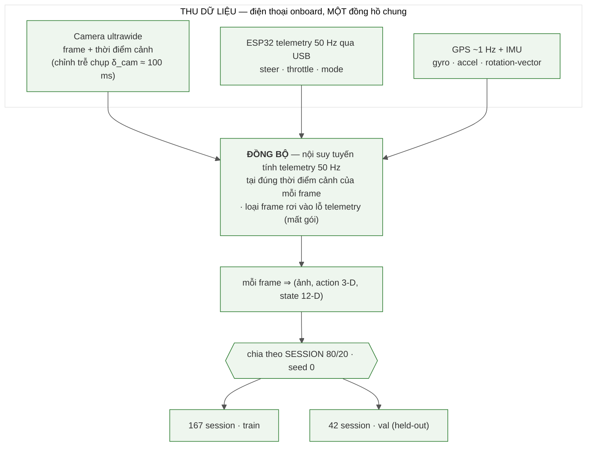
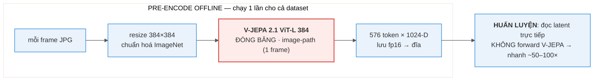
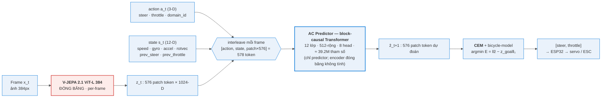
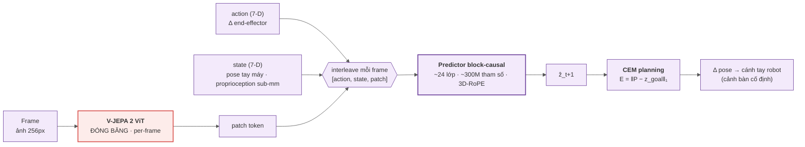

# BÁO CÁO — World Model Hành-động-điều-kiện dựa trên V-JEPA 2.1 cho Xe RC

**Đề tài.** Đóng băng encoder video nền-tảng **V-JEPA 2.1 (ViT-L, 384px)** làm biểu diễn thị giác,
huấn luyện một **AC Predictor** nhỏ học "hành động nào gây thay đổi hình ảnh nào" trong không gian
latent, rồi dùng **CEM planning** để **điều hướng xe theo ảnh-mục-tiêu (goal-conditioned)**: cho
trước một ảnh-mục-tiêu, ở mỗi bước planner chọn hành động `[lái, ga]` đưa cảnh quan-sát-hiện-tại
tiến dần về cảnh-mục-tiêu. Đây **không** phải học-bắt-chước một quỹ đạo cố định; hành động được
sinh ra từ mục-tiêu thị-giác, đổi mục-tiêu thì hành vi đổi theo.

> **Về số liệu trong báo cáo.** Mọi con số đều **đo lại trực tiếp bằng script trong repo** (xem
> §Phụ lục): tham số mô hình đếm từ checkpoint (§9.2); thống kê dữ liệu quét từ `data/raw_*` (§7);
> độ nhạy hành động đo bằng `scripts/probe_energy.py` (§11); transfer đọc từ
> `runs/lewm_overnight/…` (§11.3); accuracy Tầng 2 đọc từ `data/demo/*/demo.json` (§12).
> Placeholder cần điền: `[Họ tên]`, `[MSSV]`, `[Lớp/Môn]`, `[GVHD]`.

---

## Mục lục
1. Tóm tắt & Đóng góp
2. Giới thiệu & Động lực
3. Phát biểu bài toán & Phạm vi
4. **Khái niệm & thước đo** *(định nghĩa thuật ngữ trước khi dùng)*
5. Nền tảng & Công trình liên quan
6. Hệ thống phần cứng & cách thu thập dữ liệu
7. Dữ liệu & Thống kê
8. Encoder V-JEPA 2.1 (đóng băng) + pipeline pre-encode
9. AC Predictor — kiến trúc + huấn luyện (đóng góp chính)
10. Lập kế hoạch: CEM + động học xe
11. TẦNG 1 — Dynamics offline
12. TẦNG 2 — Planner open-loop chọn JOINT (lái + ga)
13. TẦNG 3 — Closed-loop ngoài trời (chưa đạt, phân tích cơ chế)
14. Đánh giá dữ liệu IMU & vì sao không dự đoán toàn bộ next-state
15. Hạn chế
16. Hướng phát triển
17. Kết luận
18. Phụ lục (tái lập, checkpoint, bản đồ file)

---

## 1. Tóm tắt & Đóng góp

**Tóm tắt.** Chúng tôi nghiên cứu việc dùng một **encoder video nền-tảng đóng băng (V-JEPA 2.1
ViT-L 384)** làm biểu diễn cho một **world model hành-động-điều-kiện** trên **xe RC di động**, rồi
dùng **CEM planning** để **điều hướng theo ảnh-mục-tiêu (goal-conditioned)**: cho trước một
ảnh-mục-tiêu, ở mỗi bước model so cảnh hiện tại với mục-tiêu trong không gian latent và chọn `[lái,
ga]` đưa cảnh hiện-tại tiến về cảnh-mục-tiêu. Encoder được giữ đóng băng hoàn toàn; chúng tôi chỉ
huấn luyện một **AC Predictor** nhỏ (**≈ 39.2 triệu tham số**) học ánh xạ "action → đổi latent". Báo
cáo trình bày kết quả theo **ba tầng đánh giá**, mỗi tầng có thước đo và kết luận riêng:

- **Tầng 1 — Dynamics offline:** AC predictor đặt trên latent đóng băng **dự đoán tốt hơn baseline
  "đứng yên"** (rollout@1 / identity = **0.744** < 1, tức tốt hơn giả định "cảnh không đổi" — một
  điều kiện CẦN, xem §4 cho định nghĩa), có **độ nhạy hành động đo được ở cả hai trục** — lái
  (argmin-năng-lượng đúng hướng cua **95%**, lệch trung vị so với người lái **0.146** trên thang
  [−1,1]) và ga (model nhất quán "muốn tiến" **83%**) — và cho thấy **transfer chéo-domain-servo có
  lợi**: chỉ-train-servo-mới **1.073** → pretrain servo cũ rồi finetune servo mới **0.975** → train
  trộn 2 servo **0.65**.
- **Tầng 2 — Planner open-loop, chọn JOINT cả lái lẫn ga:** trên video VAL held-out, với mỗi frame
  thật ta đặt goal là mốc ~0.9s phía trước rồi cho planner quét **lưới 2-D (lái × ga)** và chọn cả
  hai trục ở đáy năng lượng — **lái khớp dấu người 94.2%** ở khúc quẹo (lệch trung vị **0.118** trên
  thang [−1,1]) và **model tự chọn ga "muốn tiến" 92%** (median +0.075 ≈ người +0.090; lệch ga trung
  vị **0.033**). Đây là bằng chứng planner chọn hành động **gần** với chuyên gia — cả về dấu lẫn độ
  lớn — **khi chưa chịu vật-lý-đóng-vòng** (open-loop), bắc cầu giữa metric offline và "lái thật".
- **Tầng 3 — Closed-loop ngoài trời (chưa lái được, phân tích cơ chế):** khi đóng vòng thật, hệ
  thống **bám tuyến tốt ở nửa đầu route rồi "bung" ra lề**. Phân tích định lượng quy nguyên nhân
  **chính** về **khâu định-vị**, **KHÔNG** về chất lượng biểu diễn: **descriptor định-vị** (latent
  mean-pool + cosine) **không bất-biến** dưới đổi-sáng + đổi-heading giữa lúc dạy và lúc chạy → so-ảnh
  sập → goal không phân-biệt-được → CEM mất phương hướng. (Một deadlock điều-khiển phụ lúc xe đứng-yên
  cũng được phát hiện & vá bằng sàn ga — ghi ở footnote §13.3.)

**Đóng góp.**
1. **Thử nghiệm họ V-JEPA 2 trên một robot DI ĐỘNG (xe RC)** — Meta công bố chủ yếu trên cánh tay
   robot (cảnh bàn cố định). Vì dữ liệu do nhóm **tự thu, tự đo** nên chúng tôi không khẳng định
   "đầu tiên"; điểm đáng nói là đây là một **chế độ khó hơn về robustness** (heading / ánh sáng / lệch
   ngang) so với các đánh giá đã công bố.
2. **Kiểm chứng planner OPEN-LOOP** tách "năng lực lập kế hoạch" khỏi "robustness đóng vòng" — CEM
   chọn hành động khớp chuyên gia ~94% (đúng dấu lái), lệch độ-lớn trung vị ~0.12, khi không chịu
   vật-lý-đóng-vòng.
3. **Phân tích thất bại closed-loop có cơ chế, định lượng**: khoanh nguyên nhân **chính** về
   **descriptor định-vị không bất-biến sáng/heading** (đo được bằng probe), thay vì gộp một nhãn
   mơ hồ — và phân biệt rõ nó với khâu điều-khiển (vẫn bền).

---

## 2. Giới thiệu & Động lực

**Bối cảnh.** Vài năm gần đây, **world model** học theo lối tự-giám-sát — tiêu biểu là họ **JEPA**
(Joint-Embedding Predictive Architecture) của Yann LeCun và Meta — nổi lên như một hướng mạnh để cho
máy "hiểu vật lý của cảnh" mà không cần nhãn. Thay vì xây bản đồ 3D hay tái tạo từng pixel, world
model dự đoán **trong không gian biểu diễn** rằng "hành động nào dẫn tới quan sát nào", rồi **lập kế
hoạch ngay trong không gian latent** đó. Meta đã chứng minh ý tưởng này chạy thật trên **cánh tay
robot Franka** với **V-JEPA 2-AC**: chỉ cần đóng băng encoder video rồi học một predictor nhỏ
hành-động-điều-kiện là robot có thể *plan* để với/đẩy vật chỉ từ một ảnh-mục-tiêu. Câu hỏi của chúng
tôi: *liệu cùng biểu diễn đó có dùng được cho một robot **DI ĐỘNG, ngoài trời** (xe RC) — nơi động
lực học và domain-shift (ánh sáng/giờ/heading) khắc nghiệt hơn nhiều cảnh bàn cố định?* Báo cáo này
là một nỗ lực chuyển V-JEPA 2-AC từ tay-máy sang xe RC. (§5 giới thiệu kỹ world model / JEPA /
V-JEPA 2 / 2.1 / V-JEPA 2-AC và vì sao LeCun theo đuổi hướng này.)

**Vì sao V-JEPA 2.1.** V-JEPA học đặc trưng bằng **dự đoán trong không gian biểu diễn** (feature
prediction) thay vì tái tạo pixel — tránh lãng phí dung lượng mô hình vào chi tiết pixel không cần
thiết. Bản **2.1** (ViT-L distilled từ ViT-G, 384px) bổ sung **Dense Predictive Loss** → đặc trưng
patch chất lượng cao, đúng thứ một AC predictor cần để phân biệt "cảnh đổi thế nào theo hành động".

**Hạn chế tài nguyên & quyết định dừng thực địa.** Encoder ViT-L chạy trên GPU (RTX 5070 Ti), không
chạy trên điện thoại → inference phải qua PC. Sau vài ngày tinh chỉnh closed-loop ngoài thực địa mà
chẩn đoán cho thấy thất bại nằm ở **khâu định-vị**, không phải ở tham số mô hình, nhóm dừng thử
nghiệm thực địa và chốt phần offline + kiểm chứng planner open-loop, trình bày closed-loop như một
**kết quả chưa thành công được phân tích kỹ theo cơ chế**.

---

## 3. Phát biểu bài toán & Phạm vi

**Bài toán chính = ĐIỀU HƯỚNG THEO ẢNH-MỤC-TIÊU (goal-conditioned visual navigation).** Cho trước
một (hoặc một chuỗi) **ảnh-mục-tiêu**, ở mỗi bước model so cảnh hiện tại với mục-tiêu trong không gian
latent và CEM chọn `[lái, ga]` đưa cảnh hiện tại tiến về cảnh-mục-tiêu; đạt mục-tiêu này thì chuyển
sang mục-tiêu kế. Khi mục-tiêu cuối **khuất tầm nhìn**, ta xâu chuỗi vài ảnh-mục-tiêu trung-gian
(subgoal) nhìn-thấy-được dọc đường — đây **chỉ là cách cung cấp mục-tiêu** cho planner, **không phải
học-bắt-chước** một quỹ đạo: việc thu các ảnh-subgoal là *bắt buộc* vì V-JEPA-AC plan **tới một
ảnh-goal**, chứ hành động không hề được "ghi lại để phát lại". Đổi ảnh-goal → hành vi đổi theo.

**Kiến trúc 2 tầng (tách bạch — quan trọng để quy trách nhiệm khi phân tích lỗi):**
- **Định vị (chỉ dùng thị giác + GPS):** trả lời "đang ở đâu" và "ảnh-mục-tiêu kế là cái nào".
- **Điều khiển (servo-specific):** AC predictor (V-JEPA frozen + predictor) + CEM. Trả lời "đạp
  ga / đánh lái bao nhiêu để tới mục-tiêu kế".

> Việc tách 2 tầng cho phép kết luận cuối cùng: **tầng biểu diễn + điều khiển hoạt động (Tầng 1+2);
> gap nằm ở tầng định-vị (descriptor nhạy ánh sáng/heading) khi đóng vòng (Tầng 3).**

---

## 4. Khái niệm & thước đo

> Định nghĩa gọn các thuật ngữ dùng xuyên suốt, để phần kết quả đọc trôi.

- **Latent / patch token.** Encoder biến mỗi ảnh thành **576 token**, mỗi token một vector **1024
  chiều** mô tả một mảnh ảnh. Ta gọi tập 576×1024 này là *latent* của frame.
- **Horizon (tầm nhìn) `H`.** Số bước tương lai mà mô hình/planner xét tới. Báo cáo dùng `H=4` (≈
  0.9s, xem §12).
- **Rollout@k.** Cho model **dự đoán k bước latent liên tiếp** rồi đo sai số so với latent thật.
- **Baseline "đứng yên" (identity).** Phép so sánh ngây thơ: "đoán frame sau **y hệt** frame hiện
  tại" (giả định cảnh không đổi). **`rollout@k / identity`** = sai số của model chia cho sai số của
  identity. **< 1 = model dự đoán tốt hơn việc giả định cảnh đứng yên.** Đây chỉ là điều kiện **cần**
  (model có học được gì đó về tác động của hành động), chưa phải điều kiện đủ để lái được.
- **Năng lượng `E` của một chuỗi hành động.** Cho một chuỗi `[lái, ga]` ứng viên, ta **roll** nó qua
  AC predictor để ra latent dự đoán cuối `ẑ`, rồi tính **`E = ‖ẑ − z_goal‖₁`** (khoảng cách L1 trung
  bình trên toàn bộ 576×1024 chiều tới latent của ảnh-mục-tiêu). **E thấp = hành động đó đưa cảnh
  tới gần goal.**
- **argmin-E.** Hành động có `E` nhỏ nhất trong lưới quét = hành động model "chọn".
- **Contrast (độ sâu thung lũng).** **`contrast = (E_max − E_min) / E_min`** khi quét một trục hành
  động. Cao = đáy năng lượng **rõ** (model phân biệt được hành động tốt/xấu); ≈ 0 = **landscape
  phẳng** (model không có gì để bám → CEM mất phương hướng). Contrast đã khử thang tuyệt đối nên so
  được giữa các cảnh.
- **Sign-turn (đúng-dấu-cua).** Trên các frame người lái **đang quẹo** (|lái| > 0.15), tỉ lệ frame
  mà **dấu** góc lái model chọn trùng dấu góc lái người (cùng quẹo trái / phải).
- **Open-loop vs closed-loop.** *Open-loop:* video chạy theo người lái thật, model **chỉ đề xuất**
  hành động (không thực sự lái) → đo "năng lực lập kế hoạch". *Closed-loop:* model **thực sự lái xe**,
  hành động của nó quyết định frame kế → đo cả robustness vật-lý-đóng-vòng.

---

## 5. Nền tảng & Công trình liên quan

> Mục này giải thích gọn các khái niệm nền trước khi dùng: *world model*, JEPA, V-JEPA 2 / 2.1,
> V-JEPA 2-AC — chúng là gì, làm việc gì, ứng dụng ở đâu, và vì sao đây là hướng được theo đuổi.

### 5.1. World model là gì & vì sao nghiên cứu
Một **world model** là một mô hình *mô phỏng* thế giới bên trong đầu tác tử: cho trạng thái hiện tại
và một hành động, nó **dự đoán** trạng thái/quan sát kế tiếp. Nếu có một world model đủ tốt, tác tử
có thể **"tưởng tượng" hệ quả của hành động** rồi *lập kế hoạch* (thử nhiều chuỗi hành động trong đầu,
chọn chuỗi tốt) thay vì phải thử-sai ngoài đời. Đây là một trong những con đường được kỳ vọng nhất để
đi tới máy biết suy-luận và lập-kế-hoạch: học **không cần nhãn** (chỉ cần xem dữ liệu), học được
**vật lý/nhân-quả** của môi trường, và dùng lại cho nhiều nhiệm vụ. Ứng dụng tiêu biểu: robot (planning
để thao tác/di chuyển), lái tự hành, agent trong game/simulation.

### 5.2. JEPA — dự đoán trong không-gian-biểu-diễn (đường lối của Yann LeCun)
**JEPA (Joint-Embedding Predictive Architecture)** là kiến trúc world model do **Yann LeCun** đề
xướng và Meta phát triển. Ý tưởng cốt lõi: thay vì dự đoán **từng pixel** của tương lai (tốn năng lực
mô hình vào chi tiết vô nghĩa, và bất khả thi vì tương lai vốn bất định), JEPA **dự đoán trong không
gian biểu diễn (latent)** — chỉ cần đoán đúng *các đặc trưng trừu tượng* của quan sát kế tiếp. LeCun
theo đuổi hướng này vì: (1) sinh-pixel lãng phí và dễ bị nhiễu chi tiết, trong khi cái ta cần cho
suy-luận/điều-khiển là *cấu trúc trừu tượng*; (2) dự đoán trong latent cho phép mô hình **bỏ qua cái
không-đoán-được** và tập trung vào cái có-ý-nghĩa; (3) đây là mảnh ghép "predictive world model"
trong tầm nhìn của ông về *autonomous machine intelligence* (xem `docs/10356_a_path_towards_autonomous_mach.pdf`).
Bản đầu cho ảnh là **I-JEPA**; cho video là **V-JEPA**.

### 5.3. V-JEPA → V-JEPA 2 → V-JEPA 2.1
- **V-JEPA:** học self-supervised trên video bằng *feature prediction* (che một phần video, đoán
  **biểu diễn** của phần bị che) — không reconstruct pixel.
- **V-JEPA 2:** mở rộng lên video quy mô lớn (hơn 1 triệu giờ), cho encoder ViT mạnh, đạt SOTA ở
  hiểu/đoán chuyển động và **cho phép planning trên robot** (xem bên dưới).
- **V-JEPA 2.1:** bản cải tiến (ViT-L **distilled** từ ViT-G, **384px**) bổ sung **Dense Predictive
  Loss** → đặc trưng **patch** dày và chất lượng cao (mỗi mảnh ảnh có vector mô tả tốt), rất hợp cho
  bài toán cần thông tin **không-gian** như điều-khiển. PDF gốc trong `docs/`.

### 5.4. V-JEPA 2-AC — bản action-conditioned (kiến trúc tham khảo chính)
**V-JEPA 2-AC** là phần "hành-động-điều-kiện" của Meta đặt trên encoder V-JEPA 2 **đóng băng**: mỗi
frame được biểu diễn thành chuỗi token `[action, state, patch]`, một **predictor block-causal** học
dự đoán biểu diễn frame kế, rồi **CEM planning** chọn hành động bằng năng lượng `‖P − z_goal‖₁` tới
ảnh-mục-tiêu. Meta trình diễn nó **trên cánh tay robot (Franka)** — cảnh bàn cố định — để với/đẩy vật
chỉ từ một ảnh-goal, **không cần phần thưởng, không cần nhãn hành động ngoài dữ liệu tương tác**. Đây
chính là **kiến trúc tham khảo** mà AC Predictor của chúng tôi dựa vào, có điều chỉnh cho xe RC (so
sánh giống/khác/vì-sao ở §9.3).

### 5.5. Điều hướng bằng goal ảnh (ViNG)
- **ViNG** (điều hướng bằng goal ảnh): ý tưởng "đi tới một **ảnh-mục-tiêu**" cho robot di động. Chúng
  tôi **mượn ý tưởng goal-image** này; phần đồ-thị-ảnh (topological graph) chỉ là **thử nghiệm phụ**
  (§16), không phải đóng góp chính.

---

## 6. Hệ thống phần cứng & cách thu thập dữ liệu

> Mô tả phần cứng + cách thu thập **trước** kiến trúc model, để người đọc hiểu dữ liệu đến từ đâu.

### 6.1. Xe & bộ điều khiển
- **Khung xe:** xe RC địa hình; **ESP32-S3 WROOM (N16R8)** gắn trên xe điều khiển 2 cơ cấu:
  - **Servo lái** TowerPro MG946R (analog, GPIO5), dải PWM **1000–2000µs**, tâm 1560µs.
  - **ESC ga** Hobbywing QuicRun 8BL150 (150A brushless, GPIO6), dải 1000–2000µs, map tuyến tính
    `esc_us = 1000 + (ga+1)/2·1000`.
- **Nguồn:** pin → ESC; BEC 6V cấp servo (giữ ≤6V vì MG946R không phải loại HV).
- **Hai "domain" servo — vì sao có (lý do thực tế, không phải thiết kế).** Phần lớn dữ liệu cũ thu
  bằng servo **KDS**. Trong quá trình thu, **servo KDS hỏng và phải thay bằng TowerPro MG946R**. Hai
  servo có **ánh xạ lệnh→góc-lái khác nhau** (cùng một lệnh cho ra góc bánh khác nhau). Thay vì bỏ dữ
  liệu cũ, chúng tôi coi đây là **hai domain điều khiển** và gắn một cờ `domain_id` (0=KDS, 1=TowerPro)
  vào input predictor để model học chung mà vẫn phân biệt được hai ánh xạ. Việc thay servo *ngoài ý
  muốn* này về sau cho một thí nghiệm transfer có giá trị (§11.3).

### 6.2. Bước ngoặt: từ link video không dây sang điện thoại onboard
- **Rig ban đầu (đã bỏ cho thu data):** camera RunCam (OpenIPC, IMX415) truyền H.265 qua **WFB-NG
  (5.8GHz)** về PC. **Thất bại ở tầm xa** (~50m: vỡ ảnh, trễ phình 92→310ms khi mất gói).
- **Rig hiện tại (pivot):** **đặt điện thoại Android lên xe** (Samsung A42 5G) làm camera + máy ghi.
  Camera **ultrawide** chụp frame cục bộ; điện thoại đọc telemetry ESP32 qua **USB**; lưu frame +
  action + telemetry + GPS + IMU. **Frame và telemetry chung MỘT đồng hồ điện thoại** → các vấn đề
  trễ-WFB / đồng-bộ-clock biến mất. Còn lại một **độ trễ chụp camera δ_cam ≈ 100ms** (đo trên A42,
  ổn định 98–103ms) được ghi mỗi frame và hiệu chỉnh khi đồng bộ.

### 6.3. Luồng hình thành dữ liệu train/val
Hình dưới mô tả toàn bộ luồng từ lúc thu tới lúc thành tập train/val (mô tả luồng, không phải tên
file). Điểm cốt lõi: vì **frame, telemetry, GPS, IMU dùng chung một đồng hồ**, ta có thể ghép chính
xác mỗi frame với hành động *đúng tại thời điểm cảnh đó*.


**Mã mermaid (Hình 1):**


*Hình 1 — Luồng dữ liệu: thu (1 đồng hồ chung) → đồng bộ (nội suy telemetry 50Hz tại thời điểm cảnh,
hiệu chỉnh δ_cam, loại frame mất gói) → mỗi frame thành (ảnh, action 3-D, state 12-D) → chia theo
session 80/20 → 167 train / 42 val.*

1. **Thu.** Người lái tay bằng **FlySky i-BUS**; máy ghi thụ động lưu: frame ảnh kèm *thời điểm cảnh*
   (đã trừ δ_cam), luồng telemetry 50Hz (lái/ga/mode), GPS ~1Hz, IMU (gyro/accel/rotation-vector).
2. **Đồng bộ — cách nội suy (chi tiết).** Mỗi frame có *thời điểm cảnh* `t_scene = t_ms − δ_cam`
   (δ_cam = 100ms cho data cũ; = 0 cho data mới đã ghi sẵn `dcam_ms`). Telemetry 50Hz là chuỗi mẫu
   `(t_k, lái_k, ga_k)`. Để lấy hành động *đúng lúc khung hình được chụp*, ta tìm cặp mẫu kề
   `t_{k−1} ≤ t_scene < t_k` rồi **nội suy tuyến tính**:
   `lái(t_scene) = lái_{k−1} + τ·(lái_k − lái_{k−1})` với `τ = (t_scene − t_{k−1})/(t_k − t_{k−1})`
   (ga và 9 kênh IMU nội suy y hệt tại cùng `t_scene`; IMU không có trễ như camera nên lấy ngay tại
   `t_scene` là khớp cảnh). **Loại** frame nếu: `t_scene` nằm ngoài khoảng telemetry; hoặc **lỗ
   telemetry** (hai mẫu kề cách nhau `> 60ms` = mất gói lúc tín hiệu yếu → không nội suy bừa); hoặc
   `mode ≠ RECORD`. Nguyên tắc: thà bỏ frame còn hơn ghép với một hành động cũ/sai.
3. **Ghép.** Mỗi frame ⇒ một mẫu `(ảnh, action 3-D [lái, ga, domain_id], state 12-D)`. **State 12-D**
   = `[speed, gx,gy,gz, ax,ay,az, rx,ry,rz, prev_steer, prev_throttle]` = GPS speed + gyro + accel +
   rotation-vector + **hành-động-bước-trước** (loại lat/lon/bearing tuyệt đối để tránh overfit địa
   điểm — đánh giá chi tiết IMU ở §14).
4. **Chia.** Chia **theo SESSION** (không theo frame, để val không "rò rỉ" frame kề từ train) tỉ lệ
   80/20 với seed cố định → **167 session train / 42 session val**. Mọi đánh giá đọc lại split này.
- **GPS:** điện thoại A42 trả **~1.04Hz**; nhiễu vị trí **trung vị 0.44m / p90 1.0m**.
  → GPS chỉ đủ làm **cổng pop ảnh-mục-tiêu**, KHÔNG đủ giữ làn theo mét.

---

## 7. Dữ liệu & Thống kê

> Toàn bộ số trong mục này **quét lại trực tiếp** từ `data/raw_kds` + `data/raw_towerpro` (xem §Phụ lục).

### 7.1. Tổng quan

*Hình 2 — Tổng quan dữ liệu theo 2 domain servo: **209 session · 228,511 frame · 7.43 giờ** lái thật
(KDS 28 ss / 53,076 frame / 1.73h; TowerPro 181 ss / 175,435 frame / 5.71h). FPS lưu ~8.5 (đặt
save_hz=10, hụt nhẹ do tải ghi ảnh) — nhất quán giữa 2 domain. Split session-level 80/20, seed 0 →
**167 train / 42 val**.*

### 7.2. Phân bố hành động & chuyển động (đo trên 228,511 frame)
| Đại lượng | Giá trị | Ý nghĩa |
|---|---|---|
| Trung vị throttle | **0.084** | ga thật, KHÔNG ~0 (xe chạy chậm, ga nhỏ nhưng có) |
| Tỉ lệ "đi gần-thẳng" (\|steer\|<0.15) | **63%** | phần lớn thời gian đi thẳng |
| Tổng số sự kiện quẹo | **13,871** | đủ mẫu cua để học/đánh giá độ nhạy lái |
| Trung vị tốc độ GPS | **1.05 m/s** (p90 2.91) | xe đi bộ-tốc-độ |
| Tỉ lệ frame đứng-yên (speed<0.06) | **11.3%** | regime đứng-yên đáng kể → liên quan §13 |

### 7.3. Dữ liệu CÓ hành vi điều-chỉnh (corrective driving)
Dữ liệu là **lái tay tự do** trong công viên, không phải lái-một-đường-thẳng. Với **13,871 sự kiện
quẹo** và góc lái dao động hai phía liên tục (Hình 3), người lái **liên tục điều chỉnh** trái/phải.
Điều này quan trọng cho phần phân tích closed-loop (§13): **tập huấn luyện không hề thiếu hành vi
sửa-lệch** — cái thiếu khi *deploy* là một thứ khác (xem §13).


*Hình 3 — Một session điển hình: góc lái (tím) dao động hai phía liên tục + ga (cam) — bằng chứng dữ
liệu chứa hành vi điều chỉnh/sửa lệch, không phải lái-thẳng-một-mạch.*

### 7.4. Khác biệt 2 domain
- **KDS:** steering đủ dải −1..1 nhưng **throttle gần như hằng (~7.5%)** → gần "steering-only".
- **TowerPro** (thu sau khi servo KDS hỏng — §6.1) có **throttle biến thiên** (cả lùi nhẹ), cho model
  tín hiệu học trục ga (xác nhận ở §11.4: model đọc được trục ga). Hình 4, 5, 6 là phân bố
  steering / throttle / tốc độ; Hình 7 là độ dài 209 session; Hình 8 là phủ thời gian thu.


*Hình 4 — Throttle: KDS ~hằng (đỉnh nhọn ~0.075) vs TowerPro biến thiên (trải rộng, có lùi nhẹ).*

| | |
|---|---|
|  |  |
| *Hình 5 — phân bố góc lái* | *Hình 6 — phân bố tốc độ GPS* |

| | |
|---|---|
|  |  |
| *Hình 7 — độ dài 209 session* | *Hình 8 — phủ thời gian thu (giờ)* |

---

## 8. Encoder V-JEPA 2.1 (đóng băng) + pipeline pre-encode

- **Encoder:** V-JEPA 2.1 **ViT-L 384** (distilled từ ViT-G), **đóng băng tuyệt đối** (không bao giờ
  backprop).
- **Encode TỪNG frame** (image-path) → **patch tokens**: 384px → lưới **24×24 = 576 token**, mỗi token
  **1024-D**; **giữ nguyên 576 token** (không pool) để còn thông tin không gian.
- **Tối ưu then chốt — pre-encode offline:** ta chạy V-JEPA **một lần** trên toàn bộ dataset, lưu
  latent (fp16) ra đĩa; khi huấn luyện predictor chỉ **đọc latent**, **không** forward V-JEPA →
  nhanh hơn **~50–100×**. Đây là điều khiến việc huấn luyện một predictor nhỏ trên 228k frame khả thi
  trên một GPU.


**Mã mermaid (Hình 9):**


*Hình 9 — Pipeline encoder: mỗi frame → resize 384 + chuẩn hoá → V-JEPA ViT-L 384 đóng băng (per-frame)
→ 576×1024 token lưu fp16 → huấn luyện đọc latent trực tiếp (nhanh ~50–100×).*

> **Vì sao 384px (không phải 256).** Chúng tôi quyết định huấn luyện ở **384px** vì bản encoder
> **V-JEPA 2.1** (ViT-L distilled) được huấn luyện gốc ở **384** (cooldown ở 384). Dùng đúng độ phân
> giải gốc của encoder tránh việc đổi resolution làm lệch phân bố đầu vào → giữ chất lượng đặc trưng
> patch. (256px của V-JEPA 2-AC chỉ là lựa chọn **compute** "for simplicity", không phải vì 256 cho
> biểu diễn tốt hơn.)

---

## 9. AC Predictor — kiến trúc + huấn luyện (đóng góp chính)

### 9.1. Sơ đồ & cơ chế
Mỗi frame được xếp thành một nhóm token `[action_t (3-D), state_t (12-D), patch_t (576)]` (= 578
token). Một **mask block-causal** cho token ở frame t nhìn được mọi token ở frame ≤ t. Đầu ra ở
vị-trí-patch của frame t dự đoán **patch map của frame t+1**. Hình 10 cho sơ đồ tổng-thể (frame →
encoder → predictor → CEM); **Hình 11** mở **bên trong predictor** để thấy chi tiết: ba phép chiếu
tuyến tính đưa action/state/patch về chiều `P=512`, cộng pos-embedding (theo frame + theo vị-trí-token),
12 lớp Transformer (mỗi lớp = LayerNorm → self-attention block-causal 8 head → residual → LayerNorm →
MLP 512→2048→512 → residual), rồi head `Linear 512→1024` ở các vị-trí-patch của frame t sinh ẑ_{t+1}.


**Mã mermaid (Hình 10):**


*Hình 10 — Kiến trúc của chúng tôi (tổng thể): frame → V-JEPA frozen → 576×1024 → interleave [action,
state, patch] → AC predictor block-causal (12 lớp) → ẑ_{t+1} → CEM → ESP32.*


*Hình 11 — Chi tiết bên trong AC Predictor: chiếu action(3)/state(12)/patch(1024) về `P=512` + pos-emb;
× 12 lớp Transformer block-causal (LN → MHSA 8-head → residual → LN → MLP 512→2048→512 → residual);
LayerNorm cuối + head `Linear 512→1024` ở vị-trí-patch → ẑ_{t+1} (576×1024); loss = L1(ẑ_{t+1}, z_{t+1}).*

### 9.2. Quy mô — **≈ 39.2M tham số**
Cấu hình triển khai (`cd4`): `pred_dim = 512`, `depth = 12`, `n_heads = 8`, `num_tokens = 576`,
`action_dim = 3`, `state_dim = 12` → **39,192,576 ≈ 39.2M tham số huấn luyện** (chỉ predictor — encoder
V-JEPA đóng băng KHÔNG tính), trong đó **12 lớp Transformer chiếm ~96%** (mỗi lớp ~3.15M). Chúng tôi
cố ý giữ predictor **nhỏ hơn nhiều** so với ~300M của Meta vì hai lẽ: (1) **dữ liệu ít** (~228k frame)
và **576 token/frame đã rất nặng** → predictor quá lớn dễ overfit; (2) **phần cứng/tài nguyên tính
toán hạn chế** — toàn bộ huấn luyện chạy trên **một GPU RTX 5070 Ti (16GB)**, một predictor ~300M ×
576 token/frame là bất khả thi với bộ nhớ/thời gian sẵn có.

> Con số 39.2M tái lập bằng 1 dòng (xem §Phụ lục).

### 9.3. Kiến trúc tham khảo từ V-JEPA 2-AC — giống / khác / vì sao
Chúng tôi **dựa trên** kiến trúc V-JEPA 2-AC của Meta nhưng điều chỉnh cho xe. Hình 10 (của chúng
tôi) và Hình 12 (Meta) đặt cạnh nhau để so sánh.


**Mã mermaid (Hình 12):**


*Hình 12 — Kiến trúc tham khảo Meta V-JEPA 2-AC (cánh tay robot): state = pose 7-D (proprioception
sub-mm), action = Δ end-effector 7-D, 3D-RoPE, predictor ~300M.*

| Khía cạnh | Meta V-JEPA 2-AC | Của chúng tôi | Giống/Khác — **vì sao** |
|---|---|---|---|
| Encoder | V-JEPA frozen | V-JEPA 2.1 ViT-L 384 frozen | **GIỐNG** — triết lý "đóng băng encoder nền-tảng" |
| Token mỗi frame | patch tokens | 576 patch × 1024 | **GIỐNG** — giữ patch map (không pool) cho không gian |
| Interleave | `[action,state,patch]` | `[action,state,patch]` | **GIỐNG** — cấu trúc token cốt lõi |
| Attention | block-causal | block-causal | **GIỐNG** — frame t nhìn ≤ t |
| State | pose tay máy **7-D** | IMU 10-D + prev-action = **12-D** | **KHÁC** — xe không có proprioception sub-mm; dùng IMU+speed; prev-action cho model biết "đang giữ lệnh gì"; bỏ vị trí tuyệt đối tránh overfit địa điểm |
| Action | Δ end-effector **7-D** | `[steer, throttle, domain_id]` **3-D** | **KHÁC** — xe chỉ 2 trục điều khiển; thêm `domain_id` để học chung 2 servo |
| Pos-embedding | 3D-RoPE | học được (temporal + token-type) | **KHÁC** — clip nhỏ cố định thì pos-emb học được là đủ |
| Quy mô | ~24 lớp / ~300M | **12 lớp / 39.2M** | **KHÁC** — data ít → predictor to dễ overfit + 576 token rất nặng |
| Động học cho CEM | `compute_new_pose` tay máy | **bicycle-model** fit từ data xe | **KHÁC** — động học xe khác hẳn tay máy (§10) |

### 9.4. Vì sao **không** dự đoán toàn bộ next-state 12-D
Predictor hiện tại là **visual-latent predictor** — dự đoán **patch map** frame kế, KHÔNG có head
riêng cho 12-D state. Có chủ ý, vì: (1) thiết kế là visual-latent predictor; (2) **dự đoán full IMU
state rất khó** — accel/gyro/rotvec rất nhiễu (§14), data ít dễ học sai; (3) **planning chỉ cần
speed + yaw**, đã được bicycle-model (§10) lo; (4) **cố đoán full state rồi feed lại → sai số nổ
nhanh hơn** khi rollout nhiều bước. Triết lý: *"dự đoán ít nhưng phần nào còn tin được"*.

### 9.5. Huấn luyện: chuẩn-bị mục-tiêu, hàm loss, chiến lược, tham số

**Chuẩn-bị mục-tiêu (target normalization).** Patch token của V-JEPA được **LayerNorm theo từng token**
ngay trong dataset (đúng `normalize_reps` của Meta) — predictor học **dự đoán biểu diễn đã chuẩn hoá**;
12-D state được **z-score** bằng thống kê train (mean/std lưu trong checkpoint để dùng lại lúc plan).

**Hàm loss (L1, teacher-forcing + rollout 2 bước).** Với một clip `z_{1..T}` (T=horizon=4), action
`a`, state `s`:
- **Teacher-forcing 1 bước:** cho model nhìn token thật mọi frame, phạt `L1(ẑ_{t+1}, z_{t+1})` cho
  toàn chuỗi → `L_tf = ‖ model(z,a,s)[:,:−1] − z[:,1:] ‖₁`.
- **Rollout 2 bước (auto_steps=2):** chỉ cho frame đầu thật `z_1`, model **tự nuôi** dự đoán của
  chính nó 2 bước (giữa 2 bước **re-LayerNorm** đúng như lúc plan), phạt `L_ro = ‖ ẑ_3^{rollout} − z_3 ‖₁`.
- **Tổng:** `L = L_tf + L_ro`. Thành phần rollout buộc model **ổn định khi tự-hồi-quy** — đúng chế độ
  CEM dùng (roll nhiều bước), tránh model chỉ giỏi 1-bước-teacher-forcing rồi trôi khi roll.

**Cấu hình tối ưu.** AdamW, `weight_decay 1e-4`, **bf16 autocast**, **gradient checkpointing** (seq =
4×578 token × depth 12 → OOM 16GB nếu không bật; bật thì ~13GB @ batch 64), `torch.compile`. `batch_size
64`, sampler theo session (mỗi batch lấy từ một session để clip liền-mạch), `frame_stride 2` (~0.22s/bước
≈ 4fps của V-JEPA 2-AC), `action_scale [1.0, 6.67]` (đưa ga ~[−0.15,0.15] về ~[−1,1]; `domain_id` nối
thô). Split đóng băng vào `split.json` (167 train / 42 val) để mọi lần train/eval dùng đúng một split.

**Chiến lược LR kiểu WSD (warmup–stable–decay).** Mục tiêu gốc đặt cosine 60 epoch nhưng **2.9h/epoch**
→ 60 ep ≈ 7 ngày > deadline, nên đuôi cosine không bao giờ tới. Thực tế chạy thành 2 pha:
1. **Base run (pha warmup + stable):** `lr 2.5e-4`, warmup 5%, cosine. Val L1 giảm **0.79 → 0.60** ở
   ep9 rồi **đi ngang ~0.60** (pha "stable" của WSD). **Cúp điện giữa ep12.**
2. **Cooldown `cd4` (pha decay):** `init_from` best.pt(ep9), `lr 1.2e-4` (~0.5× đỉnh) **giảm cosine →
   0** trong 3 epoch (~8.6h), **giữ nguyên** mọi thứ khác (T=4, batch, data, objective) → gain quy
   được cho riêng decay-LR. Cho **checkpoint triển khai**: val **0.5693**, `rollout@1/identity 0.744`.

### 9.6. Đường cong loss

*Hình 13 — Val L1 loss (teacher-forcing + rollout 2 bước) theo epoch: base run cosine 0.79 → 0.60
(pha stable đi ngang), cúp điện giữa ep12 → cooldown cd4 LR→0 kéo val xuống **0.569** (checkpoint
deploy, rollout@1/identity 0.744). Số đọc từ log huấn luyện (wandb) + giá trị `val` lưu trong checkpoint.*

---

## 10. Lập kế hoạch: CEM + động học xe

- **CEM (Cross-Entropy Method):** lấy mẫu N chuỗi action ~ N(μ, σ) trên horizon H=4, roll mỗi chuỗi
  qua predictor, chấm năng lượng `E = ‖ẑ_cuối − z_goal‖₁`, giữ K elite có E thấp nhất, refit (μ, σ)
  rồi lặp; áp **action đầu** (receding-horizon). Mỗi vòng chèn thêm 5 ứng viên steer cố định trải đều
  `[-1,…,+1]` để elite bắt được đáy toàn cục.
- **CarDynamics (bicycle-model):** tích phân `[x, y, heading, speed]` từ `[steer, throttle]`; hệ số
  fit từ data thật: `k_thr=1.588, k_drag=0.078, k_yaw=0.088`. **Một điểm vật-lý quan trọng:**
  `yaw_rate = k_yaw · steer · speed` → **speed = 0 ⇒ lái không sinh yaw** (liên quan footnote §13.3).

---

## 11. TẦNG 1 — World-model dynamics offline

> **Câu hỏi tầng này:** predictor có học được "action → đổi latent" thật không (cả lái lẫn ga), độc
> lập hoàn toàn với chuyện đóng vòng / ánh sáng / GPS?

### 11.1. Hai thước đo (vì sao không tin val loss đơn lẻ)
- **`rollout@k / identity`**: < 1 = dự đoán tốt hơn baseline "đứng yên".
  **Vì sao không dùng val loss đơn lẻ — vấn đề "latent collapse".** Vì khung cảnh giữa hai frame kề
  thay đổi rất ít (xe đi ~1 m/s, ~0.22s/bước), một model **bỏ qua hoàn toàn action** mà chỉ học "copy
  gần như nguyên latent hiện tại sang frame sau" cũng đạt **val L1 thấp** — nó "thắng" loss bằng cách
  *không học gì về tác động của hành động*. Đó là **collapse**: predictor xẹp về một hàm gần-đồng-nhất
  (identity), val loss đẹp nhưng landscape năng lượng **phẳng theo action** → CEM vô dụng. Chia cho
  baseline identity sẽ **phơi bày** chính cái bẫy đó: nếu model chỉ copy thì tỉ số `≈ 1`; chỉ khi
  model **thật sự dùng action** để dự đoán tốt hơn copy thì tỉ số mới `< 1`. (Đây cũng là lý do ta đo
  thêm action-sensitivity bên dưới — tỉ số `<1` là cần, độ-nhạy-action mới là cái CEM thực dùng.)
- **Action-sensitivity (energy-probe):** quét `E` quanh một trục action, xem **argmin-E có đúng
  hướng** và **contrast** sâu cỡ nào. Đây là cái sát nhất với thứ CEM thực sự dùng.

### 11.2. Dự đoán tốt hơn baseline "đứng yên" (Bảng A)
| Model | @1 | @2 | @3 |
|---|---|---|---|
| **cd4 (ckpt deploy)** | **0.744** | **0.703** | **0.697** |

→ Thắng identity ở mọi horizon. **Diễn giải đúng mức:** điều này **chỉ xác nhận** predictor học được
*một phần* động học có-điều-kiện-hành-động (dự đoán tốt hơn giả định "cảnh đứng yên") — một điều kiện
**cần, chưa đủ**. Nó **không** tự nó chứng minh "lái được". Bằng chứng mạnh hơn nằm ở §11.3–11.4
(transfer + độ nhạy hành động) và §12 (planner open-loop).

### 11.3. Transfer chéo-domain-servo (servo cũ giúp học servo mới)
*Bối cảnh:* thí nghiệm này chạy ở giai đoạn **dữ liệu TowerPro còn ít** (lúc đó mới ~64 session
TowerPro + 28 KDS), nên một mình TowerPro chưa đủ để học động học. Eval trên **TowerPro held-out**
(cùng split), đo `rollout@1 / identity`:

| Cách huấn luyện | rollout@1 / identity (TowerPro held-out) |
|---|---|
| Chỉ TowerPro | **1.073** — *thua cả baseline ngây thơ* |
| Pretrain KDS → finetune TowerPro | **0.975** — chỉ vừa nhỉnh hơn baseline |
| Train **trộn** KDS + TowerPro (`domain_id`) | **0.65** — tốt nhất |

→ Càng đưa thêm dữ liệu **servo cũ (KDS, giàu tín hiệu lái)** vào, model học **động học chung** càng
tốt: chỉ-TowerPro *thua*, pretrain-rồi-finetune *gần hoà*, **trộn cả hai cùng lúc** *thắng rõ*. Cờ
`domain_id` cho phép trộn mà không lẫn lộn ánh xạ lệnh→góc của hai servo. (Đây là "quả ngọt ngoài ý
muốn" của việc phải thay servo KDS hỏng — §6.1.) Số đọc từ `runs/lewm_overnight/20260608_015058`.

> **Về chữ "baseline đứng-yên".** Đây là **baseline ngây thơ chuẩn** trong ML — một bộ dự đoán *không
> học gì*, luôn đoán "frame sau = frame này" (identity / "cảnh không đổi"). Thắng nó là điều kiện
> *tối thiểu*; tỉ số **>1 nghĩa là model còn tệ hơn việc không-làm-gì**. Dùng đúng nghĩa "baseline".


*Hình 14 — (A) Tiến trình 3 bước trên servo mới: chỉ-TowerPro THUA (1.073) → pretrain-KDS-rồi-finetune
gần hoà (0.975) → trộn 2 servo THẮNG (0.65). (B) Val loss của model trộn giảm đều 0.79 → 0.60 (học
động học chung, không overfit servo).*

### 11.4. Action-sensitivity — đo RIÊNG từng trục trước (cô lập tín hiệu)
**Chiến lược đo: riêng trước, joint sau.** Ở Tầng 1 ta đo **từng trục riêng** (giữ trục kia = teacher)
để **cô lập** xem mỗi trục có tín hiệu không; ở Tầng 2 (§12) ta đo **joint** cả hai trục cùng lúc
(sát closed-loop). Tách như vậy giúp quy trách nhiệm rõ ràng: nếu joint hỏng mà riêng-lẻ tốt thì lỗi
ở tương tác hai trục, v.v.

Đo trên **300 window VAL người-lái-đang-quẹo**, d=4, checkpoint cd4 (`scripts/probe_energy.py`):

| Đo riêng từng trục | Lái (quét steer, ga=teacher) | Ga (quét throttle, lái=teacher) |
|---|---|---|
| argmin-E **đúng dấu** (sign-turn) | **285/300 = 95%** | **83% muốn TIẾN (>0)** |
| **lệch so với người lái** (median \|argminE − teacher\|) | **0.146** (thang [−1,1]) | — |
| **contrast** (median, trên frame quẹo) | **0.33** | **0.27** |
| model "muốn" | — | ga median **+0.11** (≈ data 0.084) |

*(Lưu ý: 0.33 là contrast trên **frame quẹo**; nếu tính trên **toàn bộ** frame, contrast median ≈
0.41 — cao hơn vì frame đi thẳng cũng có đáy rõ ở lái ≈ 0.)*

→ Model **KHÔNG "đánh lái yếu" offline**: không chỉ **đúng dấu 95%**, mà góc model chọn còn **gần** góc
người lái — **lệch trung vị chỉ 0.146** trên thang [−1,1] (tức ~7% toàn dải). Đáy energy rõ và đúng
phía, ở **cả hai trục**. Hình 15 minh hoạ trực quan trên một session VAL.


*Hình 15 — Planner chọn lái khớp người lái (session VAL `162959`, goal ~0.9s phía trước). (A) Scatter
lái-người (x) vs lái-model (y) trên frame quẹo: bám sát đường chéo, **đúng dấu 95.2%**, lệch trung vị
**0.092** (session này). (B) Chuỗi thời gian: lái-model (xanh) bám theo lái-người (lục) qua các khúc quẹo.*

---

## 12. TẦNG 2 — Planner OPEN-LOOP chọn JOINT (lái + ga) khớp người lái

> **Câu hỏi tầng này:** khi *thật sự cho planner lập kế hoạch* trên video thật (chưa đóng vòng), nó
> có chọn hành động **giống chuyên gia** không — và chọn được **CẢ ga** chứ không chỉ lái?

### 12.1. Thiết kế & thuật toán (OPEN-LOOP, JOINT 2 trục)
Lấy session VAL held-out. Với **mỗi frame thật** t:
1. **Goal** = patch map d=4 bước (~0.9s) phía trước **cùng session**. *Vì sao d=4 (~0.9s)?* `lead =
   d × stride × dt_frame = 4 × 2 × 0.11 ≈ 0.9s`. Chọn d=4 vì: **đủ xa** để hành động lái tạo khác
   biệt cảnh đo được (d=1 quá gần, cảnh gần như không đổi → landscape phẳng); **đủ gần** để cảnh hiện
   tại còn overlap với goal (d lớn → contrast tụt, đo được ở §11: d2 0.44 → d8 0.27).
2. **Quét lưới JOINT 2-D** = 15 điểm lái `∈[−1,1]` × 9 điểm ga `∈[−0.1, 0.25]` = **135 tổ hợp**.
   *Vì sao dải ga `[−0.1, 0.25]`?* Dải ga **thực** trong dữ liệu là ~`[−0.16, +0.15]` (median +0.084),
   nhưng xe **gần như luôn tiến** (chỉ ~13% frame đứng-yên, lùi rất hiếm và rất nhẹ). Vì bài là
   goal-reaching *tiến về phía trước*, ta đặt lưới **lệch tiến**: phủ kỹ vùng tiến (lên tới 0.25 để
   phân giải mịn ý-định-tiến) và chỉ chừa một mép lùi nhẹ (−0.1). Cái giá: lưới **không phủ hết đuôi
   lùi** (−0.16), nhưng các frame lùi sâu hiếm tới mức không ảnh hưởng kết luận.
3. Mỗi tổ hợp `(lái, ga)` được **roll qua AC predictor** (d bước, dùng bicycle-model cho state) →
   latent dự đoán cuối → năng lượng `E(lái, ga) = ‖ẑ − z_goal‖₁`.
4. Hành động model = **argmin trên cả lưới 2-D** → chọn **lái VÀ ga cùng lúc**.
5. So với `(lái, ga)` người lái thật ở chính frame đó; **sign-turn** = sign(model_steer) ==
   sign(human_steer) trên frame |human_steer| > 0.15.

```
cho mỗi frame thật t trong session VAL:
    z_t   ← latent frame t        (đã pre-encode)
    z_goal ← latent frame t+d     (mốc ~0.9s phía trước)
    s_t   ← state 12-D tại t
    for (lái, ga) trong lưới 15×9:          # 135 tổ hợp
        roll d bước qua AC predictor (state theo bicycle-model) → ẑ
        E[lái, ga] ← mean L1(ẑ, z_goal)
    (lái*, ga*) ← argmin E                  # model chọn CẢ 2 trục
    ghi nhận: sign(lái*) == sign(lái_người)?  ;  ga* > 0?
```

**Vì sao gọi là OPEN-LOOP:** video **chạy theo người lái thật** — model **chỉ ĐỀ XUẤT**, không thực
sự lái (frame kế đã bị người lái đóng đinh). **⚠ KHÔNG chứng minh "xe tự lái".**

### 12.2. Kết quả (3 session VAL best, gộp 893 frame quẹo)
| Đo | Giá trị |
|---|---|
| **Lái — đúng dấu người** (sign-turn, \|steer\|>0.15) | **841/893 = 94.2%** (per-session 92.6 / 94.5 / 95.2%) |
| **Lái — lệch độ-lớn so với người** (median \|Δsteer\|) | **0.118** (thang [−1,1], ~6%) |
| **Ga — model muốn TIẾN (>0)** | **91.9%** |
| **Ga — model median / người median** | **+0.075 / +0.090** (toàn frame) |
| **Ga — lệch so với người** (median \|Δthrottle\|) | **0.033** |
| Contrast joint (lưới 2-D) median | **0.52** |

→ **Hai kết luận:** (a) khi tối ưu **joint cả 2 trục**, lái không chỉ **đúng chiều người 94.2%** (≈
probe 1-D 95% ở §11.4 — thêm trục ga KHÔNG làm hỏng lái) mà còn **gần về độ lớn** (lệch trung vị chỉ
0.118); (b) **model TỰ chọn ga hợp lý** — 92% muốn tiến, median +0.075 sát người +0.090, lệch ga chỉ
0.033 → **không cần giữ ga = teacher**. **Năng lực lập kế hoạch (cả lái lẫn ga) là LÀNH** — khớp
chuyên gia cả về **dấu** lẫn **độ lớn** — khi chưa chịu vật-lý-đóng-vòng; cái gãy ở Tầng 3 KHÔNG phải
"planner dốt". (Accuracy đọc từ `data/demo/*/demo.json`.)

> Demo trực quan: một web player phát lại landscape 2-D lái×ga của từng frame (● người vs ✕ model),
> xuất được MP4 cho slide.

---

## 13. TẦNG 3 — Closed-loop ngoài trời (chưa lái được) — phân tích cơ chế

> Khi đóng vòng thật, **bám tuyến tốt ở nửa đầu route rồi bung ra lề**. Chỉnh tham số chỉ **dời điểm
> bung, không xoá** → giới hạn ở model/data/descriptor, không phải tham số. (~10 run, 1 môi trường,
> 0 run về đích → kết quả **định tính + cơ chế**, chưa phải thống kê quy mô.) Phân tích quy nguyên nhân
> **chính** về **khâu định-vị** (descriptor không bất-biến sáng/heading), **KHÔNG** về chất lượng biểu
> diễn; ngoài ra có **một deadlock điều-khiển phụ lúc xe đứng-yên đã được vá** (footnote §13.3).

### 13.1. Triển khai & kết quả thô
**Luồng.** *Chuẩn-bị:* lái tay đi một lượt, chụp chuỗi ảnh-mục-tiêu + GPS dọc tuyến (~15m). *Chạy:*
phone stream (frame + GPS + rotvec) qua TCP → **PC: V-JEPA 2.1 ViT-L → AC predictor cd4 → CEM** →
2-byte action → ESP32.

**Trễ CEM (bench GPU thật).** Đóng vòng cần real-time, nên ngân sách search bị giới hạn: 32 mẫu / 1
vòng ≈ **0.5s/quyết định**; 256 mẫu / 2 vòng ≈ **5.5s** (search dày làm xe đi "mù" quá lâu giữa hai
quyết định). Chốt **32/1** (≈ chất lượng 64/2) để xe phản ứng kịp.

| Run | tick | bám tốt tới | bung tại | kết cục |
|---|---|---|---|---|
| 163607 | 1.13s | mốc 18 (lệch <0.5m) | mốc 21 (cos 0.07) | bung trái +3.2m |
| 171912 | 1.78s | mốc 6 | mốc 7 (cos 0.02) | veer trái → bụi cỏ |

### 13.2. Nguyên nhân A — descriptor ĐỊNH-VỊ không bất-biến (KHÔNG phải "V-JEPA hỏng")
**Phân biệt rõ hai thứ — đây là điểm dễ nhầm.** Hệ dùng V-JEPA cho **hai khâu khác nhau**:
- **Khâu điều khiển (CEM)** chấm năng lượng bằng **L1 trên 576 patch token** (`‖P − z_goal‖₁`). Khâu
  này **lighting-robust** (đo: nắng→mây thay đổi <5%).
- **Khâu định-vị / pop ảnh-mốc** chấm độ giống bằng **cosine trên latent MEAN-POOL** (gộp 576 token
  → 1 vector 1024-D). **Chính khâu này sập**, không phải khâu điều khiển.

**Triệu chứng.** Tới một ảnh-mốc mà ảnh live (heading/ánh-sáng/vị-trí lúc chạy khác lúc dạy) không
khớp ảnh dạy → cosine giữa latent-pooled live và mốc **tụt < 0.1 rồi âm** → goal không phân-biệt-được
→ energy CEM phẳng theo lái → lái loạn.

**Bằng chứng định lượng (từ log chạy thật).** Chất-lượng-cosine phụ thuộc **độ lệch sáng/giờ giữa
lúc dạy và lúc chạy**, không phụ thuộc cảnh:
- Route dạy & chạy **cùng buổi, sáng gần nhau** → **66% số tick** có cos > 0.3 (định-vị bám tốt).
- Route dạy 14:11, chạy 14:50 (nắng gắt, sáng đã lệch) → **0% số tick** có cos > 0.3 (định-vị sập).

**Quan trọng — đây KHÔNG phải "biểu diễn V-JEPA kém".**
- **Embedding teach không degenerate** (đo riêng: các ảnh-mục-tiêu phân-biệt-được với nhau bình thường).
- **Khâu điều khiển dùng patch-L1 vẫn bền** (nắng→mây <5%). Sự cố nằm ở **lựa chọn descriptor cho khâu
  định-vị** (mean-pool + cosine) — phép gộp toàn-cục + cosine **nhạy với đổi-sáng toàn-cục + đổi-heading/
  góc-nhìn**: khi sáng/heading lệch, vector pooled của ảnh-live xoay đi đủ để cosine tới mốc-đúng tụt
  dưới ngưỡng phân-biệt.

> **➡️ Kết luận A:** đây là **giới hạn của DESCRIPTOR định-vị** (pooled-latent + cosine) dưới
> đổi-sáng + đổi-heading, **không phải giới hạn của biểu diễn V-JEPA hay của khâu điều khiển**. **Fix
> nguyên-lý = học một descriptor bất-biến-sáng** (head nhỏ trên frozen V-JEPA, train cross-session —
> §16). **Fix kịp deadline = dạy lại CÙNG BUỔI** (descriptor rất tốt khi sáng-gần).

### 13.3. Footnote — một deadlock điều-khiển phụ lúc xe đứng-yên (đã vá, KHÔNG phải nguyên nhân chính)
Lúc debug bằng chế độ `--step`, ngoài nguyên nhân chính (A) chúng tôi gặp thêm một sự cố **phụ**: khi
xe **đứng yên** thì landscape `E(steer)` cũng phẳng — nhưng vì lý do **động học**, không phải descriptor.

**Cơ chế (đơn giản).** Động học xe: `yaw_rate = k_yaw · steer · speed` (§10). Khi speed ≈ 0, **bẻ lái
không làm cảnh quay**, nên predictor (đúng) cho **mọi góc lái ra cảnh gần như nhau** → quét steer
chẳng tạo khác biệt năng lượng → phẳng. Nói cách khác: **xe đứng thì không có gì để "lái về" cả** —
phẳng ở đây là *tại xe đứng*, không phải tại cảnh-lạ hay model-dở.

**Kiểm chứng một-biến** (`scripts/probe_speed_confound.py`, **cùng một cảnh & goal**, chỉ đổi trạng-thái-
chuyển-động): khi xe **đang chạy** thì contrast `E(steer)` = **0.335**; khi ép xe **đứng-yên-suốt** thì
tụt còn **0.088** — tức **xẹp ~3.8 lần chỉ vì xe đứng**, dù cảnh không đổi gì. (Khớp đo live: ga ≥ 0.07
→ contrast 0.2–0.57; ga < 0.06 → phẳng 0.01–0.02.)

**Gốc = deadlock đứng-yên & cách vá.** Hộp ga của CEM `[0, 0.10]` lỡ chứa **vùng-chết ma-sát-tĩnh**
`[0, 0.06)`: CEM chọn ga thấp → xe không nhúc nhích → speed = 0 → landscape phẳng → ra lái rác → xe
vẫn đứng. Vá bằng **sàn ga `TMIN = 0.07`** (ép xe luôn lăn) → landscape lái sống lại. Đây chỉ là **lỗi
triển khai (chế-độ-điều-khiển) đã sửa**; **sau khi vá xe chạy được nhưng vẫn bung ở nguyên nhân A** —
nên A mới là nút thắt thật sự, B chỉ là footnote.

### 13.4. Vì sao khi đã văng thì không cứu được (liên hệ A)
Teach&repeat chỉ chụp ảnh-mốc **dọc một đường đi** (lúc dạy xe ở giữa tuyến). Khi xe **văng ra
khỏi hành lang đã dạy**, ảnh live rơi vào vùng *chưa từng được chụp làm mốc* → cosine tới mốc kế tụt
(đúng cơ chế A) → **không còn goal hợp lệ để bám về**. Lưu ý phân biệt: **tập huấn luyện AC predictor
KHÔNG thiếu hành vi sửa-lệch** (§7.3, 13,871 sự kiện quẹo) — cái thiếu là **một ảnh-mốc chỉ đường-về
khi đã off-route**, tức là hệ quả của cách *teach một-lượt-giữa-line* + sự sập của descriptor (A),
chứ không phải "dữ liệu lái thiếu recovery". (Một khắc phục mức-latent — token-shift augment — được
bàn ở §16 như hướng tương lai.)

### 13.5. So với Meta (V-JEPA 2-AC)
- **Meta (robot-arm):** cảnh bàn cố định, action đổi-cảnh lớn + tức thì, **không** chịu heading /
  ánh-sáng / lệch-ngang. "Chính xác cm" của Meta là khớp **proprioception** tay máy (**khác hệ đo**),
  không phải "world model chính xác hơn".
- **Xe của chúng tôi (ngoài trời):** action → đổi-cảnh nhỏ + **cosine-định-vị-dropout** (đổi sáng/
  heading giữa dạy và chạy) → **khó hơn hẳn về robustness**. Cùng một họ kiến trúc, gap không nằm ở
  biểu diễn mà ở **độ-bền-định-vị** dưới domain-shift thật.

---

## 14. Đánh giá dữ liệu IMU & vì sao không dự đoán toàn bộ next-state

State token dùng 10 kênh IMU (gyro gx/gy/gz, accel ax/ay/az, rotation-vector rx/ry/rz) + speed GPS.
Quan sát thực tế về **chất lượng các kênh này**:
- **Rất nhiễu & phụ thuộc lắp đặt.** Điện thoại gắn trên xe → accel/gyro lẫn **rung khung + xóc mặt
  đường + rung mount**; az lệch hằng số do trọng lực; ax/ay nhỏ và chìm trong nhiễu khi xe chạy.
- **GPS speed 1Hz** trong khi frame ~8.5Hz → speed phải **nội suy**, trễ và mượt-hoá.
- **rotation-vector** ổn cho **pitch/roll** (thái độ xe trên dốc/xóc) nhưng **yaw≈heading drift** +
  la-bàn kém ngoài trời (đã thấy lệch lớn khi thử lái-theo-heading-hình-học).
- **Hệ quả:** trong 12-D state, **các chiều thật sự đáng tin cho điều khiển là `speed` và `gz`
  (yaw-rate)**; phần accel/rotvec mang ít tín hiệu sạch, chủ yếu để model "ngửi" được đang xóc/nghiêng.

Đây củng cố lựa chọn **không** cho predictor dự đoán full state (§9.4) và là động lực thay IMU điện
thoại bằng cảm biến chuyên dụng **BNO055** (sensor-fusion phần cứng → orientation/gyro ổn định hơn
nhiều) ở hướng tương lai (§16).

---

## 15. Hạn chế

1. **Closed-loop:** ~10 run, **1 môi trường**, **0 run về đích**, không có success-rate metric chuẩn
   → kết quả closed-loop **định tính + cơ chế**, không phải thống kê quy mô.
2. **Descriptor định-vị nhạy ánh sáng/heading:** dạy ≠ chạy về giờ/nắng → chất-lượng-cosine sập; **fix
   nguyên-lý cần learned descriptor**, chưa làm kịp deadline.
3. **GPS 1Hz, nhiễu 0.44m** → cổng pop thô, không định vị mét.
4. **IMU điện thoại nhiễu** (§14) → state chỉ tin được speed + yaw-rate.
5. **Encoder không chạy trên thiết bị** (ViT-L cần GPU) → qua PC; trễ CEM cao (0.5–5.5s/tick).
6. **Margin offline khiêm tốn** (rollout@1 0.744; thắng identity chỉ là điều kiện cần) → thẳng thắn
   là **mức report/workshop**, không phải SOTA.

---

## 16. Hướng phát triển

1. **Thay IMU bằng cảm biến BNO055** (IMU 9-trục, sensor-fusion phần cứng) → state token sạch hơn
   nhiều (fix gốc §14).
2. **LEARNED lighting/heading-invariant descriptor cho khâu định-vị (fix gốc nguyên nhân A):** head
   nhỏ trên frozen V-JEPA, train cross-session — dataset 181 session ĐÃ có cặp cùng-chỗ-khác-buổi.
3. **Token-shift augment ("DAVE-2 cho latent"):** dịch ngang lưới patch token để giả lập camera lệch
   ngang rồi ghép nhãn "bẻ-về", trộn vào BC của policy. *Đo offline:* khuếch đại đáp ứng bẻ-về
   3.4–5.4× mà không hại goal-reaching. **Lưu ý hạn chế:** dịch token là proxy, **không có
   renderer** → chưa chứng minh transfer closed-loop → mặc định tắt, chỉ bật sau khi probe trên xe.
4. **3DGS sim:** dựng lại bãi từ data → test closed-loop trong nhà, kiểm soát heading/lighting.
5. **RTK GPS** (1–2cm): pop chính-xác-mét + ground-truth lateral-offset.
6. **Thử nghiệm phụ (không dùng trong hệ chính):** đồ-thị-ảnh topological — offline định vị được
   ~2m nhưng **khó kiểm soát khi chạy thật** (đường nối zigzag, ảnh dạy≠chạy, mốc xa nhau, GPS thô)
   → hệ chính chốt ở **chuỗi ảnh-mục-tiêu tuyến tính** (subgoal tuần tự).

---

## 17. Kết luận

Frozen V-JEPA 2.1 cung cấp một **biểu diễn latent đủ tốt** để: (Tầng 1) một AC predictor **≈ 39.2M
tham số** dự đoán tốt hơn baseline identity ở mọi horizon, có độ nhạy hành động **cả lái lẫn ga**, và
**transfer chéo-domain-servo**; (Tầng 2) **planner chọn JOINT cả lái lẫn ga khớp người lái** — đúng
chiều ~94% và **gần về độ lớn** (lệch lái ~0.12, lệch ga ~0.03), ga tự chọn muốn-tiến 92% — trên video
held-out (open-loop). Tuy nhiên, (Tầng 3) triển khai closed-loop ngoài trời **bung** — và phân tích
định lượng quy nguyên nhân **chính** về **khâu định-vị (descriptor pooled-cosine không bất-biến sáng/
heading)**, **KHÔNG** về chất lượng biểu diễn (một deadlock điều-khiển phụ lúc xe đứng-yên đã được vá,
§13.3). Vì dữ liệu do nhóm tự thu/tự đo, chúng tôi trình bày đây như **một thử nghiệm họ V-JEPA 2 trên
robot DI ĐỘNG** (chế độ khó hơn về robustness so với cánh-tay-robot) cùng **một phân tích thất bại có
cơ chế**: với cùng một biểu diễn mạnh, khoảng cách giữa "dự đoán latent tốt + lập kế hoạch khớp chuyên
gia offline" và "lái được closed-loop ngoài trời" nằm ở **độ-bền-định-vị**, không ở representation.

---

## 18. Phụ lục

### 18.1. Tái lập số liệu (data/ và checkpoints/ đều gitignored)
```bash
pip install -e .
# Thống kê dữ liệu + biểu đồ tổng quan (§7)
PYTHONPATH=src python scripts/dataset_stats.py
PYTHONPATH=src python scripts/plot_dataset_overview.py
# Đếm tham số (§9.2)
python -c "import torch;sd=torch.load('checkpoints/vjepa_ac_car_cd4/vjepa_ac_car/best.pt',weights_only=False)['model'];print(sum(v.numel() for v in sd.values()))"
# Đường cong loss (§9.6)
PYTHONPATH=src python scripts/plot_loss_curve.py
# TẦNG 1: rollout-vs-identity + action-sensitivity (lái + ga) + độ-lệch so với teacher
PYTHONPATH=src python scripts/eval_ratio_ac.py --checkpoint checkpoints/vjepa_ac_car_cd4/vjepa_ac_car/best.pt
PYTHONPATH=src python scripts/probe_energy.py --turn-only -d 4 --n-windows 300 --with-throttle
PYTHONPATH=src python scripts/plot_transfer.py            # transfer 3 bước (1.073→0.975→0.65)
# TẦNG 2: planner open-loop JOINT (demo + accuracy) + hình bám-lái
PYTHONPATH=src python scripts/demo_precompute.py <session> -d 4
PYTHONPATH=src python scripts/plot_steer_tracking.py
# §13.3 footnote: ablation đứng-yên (speed=0)
PYTHONPATH=src python scripts/probe_speed_confound.py -d 4 --n-windows 200
# §13.2 (định-vị cross-lighting): đọc từ log chạy thật logs/infer_20260613_*.log (cos>0.3 theo tick)
```

### 18.2. Checkpoint deploy
`checkpoints/vjepa_ac_car_cd4/vjepa_ac_car/best.pt` — V-JEPA 2.1 ViT-L 384, state **12-D**, predictor
**depth12 / pred_dim512 / 8 heads / 39.2M**, action 3-D (steer/throttle/domain), `auto_steps 2`,
`predict_residual false`. Split: 209 ss → **train 167 / val 42** (seed 0).

### 18.3. Số liệu đối chứng (đã verify trong phiên này)
- **Data:** 209 session, **228,511 frame**, **7.43 giờ** (KDS 1.73h / TowerPro 5.71h); throttle
  median 0.084; đứng yên 11.3%; 13,871 sự kiện quẹo; speed median 1.05 m/s. Split 167/42.
- **Tham số:** AC predictor **39,192,576 ≈ 39.2M**.
- **Tầng 1:** cd4 ratio@1/2/3 = 0.744/0.703/0.697; transfer (TowerPro held-out) **1.073** (chỉ
  TowerPro) → **0.975** (pretrain KDS + finetune) → **0.65** (trộn); action-sens (300 turn-window VAL):
  lái sign-turn **285/300 = 95%**, **lệch \|argminE−teacher\| median 0.146**, contrast turn **0.33**;
  ga contrast **0.27**, muốn-tiến **83%** (median +0.11).
- **Tầng 2 (JOINT lái×ga, 3 ss VAL, 893 frame quẹo):** sign-turn lái **841/893 = 94.2%**, **lệch
  \|Δsteer\| median 0.118**; ga muốn-tiến **91.9%**, ga med +0.075 (người +0.090), **lệch \|Δthrottle\|
  median 0.033**; contrast joint median **0.52**.
- **§13.2 (định-vị cross-lighting):** từ log chạy thật — cùng-buổi-sáng-gần **66% tick cos>0.3** vs
  dạy/chạy lệch nắng **0% tick cos>0.3**.
- **§13.3 footnote (deadlock đứng-yên):** ablation `probe_speed_confound.py` (200 turn-window VAL, cùng
  cảnh): contrast E(steer) **0.335 (xe chạy) → 0.088 (đứng yên suốt, ×3.8)**; fix = sàn ga TMIN=0.07.

### 18.4. Bản đồ file
| Khâu | File |
|---|---|
| Encoder | `src/jepa_wm/models/encoders/vjepa.py`, `scripts/encode_patch.py` |
| AC predictor | `src/jepa_wm/models/vjepa2_ac_car.py`, `src/jepa_wm/engine/train_ac_car.py` |
| Thống kê data | `scripts/dataset_stats.py` |
| Eval offline (Tầng 1) | `scripts/eval_ratio_ac.py`, `scripts/probe_energy.py`, `scripts/plot_transfer.py` |
| Huấn luyện + loss | `scripts/train_ac_car.py`, `src/jepa_wm/engine/train_ac_car.py`, `scripts/plot_loss_curve.py` |
| Demo open-loop (Tầng 2) | `scripts/demo_precompute.py`, `scripts/demo_web.py`, `scripts/plot_steer_tracking.py` |
| Planning | `src/jepa_wm/planning/cem.py`, `src/jepa_wm/planning/dynamics.py` |
| Closed-loop (Tầng 3) | `scripts/inference_loop.py`, `scripts/probe_speed_confound.py` |
| Sơ đồ (graphviz + PNG) | `docs/report/figures/src/*.dot`, `docs/report/figures/fig_*.png` |
