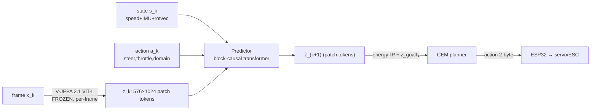
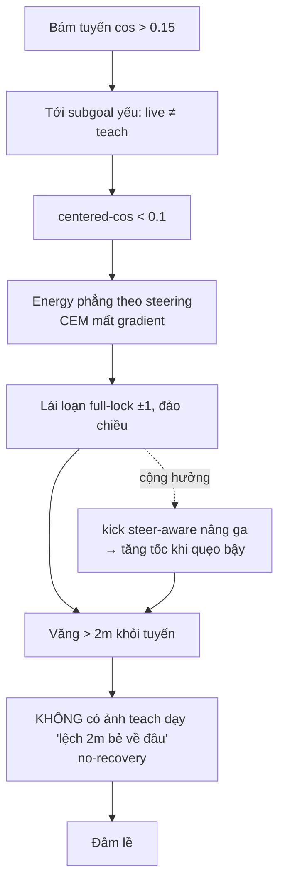

# BÁO CÁO CHI TIẾT — Action-Conditioned World Model dựa trên V-JEPA 2.1 cho Điều hướng Xe RC

**Phụ đề (gợi ý):** *Đánh giá Offline và Phân tích Triển khai Closed-loop của một World Model Latent
dùng Encoder Video Nền-tảng Đóng băng trên Robot Di động.*

> **Cách dùng file này:** đây là **kho nội dung chi tiết** (mọi khâu, mọi giai đoạn, mọi vấn đề) để
> dán/biên tập vào Word và bổ sung cho bản paper khi paper thiếu. Mọi con số đã verify từ repo
> (`docs/HANDOFF.md`, `docs/CLOSED_LOOP_FAILURE.md`, `docs/VJEPA2_AC_CAR.md`, `README.md`, `CLAUDE.md`).
> Placeholder cần điền: `[Họ tên]`, `[MSSV]`, `[Lớp/Môn CV]`, `[GVHD]`, `[ngày]`.

---

## Mục lục
1. Tóm tắt (Abstract) & Đóng góp
2. Giới thiệu & Động lực
3. Phát biểu bài toán & Phạm vi
4. Nền tảng & Công trình liên quan
5. Hệ thống phần cứng & Thu thập dữ liệu
6. Encoder V-JEPA 2.1 (đóng băng) & phát hiện về tốc độ
7. Kiến trúc AC Predictor (đóng góp chính)
8. Huấn luyện & Kết quả Offline
9. Điều hướng: Topological Graph
10. Lập kế hoạch: CEM + Car Dynamics + Policy Prior
11. Triển khai Closed-loop (Teach & Repeat)
12. Phân tích Thất bại Closed-loop (lõi phân tích)
13. Tổng hợp các vấn đề kỹ thuật đã gặp & cách xử lý
14. Hạn chế
15. Hướng phát triển
16. Kết luận
17. Phụ lục (tái lập, config, bản đồ file)

---

## 1. Tóm tắt (Abstract) & Đóng góp

**Tóm tắt.** Chúng tôi nghiên cứu việc dùng một **encoder video nền-tảng đóng băng (frozen
foundation video encoder) — V-JEPA 2.1 ViT-L** — làm biểu diễn cho một **world model hành-động-điều-kiện
(action-conditioned world model)** trên một **xe RC di động**, rồi dùng **CEM planning** để điều hướng
tới ảnh-mục-tiêu theo kiểu *teach & repeat* (lái một vòng để "dạy" chuỗi subgoal ảnh, sau đó cho xe tự
"lặp lại"). Về mặt **offline**, một AC predictor nhỏ (~26M tham số) đặt trên latent đóng băng **vượt
baseline "đứng yên" (identity)** ở mọi horizon (rollout@1 ratio = **0.744**), có **độ nhạy hành động**
đo được (argmin năng lượng đúng hướng cua **58/60**, contrast 0.37), và đặc biệt cho thấy **transfer
chéo-domain-servo có lợi** (train trộn 2 loại servo → eval trên servo mới đạt **0.65** so với **1.073**
khi chỉ train trên servo đó). Tầng điều hướng dựng **topological graph** 92 session (29,699 node) định
vị (localize) **trung vị 2.1m**. Tuy nhiên, khi **triển khai closed-loop** ngoài thực địa, hệ thống
**bám tuyến tốt ở nửa đầu route rồi "bung" ra lề tại điểm "cos-dropout"** — nơi ảnh live không khớp ảnh
teach làm cosine tụt <0.1, CEM mất gradient và lái loạn, trong khi **không có tín hiệu kéo về** (không
có dữ liệu recovery). Không run nào (trong ~10 run) về tới đích. Chúng tôi phân tích cơ chế thất bại
này một cách định lượng và chỉ ra rằng **giới hạn nằm ở tầng nav-robustness + control, không ở chất
lượng biểu diễn** — một *negative finding* trung thực về việc triển khai world model latent trên cảnh
ngoài trời.

**Đóng góp.**
1. **Đánh giá đầu tiên họ V-JEPA 2 trên một robot di động (xe RC)** — Meta chỉ thử trên cánh tay
   robot (Franka, cảnh bàn cố định). Đây là chế độ khó hơn về robustness (heading/ánh sáng/lệch ngang).
2. **Một pipeline offline rigorous**: rollout-vs-identity, độ nhạy hành động (energy-probe), và
   **bằng chứng transfer chéo-domain-servo** — KDS (giàu steering) giúp ích cho TowerPro.
3. **Một phân tích thất bại closed-loop có cơ chế** (cos-dropout → mất gradient → no-recovery → bung),
   kèm bằng chứng loại trừ giả thuyết "cảnh tự-giống / teach xấu".
4. **Một khắc phục đã validate offline cho chính negative finding đó**: *recovery augmentation* ở mức
   latent ("DAVE-2 cho V-JEPA", không cần GPU) khuếch đại đáp ứng tự-sửa của policy **3.4–5.4×** baseline
   (đúng trục vật-lý H-A, đúng dấu, không hại goal-reaching), kèm tiêu-chí phân định rõ "đã chứng minh
   offline" vs "cần xác minh trên xe" — biến thiếu-dữ-liệu-recovery thành phương pháp (§12bis).

---

## 2. Giới thiệu & Động lực

**Vấn đề.** Điều hướng bằng thị giác (visual navigation) cho robot di động truyền thống dựa vào SLAM/
bản đồ hình học. Một hướng thay thế gần đây là **học biểu diễn tự-giám-sát** rồi **lập kế hoạch trong
không gian latent**: thay vì xây bản đồ 3D, ta học một *world model* dự đoán "hành động nào gây ra thay
đổi hình ảnh nào" và tìm chuỗi hành động đưa quan sát hiện tại về quan sát-mục-tiêu.

**Vì sao V-JEPA 2.1.** V-JEPA (Joint-Embedding Predictive Architecture cho video) học đặc trưng bằng
**dự đoán trong không gian biểu diễn** (feature prediction) thay vì tái tạo pixel — tránh lãng phí dung
lượng mô hình vào chi tiết pixel không cần thiết. Bản **2.1** (ViT-L distilled từ ViT-G, 384px) bổ sung
**Dense Predictive Loss** → đặc trưng patch chất lượng cao (tốt cho localization/geometry). Meta đã chứng
minh **V-JEPA 2-AC** (action-conditioned) cho phép **planning** trên cánh tay robot. Câu hỏi tự nhiên:
*biểu diễn này có dùng được cho một robot DI ĐỘNG, ngoài trời, với động lực học và domain-shift thật?*

**Đóng khung cho môn CV.** Bài toán này bản chất là Computer Vision: (a) **biểu diễn thị giác** từ một
foundation model đóng băng; (b) **nhận dạng địa điểm bằng thị giác (visual place recognition)** để định
vị và pop subgoal; (c) **độ bền của biểu diễn dưới domain-shift thật** (ánh sáng/giờ/góc nhìn) — chính
là tâm điểm của phần phân tích thất bại; (d) **so khớp latent** để lập kế hoạch điều khiển.

**Hạn chế tài nguyên & quyết định dừng.** Đề tài có deadline cứng; encoder ViT-L chạy trên GPU (RTX
5070 Ti) chứ không chạy trên điện thoại → inference phải qua PC. Sau ~4–5 ngày tinh chỉnh closed-loop
ngoài thực địa (nắng, pin, công sức) mà chẩn đoán cho thấy thất bại là **giới hạn model/data, không phải
tham số**, nhóm **dừng thử nghiệm thực địa** và chuyển sang **viết báo cáo** — chốt lại phần offline
(đã vững) và trình bày closed-loop như một *negative finding* được phân tích kỹ.

---

## 3. Phát biểu bài toán & Phạm vi

**Bài toán "tự lái" đã chốt** (kiểu **ViNG/ViKiNG**): **visual goal-reaching cục bộ + topological graph
ảnh subgoal**. Khi đích khuất tầm nhìn → **xâu chuỗi các goal-nhìn-thấy-được**, mỗi cái CEM lái tới.

**Trong phạm vi:** điều hướng bám tuyến đã-được-dạy (teach & repeat); pop subgoal theo GPS + xác nhận
ảnh; điều khiển servo bằng CEM trên latent.

**NGOÀI phạm vi (cố ý, để vừa deadline):** KHÔNG né vật cản, KHÔNG SLAM, KHÔNG bản đồ hình học toàn cục.

**Kiến trúc 2 tầng (tách bạch — quan trọng cho việc quy trách nhiệm khi phân tích lỗi):**
- **Navigation (action-agnostic = chỉ thị giác + GPS):** `TopoGraph` — node là frame (latent V-JEPA
  single-frame + GPS mét + heading). Trả lời "đang ở đâu" và "đi qua những subgoal nào".
- **Control (servo-specific):** AC predictor (V-JEPA frozen + predictor) + CEM. Trả lời "đạp ga/đánh lái
  bao nhiêu để tới subgoal kế".

> Việc tách 2 tầng cho phép kết luận cuối cùng: **tầng representation/navigation hoạt động (offline);
> gap nằm ở tầng control + nav-robustness khi đóng vòng.**

---

## 4. Nền tảng & Công trình liên quan

- **JEPA / V-JEPA / V-JEPA 2 / 2.1.** Học self-supervised bằng *feature prediction* trong không gian
  embedding (không reconstruct pixel). V-JEPA 2 mở rộng lên video quy mô lớn và chứng minh
  *understanding / prediction / planning*. 2.1 thêm Dense Predictive Loss (đặc trưng patch dày). (Các
  PDF gốc đã lưu trong `docs/`: *V-JEPA 2*, *V-JEPA 2.1*, *V-JEPA Revisiting Feature Prediction*.)
- **V-JEPA 2-AC.** Bản action-conditioned của Meta: interleave `[action, state, patch]` mỗi frame, một
  predictor block-causal, CEM planning với energy `‖P − z_goal‖₁`. **Chỉ thử trên cánh tay robot.**
- **ViNG / ViKiNG.** Điều hướng bằng goal ảnh + đồ thị topo (không bản đồ hình học); policy học từ dữ
  liệu có hành vi đa dạng (kể cả lệch rồi về). Nền tảng cho tầng nav của chúng tôi. (PDF trong `docs/`.)
- **PiJEPA (Policy-Guided World Model Planning).** Warm-start MPC bằng một policy prior trên JEPA world
  model. Chúng tôi áp dụng đúng tinh thần này (CEM thay MPPI, BC-MLP thay Octo). (PDF trong `docs/`.)
- **LeJEPA / LeWorldModel.** Một world model pixel-JEPA end-to-end (SIGReg anti-collapse) — chúng tôi
  port làm **baseline độc lập mạnh** (KHÔNG dùng V-JEPA).

---

## 5. Hệ thống phần cứng & Thu thập dữ liệu

### 5.1. Bước ngoặt kiến trúc: từ link video không dây sang điện thoại onboard
- **Rig ban đầu (đã bỏ cho thu data):** camera RunCam WiFiLink 2 (OpenIPC, cảm biến IMX415) truyền
  H.265 qua **WFB-NG (5.8GHz, RTL8812AU)** về PC. **Thất bại ở tầm xa:** ~50m thì vỡ ảnh, ~3% frame
  giật kèm rớt nhiều giây, độ trễ phình **92→310ms** khi mất gói. → quyết định **ngừng đánh nhau với
  link video không dây**.
- **Rig hiện tại (pivot 2026-06-04):** **đặt điện thoại Android lên xe** (Samsung A42 5G, Android 13)
  làm **camera + máy ghi + relay**. Camera **ultrawide** chụp frame cục bộ; đọc telemetry ESP32 qua
  **USB (không cần root, `usb-serial-for-android`)**; lưu `frames/*.jpg + actions.csv + telemetry.csv`
  **cùng schema** với rig cũ → tái dùng pipeline sync/encode. Vì **frame và telemetry chung một đồng hồ
  điện thoại** → các vấn đề trễ-WFB / LED / đồng-bộ-clock **biến mất**.
- **Độ trễ chụp camera δ_cam ≈ 100ms** (đo trên A42, `TIMESTAMP_SOURCE=REALTIME`, ổn định 98–103ms cả
  trong nhà lẫn ngoài trời) — KHÔNG bằng 0; app ghi `dcam_ms` mỗi frame và `sync.py` hiệu chỉnh.

### 5.2. Điều khiển & lái tay
- **ESP32-S3** trên xe điều khiển **servo lái** (TowerPro MG946R, GPIO5) và **ESC ga** (Hobbywing
  QuicRun 8BL150, GPIO6). Điện thoại cấp nguồn + giao tiếp ESP32 qua **cổng USB native (VID 303A)**.
- **Lái tay khi RECORD** bằng bộ điều khiển **FlySky FS-i6 / iA10B i-BUS** (CH1=lái, CH2=ga, CH9=mode,
  CH10=record). `recorder.py` là **logger thụ động**: ghép mỗi frame với hành động tại `t_read − δ_cam`.
- **Hai "domain" servo** (quan trọng cho phần transfer): **KDS** (servo cũ) và **TowerPro MG946R**
  (servo hiện tại, recalib 2026-06-07). Hai servo có **ánh xạ action→góc lái khác nhau** → là 2 domain
  điều khiển khác nhau → ta gắn `domain_id` (0=KDS, 1=TowerPro) vào input predictor.

### 5.3. Đồng bộ & state
- `sync.py` re-pair mỗi frame bằng **nội suy tuyến tính `telemetry.csv` 50Hz** tại thời điểm cảnh thật,
  hiệu chỉnh δ_cam, loại frame rơi-vào-lỗ-telemetry → xuất `actions_synced.csv` + `imu_synced.csv`.
- **State vector 10-D:** `[speed, gx,gy,gz, ax,ay,az, rx,ry,rz]` = GPS speed + gyro + accel + rotvec
  (orientation tuyệt đối). (Loại lat/lon/bearing tuyệt đối để tránh overfit địa điểm.)
- **GPS:** điện thoại A42 thực tế trả **~1.04Hz** (dù app xin 5Hz); nhiễu vị trí **trung vị 0.44m /
  p90 1.0m / max 3.2m** (đo bằng `measure_gps_noise.py` trên 57 đoạn đứng-yên).

### 5.4. Thống kê dữ liệu
| Tập | #session | Đặc điểm |
|---|---|---|
| **KDS** (servo cũ) | ~28–30 | Steering đủ dải −1..1; **throttle ~hằng ~7.5%** (≈ steering-only) |
| **TowerPro** (servo mới) | **181** (64 + 117 recovery) | **Throttle biến thiên** (std~0.07, reverse 9–14%, dải −0.16..0.15) |
| **Tổng** | **209 session ≈ 228k frame** | Đứng yên 13.4% frame; **1049 sự kiện đề-pa** |

- **Split tái lập được:** train ghi `split.json` (seed 0, session-level 80/20 = 145/36); mọi eval đọc
  lại y nguyên → val set cố định.

---

## 6. Encoder V-JEPA 2.1 (đóng băng) & phát hiện về tốc độ

- **Encoder:** V-JEPA 2.1 **ViT-L 384** (distilled từ ViT-G), **đóng băng tuyệt đối** (không bao giờ
  backprop). Tải qua `torch.hub` (`vjepa2_1_vit_large_384`) — **2.1 chỉ có trên torch.hub, không trên
  HuggingFace** (HF id cũ trong tài liệu là 2.0).
- **Encode TỪNG frame** (image-path) → **patch tokens**: 256px → 16×16 = **256 token**; 384px → **576
  token**; mỗi token **1024-D**. KHÔNG pool, KHÔNG nhồi nhiều frame.
- **Tối ưu then chốt:** **pre-encode toàn bộ dataset offline một lần** → lưu latent (`.npy` memmap fp16)
  → train đọc latent trực tiếp, **không forward V-JEPA khi train** (~50–100× nhanh hơn).
- **⚠️ Phát hiện quan trọng (đo được) — encoder KHÔNG mang thông tin tốc độ:** latent single-frame
  pooled có **R²(speed) = −1.1** (≈ 0 thông tin tốc độ); nhồi clip nhiều frame vào encoder cũng **≈ 0**.
  Lý do: model 2.1 ViT-L 384 chạy **image-path tubelet_size=1** (Conv3d kernel thời gian = 1 → không
  tích chập thời gian). → **tốc độ phải vào qua STATE token** (GPS speed), KHÔNG phải qua multi-frame.
  Đây là một bài học CV cụ thể: *một video encoder vẫn có thể "mù vận tốc" nếu chạy ở image-path.*
- **Vì sao vẫn dùng được cho control:** camera xe **thấy bánh lái phía trước** → **góc lái đã nằm trong
  patch map** (state quan sát-được-bằng-ảnh); state token chỉ cần lo phần **tốc độ** mà ảnh không cho.

### 5↔6 — Đính chính resolution (ghi rõ để tránh sai như bản nháp đầu)
- **384 là cố ý cho CHẤT LƯỢNG** (V-JEPA 2.1 cooldown ở 384; checkpoint ViT-L distilled là 384-native).
- **256 của V-JEPA 2-AC = lựa chọn COMPUTE** ("for simplicity", clip 16-frame cho MPC), **KHÔNG** phải
  "256 đẹp hơn". → **đừng gọi 256 là "faithful".** Chiến lược: iterate ở 256 (rẻ, ablate nhanh), **chốt
  model cuối ở 384**.

---

## 7. Kiến trúc AC Predictor (đóng góp chính)

### 7.1. Sơ đồ
```
mỗi frame x_k ──[V-JEPA 2.1 ViT-L 384, FROZEN, per-frame]──► z_k  (N_tok × 1024 patch tokens)
state  s_k = [speed, gx,gy,gz, ax,ay,az, rx,ry,rz]  (GPS+IMU)  ──┐
action a_k = [steer, throttle, domain]                          ──┤ interleave (a_k, s_k, z_k) mỗi frame
                                                                  ▼
                       Predictor block-causal transformer ───────► ẑ_{k+1}  (patch tokens)
```


*Hình 1 — Kiến trúc hệ thống (PNG dùng ngay, render từ graphviz). Nguồn diagram để chỉnh ở
`figures/src/fig_architecture.dot`; bản mermaid tương đương dưới đây.*



### 7.2. Thành phần (đã verify vs code Meta gốc)
| Thành phần | Giá trị | Khớp Meta? |
|---|---|---|
| Encoder | V-JEPA 2.1 ViT-L 384, frozen, per-frame | ✓ image-encoder |
| Interleave | `[action, state, patch]` mỗi frame | ✓ |
| Predictor | block-causal transformer, **depth 12, hidden 1024** | ⚠️ Meta 24/300M (ta nhỏ hơn để tránh overfit ~228k frame) |
| Pos-embedding | **học được** (temporal + token-type) | ⚠️ Meta dùng 3D-RoPE (lệch có chủ ý) |
| Dự đoán | **tuyệt đối** `ẑ = P(...)` (predict_residual=false) | ✓ |
| Chuẩn hóa | **per-token LayerNorm** + re-LN sau mỗi bước rollout | ✓ |
| Loss | **L1 teacher-forcing + rollout 2-step** (auto_steps=2) | ✓ (paper eq.2–4) |
| Số tham số | ~26M (patch) / 7.4M (pooled) | — |

### 7.3. Lệch CÓ CHỦ Ý so với Meta (ghi minh bạch)
- **State = IMU 10-D** thay pose 7-D cánh tay (xe không có proprioception sub-mm; loại vị trí tuyệt đối
  để tránh overfit địa điểm).
- **Pos-emb học được** thay 3D-RoPE (với clip nhỏ cố định là đủ).
- **Depth 12/512** thay 24/1024 (data ~228k frame, predictor quá to dễ overfit).
- **Bicycle-model dynamics** thay `compute_new_pose` của cánh tay (xem §10).

---

## 8. Huấn luyện & Kết quả Offline

### 8.1. Hai world model được so sánh trên cùng dataset latent
- **`vjepa_ac` / `VJEPA2ACCar`** — AC predictor đặt trên V-JEPA latent đóng băng (**đóng góp chính**).
- **`LeWM` (LeWorldModel)** — pixel-JEPA end-to-end (**baseline độc lập**).

### 8.2. Metric (giải thích — vì sao không tin val_pred đơn lẻ)
- **`rollout@k / identity` = MSE(model, z_{t+k}) / MSE(identity, z_{t+k})**, với identity = "đoán frame
  sau y hệt frame trước (đứng yên)". **<1 = thắng baseline; thấp hơn = tốt hơn.** Đây là **chỉ số quyết
  định**, vì val_pred đơn lẻ có thể bị lừa (latent collapse + bỏ qua action vẫn cho val thấp).
- **Action-sensitivity (energy-probe):** quét energy E(steer) trên `[-1,1]` ở các cửa-sổ-cua, xem
  **argmin-E có đúng hướng quẹo không** và **contrast (Emax−Emin)/Emin** sâu cỡ nào. Đây là thước đo
  "CEM thực sự đọc được hành động ở cua", sát với cái CEM dùng hơn cả ratio.

### 8.3. Kết quả (Bảng A) — world model thắng baseline
| Model | @1 | @2 | @3 | Ghi chú |
|---|---|---|---|---|
| **cd4 (ckpt deploy)** | **0.744** | **0.703** | **0.697** | frozen split, 2000 window |
| vjepa_ac pooled (7.4M), 5-seed CV | 0.958 ± 0.024 | — | — | 4/5 seed <1, var thấp → **ổn định** |
| vjepa_ac_pool (baseline pooled) | 0.867 | — | — | ablation |
| **LeWM** (pixel JEPA, ~22M) | 0.97 ± 0.15 | — | ≥1 horizon dài | **không ổn (2/5 fold fail)** |

→ **Headline:** model chính **thắng identity ổn định ở mọi horizon**; baseline LeWM chỉ thắng biên độ
và **không ổn định**.

### 8.4. Cross-domain servo transfer (Bảng B) — kết quả nổi bật nhất
| Train | Eval trên TowerPro held-out (@1) |
|---|---|
| **Mixed (KDS + TowerPro)** | **0.65** |
| TowerPro-only | **1.073** (tệ hơn đứng yên!) |

→ Train **chỉ** trên TowerPro lại **thua identity**; train **trộn** KDS (servo khác, giàu steering) →
**0.65**. **KDS transfer sang TowerPro** dù khác servo. Đây là bằng chứng "đa dạng hành động/domain quan
trọng hơn so-khớp-domain", một finding gọn và dễ trình bày.

### 8.5. Action-sensitivity (Bảng C) — CEM đọc được hướng cua
| Đo (probe_energy --turn-only, d=4, cd4) | Giá trị |
|---|---|
| argmin-E đúng hướng cua | **58/60** |
| median \|argmin−teacher\| | 0.12 |
| contrast (Emax−Emin)/Emin | **0.37** |
| Δsteer recovery / Δthrot | 0.16 / 0.04 |
| contrast theo khoảng cách target | d2 **0.443** / d4 0.355 / d8 **0.270** |

→ (a) **Model KHÔNG "đánh lái yếu" offline** — đáy energy rõ và đúng phía. (b) **Contrast tụt theo
khoảng cách target** = cơ chế "mất tín hiệu khi subgoal xa/quanh-góc" → trị bằng **target gần + teach
dày**, không phải train thêm.


*Hình 2 — Energy landscape (probe_energy, 60 turn-window val, cd4). **Trái:** các đường E(steer) chuẩn
hoá — đáy ● đúng phía cua (đỏ = cua trái → đáy bên trái; xanh = cua phải → đáy bên phải); đường chấm =
hành động teacher. **Phải:** argmin-E (model) vs steer teacher — **58/60 đúng dấu**, median contrast
**0.355** (tái lập số headline). → Offline CEM **có** tín hiệu lái rõ; closed-loop hỏng là vì cos-dropout
**làm phẳng chính landscape này** (Hình 5), KHÔNG phải model dốt cua. Sinh:
`scripts/probe_energy.py --turn-only -d 4 --n-windows 60 --plot …`.*

### 8.6. Ablation âm cd4_as3 (thể hiện rigor)
- **cd4_as3** = cd4 nhưng **auto_steps 3** (train rollout sâu hơn). Kết quả: **dự đoán multi-step tốt
  lên** (ratio@2 0.699, @3 0.686 vs cd4 0.703/0.697) **NHƯNG action-sensitivity KÉM đi**
  (probe turn 54/60, contrast **0.274** < cd4 58/60, 0.37).
- **Diễn giải:** train rollout sâu hơn làm dự đoán **mượt/trung-bình-hoá** → landscape energy theo
  action **phẳng đi quanh cua**. → **giữ cd4** để deploy. **Bài học:** auto_steps cao hơn không miễn
  phí — phải soi cả action-sensitivity, không chỉ val/ratio.

### 8.7. Các bài học train/data
- **frame_skip=1 (10fps) làm HỎNG LeWM:** frame liên tiếp gần giống hệt → model học identity (ratio
  1.25). Phải frame_skip=5 (~0.5s/bước). (vjepa_ac dùng frame liên tiếp OK vì latent V-JEPA đổi rõ hơn.)
- **eff_rank latent của LeWM chỉ ~7–9/256** → **dữ liệu đơn điệu (ga gần cố định) là bottleneck chính.**
- **Throttle normalization:** thêm `action_scale [1.0, 6.67]` (đưa throttle ~[-0.15,0.15] → ~[-1,1]) →
  Δthrot từ **0.12 → 0.04** (predictor không còn coi nhẹ ga).

---

## 9. Điều hướng: Topological Graph

- **Node** = frame (latent V-JEPA single-frame + GPS mét + heading). **Cạnh** = **temporal** (người đã
  lái qua = chắc đi được) + **loop-closure** (kNN cosine latent cross-session, **GPS-gate <8m** chống
  aliasing thị giác).
- **API:** `localize()` (có GPS-prior), `plan_route()` (Dijkstra), `extract_subgoals()` (chuỗi ảnh).
- **Kết quả (Bảng E):** graph 92-session (28 KDS + 64 TowerPro) = **29,699 node, 1 component 100%**;
  localize LOSO **median 2.1m (<8m 88%)**; routing **100%**; route bám tuyến người **median 2.3m**.
  (Rebuild 209-session sau khi **lọc 23% node** đâm/lùi/kẹt → 33,590 node, localize 2.0m <8m 86%.)
- **Phân biệt vị trí bằng centered-cos:** tại-chỗ ~1.0, subgoal kế ~0.58, cách-2 ~0.37 (raw-cos vô dụng
  0.95–0.99 ở mọi nơi). → **đây là phần "place recognition" của bài, hoạt động tốt offline.**


*Hình 4 — Đồ thị topological 209-session: nền xám = mọi quỹ đạo người lái (cấu trúc vòng của bãi);
đường xanh = route Dijkstra; dải ảnh dưới = chuỗi subgoal ảnh (visual place) CEM bám theo. Sinh bằng
`scripts/viz_route.py --graph data/graph/topograph.pt`.*

---

## 10. Lập kế hoạch: CEM + Car Dynamics + Policy Prior

- **CEMPlannerAC:** context 2 frame, **horizon 4**, energy `‖P − z_goal‖₁`, receding-horizon, chỉ áp
  **action đầu**. Mỗi iteration **chèn 5 seed candidate steer** `[-1,-0.5,0,+0.5,+1]` để elite bắt được
  đáy toàn cục (trước đó policy warm-start che mất vùng search).
- **CarDynamics (bicycle-model)** tích phân `[x,y,heading,speed]` từ `[steer,throttle]`; hệ số **fit từ
  data thật**: `k_thr=1.588, k_drag=0.078, k_yaw=0.088`. *(Đây là phần kỹ thuật tự dựng, rủi ro nhất.)*
- **Policy prior (PiJEPA-style BC):** `π(pooled z_t, pooled z_goal, state, domain) → [steer,throttle]`,
  dùng để **warm-start mu của CEM** → hội tụ nhanh → giảm samples/iters → giảm trễ. (BC offline:
  med|Δsteer| 0.023–0.027 phẳng theo d=1..8.)
- **Trễ CEM (bench GPU thật, model cd4):** tick (CEM + enc ~0.03 + overhead):
  **32/1 ≈ 0.50s · 64/2 ≈ 1.57s · 128/2 ≈ 2.89s · 256/2 ≈ 5.51s**. → cấu hình search dày (256/2) khiến
  xe đi "mù" ~5.5s/quyết định; **32/1 cho chất lượng action NGANG 64/2** (đã đo) nên chốt 32/1 + policy.

---

## 11. Triển khai Closed-loop (Teach & Repeat)

### 11.1. Luồng
- **Teach:** lái xe tay, **chụp chuỗi subgoal ảnh + GPS** dọc tuyến (`teach_record.py` /
  `route_web.py` panel "Route tay"; vào cua chụp DÀY).
- **Repeat:** điện thoại stream (frame + GPS + rotvec) qua TCP → **PC** chạy **V-JEPA 2.1 ViT-L (frozen)
  → AC predictor cd4 → CEM** lái tới subgoal hiện tại (patch tokens) → gửi **2-byte action** về điện
  thoại → ESP32 → servo/ESC. **Pop subgoal** theo GPS (± xác nhận ảnh).
- **Vận hành:** web `route_web.py` (Flask :8060) hiển thị vị trí xe + camera + trạng thái; nút ⛔ STOP
  khẩn. `run_infer.sh` tự ghi `logs/infer_<thời_gian>.log` để mổ offline.

### 11.2. Cấu hình chạy thật (chốt tại trận)
`--samples 32 --iters 1` (hoặc 256/2 khi cần search dày) · `--throttle-cap/cruise 0.08` ·
`--kick-throttle 0.10` (đề-pa) · `--steer-smooth 0.1` · `--pop-confirm-cos` (GPS + xác nhận ảnh) ·
`--ctrl-lookahead-m 0.5` · checkpoint `vjepa_ac_car_cd4/best.pt` + policy prior. Route: bãi cỏ công
viên, tuyến ~thẳng ~15m (parkfix3/park4/park6).

### 11.3. Kết quả (Bảng D) — KHÔNG run nào về đích
| Run | tick | config | bám tốt tới | bung tại (cos) | kết cục |
|---|---|---|---|---|---|
| 163607 | 1.13s | 59sg, fast | **sg18 (xt<0.5m)** | sg21 (cos 0.07) | bung trái +3.2m |
| 163831 | 2.82s | 59sg, slow | sg8 | sg10 (cos 0.27) | trôi −2.4m |
| 164827 | 2.90s | 59sg, slow | sg12 | sg27 | trôi trái +2.8m |
| 171022 | 2.82s | geosteer ON | sg20 | sg23 | 🛑 DIVERGE (rotvec hỏng) |
| **171912** | 1.78s | **pure-visual sạch** | sg6 | **sg7 (cos 0.02)** | veer trái → bụi cỏ |

→ **Pattern bất biến qua mọi config:** bám tuyến tốt ở **nửa đầu** (lệch ngang xt < 0.5m) → tới một
subgoal "yếu" → **cos sập** → bung ra lề. **Knob chỉ DỜI điểm bung, không xoá** (tick nhanh giúp bám tới
sg18 thay vì sg8 nhưng vẫn bung).

---

## 12. Phân tích Thất bại Closed-loop (lõi phân tích)

### 12.1. Cơ chế "vòng xoáy cos-dropout" (đo, không đoán)
```
bám tuyến (cos>0.15)  →  tới subgoal "yếu" (live ≠ teach)  →  cos < 0.1
   ↑                                                              ↓
đâm lề  ←  no-recovery (văng >2m mất luôn)  ←  CEM lái loạn full-lock ±1  ←  mất gradient
                                                    ↓ (cộng hưởng)
                                          kick steer-aware nâng ga → tăng tốc khi quẹo bậy
```


*Hình 3 — Cơ chế thất bại cos-dropout (PNG dùng ngay, render từ graphviz; nguồn
`figures/src/fig_cos_dropout_mechanism.dot`). Bản mermaid tương đương dưới đây.*


- **Vì sao cos-dropout:** vài subgoal có ảnh live (heading/ánh-sáng/vị-trí repeat khác teach) **không
  khớp** ảnh teach → centered-cos tụt <0.1.
- **Vì sao panic:** energy CEM = `‖predicted_patch − goal_patch‖`; cos thấp = goal **không phân-biệt-được**
  trong latent → energy **phẳng** theo steering → CEM chọn lái ~ngẫu nhiên, hay full-lock + đảo chiều.
- **Vì sao không cứu được:** teach chụp toàn bộ **khi xe ở GIỮA tuyến** → **không có ảnh teach nào dạy
  "lệch 2m thì bẻ về hướng nào"** → một khi văng ra, thị giác mù hướng-về (cos chỉ tụt, không chỉ đường).


*Hình 5 — Chữ ký thất bại (run thật 171912, parse từ log). Trên: centered-cos giữ ~0.25 ở sg4–7 rồi
**rơi qua ngưỡng 0.1** (vùng đỏ) ở sg8 và xuống âm ở sg9. Dưới: ngay khi vào vùng cos-dropout,
**|raw steer| của CEM bão hòa 1.0** (lái full-lock) — minh chứng "mất gradient → lái loạn".*


*Hình 6 — Quỹ đạo cùng run: màu điểm = centered-cos. Nửa đầu (xanh, cos tốt) xe **bám tuyến**; khi cos
collapse (vàng→đỏ) xe **bung ra** và dừng tại ❌. Sinh bằng `scripts/plot_closed_loop.py logs/infer_20260613_171912.log`.*

### 12.2. Bằng chứng: KHÔNG phải "cảnh tự-giống / teach xấu"
- **Embedding teach tốt đều:** encode lại qua V-JEPA, đo độ phân-biệt: parkfix3 **self-gap 0.070**;
  parkfix_5 **self-gap 0.094** (≈/hơn). raw-cos giữa-subgoal ~0.98, centered-norm ~5. → **không** do
  scene/teach degenerate.
- **Cos-quality khi CHẠY phụ thuộc alignment teach-vs-repeat:** parkfix3 (teach sáng, chạy ngay sau)
  **66% tick có cos>0.3** → bám tới sg18-57; parkfix_5 (teach 14:11, chạy 14:50, nắng gắt) **0%>0.3**.
  → **khớp-live nhạy với giờ/nắng/heading**, KHÔNG do biểu diễn V-JEPA. *(Đây là kết luận CV cốt lõi:
  domain-shift ánh sáng/góc nhìn giữa teach và repeat là thủ phạm, không phải encoder.)*

### 12.3. So với Meta & ViNG/ViKiNG
- **Meta (robot-arm):** cảnh bàn cố định, action gây đổi-cảnh **lớn + tức thì**, **không** có heading/
  ánh-sáng/lệch-ngang. "Chính xác cm" của họ = encoder khớp **proprioception tay máy** (sub-mm,
  quasi-static, in-domain) — **khác hệ đo**, không phải "world model chính xác hơn".
- **Xe ngoài trời:** action → đổi-cảnh **nhỏ** + **cos-dropout** + **no-recovery** → chế độ **khó hơn**
  về robustness.
- **ViNG/ViKiNG chạy được** vì policy **train TRÊN data có recovery** (lệch→về). Data teach-1-lượt-giữa-
  line của ta **THIẾU** đúng tín hiệu đó.

### 12.4. Đóng khung negative finding (cho phần kết)
> *"Open-loop teach&repeat trên một frozen video-encoder + CEM, thiếu lateral-recovery, sẽ bung ở điểm
> visual-mismatch trên cảnh ngoài trời."* Bảng D (§11.3) + cơ chế (§12.1) + bằng chứng loại trừ
> (§12.2) là toàn bộ chứng cứ. **Giới hạn ở tầng nav-robustness + control, KHÔNG ở representation.**

---

## 12bis. (Bổ sung 06-14) Khắc phục đề xuất — Recovery-augmented policy + đo lại "tốc-độ-quyết-định"

> Phần này biến *negative finding* (§12) thành một **phương pháp khắc phục cụ thể, đã validate offline**.
> Hai nguyên nhân cộng hưởng của thất bại closed-loop được tách bạch và xử lý riêng.

### 12bis.1. Nguyên nhân #2 = TỐC-ĐỘ-QUYẾT-ĐỊNH (không chỉ thiếu recovery)
Ngoài "thiếu lateral-recovery" (§12.1), một nguyên nhân thứ hai là **độ trễ quyết định của CEM**: mỗi
tick CEM mất 0.5–5.5 s (theo số sample), trong đó xe chạy "mù" giữ nguyên action cũ → tích luỹ lệch.
Giả thuyết trước đây: "nhiều sample thắng vì cắt được đuôi action full-lock". **Đo lại (`meas_tail.py`,
300 window VAL, d=4)** bác bỏ: tăng sample 16→256 **KHÔNG** giảm phương sai argmin (≈0.18–0.23, phẳng)
cũng **KHÔNG** giảm tỉ lệ full-lock trên đoạn thẳng (≈14–16%, phẳng). Đuôi full-lock là **nội tại của
world-model**, không sửa được bằng search rộng hơn. ⇒ Hệ quả: **64 sample (1.6 s) ≈ 256 sample (5.5 s)
về chất lượng** nhưng ít "lái mù" 3.4×; đòn bẩy đúng là **tick nhanh + ga thấp**, không phải search rộng.
Điều này thúc đẩy một **policy học sẵn** (1 forward MLP, <1 ms) thay cho CEM trong vòng điều khiển.

### 12bis.2. Recovery augmentation — "DAVE-2 cho latent V-JEPA" (không cần GPU)
Dữ liệu teach-giữa-làn thiếu cảnh "xe lệch rồi bẻ về" (ViNG/Meta có). Ta **tổng hợp** nó ở mức latent:
patch cache là lưới token **24×24**; **dịch ngang lưới** (border-replicate) ≈ góc nhìn của xe **lệch
ngang/chệch hướng**, rồi mean-pool → latent lệch (giữ đủ 576 token = khớp pool tính online lúc inference,
**không** cần encode lại qua V-JEPA). Mỗi mức dịch `s` ghép một **nhãn bẻ-về**: dịch phải (+s) → steer
TRÁI một lượng `α·s/W`. Trộn `p_aug=0.35` mẫu recovery vào behavior-cloning của GoalPolicyPrior
(`scripts/pool_recovery_latents.py`, `train_policy_recovery.py`).

### 12bis.3. Validate offline (3 thí nghiệm, VAL held-out)
- **(H-A) Trục synthetic có cơ-sở vật-lý** (`probe_aug_alignment.py`, 76k frame-pair): dịch token
  synthetic dịch pooled latent **đúng trục** chuyển-động-ngang thật khi camera yaw — cos(real, synth+12)
  = **+0.10** lúc yaw phải / −0.09 lúc yaw trái (đối xứng), còn chuyển-động THẲNG (control) ≈ **0**
  (−0.01/−0.03). ⇒ augment không train một trục lạ.
- **(REC-3) Recovery KHUẾCH ĐẠI đáp ứng bẻ-về** (`eval_recovery_response.py`, 8000 anchor): so baseline,
  policy recovery có slope Δsteer/shift dốc **3.4–5.4×**, monotone, **đúng dấu mọi mức dịch**:

  | policy | slope | \|Δsteer\| @ dịch +12 | val w-L1 (normal) |
  |---|---|---|---|
  | baseline (BC thường) | −0.0070 | 0.097 | 0.0699 |
  | recovery α=0.6 | **−0.0239** | **0.286** | **0.0648** |
  | recovery α=1.0 | −0.0377 | 0.447 | 0.0682 |

  Baseline **đã có** recovery yếu-nhưng-đúng-dấu (goal-conditioning mang sẵn tín hiệu lệch) → augment chỉ
  khuếch đại. val-loss recovery **≈/tốt hơn** baseline ⇒ **không hại** goal-reaching thường. Đáp ứng
  **bất biến theo cự-ly goal** (d=1 ≈ d=2 = tầm lookahead deploy).

### 12bis.4. Hạn chế trung thực + kế hoạch triển khai có cổng
Dịch token synthetic là **proxy** cho lệch thật (mild: cos tới ảnh gốc ≈0.94 ở mức dịch lớn nhất, còn
lệch ~1 m thật ≈0.8) và **không có renderer** → **không thể chứng minh transfer closed-loop offline**.
Do đó policy recovery được triển khai **có cổng**: chạy CEM-floor đã-chứng-minh làm mặc định, và chỉ
bật policy sau một **probe trên xe** (nhấc xe lệch trái → steer phải? phải → trái?). Đây là một **đóng
góp phương pháp**: biến thiếu-sót-dữ-liệu thành augmentation latent rẻ + bộ tiêu chí validate offline,
với ranh giới rõ giữa "đã chứng minh offline" và "cần xác minh trên xe".

---

## 13. Tổng hợp các vấn đề kỹ thuật đã gặp & cách xử lý (catalog "mỗi vấn đề")

> Phần này để bổ sung chiều sâu engineering vào Word; mỗi mục = 1 vấn đề thật + cách xử lý.

**A. Phần cứng / dữ liệu**
1. **Link video WFB vỡ ở tầm xa** (50m: vỡ ảnh, trễ 92→310ms) → **pivot điện thoại onboard**.
2. **δ_cam ≈ 100ms** (trễ chụp camera) → ghi `dcam_ms`/frame + hiệu chỉnh trong `sync.py`.
3. **Cổng USB-C C↔C không cấp nguồn** (CH343 thiếu CC resistor) → cắm phone vào **cổng native 303A**.
4. **`availableForWrite()` guard gây NO TELEM** trên phone (HWCDC) → **revert, đừng thêm lại**.
5. **GPS chỉ 1Hz + nhiễu 0.44m** → KHÔNG dùng GPS để giữ làn (lái 100% vision); GPS chỉ làm cổng pop.
6. **Throttle ~hằng trong data cũ** (eff_rank ~8) → thu mẻ **TowerPro ga biến thiên** (181 ss).

**B. Biểu diễn / huấn luyện**
7. **Encoder mù vận tốc (R²≈0)** → đưa speed qua **state token**, không qua multi-frame.
8. **val_pred lừa người** (collapse + bỏ action vẫn val thấp) → quyết bằng **rollout-vs-identity +
   action-sensitivity**.
9. **frame_skip=1 → LeWM học identity** → frame_skip=5.
10. **Throttle bị coi nhẹ** (raw nhỏ hơn steering 6.67×) → `action_scale [1.0, 6.67]` → Δthrot 0.12→0.04.
11. **torch.compile prefix `_orig_mod.`** khi load thủ công → strip prefix.
12. **TowerPro-only train thua identity (1.073)** → train **mixed** (cross-domain) → 0.65.
13. **auto_steps 3 làm phẳng energy cua** (cd4_as3) → giữ cd4 (auto_steps 2).

**C. Lập kế hoạch / điều khiển closed-loop**
14. **CEM bang-bang** (σ=0.5 trên box ga nhỏ → 94% sample dính biên) → **σ per-dim + warm-start σ nhỏ**.
15. **Policy che search** (E(-1) thấp nhất mà CEM ra +0.27) → **chèn 5 seed candidate** mỗi iter.
16. **Standstill attractor** (đứng yên → policy đề ga ~0 < ma sát tĩnh → kẹt) → **kickstart** mu ga ≥0.75·cap.
17. **Ma sát tĩnh > cap** (0.07 không lăn) → kick/cruise theo sàn (đo 1 lần); **turn-slow=0** để có lực
    scrub qua cua.
18. **steer-smooth 0.6 → đi thẳng** (bóp nửa lực quẹo) → dùng 0.1.
19. **fit_dynamics fallback unit-coeffs k=1** (sai ~10×) do đọc nhầm path → fix multi-root + frozen split.
20. **CarDynamics off-by-one yaw** (regress yaw[i] thay yaw[i+stride]) → k_yaw 0.142→0.088.

**D. Định-vị / pop subgoal**
21. **GPS nuốt subgoal** (route dày << reach-m → nhảy 4 subgoal/tick) → pop chỉ khi **đã đi qua**.
22. **Pop lệch pha (latch)** — 3 điều kiện AND đúng ở 2 thời điểm khác nhau → **`man_seen` latch** "ảnh
    đã khớp" ở bất kỳ tick nào.
23. **Veto ảnh ở cua** (ccos đỉnh chỉ 0.48 <0.5 dù xe đè lên mốc) → **geo-confirm** GPS <min(1.5m,reach).
24. **Trôi ngang tích luỹ** đẩy xe qua subgoal ngoài cửa-sổ 1.5m → kẹt wp_idx → **pop thuần GPS (POP=0)**.
25. **Teach CỘNG DỒN** (`api_manual_snap` append không xoá) → route 59→112 subgoal với seam 29m → vá
    `api_routes_delete` (rmtree meta) + cắt route.

**E. Recovery / robustness (đã thử, chưa giải quyết được gốc)**
26. **Recovery v1 xoay vòng** (heading từ GPS-track 1Hz → 60% tick fallback + steer bão hoà ±1 → pivot
    tại chỗ) → **revert OFF**.
27. **geosteer (rotvec heading + Stanley, cap 0.5):** Phase 0–3 PASS offline (13/13) nhưng **calib
    rotvec↔graph hỏng he±50–180°** (nghi handedness) → DIVERGE khi chạy thật → vẫn nợ "dấu steer→yaw".
28. **Domain-shift chạng vạng** (encoder match "đường tối chung chung" → localize ≈ random) → **chỉ test
    ban ngày**.
29. **Replay-offline chỉ kiểm DẤU tĩnh** → không bắt được spin động học → **bài học: phải SIM động học**
    (bicycle sim) để validate recovery; là tiền đề cho hướng 3DGS.

---

## 14. Hạn chế

1. **Closed-loop:** ~10 run, **1 môi trường** (một bãi cỏ), **0 run về đích**, **không có success-rate
   metric** chuẩn. → kết quả closed-loop là **định tính + cơ chế**, không phải thống kê quy mô.
2. **Thiếu recovery data:** teach 1-lượt-giữa-line → model chưa từng thấy "lệch rồi về" → no-recovery.
3. **Domain-shift ánh sáng:** teach và repeat khác giờ/nắng → cos-quality dao động (66%→0%); confound
   chưa kiểm soát.
4. **GPS 1Hz, nhiễu 0.44m** → cổng pop thô, không định vị mét.
5. **Encoder không chạy trên thiết bị** (ViT-L cần GPU) → phải qua PC; trễ CEM cao (0.5–5.5s/tick).
6. **Margin offline khiêm tốn** ở bản pooled (0.958 ≈ hơn identity 4%); headline dựa vào cd4 (0.744) +
   cross-domain — trung thực là **mức report/workshop**, không phải SOTA.

---

## 15. Hướng phát triển

1. **Retrain có RECOVERY DATA (fix gốc):** thu/augment cảnh xe **lệch khỏi tuyến rồi action kéo về**
   (đúng cái ViNG/Meta có) → predictor/policy học hướng-về → hết panic ở cos-dropout.
2. **3DGS sim** (kế hoạch: `docs/SIM_3DGS_PLAN.md`): dựng lại bãi từ data → test closed-loop **trong
   nhà**, kiểm soát heading/lighting, lặp control ban đêm không phụ thuộc nắng/pin.
3. **Đo tốt hơn dưới domain-shift:** **seq-matching kiểu SeqSLAM** (khớp chuỗi 5–20 frame, bền với đổi
   sáng) hoặc **reachability / temporal-distance head kiểu ViNG** (học "còn mấy bước tới goal" — nguyên
   tắc đúng hơn cosine tức thời).
4. **RTK GPS** (Quectel LC29H / ZED-F9P) → 1–2cm: pop chính-xác-mét + ground-truth lateral-offset cho
   báo cáo + mở cửa pure-pursuit fallback.
5. **Bỏ cộng hưởng:** tắt kick steer-aware khi |steer| lớn lúc cos thấp (đừng tăng tốc khi panic).

---

## 16. Kết luận

Frozen V-JEPA 2.1 cung cấp một **biểu diễn latent đủ tốt** để (a) một AC predictor nhỏ **vượt baseline
identity ổn định** ở mọi horizon, (b) **transfer chéo-domain-servo** có lợi, và (c) **định vị bằng thị
giác** trung vị ~2m trên đồ thị topo. Tuy nhiên, **triển khai closed-loop** ngoài trời **bung ở điểm
cos-dropout** do **thiếu tín hiệu lateral-recovery** trong dữ liệu teach một-lượt-giữa-line. Đây là
**đánh giá đầu tiên họ V-JEPA 2 trên robot di động** và một **negative finding trung thực**: với cùng
một biểu diễn mạnh, khoảng cách giữa "dự đoán latent tốt offline" và "lái được closed-loop ngoài trời"
nằm ở **nav-robustness + control + dữ liệu recovery**, KHÔNG ở chất lượng representation.

---

## 17. Phụ lục

### 17.1. Tái lập artifact (data/ và checkpoints/ đều gitignored)
```bash
pip install -e .
# Encode V-JEPA latent (chậm, GPU): patch + pooled
PYTHONPATH=src python scripts/encode_dataset.py --raw-dir data/raw_towerpro --out-dir data/latents_towerpro
# Build graph 92-session
PYTHONPATH=src python scripts/build_graph.py --root data/latents:data/raw:kds \
  --root data/latents_towerpro:data/raw_towerpro:towerpro --out data/graph/topograph.pt
PYTHONPATH=src python scripts/eval_navigation.py --graph data/graph/topograph.pt
# Eval world model (rollout-vs-identity)
PYTHONPATH=src python scripts/eval_ratio_ac.py \
  --checkpoint checkpoints/vjepa_ac_car_cd4/vjepa_ac_car/best.pt
# Action-sensitivity (energy probe)
PYTHONPATH=src python scripts/probe_energy.py --turn-only -d 4 --n-windows 60
# Closed-loop (cần xe + phone)
bash run_web.sh ; bash run_infer.sh   # logs/infer_<time>.log
```

### 17.2. Checkpoint deploy
`checkpoints/vjepa_ac_car_cd4/vjepa_ac_car/best.pt` — V-JEPA 2.1 ViT-L 384, patch+state, depth12,
auto_steps 2, ep2 best (val 0.5693). + `checkpoints/policy_prior/best.pt`.

### 17.3. Bản đồ file (đối chiếu khi viết / vấn đáp)
| Khâu | File |
|---|---|
| Encoder | `src/jepa_wm/models/encoders/vjepa.py`, `scripts/encode_dataset.py`, `scripts/encode_patch.py` |
| AC predictor | `src/jepa_wm/models/` (`vjepa2_ac_car`), `src/jepa_wm/engine/train_ac_car.py` |
| Baseline LeWM | `src/jepa_wm/models/leworldmodel.py`, `scripts/train_lewm.py` |
| Eval offline | `scripts/eval_ratio_ac.py`, `scripts/eval_goal_reaching_ac.py`, `scripts/probe_energy.py` |
| Navigation | `src/jepa_wm/nav/graph.py`, `scripts/build_graph.py`, `scripts/eval_navigation.py`, `scripts/viz_route.py` |
| Planning | `src/jepa_wm/planning/cem.py`, `dynamics`, `scripts/train_policy_prior.py` |
| Closed-loop | `scripts/inference_loop.py`, `scripts/route_web.py`, `scripts/teach_record.py`, `run_infer.sh` |
| Phân tích lỗi | `docs/CLOSED_LOOP_FAILURE.md`, `logs/infer_20260613_*.log` |

### 17.4. Số liệu đối chứng (tổng hợp — đã verify)
- World model: cd4 ratio@1/2/3 = **0.744/0.703/0.697**; pooled 5-seed CV **0.958±0.024**; LeWM
  **0.97±0.15** (2/5 fold fail).
- Cross-domain: mixed→TowerPro **0.65** vs TowerPro-only **1.073**.
- Action-sens: argmin-E đúng cua **58/60**, contrast **0.37**; Δsteer 0.16/Δthrot 0.04; contrast d2/4/8 =
  0.443/0.355/0.270.
- Nav: graph 29,699 node, localize **2.1m** (<8m 88%), routing 100%, place-cos tại/kế/cách-2 = 1.0/0.58/0.37.
- CEM tick: 32/1 0.50s · 64/2 1.57s · 128/2 2.89s · 256/2 5.51s. Dynamics k_thr 1.588/k_drag 0.078/k_yaw 0.088.
- Data: **209 session ≈ 228k frame**; KDS ~28 (steering-only) + TowerPro 181 (ga biến thiên); đứng yên
  13.4%; GPS ~1Hz, nhiễu 0.44m; δ_cam ≈ 100ms.
- Closed-loop: **0/~10 run về đích**; bám sg1–6/18 (xt<0.5m) → bung tại cos-dropout (cos<0.1).
