# An Action-Conditioned World Model based on V-JEPA 2.1 for RC-Car Navigation

**Topic.** Freeze the foundation video encoder **V-JEPA 2.1 (ViT-L, 384px)** as a visual
representation, train a small **AC Predictor** that learns "which action causes which visual change"
in latent space, then use **CEM planning** to perform **goal-conditioned image navigation**: given a
goal image, at every step the planner picks an action `[steer, throttle]` that moves the
current observed scene toward the goal scene. This is **not** imitation of a fixed trajectory; the
action is generated from the visual goal, so changing the goal changes the behaviour.

*Author / Student ID / Course / Advisor: to be filled in.*

> **On the numbers in this report.** Every quantity is **measured directly by a script in the repo**
> (see Appendix): model parameters are counted from the checkpoint (§9.2); dataset statistics are
> scanned from `data/raw_*` (§7); action sensitivity is measured with `scripts/probe_energy.py`
> (§11); transfer is read from `runs/lewm_overnight/…` (§11.3); Tier-2 accuracy is read from
> `data/demo/*/demo.json` (§12).

---

## Table of Contents
1. [Summary & Contributions](#1-summary--contributions)
2. [Introduction & Motivation](#2-introduction--motivation)
3. [Problem Statement & Scope](#3-problem-statement--scope)
4. [Concepts & Metrics](#4-concepts--metrics)
5. [Background & Related Work](#5-background--related-work)
6. [Hardware & Data Collection](#6-hardware--data-collection)
7. [Data & Statistics](#7-data--statistics)
8. [The Frozen V-JEPA 2.1 Encoder & Pre-encoding Pipeline](#8-the-frozen-v-jepa-21-encoder--pre-encoding-pipeline)
9. [AC Predictor — Architecture & Training (main contribution)](#9-ac-predictor--architecture--training-main-contribution)
10. [Planning: CEM + Vehicle Dynamics](#10-planning-cem--vehicle-dynamics)
11. [TIER 1 — Offline Dynamics](#11-tier-1--offline-dynamics)
12. [TIER 2 — Open-loop Planner choosing JOINT (steer + throttle)](#12-tier-2--open-loop-planner-choosing-joint-steer--throttle)
13. [TIER 3 — Outdoor Closed-loop (not yet driving; mechanistic analysis)](#13-tier-3--outdoor-closed-loop-not-yet-driving-mechanistic-analysis)
14. [IMU Data Assessment & Why Not Predict the Full Next-State](#14-imu-data-assessment--why-not-predict-the-full-next-state)
15. [Limitations](#15-limitations)
16. [Future Work](#16-future-work)
17. [Conclusion](#17-conclusion)
18. [Appendix (reproduction, checkpoint, file map, figure sources)](#18-appendix)
19. [References](#19-references)

---

## List of Figures
- **Figure 1** — Results at a glance: three-tier scorecard (§1)
- **Figure 2** — The RC car rig: chassis + onboard ESP32 + wiring (§6.1)
- **Figure 3** — Representative onboard frames across time of day & both servo domains (§6.2)
- **Figure 4** — Data pipeline: capture → sync → pair → split (§6.3)
- **Figure 5** — Dataset overview by servo domain (§7.1)
- **Figure 7** — Steering time series of a typical session (corrective driving) (§7.3)
- **Figure 8** — Throttle distribution, two domains (§7.4)
- **Figure 9** — Steering distribution (§7.4)
- **Figure 10** — GPS speed distribution (§7.4)
- **Figure 11** — Session lengths (209 sessions) (§7.4)
- **Figure 12** — Time-of-day coverage (§7.4)
- **Figure 13** — Encoder pipeline: offline pre-encode, training reads latents (§8)
- **Figure 14** — Our architecture (overview) (§9.1)
- **Figure 15** — AC Predictor internal detail (§9.1)
- **Figure 16** — Reference architecture: Meta V-JEPA 2-AC (§9.3)
- **Figure 17** — Validation L1 loss curve (§9.6)
- **Figure 18** — Cross-servo-domain transfer (§11.3)
- **Figure 20** — Planner steering vs human steering (§11.4)
- **Figure 21** — Energy contrast vs goal horizon d, justifying d = 4 (§12.1)
- **Figure 22** — Joint energy landscape E(steer, throttle) for one VAL frame (§12.2)
- **Figure 23** — Closed-loop deployment block diagram (§13.1)
- **Figure 24** — Taught route and visual subgoals (§13.1)
- **Figure 25** — A real run trajectory: tracks then veers off (§13.1)
- **Figure 26** — Localization descriptor under a lighting shift (66% vs 0%) (§13.2)
- **Figure 27** — Cosine-collapse trace of a real run (§13.2)
- **Figure 28** — The cos-dropout failure mechanism (§13.2)

## List of Tables
- **Table 1** — Action & motion distribution over 228,511 frames (§7.2)
- **Table 2** — Architecture comparison: Meta V-JEPA 2-AC vs ours (§9.3)
- **Table 3** — Rollout vs identity baseline (§11.2)
- **Table 4** — Cross-servo-domain transfer (§11.3)
- **Table 5** — Per-axis action sensitivity (§11.4)
- **Table 6** — Tier-2 joint open-loop planner results (§12.2)
- **Table 7** — Closed-loop runs (raw outcomes) (§13.1)
- **Table 8** — File map (Appendix §18.4)

---

## 1. Summary & Contributions

**Summary.** We study using a **frozen foundation video encoder (V-JEPA 2.1 ViT-L 384)** [2] as the
representation for an **action-conditioned world model** on a **mobile RC car**, then use **CEM
planning** [6] for **goal-conditioned navigation**: given a goal image, at each step the model
compares the current scene to the goal in latent space and selects `[steer, throttle]` that drives
the current scene toward the goal scene. The encoder is kept completely frozen; we train only a small
**AC Predictor** (**≈ 39.2 million parameters**) that learns the mapping "action → latent change". We
present the results across **three evaluation tiers**, each with its own metric and conclusion
(Figure 1):

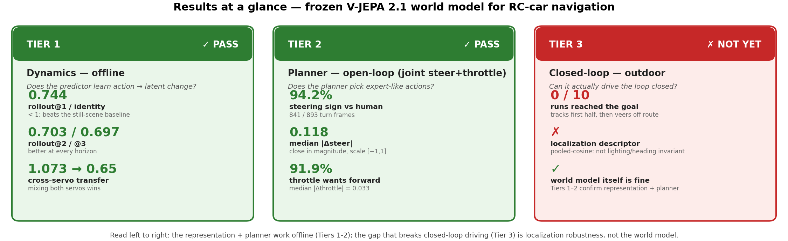
*Figure 1 — The whole story in five seconds. **Tier 1** (offline dynamics) and **Tier 2** (open-loop
planning) pass; **Tier 3** (outdoor closed-loop) does not yet drive — and the gap is localization
robustness, not the world model.*

- **Tier 1 — Offline dynamics:** the AC predictor on top of frozen latents **predicts better than the
  "still scene" baseline** (rollout@1 / identity = **0.744** < 1, i.e. better than assuming "the
  scene does not change" — a *necessary* condition, see §4), shows **measurable action sensitivity on
  both axes** — steering (energy-argmin in the correct turn direction **95%**, median deviation from
  the human driver **0.146** on the [−1,1] scale) and throttle (the model consistently "wants to go
  forward" **83%**) — and exhibits **beneficial cross-servo-domain transfer**: train-new-servo-only
  **1.073** → pretrain-old-servo-then-finetune **0.975** → train-mixed **0.65**.
- **Tier 2 — Open-loop planner, choosing the JOINT of steer and throttle:** on held-out VAL video,
  for each real frame we set the goal to a marker ~0.9 s ahead and let the planner sweep a **2-D grid
  (steer × throttle)** and pick both axes at the energy minimum — **steering matches the human's sign
  94.2%** of the time on turns (median deviation **0.118** on the [−1,1] scale) and the **model itself
  chooses a forward throttle 92%** of the time (median +0.075 ≈ human +0.090; median throttle
  deviation **0.033**). This is evidence that the planner picks actions **close** to the expert — in
  both sign and magnitude — **before facing closed-loop physics** (open-loop), bridging the offline
  metric and "real driving".
- **Tier 3 — Outdoor closed-loop (not yet driving; mechanistic analysis):** when the loop is closed
  for real, the system **tracks the route well over the first half, then "veers" off**. Quantitative
  analysis attributes the **primary** cause to the **localization stage**, **not** to representation
  quality: the **localization descriptor** (mean-pooled latent + cosine) is **not invariant** to
  lighting + heading changes between teach time and run time → image matching collapses → the goal
  becomes indistinguishable → CEM loses direction. (A secondary control deadlock when the car is
  standing still was also found and patched with a throttle floor — see §13.4.)

**Contributions.**
1. **An experiment of the V-JEPA 2 family on a MOBILE robot (RC car)** — Meta published mainly on
   robot arms (fixed tabletop scenes) [2]. Because the data was **collected and measured by us**, we
   do not claim "first"; the notable point is that this is a **harder robustness regime** (heading /
   lighting / lateral offset) than the published evaluations.
2. **An OPEN-LOOP planner study** that separates "planning capability" from "closed-loop robustness"
   — CEM picks actions matching the expert ~94% (correct steering sign), with a median magnitude
   deviation of ~0.12, when not subject to closed-loop physics.
3. **A mechanistic, quantitative closed-loop failure analysis**: it localizes the **primary** cause to
   a **localization descriptor that is not lighting/heading-invariant** (measured by a probe), rather
   than assigning a vague label — and clearly distinguishes it from the control stage (which remains
   robust).

---

## 2. Introduction & Motivation

**Context.** In recent years, **world models** learned in a self-supervised fashion — notably the
**JEPA** family (Joint-Embedding Predictive Architecture) of Yann LeCun and Meta [3] — have emerged as
a strong direction for letting machines "understand the physics of a scene" without labels. Instead of
building a 3-D map or reconstructing every pixel, a world model predicts **in representation space**
"which action leads to which observation", and then **plans directly in that latent space**. Meta
demonstrated this running for real on a **Franka robot arm** with **V-JEPA 2-AC** [2]: freezing a video
encoder and learning a small action-conditioned predictor is enough for the robot to *plan* to
reach/push an object from just a goal image. Our question: *can the same representation work for a
**mobile, outdoor** robot (an RC car) — where the dynamics and domain shift (lighting/time-of-day/
heading) are far harsher than a fixed tabletop?* This report is an attempt to carry V-JEPA 2-AC from
the robot arm to an RC car. (§5 introduces world models / JEPA / V-JEPA 2 / 2.1 / V-JEPA 2-AC and why
LeCun pursues this direction.)

**Why V-JEPA 2.1.** V-JEPA learns features by **prediction in representation space** (feature
prediction) rather than pixel reconstruction — avoiding wasting model capacity on unnecessary pixel
detail [1]. The **2.1** version (ViT-L distilled from ViT-G, 384px) adds a **Dense Predictive Loss** →
high-quality patch features, exactly what an AC predictor needs to discriminate "how the scene changes
with action" [2].

**Resource constraints & the decision to stop field testing.** The ViT-L encoder runs on a GPU (RTX
5070 Ti), not on a phone → inference must go through the PC. After several days of closed-loop tuning
in the field, the diagnosis showed the failure was in the **localization stage**, not in the model
parameters; the team stopped field testing and consolidated the offline part plus the open-loop
planner study, presenting closed-loop as a **carefully analysed, not-yet-successful result**.

---

## 3. Problem Statement & Scope

**Main problem = GOAL-CONDITIONED VISUAL NAVIGATION.** Given one (or a chain of) **goal image(s)**, at
each step the model compares the current scene to the goal in latent space and CEM picks `[steer,
throttle]` that moves the current scene toward the goal scene; once a goal is reached, it moves to the
next. When the final goal is **out of sight**, we chain together several intermediate **visible**
goal images (subgoals) along the way — this is **only a way to supply goals** to the planner, **not
imitation** of a trajectory: collecting the subgoal images is *necessary* because V-JEPA-AC plans
**toward a goal image**, whereas the actions are never "recorded for playback". Change the goal image
→ the behaviour changes accordingly.

**Two-tier architecture (kept separate — important for attributing blame during failure analysis):**
- **Localization (vision + GPS only):** answers "where am I" and "which is the next goal image".
- **Control (servo-specific):** the AC predictor (frozen V-JEPA + predictor) + CEM. Answers "how much
  throttle / steering to reach the next goal".

> Separating the two tiers enables the final conclusion: **the representation + control tiers work
> (Tiers 1+2); the gap is in the localization tier (a descriptor sensitive to lighting/heading) when
> the loop is closed (Tier 3).**

---

## 4. Concepts & Metrics

> Concise definitions of the terms used throughout, so the results read smoothly.

- **Latent / patch token.** The encoder turns each image into **576 tokens**, each a **1024-dimensional**
  vector describing one image patch. We call this 576×1024 set the *latent* of a frame.
- **Horizon `H`.** The number of future steps the model/planner considers. The report uses `H=4`
  (≈ 0.9 s, see §12).
- **Rollout@k.** Let the model **predict k consecutive latent steps** and measure the error against the
  true latents.
- **The "still scene" (identity) baseline.** A naive comparison: "predict the next frame to be
  **identical** to the current frame" (assume the scene does not change). **`rollout@k / identity`** =
  the model's error divided by identity's error. **< 1 = the model predicts better than assuming a
  static scene.** This is only a **necessary** condition (the model learned *something* about the
  effect of actions), not a sufficient condition for driving.
- **Energy `E` of an action sequence.** For a candidate `[steer, throttle]` sequence, we **roll** it
  through the AC predictor to get the final predicted latent `ẑ`, then compute
  **`E = ‖ẑ − z_goal‖₁`** (mean L1 distance over all 576×1024 dimensions to the goal-image latent).
  **Low E = that action drives the scene closer to the goal.**
- **argmin-E.** The action with the smallest `E` over the swept grid = the action the model "chooses".
- **Contrast (valley depth).** **`contrast = (E_max − E_min) / E_min`** when sweeping an action axis.
  High = a **clear** energy minimum (the model can tell good from bad actions); ≈ 0 = a **flat
  landscape** (the model has nothing to hold onto → CEM loses direction). Contrast removes the
  absolute scale, so it is comparable across scenes.
- **Sign-turn (correct turn direction).** On frames where the human is **turning** (|steer| > 0.15),
  the fraction of frames where the **sign** of the model's chosen steering matches the human's
  (same left/right turn).
- **Open-loop vs closed-loop.** *Open-loop:* the video plays back the real human drive, the model
  **only proposes** actions (it does not actually drive) → measures "planning capability".
  *Closed-loop:* the model **actually drives the car**, its actions determine the next frame →
  measures real closed-loop robustness too.

---

## 5. Background & Related Work

> This section briefly explains the foundational concepts before they are used: *world model*, JEPA,
> V-JEPA 2 / 2.1, V-JEPA 2-AC — what they are, what they do, where they apply, and why this direction
> is being pursued.

### 5.1. What a world model is & why it is studied
A **world model** is a model that *simulates* the world inside an agent's head: given the current
state and an action, it **predicts** the next state/observation. With a good enough world model, an
agent can **"imagine" the consequences of actions** and then *plan* (try many action sequences in its
head, pick a good one) instead of trial-and-error in the real world. This is one of the most promising
paths toward machines that can reason and plan: learning **without labels** (just by watching data),
learning the **physics/causality** of the environment, and reusing it across many tasks [3]. Typical
applications: robotics (planning for manipulation/locomotion), autonomous driving, agents in
games/simulation.

### 5.2. JEPA — prediction in representation space (Yann LeCun's approach)
**JEPA (Joint-Embedding Predictive Architecture)** is a world-model architecture proposed by **Yann
LeCun** and developed at Meta [3]. The core idea: instead of predicting **every pixel** of the future
(which spends model capacity on meaningless detail, and is intractable because the future is
inherently uncertain), JEPA **predicts in representation (latent) space** — it only needs to predict
the *abstract features* of the next observation. LeCun pursues this because: (1) pixel generation is
wasteful and easily distracted by detail, while what we need for reasoning/control is the *abstract
structure*; (2) predicting in latent space lets the model **ignore the unpredictable** and focus on
the meaningful; (3) it is the "predictive world model" piece in his vision of *autonomous machine
intelligence* (see `docs/10356_a_path_towards_autonomous_mach.pdf`) [3]. The first version for images
is **I-JEPA** [4]; for video it is **V-JEPA** [1].

### 5.3. V-JEPA → V-JEPA 2 → V-JEPA 2.1
- **V-JEPA** [1]: self-supervised learning on video by *feature prediction* (mask part of the video,
  predict the **representation** of the masked part) — no pixel reconstruction.
- **V-JEPA 2** [2]: scaled up to large-scale video (over one million hours), yielding a strong ViT
  encoder, achieving SOTA on motion understanding/prediction and **enabling planning on robots** (see
  below).
- **V-JEPA 2.1** [2]: an improved variant (ViT-L **distilled** from ViT-G, **384px**) adding a **Dense
  Predictive Loss** → dense, high-quality **patch** features (each image patch has a good descriptor),
  well-suited to tasks needing **spatial** information such as control. The source PDFs are in
  `docs/`.

### 5.4. V-JEPA 2-AC — the action-conditioned variant (main reference architecture)
**V-JEPA 2-AC** [2] is Meta's "action-conditioned" component placed on top of a **frozen** V-JEPA 2
encoder: each frame is represented as a token sequence `[action, state, patch]`, a **block-causal**
predictor learns to predict the next frame's representation, and then **CEM planning** picks actions
by the energy `‖P − z_goal‖₁` toward a goal image. Meta demonstrated it **on a robot arm (Franka)** —
a fixed tabletop scene — reaching/pushing objects from just a goal image, **without rewards and
without action labels beyond the interaction data**. This is precisely the **reference architecture**
our AC Predictor builds on, with adaptations for the RC car (same/different/why in §9.3).

### 5.5. Image-goal navigation (ViNG)
- **ViNG** (image-goal navigation) [5]: the idea of "go to a **goal image**" for a mobile robot. We
  **borrow this goal-image idea**; the topological image-graph part is only a **side experiment**
  (§16), not a main contribution.

---

## 6. Hardware & Data Collection

> We describe the hardware + how data is collected **before** the model architecture, so the reader
> understands where the data comes from.

### 6.1. Vehicle & controller
- **Chassis:** an off-road RC car; an **ESP32-S3 WROOM (N16R8)** mounted on the car drives two
  actuators:
  - **Steering servo** TowerPro MG946R (analog, GPIO5), PWM range **1000–2000 µs**, center 1560 µs.
  - **Throttle ESC** Hobbywing QuicRun 8BL150 (150 A brushless, GPIO6), range 1000–2000 µs, linear map
    `esc_us = 1000 + (throttle+1)/2·1000`.
- **Power:** battery → ESC; a 6 V BEC powers the servo (kept ≤ 6 V because the MG946R is not an HV
  type).
- **Two servo "domains" — why they exist (a practical reason, not a design choice).** Most of the
  older data was collected with a **KDS** servo. During collection, the **KDS servo failed and had to
  be replaced with a TowerPro MG946R**. The two servos have **different command→steering-angle
  mappings** (the same command produces a different wheel angle). Rather than discard the old data, we
  treat this as **two control domains** and attach a `domain_id` flag (0 = KDS, 1 = TowerPro) to the
  predictor input so the model can learn jointly while still distinguishing the two mappings. This
  *unintended* servo swap later yielded a valuable transfer experiment (§11.3).

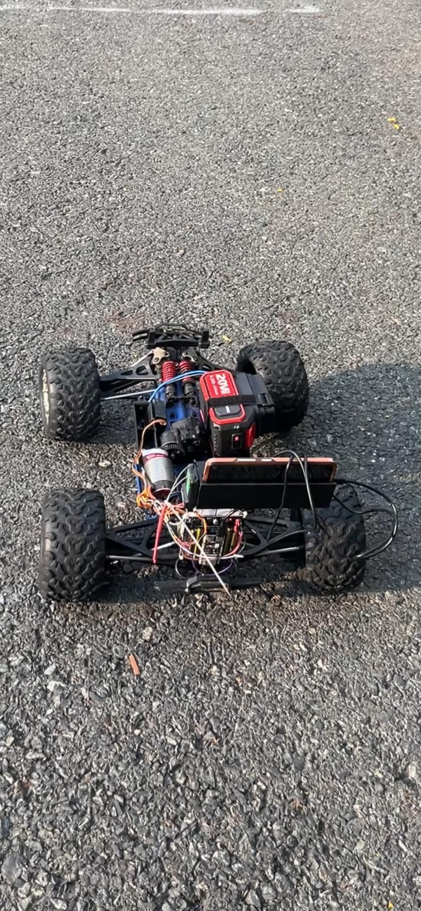
*Figure 2 — The RC car platform used for data collection: the off-road chassis with the onboard
ESP32-S3 controller and the steering-servo / throttle-ESC wiring. The Android phone (camera + recorder,
§6.2) mounts on the deck on top; a human drives the car manually during collection.*

### 6.2. The pivot: from a wireless video link to an onboard phone
- **Original rig (dropped for data collection):** a RunCam camera (OpenIPC, IMX415) streaming H.265
  over **WFB-NG (5.8 GHz)** to the PC. **It failed at range** (~50 m: image break-up, latency
  ballooning 92→310 ms under packet loss).
- **Current rig (the pivot):** **put an Android phone on the car** (Samsung A42 5G) as camera +
  recorder. The **ultrawide** camera captures frames locally; the phone reads ESP32 telemetry over
  **USB**; it logs frames + actions + telemetry + GPS + IMU. **Frames and telemetry share ONE phone
  clock** → the WFB-latency / clock-sync problems disappear. What remains is a **camera capture latency
  δ_cam ≈ 100 ms** (measured on the A42, stable at 98–103 ms), recorded per-frame and corrected during
  synchronization.

Figure 3 shows representative frames the onboard camera captures — the same frames the frozen encoder
later sees. They span a wide range of lighting and time of day, which becomes central in §13.

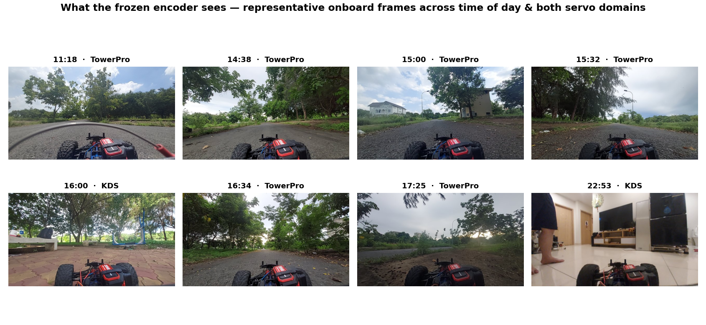
*Figure 3 — Representative onboard frames sampled across time of day (11:18 → 22:53) and both servo
domains. The variety of lighting, shadows and scenes is exactly the domain shift the system must
handle; §13 shows it is the localization descriptor — not the encoder — that struggles with it.*

### 6.3. The pipeline that forms the train/val data
Figure 4 describes the entire flow from capture to a train/val set (it describes the flow, not file
names). The key point: because **frame, telemetry, GPS and IMU share one clock**, we can pair each
frame precisely with the action *at the exact moment that scene occurred*.

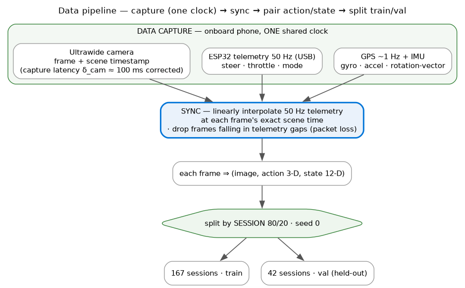
*Figure 4 — Data flow: capture (one shared clock) → sync (linearly interpolate 50 Hz telemetry at each
frame's scene time, correct δ_cam, drop packet-loss frames) → each frame becomes (image, action 3-D,
state 12-D) → split by session 80/20 → 167 train / 42 val. (Diagram source in Appendix §18.5.)*

1. **Capture.** A human drives manually with a **FlySky i-BUS** radio; a passive recorder logs: the
   image frame with its *scene time* (δ_cam already subtracted), the 50 Hz telemetry stream
   (steer/throttle/mode), GPS ~1 Hz, and IMU (gyro/accel/rotation-vector).
2. **Sync — how interpolation works (detail).** Each frame has a *scene time* `t_scene = t_ms − δ_cam`
   (δ_cam = 100 ms for old data; = 0 for new data which already recorded `dcam_ms`). The 50 Hz
   telemetry is a sample stream `(t_k, steer_k, throttle_k)`. To get the action *at the instant the
   frame was captured*, we find the bracketing pair `t_{k−1} ≤ t_scene < t_k` and **linearly
   interpolate**:
   `steer(t_scene) = steer_{k−1} + τ·(steer_k − steer_{k−1})` with
   `τ = (t_scene − t_{k−1})/(t_k − t_{k−1})` (throttle and the 9 IMU channels are interpolated
   identically at the same `t_scene`; the IMU has no camera-like latency, so sampling at `t_scene`
   already matches the scene). We **drop** a frame if: `t_scene` falls outside the telemetry interval;
   or there is a **telemetry gap** (two adjacent samples more than `60 ms` apart = packet loss under a
   weak signal → do not interpolate blindly); or `mode ≠ RECORD`. Principle: better to drop a frame
   than pair it with a stale/wrong action.
3. **Pair.** Each frame ⇒ one sample `(image, action 3-D [steer, throttle, domain_id], state 12-D)`.
   **State 12-D** = `[speed, gx,gy,gz, ax,ay,az, rx,ry,rz, prev_steer, prev_throttle]` = GPS speed +
   gyro + accel + rotation-vector + **previous action** (absolute lat/lon/bearing are dropped to avoid
   overfitting to location — detailed IMU assessment in §14).
4. **Split.** Split **by SESSION** (not by frame, so that val does not "leak" adjacent frames from
   train) at an 80/20 ratio with a fixed seed → **167 train sessions / 42 val sessions**. Every
   evaluation reuses this split.
- **GPS:** the A42 phone returns **~1.04 Hz**; position noise **median 0.44 m / p90 1.0 m**.
  → GPS is only good enough to **gate goal-image pops**, NOT to hold a lane to the meter.

---

## 7. Data & Statistics

> Every number in this section is **scanned directly** from `data/raw_kds` + `data/raw_towerpro` (see
> Appendix).

### 7.1. Overview
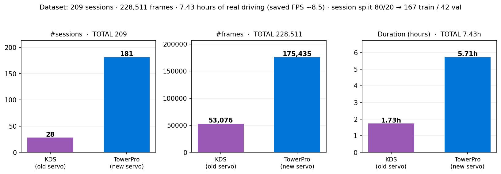
*Figure 5 — Dataset overview by the two servo domains: **209 sessions · 228,511 frames · 7.43 hours**
of real driving (KDS 28 ss / 53,076 frames / 1.73 h; TowerPro 181 ss / 175,435 frames / 5.71 h). Saved
FPS ~8.5 (target save_hz=10, slightly short due to image-write load) — consistent across the two
domains. Session-level 80/20 split, seed 0 → **167 train / 42 val**.*

### 7.2. Action & motion distribution (measured over 228,511 frames)
| Quantity | Value | Meaning |
|---|---|---|
| Median throttle | **0.084** | real throttle, NOT ~0 (the car drives slowly, small but nonzero throttle) |
| "Near-straight" fraction (\|steer\| < 0.15) | **63%** | most of the time it drives straight |
| Total turning events | **13,871** | enough turning samples to learn/evaluate steering sensitivity |
| Median GPS speed | **1.05 m/s** (p90 2.91) | walking-pace driving |
| Standstill fraction (speed < 0.06) | **11.3%** | a substantial standstill regime → relevant to §13 |

*Table 1 — Action & motion distribution over all 228,511 frames.*

### 7.3. The data DOES contain corrective driving
The data is **free-form manual driving** in a park, not driving down a single straight line. With
**13,871 turning events** and continuous two-sided steering oscillation (Figure 7), the human driver
**continuously corrects** left/right. This matters for the closed-loop analysis (§13): **the training
set does not lack corrective behaviour** — what is missing at *deploy* time is something else (see
§13.7).

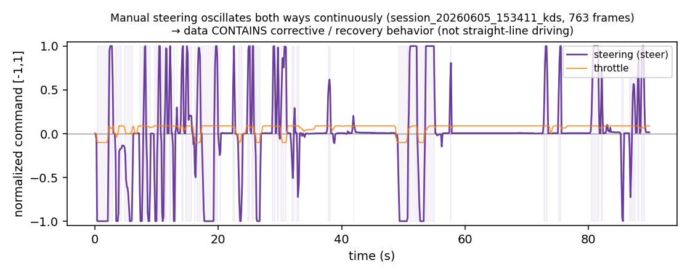
*Figure 7 — A typical session: steering (purple) oscillates two-sided continuously, alongside throttle
(orange) — evidence that the data contains corrective/lane-keeping behaviour, not a single straight
run.*

### 7.4. Differences between the two domains
- **KDS:** steering spans the full −1..1 range but **throttle is nearly constant (~7.5%)** → close to
  "steering-only".
- **TowerPro** (collected after the KDS servo failed — §6.1) has **variable throttle** (including
  light reverse), giving the model a learnable throttle-axis signal (confirmed in §11.4: the model
  reads the throttle axis). Figures 7, 8, 9 are the steering / throttle / speed distributions; Figure
  10 shows the lengths of all 209 sessions; Figure 12 shows the time-of-day coverage.

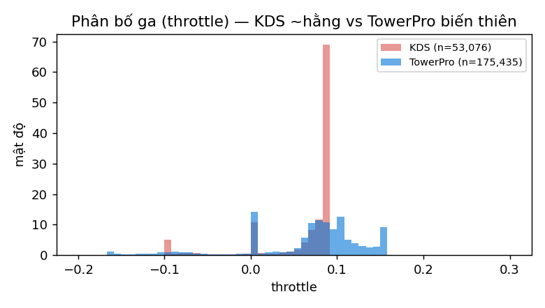
*Figure 8 — Throttle: KDS ~constant (sharp peak ~0.075) vs TowerPro variable (spread out, with light
reverse).*

| | |
|---|---|
| 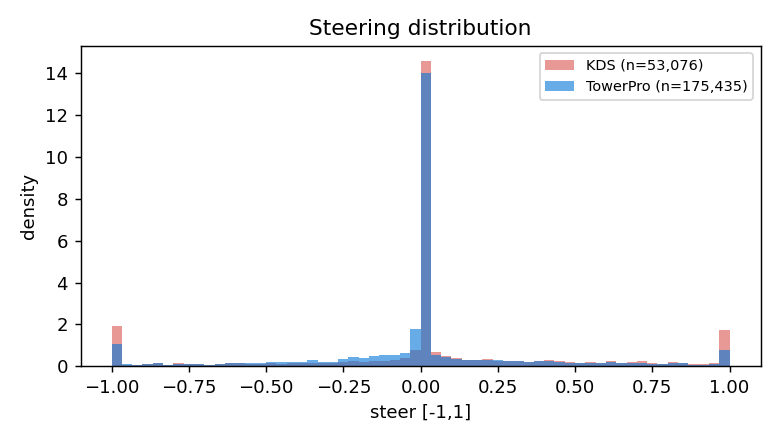 | 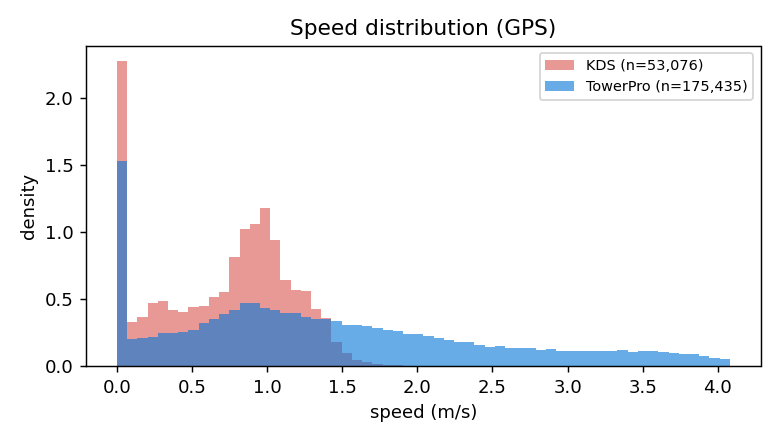 |
| *Figure 9 — steering distribution* | *Figure 10 — GPS speed distribution* |

| | |
|---|---|
| 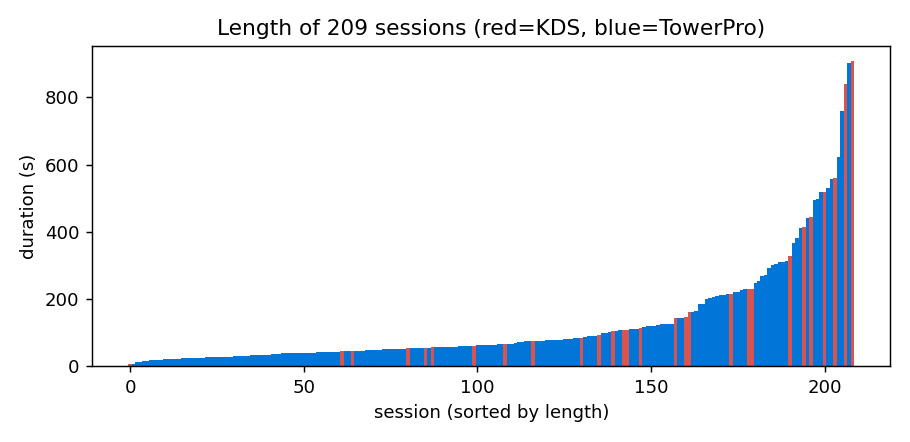 | 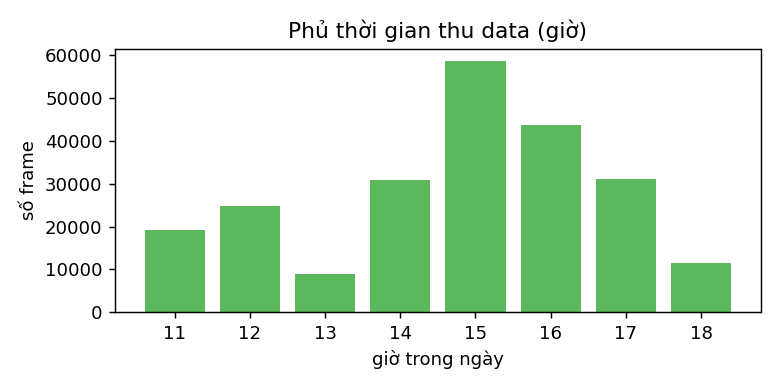 |
| *Figure 11 — lengths of 209 sessions* | *Figure 12 — time-of-day coverage (hour)* |

---

## 8. The Frozen V-JEPA 2.1 Encoder & Pre-encoding Pipeline

- **Encoder:** V-JEPA 2.1 **ViT-L 384** (distilled from ViT-G), **absolutely frozen** (never
  backpropagated through) [2].
- **Encode EACH frame** (image-path) → **patch tokens**: 384px → a **24×24 = 576 token** grid, each
  token **1024-D**; we **keep all 576 tokens** (no pooling) to retain spatial information.
- **Key optimization — offline pre-encoding:** we run V-JEPA **once** over the whole dataset and save
  the latents (fp16) to disk; during predictor training we only **read latents**, with **no** V-JEPA
  forward pass → **~50–100× faster**. This is what makes training a small predictor on 228k frames
  feasible on a single GPU.

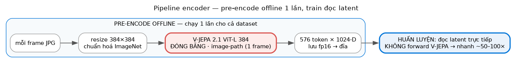
*Figure 13 — Encoder pipeline: each frame → resize 384 + normalize → frozen V-JEPA ViT-L 384
(per-frame) → 576×1024 tokens saved fp16 → training reads latents directly (~50–100× faster).
(Diagram source in Appendix §18.5.)*

> **Why 384px (not 256).** We chose to train at **384px** because the **V-JEPA 2.1** encoder (ViT-L
> distilled) was originally trained at **384** (with a cooldown at 384). Using the encoder's native
> resolution avoids distorting the input distribution by changing the resolution → it preserves patch
> feature quality. (The 256px of V-JEPA 2-AC was merely a **compute** choice "for simplicity", not
> because 256 gives a better representation.)

---

## 9. AC Predictor — Architecture & Training (main contribution)

### 9.1. Diagram & mechanism
Each frame is arranged into a token group `[action_t (3-D), state_t (12-D), patch_t (576)]` (= 578
tokens). A **block-causal mask** lets a token at frame t attend to every token at frame ≤ t. The
output at the patch positions of frame t predicts the **patch map of frame t+1**. Figure 14 shows the
overall diagram (frame → encoder → predictor → CEM); **Figure 15** opens up the **inside of the
predictor**: three linear projections bring action/state/patch to width `P=512`, plus positional
embeddings (per-frame temporal + per-token-type), 12 Transformer layers (each = LayerNorm →
block-causal self-attention with 8 heads → residual → LayerNorm → MLP 512→2048→512 → residual), then a
`Linear 512→1024` head at the patch positions of frame t produces ẑ_{t+1}.

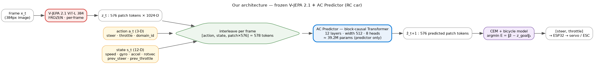
*Figure 14 — Our architecture (overview): frame → frozen V-JEPA → 576×1024 → interleave [action, state,
patch] → block-causal AC predictor (12 layers) → ẑ_{t+1} → CEM → ESP32. (Diagram source in Appendix
§18.5.)*

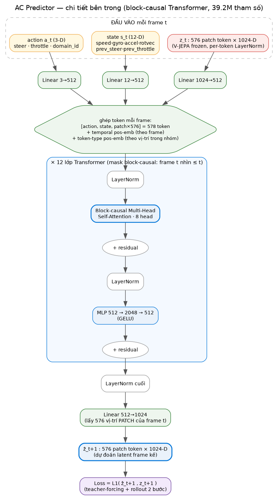
*Figure 15 — Inside the AC Predictor: project action(3)/state(12)/patch(1024) to `P=512` + pos-emb;
× 12 block-causal Transformer layers (LN → 8-head MHSA → residual → LN → MLP 512→2048→512 → residual);
final LayerNorm + `Linear 512→1024` head at the patch positions → ẑ_{t+1} (576×1024); loss = L1(ẑ_{t+1},
z_{t+1}).*

### 9.2. Scale — **≈ 39.2M parameters**
The deployment configuration (`cd4`): `pred_dim = 512`, `depth = 12`, `n_heads = 8`,
`num_tokens = 576`, `action_dim = 3`, `state_dim = 12` → **39,192,576 ≈ 39.2M trainable parameters**
(predictor only — the frozen V-JEPA encoder is NOT counted), of which the **12 Transformer layers
account for ~96%** (~3.15M each). We deliberately keep the predictor **much smaller** than Meta's
~300M for two reasons: (1) **little data** (~228k frames) and **576 tokens/frame is already very
heavy** → an oversized predictor easily overfits; (2) **limited hardware/compute** — all training runs
on **a single RTX 5070 Ti (16 GB)**, where a ~300M predictor × 576 tokens/frame is infeasible given
the available memory/time.

> The 39.2M figure is reproducible in one line (see Appendix).

### 9.3. Reference architecture from V-JEPA 2-AC — same / different / why
We **build on** Meta's V-JEPA 2-AC architecture [2] but adapt it for the car. Figure 14 (ours) and
Figure 16 (Meta) are placed side by side for comparison.

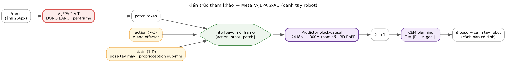
*Figure 16 — Reference architecture, Meta V-JEPA 2-AC (robot arm): state = 7-D pose (sub-mm
proprioception), action = 7-D Δ end-effector, 3D-RoPE, ~300M predictor. (Diagram source in Appendix
§18.5.)*

| Aspect | Meta V-JEPA 2-AC | Ours | Same/Different — **why** |
|---|---|---|---|
| Encoder | frozen V-JEPA | frozen V-JEPA 2.1 ViT-L 384 | **SAME** — the "freeze the foundation encoder" philosophy |
| Tokens per frame | patch tokens | 576 patch × 1024 | **SAME** — keep the patch map (no pooling) for spatial info |
| Interleave | `[action,state,patch]` | `[action,state,patch]` | **SAME** — the core token structure |
| Attention | block-causal | block-causal | **SAME** — frame t attends to ≤ t |
| State | arm pose **7-D** | IMU 10-D + prev-action = **12-D** | **DIFFERENT** — a car has no sub-mm proprioception; use IMU+speed; prev-action tells the model "what command is being held"; drop absolute position to avoid overfitting to location |
| Action | Δ end-effector **7-D** | `[steer, throttle, domain_id]` **3-D** | **DIFFERENT** — a car has only 2 control axes; add `domain_id` to learn the two servos jointly |
| Pos-embedding | 3D-RoPE | learned (temporal + token-type) | **DIFFERENT** — for small fixed clips a learned pos-emb suffices |
| Scale | ~24 layers / ~300M | **12 layers / 39.2M** | **DIFFERENT** — little data → a big predictor overfits + 576 tokens are very heavy |
| Dynamics for CEM | arm `compute_new_pose` | **bicycle model** fit from car data | **DIFFERENT** — car dynamics differ entirely from an arm (§10) |

*Table 2 — Architecture comparison: Meta V-JEPA 2-AC vs ours.*

### 9.4. Why **not** predict the full 12-D next-state
The current predictor is a **visual-latent predictor** — it predicts the **patch map** of the next
frame, with NO separate head for the 12-D state. This is intentional, because: (1) the design is a
visual-latent predictor; (2) **predicting the full IMU state is very hard** — accel/gyro/rotvec are
very noisy (§14), and with little data it easily learns wrong; (3) **planning only needs speed + yaw**,
which the bicycle model (§10) already handles; (4) **trying to predict the full state and feeding it
back → error explodes faster** over multi-step rollouts. The philosophy: *"predict less but keep what
is trustworthy"*.

### 9.5. Training: target preparation, loss, strategy, hyperparameters

**Target preparation (normalization).** V-JEPA patch tokens are **per-token LayerNorm'd** right in the
dataset (matching Meta's `normalize_reps`) — the predictor learns to **predict the normalized
representation**; the 12-D state is **z-scored** using train-set statistics (mean/std stored in the
checkpoint for reuse at plan time).

**Loss (L1, teacher-forcing + 2-step rollout).** For a clip `z_{1..T}` (T = horizon = 4), action `a`,
state `s`:
- **1-step teacher-forcing:** feed the model the true tokens at every frame, penalize
  `L1(ẑ_{t+1}, z_{t+1})` over the whole sequence → `L_tf = ‖ model(z,a,s)[:,:−1] − z[:,1:] ‖₁`.
- **2-step rollout (auto_steps=2):** give only the first true frame `z_1`, let the model **feed its
  own** predictions for 2 steps (with a **re-LayerNorm** between steps, exactly as at plan time),
  penalize `L_ro = ‖ ẑ_3^{rollout} − z_3 ‖₁`.
- **Total:** `L = L_tf + L_ro`. The rollout term forces the model to be **stable under
  auto-regression** — the exact regime CEM uses (rolling many steps) — avoiding a model that is only
  good at 1-step teacher-forcing and then drifts when rolled out.

**Optimizer configuration.** AdamW [7], `weight_decay 1e-4`, **bf16 autocast**, **gradient
checkpointing** (sequence = 4×578 tokens × depth 12 → OOM on 16 GB without it; with it ~13 GB at batch
64), `torch.compile`. `batch_size 64`, a session-based sampler (each batch comes from one session for
contiguous clips), `frame_stride 2` (~0.22 s/step ≈ the 4 fps of V-JEPA 2-AC), `action_scale
[1.0, 6.67]` (brings throttle ~[−0.15,0.15] to ~[−1,1]; `domain_id` is concatenated raw). The split is
frozen in `split.json` (167 train / 42 val) so every train/eval uses exactly one split.

**A WSD-style (warmup–stable–decay) LR strategy.** The original target was a cosine schedule over 60
epochs, but at **2.9 h/epoch** 60 epochs ≈ 7 days > the deadline, so the cosine tail was never reached.
In practice it ran as two phases:
1. **Base run (warmup + stable phase):** `lr 2.5e-4`, 5% warmup, cosine. Val L1 dropped **0.79 → 0.60**
   by epoch 9, then went **flat ~0.60** (the WSD "stable" phase). **A power cut hit mid-epoch 12.**
2. **Cooldown `cd4` (decay phase):** `init_from` best.pt(ep9), `lr 1.2e-4` (~0.5× the peak) **cosine
   decaying → 0** over 3 epochs (~8.6 h), keeping everything else fixed (T=4, batch, data, objective)
   so the gain is attributable to LR decay alone. This yields the **deployment checkpoint**: val
   **0.5693**, `rollout@1 / identity 0.744`.

### 9.6. Loss curve
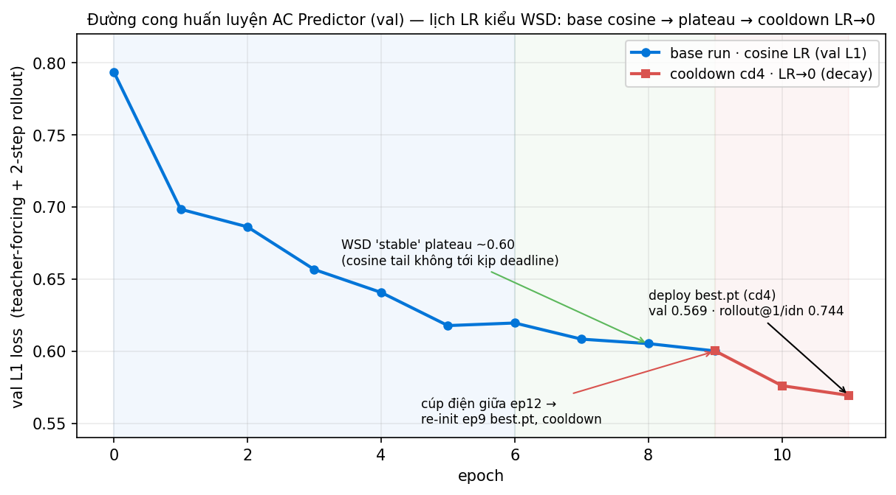
*Figure 17 — Validation L1 loss (teacher-forcing + 2-step rollout) vs epoch: the base run cosine drops
0.79 → 0.60 (stable phase flattens), a power cut hits mid-epoch 12, then the cd4 cooldown LR→0 pulls
val down to **0.569** (the deploy checkpoint, rollout@1/identity 0.744). Numbers are read from the
training log (wandb) plus the `val` value stored in the checkpoint.*

---

## 10. Planning: CEM + Vehicle Dynamics

- **CEM (Cross-Entropy Method)** [6]: sample N action sequences ~ N(μ, σ) over horizon H=4, roll each
  sequence through the predictor, score the energy `E = ‖ẑ_final − z_goal‖₁`, keep the K elites with
  the lowest E, refit (μ, σ) and repeat; apply the **first action** (receding-horizon). Each round also
  injects 5 fixed steering candidates evenly spread over `[−1,…,+1]` so the elites can catch the global
  minimum.
- **CarDynamics (bicycle model)** [8]: integrate `[x, y, heading, speed]` from `[steer, throttle]`;
  coefficients fit from real car data: `k_thr=1.588, k_drag=0.078, k_yaw=0.088`. **One important
  physical point:** `yaw_rate = k_yaw · steer · speed` → **speed = 0 ⇒ steering produces no yaw**
  (relevant to §13.4).

---

## 11. TIER 1 — Offline Dynamics

> **Question for this tier:** does the predictor really learn "action → latent change" (both steering
> and throttle), fully independent of closed-loop / lighting / GPS issues?

### 11.1. Two metrics (why we do not trust val loss alone)
- **`rollout@k / identity`**: < 1 = predicts better than the "still scene" baseline.
  **Why not use val loss alone — the "latent collapse" problem.** Because the scene between two
  adjacent frames changes very little (the car moves ~1 m/s, ~0.22 s/step), a model that **completely
  ignores the action** and just learns to "copy almost the entire current latent to the next frame"
  also achieves a **low val L1** — it "wins" the loss by *learning nothing about the effect of
  actions*. That is **collapse**: the predictor degenerates to a near-identity function, val loss looks
  great but the energy landscape is **flat in action** → CEM is useless. Dividing by the identity
  baseline **exposes** exactly that trap: if the model just copies, the ratio `≈ 1`; only when the
  model **actually uses the action** to predict better than copying does the ratio drop `< 1`. (This is
  also why we additionally measure action sensitivity below — the `<1` ratio is necessary, but action
  sensitivity is what CEM actually uses.)
- **Action sensitivity (energy probe):** sweep `E` around one action axis and see whether
  **argmin-E points the right way** and how deep the **contrast** is. This is the closest thing to what
  CEM actually uses.

### 11.2. Predicting better than the "still scene" baseline (Table A)
| Model | @1 | @2 | @3 |
|---|---|---|---|
| **cd4 (deploy ckpt)** | **0.744** | **0.703** | **0.697** |

*Table 3 — Rollout vs identity baseline (lower = better; < 1 beats "still scene").*

→ It beats identity at every horizon. **Reading it correctly:** this **only confirms** that the
predictor learned *part* of the action-conditioned dynamics (it predicts better than assuming a static
scene) — a **necessary, not sufficient** condition. It does **not** by itself prove "it can drive".
Stronger evidence is in §11.3–11.4 (transfer + action sensitivity) and §12 (open-loop planner).

### 11.3. Cross-servo-domain transfer (the old servo helps learn the new one)
*Context:* this experiment ran at a stage when **TowerPro data was still scarce** (then only ~64
TowerPro + 28 KDS sessions), so TowerPro alone was not enough to learn the dynamics. Evaluated on
**held-out TowerPro** (same split), measuring `rollout@1 / identity`:

| Training method | rollout@1 / identity (held-out TowerPro) |
|---|---|
| TowerPro only | **1.073** — *worse than the naive baseline* |
| Pretrain KDS → finetune TowerPro | **0.975** — only just above the baseline |
| Train **mixed** KDS + TowerPro (`domain_id`) | **0.65** — best |

*Table 4 — Cross-servo-domain transfer on held-out TowerPro.*

→ The more **old-servo data (KDS, steering-rich)** we add, the better the model learns the **shared
dynamics**: TowerPro-only *loses*, pretrain-then-finetune *nearly ties*, **mixing both at once** *wins
clearly*. The `domain_id` flag lets us mix without confusing the two servos' command→angle mappings.
(This is the "unexpected upside" of having to replace the failed KDS servo — §6.1.) The numbers are
read from `runs/lewm_overnight/20260608_015058`.

> **On the phrase "still-scene baseline".** This is the **standard naive baseline** in ML — a predictor
> that *learns nothing* and always predicts "next frame = this frame" (identity / "scene unchanged").
> Beating it is the *minimal* requirement; a ratio **>1 means the model is worse than doing nothing**.
> We use "baseline" in exactly this sense.

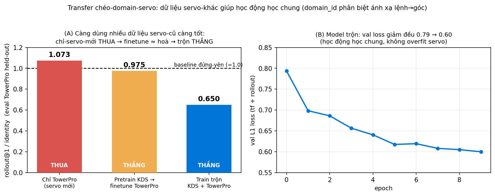
*Figure 18 — (A) The 3-step progression on the new servo: TowerPro-only LOSES (1.073) → pretrain-KDS-
then-finetune nearly ties (0.975) → mixing both servos WINS (0.65). (B) The mixed model's val loss
drops steadily 0.79 → 0.60 (learning shared dynamics, not overfitting one servo).*

### 11.4. Action sensitivity — measure each axis separately first (isolate the signal)
**Measurement strategy: separate first, joint later.** In Tier 1 we measure **each axis separately**
(holding the other axis = teacher) to **isolate** whether each axis carries signal; in Tier 2 (§12) we
measure **jointly** over both axes at once (closer to closed-loop). This separation enables clean
attribution: if joint fails but each axis is fine individually, the fault is in the two-axis
interaction, etc.

Measured over **300 turning VAL windows**, d=4, checkpoint cd4 (`scripts/probe_energy.py`):

| Per-axis measurement | Steering (sweep steer, throttle=teacher) | Throttle (sweep throttle, steer=teacher) |
|---|---|---|
| argmin-E **correct sign** (sign-turn) | **285/300 = 95%** | **83% want FORWARD (>0)** |
| **deviation from human** (median \|argminE − teacher\|) | **0.146** (scale [−1,1]) | — |
| **contrast** (median, on turning frames) | **0.33** | **0.27** |
| what the model "wants" | — | median throttle **+0.11** (≈ data 0.084) |

*Table 5 — Per-axis action sensitivity (300 turning VAL windows, d=4).*

*(Note: 0.33 is the contrast on **turning** frames; over **all** frames the median contrast ≈ 0.41 —
higher because straight-driving frames also have a clear minimum at steer ≈ 0.)*

→ The model does **NOT "steer weakly" offline**: not only is it **95% correct in sign**, the chosen
angle is also **close** to the human's — **median deviation only 0.146** on the [−1,1] scale (i.e.
~7% of the full range). The energy minimum is clear and on the right side, on **both axes**. Figure 20
shows the planner tracking the human's steering on a concrete VAL session with actual numbers.

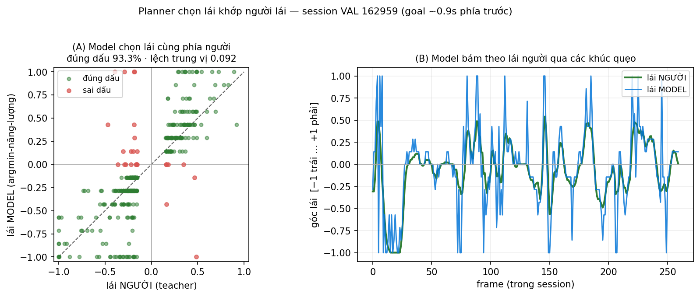
*Figure 20 — The planner picks steering that matches the human (VAL session `162959`, goal ~0.9 s
ahead). (A) Scatter of human steering (x) vs model steering (y) on turning frames: hugs the diagonal,
**95.2% correct sign**, median deviation **0.092** (this session). (B) Time series: the model's
steering (blue) follows the human's (green) through the turns.*

---

## 12. TIER 2 — Open-loop Planner choosing JOINT (steer + throttle)

> **Question for this tier:** when we *actually let the planner plan* on real video (loop still open),
> does it pick actions **like the expert** — and pick **the throttle too**, not just steering?

### 12.1. Design & algorithm (OPEN-LOOP, JOINT 2 axes)
Take a held-out VAL session. For **each real frame** t:
1. **Goal** = the patch map d=4 steps (~0.9 s) ahead **in the same session**. *Why d=4 (~0.9 s)?*
   `lead = d × stride × dt_frame = 4 × 2 × 0.11 ≈ 0.9 s`. We pick d=4 because: it is **far enough** for
   the steering action to make a measurable scene difference (d=1 is too close, the scene barely
   changes → flat landscape); and **near enough** that the current scene still overlaps the goal (a
   large d collapses contrast, measured: d=2 0.44 → d=8 0.27, Figure 21).
2. **Sweep the JOINT 2-D grid** = 15 steering points `∈[−1,1]` × 9 throttle points `∈[−0.1, 0.25]` =
   **135 combinations**. *Why a throttle range of `[−0.1, 0.25]`?* The **actual** throttle range in the
   data is ~`[−0.16, +0.15]` (median +0.084), but the car **almost always goes forward** (only ~13% of
   frames standstill; reverse is rare and very gentle). Since the task is goal-reaching *moving
   forward*, we set a **forward-biased grid**: cover the forward region densely (up to 0.25 for fine
   forward-intent resolution) and leave only a small reverse margin (−0.1). The cost: the grid **does
   not cover the full reverse tail** (−0.16), but deep-reverse frames are so rare they do not affect
   the conclusion.
3. Each combination `(steer, throttle)` is **rolled through the AC predictor** (d steps, using the
   bicycle model for state) → a final predicted latent → energy `E(steer, throttle) = ‖ẑ − z_goal‖₁`.
4. The model's action = **argmin over the whole 2-D grid** → it chooses **steering AND throttle at
   once**.
5. Compare against the human's real `(steer, throttle)` at that frame; **sign-turn** =
   sign(model_steer) == sign(human_steer) on frames with |human_steer| > 0.15.


```mermaid
%%{init: {'theme':'base','themeVariables':{'fontSize':'14px','primaryColor':'#eaf2fb','primaryBorderColor':'#0275d8','lineColor':'#444'}}}%%
flowchart TB
  START(["frame t in VAL session"]):::start --> FETCH
  FETCH["z_t ← pre-encoded latent of frame t
z_goal ← pre-encoded latent of frame t+d  ⟵ goal ~0.9 s ahead
s_t ← state 12-D at t"]:::data --> GRID
  GRID(["for (steer, throttle) in 15×9 grid — 135 combinations"]):::loop --> ROLL
  ROLL["roll d steps: AC Predictor + bicycle model → ẑ"]:::compute --> ENERGY
  ENERGY["E[steer, throttle] = mean L1(ẑ, z_goal)"]:::compute --> CHECK
  CHECK{"more\ncombinations?"}:::decision
  CHECK -- yes --> ROLL
  CHECK -- no --> ARGMIN
  ARGMIN["(steer*, throttle*) = argmin E
model picks both axes simultaneously"]:::result --> RECORD
  RECORD["sign(steer*) == sign(human_steer)?  ·  throttle* > 0?"]:::result --> NEXT
  NEXT(["next frame t"]):::start --> FETCH

  classDef start    fill:#e8f5e9,stroke:#2e7d32,stroke-width:1.5px
  classDef data     fill:#eaf2fb,stroke:#0275d8,stroke-width:1.5px
  classDef loop     fill:#fff8e1,stroke:#f0ad4e,stroke-width:1.5px
  classDef compute  fill:#f3eafb,stroke:#6a3d9a,stroke-width:1.5px
  classDef decision fill:#fdecea,stroke:#d9534f,stroke-width:1.5px
  classDef result   fill:#e8f5e9,stroke:#2e7d32,stroke-width:1.5px
```

**Why it is called OPEN-LOOP:** the video **plays back the real human drive** — the model **only
proposes**, it does not actually drive (the next frame is already fixed by the human). **⚠ This does
NOT prove "the car self-drives".**

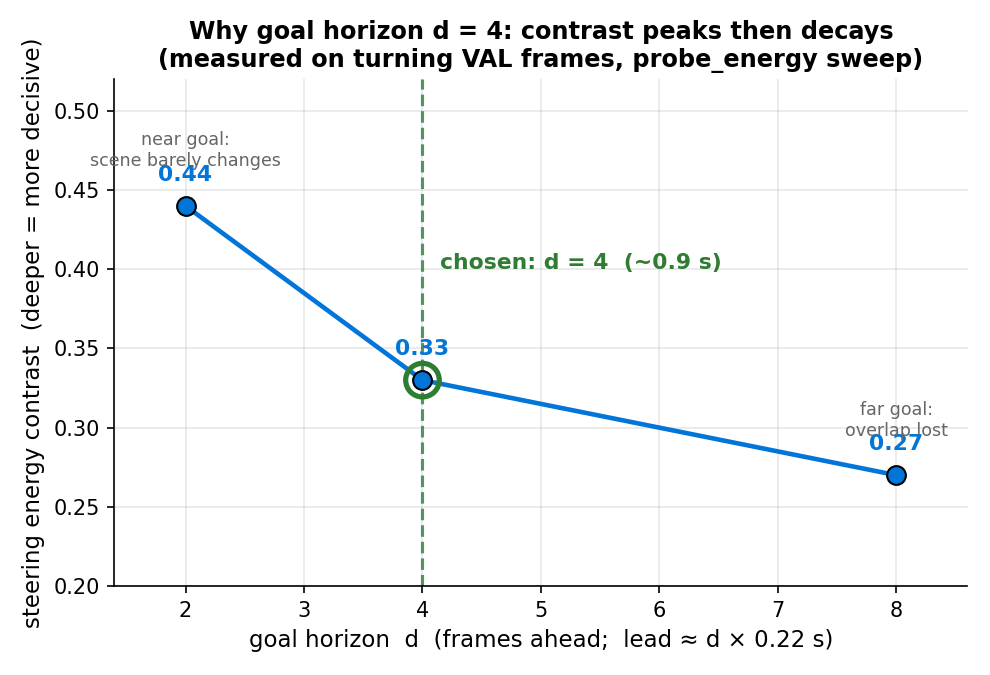
*Figure 21 — Why goal horizon d = 4: steering energy contrast peaks then decays with horizon (measured
on turning VAL frames: d=2 0.44, d=4 0.33, d=8 0.27). d=4 is far enough that the action changes the
scene, near enough that overlap with the goal is retained.*

### 12.2. Results (3 best VAL sessions, 893 turning frames pooled)
| Metric | Value |
|---|---|
| **Steering — correct human sign** (sign-turn, \|steer\|>0.15) | **841/893 = 94.2%** (per-session 92.6 / 94.5 / 95.2%) |
| **Steering — magnitude deviation vs human** (median \|Δsteer\|) | **0.118** (scale [−1,1], ~6%) |
| **Throttle — model wants FORWARD (>0)** | **91.9%** |
| **Throttle — model median / human median** | **+0.075 / +0.090** (all frames) |
| **Throttle — deviation vs human** (median \|Δthrottle\|) | **0.033** |
| Joint contrast (2-D grid) median | **0.52** |

*Table 6 — Tier-2 joint open-loop planner results (3 VAL sessions, 893 turning frames).*

→ **Two conclusions:** (a) when optimizing the **joint of both axes**, steering is not only **94.2%
in the human's direction** (≈ the 1-D probe's 95% in §11.4 — adding the throttle axis does NOT break
steering) but also **close in magnitude** (median deviation only 0.118); (b) **the model picks a
sensible throttle on its own** — 92% want forward, median +0.075 close to the human's +0.090, throttle
deviation only 0.033 → **no need to hold throttle = teacher**. **Planning capability (steering AND
throttle) is HEALTHY** — matching the expert in both **sign** and **magnitude** — before facing
closed-loop physics; what breaks in Tier 3 is NOT "a dumb planner". (Accuracy is read from
`data/demo/*/demo.json`.)

Figure 22 makes the joint planner tangible — the actual 15×9 grid scored for a single real frame, with
the human and model markers both in the low-energy basin.

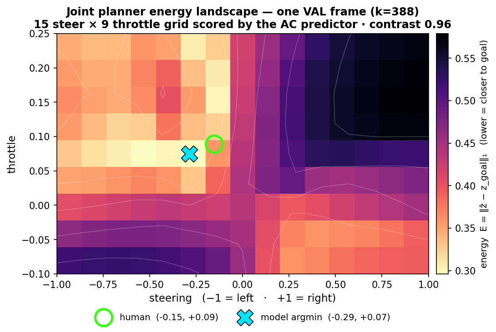
*Figure 22 — The joint planner's energy landscape E(steer, throttle) for one VAL frame (k=388): the
15×9 grid the planner actually scores. Both the human (○) and the model's argmin (✕) land in the
low-energy valley on the correct (left) turn side, at a forward throttle — a clear, decisive minimum
(contrast 0.96 for this frame).*

> Interactive demo: a web player replays each frame's 2-D steer×throttle landscape (● human vs ✕
> model) and can export an MP4 for slides.

---

## 13. TIER 3 — Outdoor Closed-loop (not yet driving; mechanistic analysis)

> When the loop is closed for real, it **tracks the route well over the first half, then veers off**.
> Tuning hyperparameters only **moves the breakaway point, it does not remove it** → the limit is in
> the model/data/descriptor, not the hyperparameters. (~10 runs, 1 environment, 0 runs reached the goal
> → the result is **qualitative + mechanistic**, not large-scale statistics.) The analysis identifies
> multiple causes: the **primary** cause is the **localization stage** (a descriptor not invariant to
> lighting/heading), **NOT** representation quality (§13.2); attempted localization remedies all fell
> short within the deadline (§13.3); a **structural standstill deadlock** (creep–stop–creep from
> inference latency, patched with a throttle floor — §13.4) and **variable inference latency** (§13.5)
> force the car to drive blind between decisions; **coarse sensor state and bicycle-model dynamics**
> (§13.6) further limit closed-loop precision.

### 13.1. Deployment & raw results
**Flow.** *Teach:* drive manually once, capturing a sequence of goal images + GPS along the route
(~15 m). *Run:* the phone streams (frame + GPS + rotvec) over TCP → **PC: V-JEPA 2.1 ViT-L → AC
predictor cd4 → CEM** → a 2-byte action → ESP32. Figure 23 is the deployment block diagram; Figure 24
is a taught route with its visual subgoals.

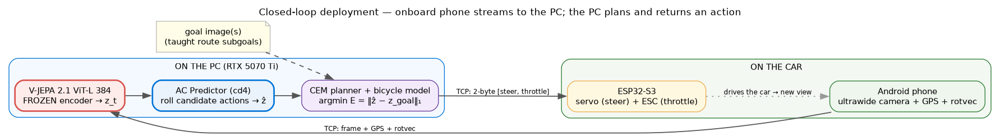
*Figure 23 — Closed-loop deployment: the onboard phone streams frame + GPS + rotvec over TCP to the PC,
which runs the frozen V-JEPA encoder → AC predictor → CEM planner and returns a 2-byte [steer,
throttle] back to the **phone over TCP**; the phone forwards it to the **ESP32 over USB**, which drives
the servo and ESC. (Diagram source: `figures/src/deploy_loop.dot`.)*

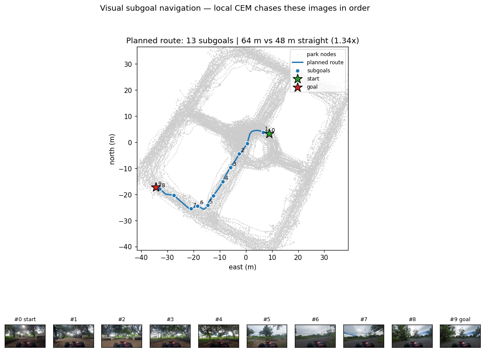
*Figure 24 — A taught route and its visual subgoals (the images the local CEM chases in order): the
planned route threads 13 subgoals through the park; the thumbnails below are the subgoal goal images.*

**CEM latency (real GPU bench).** Closed-loop needs to be real-time, so the search budget is limited:
32 samples / 1 iteration ≈ **0.5 s/decision**; 256 samples / 2 iterations ≈ **5.5 s** (a dense search
makes the car drive "blind" too long between decisions). We chose **32/1** (≈ the quality of 64/2) so
the car reacts in time.

| Run | tick | tracks well to | veers at | outcome |
|---|---|---|---|---|
| 163607 | 1.13 s | subgoal 18 (< 0.5 m off) | subgoal 21 (cos 0.07) | veers left +3.2 m |
| 171912 | 1.78 s | subgoal 6 | subgoal 7 (cos 0.02) | veers left → into grass |

*Table 7 — Closed-loop runs (raw outcomes). Both track the first half, then veer off at a cos-collapse.*

Figure 25 shows run 171912's trajectory: tracking cleanly (blue, high cosine) then veering off (red,
collapsed cosine) at the breakaway point.

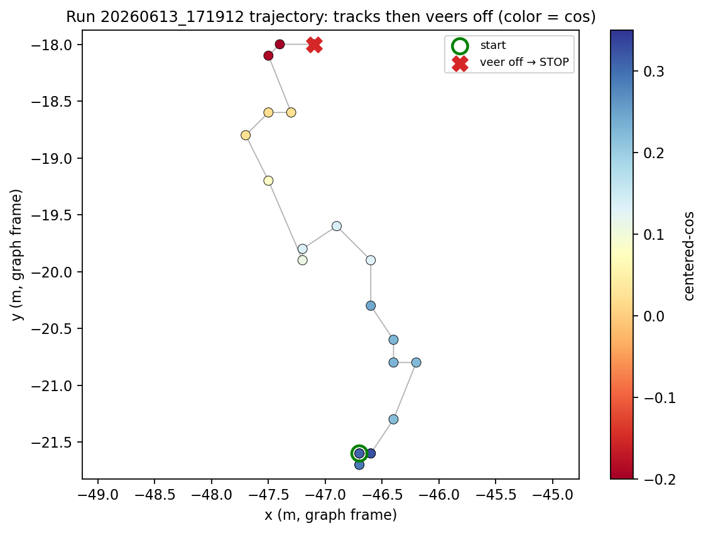
*Figure 25 — Run 20260613_171912 trajectory, coloured by localization cosine: it tracks the taught
corridor (cool colours = high cos) then the cosine collapses (warm colours) and it veers off, where the
run was stopped.*

### 13.2. Cause A — the LOCALIZATION descriptor is not invariant (NOT "V-JEPA is broken")
**Distinguish two things clearly — this is the easy confusion.** The system uses V-JEPA for **two
different stages**:
- **The control stage (CEM)** scores energy with **L1 over the 576 patch tokens** (`‖P − z_goal‖₁`).
  This stage is **lighting-robust** (measured: sun→cloud changes it < 5%).
- **The localization / goal-pop stage** scores similarity with **cosine over the MEAN-POOLED latent**
  (pooling 576 tokens → one 1024-D vector). **It is this stage that collapses**, not the control stage.

**Symptom.** On reaching a goal image where the live image (heading/lighting/position at run time
differs from teach time) does not match the taught image → the cosine between the live pooled latent
and the marker **drops < 0.1 then goes negative** → the goal becomes indistinguishable → the CEM
energy goes flat in steering → erratic steering.

**Quantitative evidence (from real-run logs).** Cosine quality depends on the **lighting/time gap
between teach and run**, not on the scene (Figure 26):
- Route taught & run **in the same session, close in time** → **66% of ticks** have cos > 0.3
  (localization tracks well).
- Route taught at 14:11, run at 14:50 (bright sun, lighting already shifted) → **0% of ticks** have
  cos > 0.3 (localization collapses).

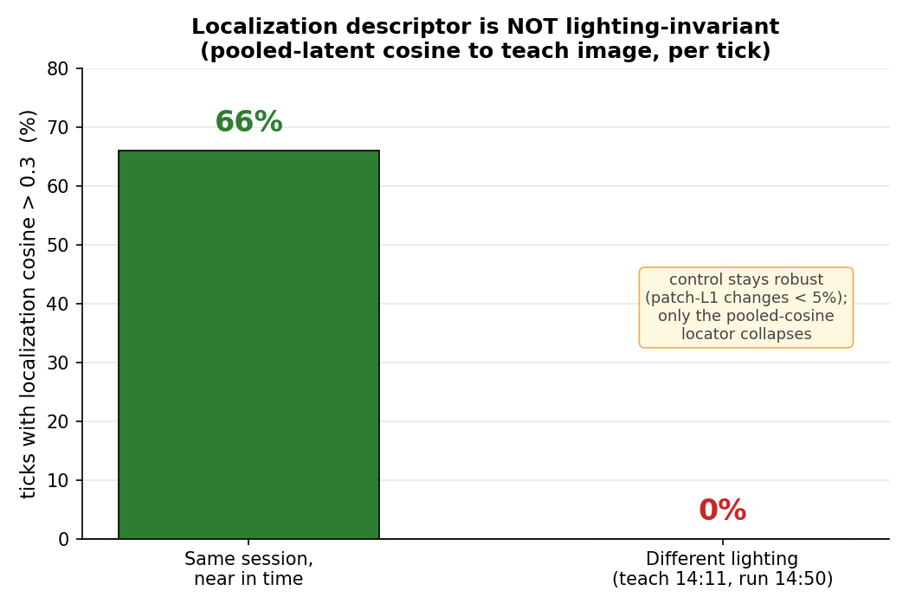
*Figure 26 — The localization descriptor is NOT lighting-invariant: 66% of ticks well-localized
(cos > 0.3) when teach and run are close in time vs 0% under a lighting shift. The control stage stays
robust (patch-L1 < 5% change); only the pooled-cosine locator collapses.*

Figure 27 traces this collapse over one real run: the centered-cosine to the matching subgoal decays
below the 0.1 threshold, and as it does, the CEM's raw steering swings to full-lock.

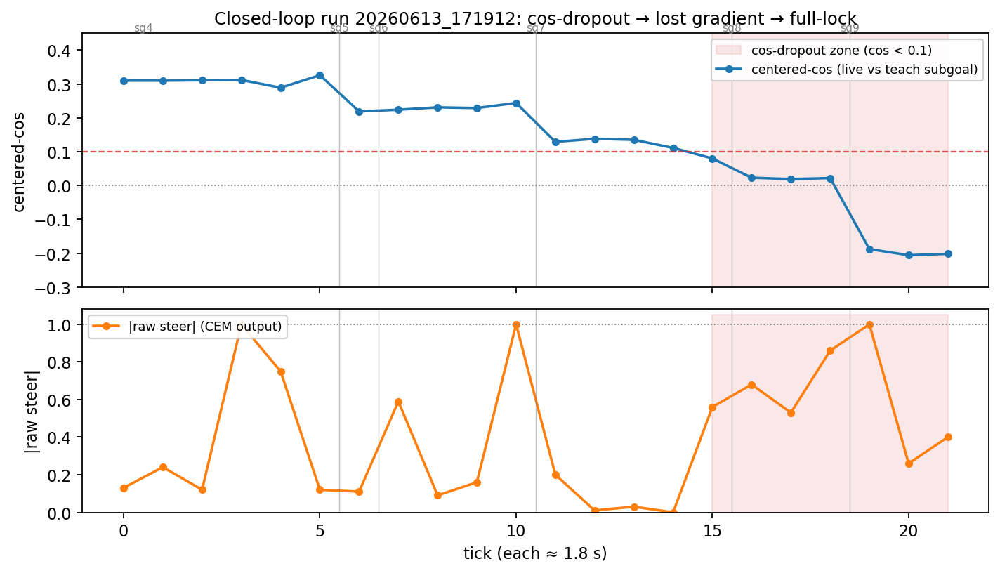
*Figure 27 — Closed-loop run 20260613_171912: the centered-cosine to the live-vs-teach subgoal (top)
decays into the cos-dropout zone (cos < 0.1), and as it does the CEM's |raw steer| (bottom) jumps to
full-lock — the lost-gradient → full-lock signature.*

**Important — this is NOT "a poor V-JEPA representation".**
- **The teach embeddings are not degenerate** (measured separately: the goal images are mutually
  distinguishable as normal).
- **The control stage using patch-L1 stays robust** (sun→cloud < 5%). The failure is in the **choice of
  descriptor for the localization stage** (mean-pool + cosine) — global pooling + cosine is **sensitive
  to global lighting changes + heading/viewpoint changes**: when lighting/heading shifts, the live
  image's pooled vector rotates enough that the cosine to the correct marker drops below the
  discrimination threshold. Figure 28 lays out the full failure spiral.

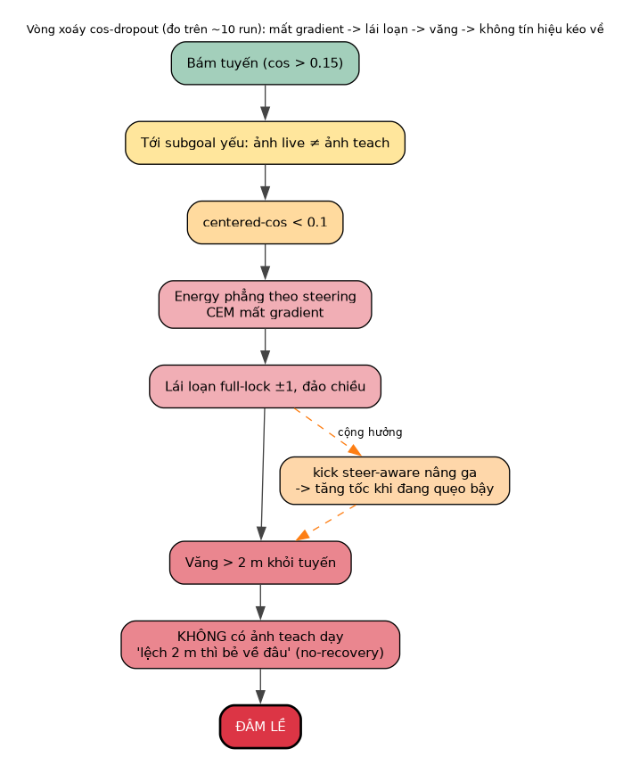
*Figure 28 — The cos-dropout failure spiral (observed over ~10 runs): a weak subgoal (live ≠ taught) →
centered-cos < 0.1 → energy flat in steering → CEM loses gradient → full-lock erratic steering → drifts
> 2 m off route → no taught image teaches "how to steer back" → hits the edge.*

> **➡️ Conclusion A:** this is a **limit of the LOCALIZATION DESCRIPTOR** (pooled-latent + cosine) under
> lighting + heading change, **not a limit of the V-JEPA representation or of the control stage**. **The
> principled fix = learn a lighting-invariant descriptor** (a small head on frozen V-JEPA, trained
> cross-session — §16). **The deadline-compatible fix = re-teach in the SAME session** (the descriptor
> is very good when lighting is close).

### 13.3. Attempted remedies for the localization collapse (all insufficient within the deadline)

After identifying cause A, several remedies were tested. All reduced the symptom partially but did not
eliminate the root cause (descriptor sensitivity to lighting/heading change):

1. **Tuning the cosine threshold** (the cutoff below which the goal is considered "lost"). Lowering it
   → the car pops to the next goal too eagerly on a false match; raising it → the car stays locked on a
   collapsed goal. Moving the threshold only shifts *when* the collapse manifests, not *whether* it
   happens. The breakaway point moves to a different subgoal — the car still veers.

2. **Teaching and running in the same session, close in time.** This works: 66% of ticks have cos > 0.3
   when teach and run are close in time vs 0% when lighting shifts (§13.2, Figure 26). However it
   constrains operation to a narrow time window (teach, then run immediately) — the general case (teach
   once, re-run any time) is not solved.

3. **GPS-gated goal-popping** (advance to the next subgoal when GPS distance to marker < threshold
   rather than waiting for cos > threshold). The 1 Hz GPS and ~0.44 m noise cause erratic triggering:
   the pop fires before the car has reached the marker, or fails to fire because the GPS fix drifts.
   Combined with heading uncertainty it does not reliably pop at the right moment.

4. **CEM parameter sweeps** (N samples, K iterations, initial σ). These shift the breakaway point
   (better coverage of the action space slightly delays the onset of flat landscape) but cannot fix the
   root cause: once the localization cosine collapses, the goal energy is uniformly low across actions
   → no parameter change rescues a flat landscape.

The principled fix (a learned cross-session invariant descriptor — §16) was not completed before the
deadline. The `--step` debugging mode was used to isolate each failure, but all failures reproduce in
the continuous live loop (cause A is structural, not a mode artifact).

### 13.4. Standstill deadlock — a structural problem in any latency-limited loop (patched)

This is **not** an artifact of the `--step` debugging mode; it is a **structural issue** in any
closed-loop run where inference latency is significant (§13.5). Because each CEM tick takes ~0.5–1 s,
the car cannot maintain continuous motion: it **lurches forward with the last command, then decelerates
and stops** while the next plan is computed. The resulting pattern is a **creep–stop–creep–stop** cycle.
During the stopped moments the `E(steer)` landscape goes flat for a **dynamics** reason (not a
descriptor reason), producing garbage steering that compounds the overall failure.

**Mechanism (simple).** The car dynamics: `yaw_rate = k_yaw · steer · speed` (§10). When speed ≈ 0,
**steering does not rotate the scene**, so the predictor (correctly) makes **every steering angle yield
almost the same scene** → sweeping steer creates no energy difference → flat. In other words: **a
stationary car has nothing to "steer toward"** — the flatness is *because the car is stopped*, not
because the scene is unfamiliar or the model is poor.

**Single-variable check** (`scripts/probe_speed_confound.py`, **same scene & goal**, only changing the
motion state): when the car is **moving** the `E(steer)` contrast = **0.335**; when forced
**standing-still throughout** it drops to **0.088** — collapses **~3.8×** just because the car is
stopped, with no scene change at all. (Live measurement: throttle ≥ 0.07 → contrast 0.2–0.57;
throttle < 0.06 → flat 0.01–0.02.)

**The deadlock cycle.** The CEM throttle box `[0, 0.10]` contains a static-friction dead zone
`[0, 0.06)`: CEM picks a low throttle → car does not move → speed = 0 → landscape flat → garbage
steering → car stays put → next tick: same. The **patch** is a **throttle floor `TMIN = 0.07`**
(forcing the car to always roll above the dead zone) → the steering landscape revives between ticks.
After the patch the car drives but **still veers off at cause A** — so A is the primary bottleneck; the
standstill deadlock is a secondary (but real and recurring) structural issue that the throttle floor
only partially mitigates: the car still stops momentarily at each tick, just less deeply into the dead
zone.

**Mechanism (simple).** The car dynamics: `yaw_rate = k_yaw · steer · speed` (§10). When speed ≈ 0,
**steering does not rotate the scene**, so the predictor (correctly) makes **every steering angle yield
almost the same scene** → sweeping steer creates no energy difference → flat. In other words: **a
stationary car has nothing to "steer toward"** — the flatness here is *because the car is stopped*, not
because the scene is unfamiliar or the model is poor.

**Single-variable check** (`scripts/probe_speed_confound.py`, **same scene & goal**, only changing the
motion state): when the car is **moving** the `E(steer)` contrast = **0.335**; when forced
**standing-still throughout** it drops to **0.088** — i.e. **collapses ~3.8× just because the car is
stopped**, with no scene change at all. (This matches the live measurement: throttle ≥ 0.07 → contrast
0.2–0.57; throttle < 0.06 → flat 0.01–0.02.)

**Root cause = a standstill deadlock & the patch.** The CEM throttle box `[0, 0.10]` happens to contain
a **static-friction dead zone** `[0, 0.06)`: CEM picks a low throttle → the car does not move → speed =
0 → the landscape goes flat → it outputs garbage steering → the car stays put. We patch this with a
**throttle floor `TMIN = 0.07`** (forcing the car to always roll) → the steering landscape revives.
This is only a **(control-mode) implementation bug that was fixed**; **after the patch the car drives
but still veers off at cause A** — so A is the real bottleneck, B is only a footnote.

### 13.5. Variable inference latency: the car drives blind between decisions

A structural constraint that fundamentally limits closed-loop quality, independent of the planner's
quality: **the control loop is not real-time**. One CEM tick costs **≈ 0.5 s (32 samples / 1 iteration)**
at minimum; a denser search (256/2) costs **≈ 5.5 s** (Table 7 bench). During that entire compute
round-trip — phone TCP stream → PC encode → CEM → action → ESP32 — **the car drives blind** with
whatever the last command was.

- **Stale-state planning.** The bicycle model in CEM integrates forward from the *current* state
  (speed, heading). But "current" is already **0.5–1.5 s stale** by the time the action is computed
  and acted upon. At 1 m/s walking pace this means the car is **0.5–1.5 m ahead** of where the model
  thinks it is — so the planned action is optimal for a past position, not the present one.
- **Aperiodic loop.** TCP buffering, GPU scheduling, and variable CEM budget (the number of valid
  samples varies per tick) all make the inter-tick interval **non-constant**. The bicycle model
  integrates a fixed `dt`; any mismatch between assumed and real `dt` accumulates heading error.
- **Latency × veering interaction.** Once the localization collapse (§13.2) begins pushing the car
  off-route, a 0.5–1 s dead-time between corrections gives the car **0.5–1 m of uncontrolled drift**
  per cycle, rapidly compounding the off-route displacement.
- **Root cause.** ViT-L cannot run on the phone → off-board GPU required → TCP round-trip latency
  unavoidable with this architecture. On-board inference (a lighter encoder or NPU quantization) would
  reduce dead-time to < 50 ms, but is outside the current hardware budget.

### 13.6. State approximation: bicycle model vs. proprioception

Meta's V-JEPA 2-AC runs on a robot arm with **7-D sub-mm proprioception** (exact Cartesian pose +
joint angles sampled at the servo controller frequency). The arm's CEM plans in the *exact* current
state. Our car's state at inference time is fundamentally coarser:

- **Speed from GPS at 1 Hz** (then interpolated), with ~0.44 m position noise → speed estimate is
  delayed and smoothed, not instantaneous.
- **Heading from phone IMU** (gyro integration + magnetometer). The phone compass is unreliable
  outdoors near the brushless motor and ESC (strong magnetic interference) — large heading errors were
  observed when attempting geometric heading-following.
- **No absolute position at inference time** (only coarse GPS for goal-popping, not for control).
- **Bicycle model** (`yaw_rate = k_yaw · steer · speed`) is a linearized kinematic approximation:
  it assumes no tire slip, flat terrain, and constant drag coefficients. A real RC car on outdoor
  gravel/grass has significant slip, load transfer on bumps, and nonlinear tire behavior.
- **Consequence.** The CEM rolls forward an imprecise state through an imprecise model — so even when
  the energy landscape is clear, the action that *actually* moves the car in the right direction can
  deviate from what the bicycle model predicts. By contrast, Meta's arm has exact state → exact
  dynamics → CEM explores the real state space accurately. This gap is not a failure of the V-JEPA
  representation; it is a **sensor + dynamics modeling gap** inherent to the current mobile rig.

### 13.7. Why it cannot recover once it has veered (relation to A)
Teach&repeat only captures goal images **along one path** (during teaching the car is in the middle of
the route). When the car **veers out of the taught corridor**, the live image falls into a region *never
captured as a marker* → the cosine to the next marker drops (exactly mechanism A) → **there is no valid
goal to steer back toward**. Note the distinction: **the AC predictor's training set does NOT lack
corrective behaviour** (§7.3, 13,871 turning events) — what is missing is **a goal image showing the way
back when off-route**, i.e. a consequence of the *teach-once-down-the-middle* method + the descriptor
collapse (A), not "the driving data lacks recovery". (A latent-level remedy — token-shift augmentation —
is discussed in §16 as future work.)

### 13.8. Comparison with Meta (V-JEPA 2-AC)
- **Meta (robot arm):** a fixed tabletop scene, actions cause large + immediate scene changes, **no**
  heading / lighting / lateral offset to deal with. Meta's "cm-accurate" claim matches the arm's
  **sub-mm proprioception** (**a different measurement** — exact Cartesian pose, not a world-model
  accuracy claim), not "a more accurate world model". CEM plans in the exact current state.
- **Our car (outdoor):** action → small scene change + **cosine-localization-dropout** (§13.2,
  lighting/heading shift between teach and run) + **0.5–1 s blind dead-time per tick** (§13.5) +
  **coarse GPS/IMU state and bicycle-model dynamics** (§13.6) → **far harder on robustness than a
  fixed tabletop**. Same architecture family; the gap is not in the representation but in
  **localization robustness** under real domain shift, compounded by sensor + latency constraints.

---

## 14. IMU Data Assessment & Why Not Predict the Full Next-State

The state token uses 10 IMU channels (gyro gx/gy/gz, accel ax/ay/az, rotation-vector rx/ry/rz) + GPS
speed. Practical observations about **the quality of these channels**:
- **Very noisy & mounting-dependent.** A phone strapped to the car → accel/gyro mix in **chassis
  vibration + road bumps + mount resonance**; az has a constant gravity offset; ax/ay are small and
  drowned in noise while driving.
- **GPS speed at 1 Hz** while frames are ~8.5 Hz → speed must be **interpolated**, delayed and
  smoothed.
- **The rotation-vector** is stable for **pitch/roll** (the car's attitude on slopes/bumps) but has
  **yaw≈heading drift** + a poor outdoor compass (large errors were seen when trying geometric
  heading-following).
- **Consequence:** among the 12-D state, **the truly trustworthy dimensions for control are `speed` and
  `gz` (yaw-rate)**; the accel/rotvec part carries little clean signal, mainly letting the model "sense"
  that it is bumping/tilting.

This reinforces the choice **not** to have the predictor predict the full state (§9.4) and motivates
replacing the phone IMU with a dedicated **BNO055** sensor [9] (hardware sensor fusion → far more
stable orientation/gyro) in future work (§16).

---

## 15. Limitations

1. **Closed-loop:** ~10 runs, **1 environment**, **0 runs reached the goal**, no standard success-rate
   metric → the closed-loop result is **qualitative + mechanistic**, not large-scale statistics.
2. **The localization descriptor is sensitive to lighting/heading:** teach ≠ run in time/sun → cosine
   quality collapses; **the principled fix needs a learned descriptor**, not done in time for the
   deadline.
3. **GPS at 1 Hz, 0.44 m noise** → only a coarse pop gate, not meter-level localization.
4. **A noisy phone IMU** (§14) → only speed + yaw-rate in the state are trustworthy.
5. **The encoder does not run on-device** (ViT-L needs a GPU) → it goes through the PC; high CEM
   latency (0.5–5.5 s/tick).
6. **A modest offline margin** (rollout@1 0.744; beating identity is only a necessary condition) →
   honestly this is **a report/workshop level**, not SOTA.

---

## 16. Future Work

1. **Replace the IMU with a BNO055** (a 9-axis IMU, hardware sensor fusion) → a much cleaner state token
   (the root fix for §14) [9].
2. **A LEARNED lighting/heading-invariant descriptor for the localization stage (the root fix for cause
   A):** a small head on frozen V-JEPA, trained cross-session — the 181-session dataset ALREADY contains
   same-place-different-time pairs.
3. **Token-shift augmentation ("DAVE-2 for latents"):** laterally shift the patch-token grid to simulate
   a laterally-offset camera, then attach "steer-back" labels and mix it into the policy's BC. *Measured
   offline:* it amplifies the steer-back response 3.4–5.4× without hurting goal-reaching. **A caveat:**
   token shifting is a proxy, with **no renderer** → closed-loop transfer is unproven → off by default,
   enabled only after an on-car probe.
4. **3DGS simulation:** reconstruct the park from data → test closed-loop indoors, controlling
   heading/lighting.
5. **RTK GPS** (1–2 cm): meter-precise pops + a ground-truth lateral offset.
6. **A side experiment (not used in the main system):** a topological image-graph — offline it localizes
   to ~2 m but is **hard to control in the real run** (zigzag connecting edges, teach≠run images, distant
   markers, coarse GPS) → the main system settles on a **linear chain of goal images** (sequential
   subgoals).

---

## 17. Conclusion

Frozen V-JEPA 2.1 provides a **good-enough latent representation** to: (Tier 1) let an AC predictor of
**≈ 39.2M parameters** predict better than the identity baseline at every horizon, with action
sensitivity on **both steering and throttle**, and **cross-servo-domain transfer**; (Tier 2) let a
**planner choose the JOINT of steering and throttle matching the human driver** — ~94% correct direction
and **close in magnitude** (steering deviation ~0.12, throttle deviation ~0.03), with self-chosen
forward throttle 92% — on held-out video (open-loop). However, (Tier 3) the outdoor closed-loop
deployment **veers off** — and the quantitative analysis attributes the **primary** cause to the
**localization stage (a pooled-cosine descriptor not invariant to lighting/heading)**, **NOT** to
representation quality (a secondary standstill control deadlock was patched, §13.4). Because the data was
collected and measured by us, we present this as **an experiment of the V-JEPA 2 family on a MOBILE
robot** (a harder robustness regime than a robot arm) together with **a mechanistic failure analysis**:
with the same strong representation, the gap between "good latent prediction + expert-matching offline
planning" and "real outdoor closed-loop driving" lies in **localization robustness**, not in the
representation.

---

## 18. Appendix

### 18.1. Reproducing the numbers (both data/ and checkpoints/ are gitignored)
```bash
pip install -e .
# Dataset statistics + overview charts (§7)
PYTHONPATH=src python scripts/dataset_stats.py
PYTHONPATH=src python scripts/plot_dataset_overview.py
# Parameter count (§9.2)
python -c "import torch;sd=torch.load('checkpoints/vjepa_ac_car_cd4/vjepa_ac_car/best.pt',weights_only=False)['model'];print(sum(v.numel() for v in sd.values()))"
# Loss curve (§9.6)
PYTHONPATH=src python scripts/plot_loss_curve.py
# TIER 1: rollout-vs-identity + action sensitivity (steer + throttle) + deviation from teacher
PYTHONPATH=src python scripts/eval_ratio_ac.py --checkpoint checkpoints/vjepa_ac_car_cd4/vjepa_ac_car/best.pt
PYTHONPATH=src python scripts/probe_energy.py --turn-only -d 4 --n-windows 300 --with-throttle
PYTHONPATH=src python scripts/plot_transfer.py            # 3-step transfer (1.073→0.975→0.65)
# TIER 2: joint open-loop planner (demo + accuracy) + steering-tracking figure
PYTHONPATH=src python scripts/demo_precompute.py <session> -d 4
PYTHONPATH=src python scripts/plot_steer_tracking.py
# §13.4 standstill ablation (speed=0)
PYTHONPATH=src python scripts/probe_speed_confound.py -d 4 --n-windows 200
# §13.2 (cross-lighting localization): read from real-run logs logs/infer_20260613_*.log (cos>0.3 per tick)
# Report figures (regenerate every PNG with English labels):
PYTHONPATH=src python scripts/plot_results_summary.py        # N1
PYTHONPATH=src python scripts/plot_cross_lighting.py         # N2
PYTHONPATH=src python scripts/plot_energy_heatmap.py         # N3
PYTHONPATH=src python scripts/plot_contrast_vs_horizon.py    # N4
PYTHONPATH=src python scripts/plot_frame_montage.py          # N5
PYTHONPATH=src python scripts/plot_energy_landscape.py --demo data/demo/session_20260607_162959/demo.json
python scripts/plot_closed_loop.py logs/infer_20260613_171912.log --out docs/report/figures
# Diagrams (graphviz): for f in arch_ours arch_meta arch_predictor_detail encoder_pipeline data_pipeline deploy_loop; do
#   dot -Tpng docs/report/figures/src/$f.dot -o docs/report/figures/fig_$f.png; done
# dot -Tpng docs/report/figures/src/fig_cos_dropout_mechanism.dot -o docs/report/figures/fig_cos_dropout_mechanism.png
```

### 18.2. Deployment checkpoint
`checkpoints/vjepa_ac_car_cd4/vjepa_ac_car/best.pt` — V-JEPA 2.1 ViT-L 384, state **12-D**, predictor
**depth12 / pred_dim512 / 8 heads / 39.2M**, action 3-D (steer/throttle/domain), `auto_steps 2`,
`predict_residual false`. Split: 209 ss → **train 167 / val 42** (seed 0).

### 18.3. Reference numbers (verified in this pass)
- **Data:** 209 sessions, **228,511 frames**, **7.43 hours** (KDS 1.73 h / TowerPro 5.71 h); throttle
  median 0.084; standstill 11.3%; 13,871 turning events; speed median 1.05 m/s. Split 167/42.
- **Parameters:** AC predictor **39,192,576 ≈ 39.2M**.
- **Tier 1:** cd4 ratio@1/2/3 = 0.744/0.703/0.697; transfer (held-out TowerPro) **1.073** (TowerPro
  only) → **0.975** (pretrain KDS + finetune) → **0.65** (mixed); action sensitivity (300 turning VAL
  windows): steering sign-turn **285/300 = 95%**, **median \|argminE−teacher\| 0.146**, turn contrast
  **0.33**; throttle contrast **0.27**, want-forward **83%** (median +0.11).
- **Tier 2 (JOINT steer×throttle, 3 VAL ss, 893 turning frames):** steering sign-turn **841/893 =
  94.2%**, **median \|Δsteer\| 0.118**; throttle want-forward **91.9%**, throttle median +0.075 (human
  +0.090), **median \|Δthrottle\| 0.033**; joint contrast median **0.52**.
- **§13.2 (cross-lighting localization):** from real-run logs — same-session-near-time **66% ticks
  cos>0.3** vs teach/run lighting-shifted **0% ticks cos>0.3**.
- **§13.4 (standstill deadlock):** `probe_speed_confound.py` ablation (200 turning VAL windows,
  same scene): contrast E(steer) **0.335 (moving) → 0.088 (standing still, ×3.8)**; fix = throttle floor
  TMIN=0.07.

### 18.4. File map
| Stage | File |
|---|---|
| Encoder | `src/jepa_wm/models/encoders/vjepa.py`, `scripts/encode_patch.py` |
| AC predictor | `src/jepa_wm/models/vjepa2_ac_car.py`, `src/jepa_wm/engine/train_ac_car.py` |
| Dataset stats | `scripts/dataset_stats.py` |
| Offline eval (Tier 1) | `scripts/eval_ratio_ac.py`, `scripts/probe_energy.py`, `scripts/plot_transfer.py` |
| Training + loss | `scripts/train_ac_car.py`, `src/jepa_wm/engine/train_ac_car.py`, `scripts/plot_loss_curve.py` |
| Open-loop demo (Tier 2) | `scripts/demo_precompute.py`, `scripts/demo_web.py`, `scripts/plot_steer_tracking.py` |
| Planning | `src/jepa_wm/planning/cem.py`, `src/jepa_wm/planning/dynamics.py` |
| Closed-loop (Tier 3) | `scripts/inference_loop.py`, `scripts/probe_speed_confound.py` |
| Report figures | `scripts/plot_*.py`, `docs/report/figures/src/*.dot`, `docs/report/figures/fig_*.png` |

*Table 8 — File map.*

### 18.5. Figure sources (diagram code)
The body shows the rendered PNGs (via graphviz). The equivalent **mermaid** source is kept here so the
diagrams also render on GitHub/VS Code; the canonical sources live in `docs/report/figures/src/*.{dot,mmd}`.

**Figure 4 — Data pipeline (`data_pipeline.mmd`):**
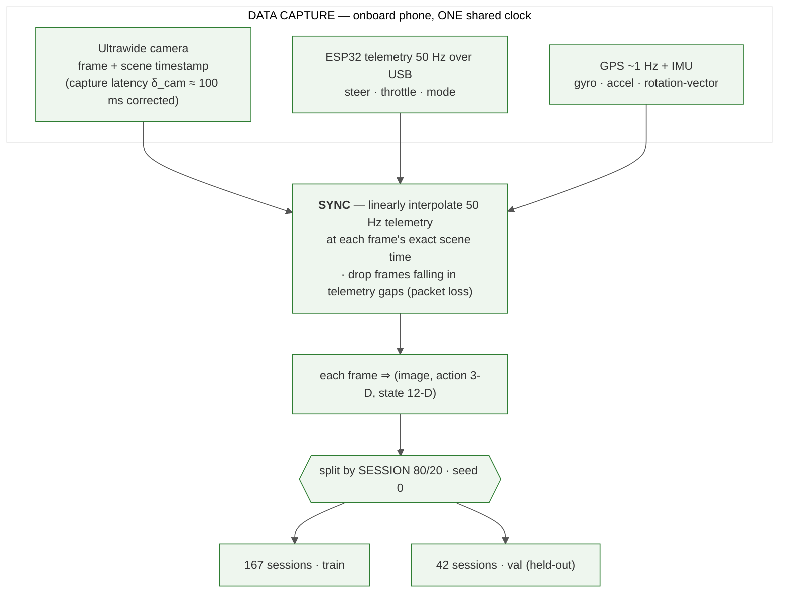
```mermaid
%%{init: {'theme':'base','themeVariables':{'fontSize':'14px','primaryColor':'#eef6ee','primaryBorderColor':'#2e7d32','lineColor':'#555'}}}%%
flowchart TB
  subgraph REC["DATA CAPTURE — onboard phone, ONE shared clock"]
    direction LR
    CAM["Ultrawide camera<br/>frame + scene timestamp<br/>(capture latency δ_cam ≈ 100 ms corrected)"]
    TEL["ESP32 telemetry 50 Hz over USB<br/>steer · throttle · mode"]
    SEN["GPS ~1 Hz + IMU<br/>gyro · accel · rotation-vector"]
  end
  CAM --> SYNC
  TEL --> SYNC
  SEN --> SYNC
  SYNC["<b>SYNC</b> — linearly interpolate 50 Hz telemetry<br/>at each frame's exact scene time<br/>· drop frames falling in telemetry gaps (packet loss)"]
  SYNC --> PAIR["each frame ⇒ (image, action 3-D, state 12-D)"]
  PAIR --> SPLIT{{"split by SESSION 80/20 · seed 0"}}
  SPLIT --> TR["167 sessions · train"]
  SPLIT --> VA["42 sessions · val (held-out)"]
```

**Figure 13 — Encoder pipeline (`encoder_pipeline.mmd`):**
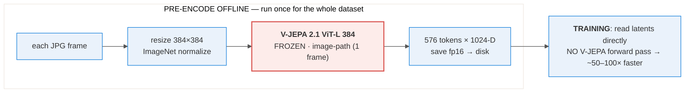
```mermaid
%%{init: {'theme':'base','themeVariables':{'fontSize':'15px','primaryColor':'#eaf2fb','primaryBorderColor':'#0275d8','lineColor':'#555'}}}%%
flowchart LR
  subgraph OFF["PRE-ENCODE OFFLINE — run once for the whole dataset"]
    direction LR
    A["each JPG frame"] --> B["resize 384×384<br/>ImageNet normalize"]
    B --> C["<b>V-JEPA 2.1 ViT-L 384</b><br/>FROZEN · image-path (1 frame)"]
    C --> D["576 tokens × 1024-D<br/>save fp16 → disk"]
  end
  D --> E["<b>TRAINING</b>: read latents directly<br/>NO V-JEPA forward pass → ~50–100× faster"]
  classDef frozen fill:#fdecea,stroke:#d9534f,stroke-width:2px;
  class C frozen;
```

**Figure 14 — Our architecture (`arch_ours.mmd`):**
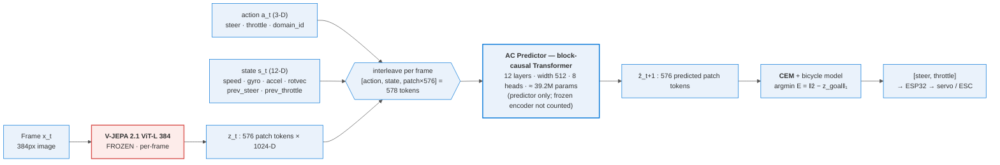
```mermaid
%%{init: {'theme':'base','themeVariables':{'fontSize':'15px','primaryColor':'#eaf2fb','primaryBorderColor':'#0275d8','lineColor':'#555'}}}%%
flowchart LR
  IMG["Frame x_t<br/>384px image"] --> ENC["<b>V-JEPA 2.1 ViT-L 384</b><br/>FROZEN · per-frame"]
  ENC --> TOK["z_t : 576 patch tokens × 1024-D"]
  ACT["action a_t (3-D)<br/>steer · throttle · domain_id"] --> GRP
  ST["state s_t (12-D)<br/>speed · gyro · accel · rotvec<br/>prev_steer · prev_throttle"] --> GRP
  TOK --> GRP{{"interleave per frame<br/>[action, state, patch×576] = 578 tokens"}}
  GRP --> PRED["<b>AC Predictor — block-causal Transformer</b><br/>12 layers · width 512 · 8 heads · ≈ 39.2M params<br/>(predictor only; frozen encoder not counted)"]
  PRED --> ZH["ẑ_t+1 : 576 predicted patch tokens"]
  ZH --> CEM["<b>CEM</b> + bicycle model<br/>argmin E = ‖ẑ − z_goal‖₁"]
  CEM --> OUT["[steer, throttle]<br/>→ ESP32 → servo / ESC"]
  classDef frozen fill:#fdecea,stroke:#d9534f,stroke-width:2px;
  classDef train fill:#eaf2fb,stroke:#0275d8,stroke-width:2px;
  class ENC frozen;
  class PRED train;
```

**Algorithm — Open-loop planner (§12.1) (`open_loop_algo.mmd`):**
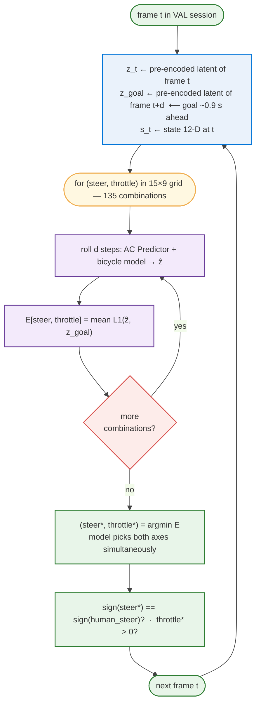
```mermaid
%%{init: {'theme':'base','themeVariables':{'fontSize':'14px','primaryColor':'#eaf2fb','primaryBorderColor':'#0275d8','lineColor':'#444'}}}%%
flowchart TB
  START(["frame t in VAL session"]):::start --> FETCH
  FETCH["z_t ← pre-encoded latent of frame t
z_goal ← pre-encoded latent of frame t+d  ⟵ goal ~0.9 s ahead
s_t ← state 12-D at t"]:::data --> GRID
  GRID(["for (steer, throttle) in 15×9 grid — 135 combinations"]):::loop --> ROLL
  ROLL["roll d steps: AC Predictor + bicycle model → ẑ"]:::compute --> ENERGY
  ENERGY["E[steer, throttle] = mean L1(ẑ, z_goal)"]:::compute --> CHECK
  CHECK{"more\ncombinations?"}:::decision
  CHECK -- yes --> ROLL
  CHECK -- no --> ARGMIN
  ARGMIN["(steer*, throttle*) = argmin E
model picks both axes simultaneously"]:::result --> RECORD
  RECORD["sign(steer*) == sign(human_steer)?  ·  throttle* > 0?"]:::result --> NEXT
  NEXT(["next frame t"]):::start --> FETCH

  classDef start    fill:#e8f5e9,stroke:#2e7d32,stroke-width:1.5px
  classDef data     fill:#eaf2fb,stroke:#0275d8,stroke-width:1.5px
  classDef loop     fill:#fff8e1,stroke:#f0ad4e,stroke-width:1.5px
  classDef compute  fill:#f3eafb,stroke:#6a3d9a,stroke-width:1.5px
  classDef decision fill:#fdecea,stroke:#d9534f,stroke-width:1.5px
  classDef result   fill:#e8f5e9,stroke:#2e7d32,stroke-width:1.5px
```

**Figure 16 — Meta V-JEPA 2-AC (`arch_meta.mmd`):**
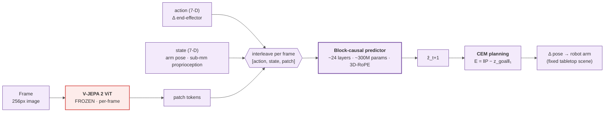
```mermaid
%%{init: {'theme':'base','themeVariables':{'fontSize':'15px','primaryColor':'#f3eafb','primaryBorderColor':'#6a3d9a','lineColor':'#555'}}}%%
flowchart LR
  IMG["Frame<br/>256px image"] --> ENC["<b>V-JEPA 2 ViT</b><br/>FROZEN · per-frame"]
  ENC --> TOK["patch tokens"]
  ACT["action (7-D)<br/>Δ end-effector"] --> GRP
  ST["state (7-D)<br/>arm pose · sub-mm proprioception"] --> GRP
  TOK --> GRP{{"interleave per frame<br/>[action, state, patch]"}}
  GRP --> PRED["<b>Block-causal predictor</b><br/>~24 layers · ~300M params · 3D-RoPE"]
  PRED --> ZH["ẑ_t+1"]
  ZH --> CEM["<b>CEM planning</b><br/>E = ‖P − z_goal‖₁"]
  CEM --> OUT["Δ pose → robot arm<br/>(fixed tabletop scene)"]
  classDef frozen fill:#fdecea,stroke:#d9534f,stroke-width:2px;
  classDef train fill:#f3eafb,stroke:#6a3d9a,stroke-width:2px;
  class ENC frozen;
  class PRED train;
```

---

## 19. References

[1] A. Bardes, Q. Garrido, J. Ponce, X. Chen, M. Rabbat, Y. LeCun, M. Assran, N. Ballas.
"Revisiting Feature Prediction for Learning Visual Representations from Video" (V-JEPA). Meta AI, 2024.

[2] Meta AI (FAIR). "V-JEPA 2: Self-Supervised Video Models Enable Understanding, Prediction and
Planning," 2025 — including the action-conditioned **V-JEPA 2-AC** model used for robot-arm planning,
and the distilled ViT-L **V-JEPA 2.1** (384px, Dense Predictive Loss) used here. Model weights:
`https://dl.fbaipublicfiles.com/vjepa2/`; HF id `facebook/vjepa2-vitl-fpc64-256`.

[3] Y. LeCun. "A Path Towards Autonomous Machine Intelligence." Open Review / Meta AI, 2022
(`docs/10356_a_path_towards_autonomous_mach.pdf`).

[4] M. Assran, Q. Duval, I. Misra, P. Bojanowski, P. Vincent, M. Rabbat, Y. LeCun, N. Ballas.
"Self-Supervised Learning from Images with a Joint-Embedding Predictive Architecture" (I-JEPA). CVPR,
2023.

[5] D. Shah, B. Eysenbach, G. Kahn, N. Rhinehart, S. Levine. "ViNG: Learning Open-World Navigation with
Visual Goals." ICRA, 2021.

[6] P.-T. de Boer, D. P. Kroese, S. Mannor, R. Y. Rubinstein. "A Tutorial on the Cross-Entropy Method."
Annals of Operations Research, 2005.

[7] I. Loshchilov, F. Hutter. "Decoupled Weight Decay Regularization" (AdamW). ICLR, 2019.

[8] R. Rajamani. *Vehicle Dynamics and Control* (kinematic bicycle model). Springer, 2006.

[9] Bosch Sensortec. "BNO055 — Intelligent 9-axis absolute orientation sensor," datasheet. (Future
work.)
