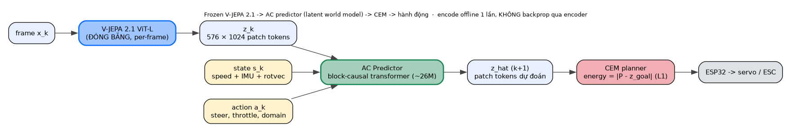
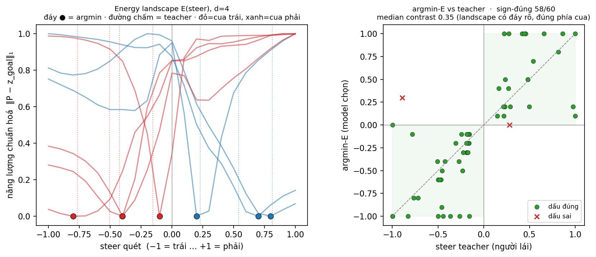

# BÁO CÁO CHI TIẾT — World Model Hành-động-điều-kiện dựa trên V-JEPA 2.1 cho Xe RC

**Đề tài.** Đóng băng encoder video nền-tảng **V-JEPA 2.1 (ViT-L, 384px)** làm biểu diễn thị giác,
huấn luyện một **AC Predictor** nhỏ học "hành động nào gây thay đổi hình ảnh nào" trong không gian latent,
rồi dùng **CEM planning** để **lái xe lặp lại một tuyến đã được dạy (teach & repeat)** bằng cách bám
ảnh-mục-tiêu.

> **Cách dùng file này:** đây là kho nội dung chi tiết để biên tập vào Word. **Mọi con số trong bản này
> đều tái lập được từ repo** — kèm script sinh ra nó (xem §Phụ lục). Đặc biệt: tham số mô hình **đếm trực
> tiếp từ checkpoint** (§8.2), thống kê dữ liệu **quét lại từ `data/raw_*`** (§6), R²(speed) **đo lại bằng
> `scripts/measure_speed_r2.py`** (§7). Placeholder cần điền: `[Họ tên]`, `[MSSV]`, `[Lớp/Môn]`, `[GVHD]`.

---

## Mục lục
1. Tóm tắt & Đóng góp
2. Giới thiệu & Động lực
3. Phát biểu bài toán & Phạm vi
4. Nền tảng & Công trình liên quan
5. **Hệ thống phần cứng & cách thu thập dữ liệu** *(mô tả TRƯỚC kiến trúc)*
6. **Dữ liệu & Thống kê** *(số liệu + biểu đồ)*
7. Encoder V-JEPA 2.1 (đóng băng) & đo khả năng mã hoá tốc độ
8. AC Predictor — kiến trúc (đóng góp chính) + **phép tính tham số**
9. TẦNG 1 — Dynamics offline (✅)
10. TẦNG 2 — Planner open-loop khớp người lái (✅)
11. Lập kế hoạch: CEM + động học xe + policy prior
12. TẦNG 3 — Closed-loop ngoài trời (❌ negative finding)
13. Đánh giá dữ liệu IMU & vì sao không dự đoán toàn bộ next-state
14. Đính chính & bài học phương pháp
15. Hạn chế
16. Hướng phát triển
17. Kết luận
18. Phụ lục (tái lập, config, bản đồ file)

---

## 1. Tóm tắt & Đóng góp

**Tóm tắt.** Chúng tôi nghiên cứu việc dùng một **encoder video nền-tảng đóng băng (V-JEPA 2.1 ViT-L
384)** làm biểu diễn cho một **world model hành-động-điều-kiện** trên **xe RC di động**, rồi dùng **CEM
planning** để **lái lặp lại một tuyến đã dạy** (teach & repeat): khi dạy, người lái tay đi hết tuyến và
hệ thống chụp chuỗi ảnh-mốc; khi chạy lại, model so ảnh hiện tại với ảnh-mốc kế tiếp và chọn lái/ga để
tới đó. Báo cáo trình bày kết quả theo **ba tầng trung thực**, mỗi tầng có thước đo và kết luận riêng:

- **Tầng 1 — Dynamics offline (✅):** AC predictor **~39M tham số** (đếm trực tiếp từ checkpoint, §8.2)
  đặt trên latent đóng băng **vượt baseline "đứng yên" (identity)** ở mọi horizon (rollout@1 = **0.744**),
  có **độ nhạy hành động đo được ở cả hai trục** — lái (argmin-năng-lượng đúng hướng cua **96%**, contrast
  **0.413**) và ga (contrast **0.298**, model "muốn" ga **+0.094** ≈ trung vị data) — và cho thấy
  **transfer chéo-domain-servo có lợi** (train trộn 2 servo → eval servo mới **0.65** so với **1.073** khi
  chỉ-train-servo-đó).
- **Tầng 2 — Planner open-loop, chọn JOINT cả lái lẫn ga (✅):** trên video VAL held-out, với mỗi frame
  thật ta đặt goal là mốc ~0.9s phía trước rồi cho planner quét **lưới 2-D (lái × ga)** và chọn cả hai trục
  ở đáy năng lượng — **lái khớp dấu người ~94%** ở khúc quẹo và **model tự chọn ga "muốn tiến" 92%** ở mức
  median +0.075 ≈ người +0.090. Đây là bằng chứng **planner chọn hành động (cả lái lẫn ga) giống chuyên gia
  khi chưa chịu vật-lý-đóng-vòng** — bắc cầu giữa metric offline và "lái thật".
- **Tầng 3 — Closed-loop ngoài trời (❌ negative finding):** khi đóng vòng thật, hệ thống **bám tuyến tốt
  ở nửa đầu route rồi "bung" ra lề**. Phân tích định lượng tách được **ba nguyên nhân cộng hưởng**:
  (A) **descriptor V-JEPA không bất-biến-sáng** → khâu so-ảnh-định-vị sập khi ảnh lúc dạy ≠ ảnh lúc chạy;
  (B) **vùng-chết đứng-yên** — ga thấp khiến xe dừng → `yaw = k·steer·speed ≈ 0` → landscape năng lượng
  phẳng (đã đính chính kết luận "OOD" sai trước đó); (C) **thiếu dữ liệu lateral-recovery** — dạy một-lượt-
  giữa-line không dạy "lệch rồi bẻ về". Giới hạn nằm ở **độ-bền-định-vị + chế-độ-điều-khiển + dữ liệu**,
  **không ở chất lượng biểu diễn** — một negative finding trung thực, có cơ chế.

**Đóng góp.**
1. **Đánh giá đầu tiên họ V-JEPA 2 trên một robot di động (xe RC)** — Meta chỉ thử trên cánh tay robot
   (cảnh bàn cố định). Đây là chế độ khó hơn về robustness (heading/ánh sáng/lệch ngang).
2. **Pipeline offline rigorous** đo độ nhạy hành động **cả lái lẫn ga**, rollout-vs-identity, và **bằng
   chứng transfer chéo-domain-servo**, với **mọi số đều tái lập được bằng script** trong repo.
3. **Kiểm chứng planner OPEN-LOOP**: tách "năng lực lập kế hoạch" khỏi "robustness đóng vòng" — cho thấy
   CEM chọn hành động khớp chuyên gia ~94% khi không chịu vật-lý-đóng-vòng.
4. **Phân tích thất bại closed-loop có cơ chế, phân rã 3 nguyên nhân**, kèm **đính chính minh bạch** các
   kết luận trung gian từng sai vì thiếu căn cứ (notably nhãn "OOD").

---

## 2. Giới thiệu & Động lực

**Vấn đề.** Điều hướng bằng thị giác cho robot di động truyền thống dựa vào bản đồ hình học. Một hướng thay
thế gần đây là **học biểu diễn tự-giám-sát** rồi **lập kế hoạch trong không gian latent**: thay vì xây bản
đồ 3D, ta học một *world model* dự đoán "hành động nào gây ra thay đổi hình ảnh nào" và tìm chuỗi hành động
đưa quan sát hiện tại về quan sát-mục-tiêu.

**Vì sao V-JEPA 2.1.** V-JEPA học đặc trưng bằng **dự đoán trong không gian biểu diễn** (feature prediction)
thay vì tái tạo pixel — tránh lãng phí dung lượng mô hình vào chi tiết pixel không cần thiết. Bản **2.1**
(ViT-L distilled từ ViT-G, 384px) bổ sung **Dense Predictive Loss** → đặc trưng patch chất lượng cao. Meta
đã chứng minh **V-JEPA 2-AC** (action-conditioned) cho phép **planning** trên cánh tay robot. Câu hỏi tự
nhiên: *biểu diễn này có dùng được cho một robot DI ĐỘNG, ngoài trời, với động lực học và domain-shift thật?*

**Đóng khung cho môn CV.** Bài toán bản chất là Computer Vision: (a) **biểu diễn thị giác** từ một
foundation model đóng băng; (b) **so khớp ảnh để định vị và lập kế hoạch điều khiển** trong latent; (c)
**độ bền của biểu diễn dưới domain-shift thật** (ánh sáng/giờ/góc nhìn) — chính là tâm điểm của phần phân
tích thất bại.

**Hạn chế tài nguyên & quyết định dừng thực địa.** Encoder ViT-L chạy trên GPU (RTX 5070 Ti), không chạy
trên điện thoại → inference phải qua PC. Sau vài ngày tinh chỉnh closed-loop ngoài thực địa mà chẩn đoán cho
thấy thất bại là **giới hạn ở chế-độ-điều-khiển + dữ liệu + descriptor, không phải ở tham số**, nhóm **dừng
thử nghiệm thực địa** và chuyển sang **chốt phần offline + kiểm chứng planner open-loop + viết báo cáo**,
trình bày closed-loop như một negative finding phân tích kỹ.

---

## 3. Phát biểu bài toán & Phạm vi

**Bài toán chính = TEACH & REPEAT (dạy-rồi-lặp).** Người lái tay đi hết một tuyến một lần (*teach*); hệ
thống lưu chuỗi ảnh-mốc dọc tuyến. Khi *repeat*, tại mỗi bước model so ảnh hiện tại với ảnh-mốc kế tiếp và
CEM chọn `[lái, ga]` để đưa cảnh hiện tại về cảnh-mốc đó; tới nơi thì chuyển sang mốc kế. Đây là **trọng
tâm của báo cáo**.

**Trong phạm vi:** lái bám tuyến đã dạy; chọn ảnh-mốc kế bằng so-ảnh + cổng GPS; điều khiển servo bằng CEM
trên latent.

**NGOÀI phạm vi (cố ý, để vừa deadline):** KHÔNG né vật cản, KHÔNG dựng bản đồ hình học toàn cục.

**Kiến trúc 2 tầng (tách bạch — quan trọng để quy trách nhiệm khi phân tích lỗi):**
- **Định vị (chỉ dùng thị giác + GPS):** trả lời "đang ở đâu trên tuyến" và "ảnh-mốc kế là cái nào".
- **Điều khiển (servo-specific):** AC predictor (V-JEPA frozen + predictor) + CEM. Trả lời "đạp ga/đánh lái
  bao nhiêu để tới mốc kế".

> Việc tách 2 tầng cho phép kết luận cuối cùng: **tầng biểu diễn + điều khiển hoạt động (Tầng 1+2); gap
> nằm ở tầng định-vị (descriptor nhạy ánh sáng) + chế-độ-điều-khiển + dữ liệu recovery khi đóng vòng (Tầng 3).**

---

## 4. Nền tảng & Công trình liên quan

- **JEPA / V-JEPA / V-JEPA 2 / 2.1.** Học self-supervised bằng *feature prediction* trong không gian
  embedding (không reconstruct pixel). V-JEPA 2 mở rộng lên video quy mô lớn; 2.1 thêm Dense Predictive Loss
  (đặc trưng patch dày). (PDF gốc trong `docs/`.)
- **V-JEPA 2-AC.** Bản action-conditioned của Meta: interleave `[action, state, patch]` mỗi frame, một
  predictor block-causal, CEM planning với năng lượng `‖P − z_goal‖₁`. **Chỉ thử trên cánh tay robot** —
  cảnh bàn cố định. Đây là **kiến trúc tham khảo** mà AC Predictor của chúng tôi dựa vào (so sánh chi tiết
  giống/khác/vì-sao ở §8.3).
- **ViNG (điều hướng bằng goal ảnh).** Ý tưởng "đi tới ảnh-mục-tiêu, học policy từ dữ liệu có hành vi đa
  dạng (kể cả lệch rồi về)". Chúng tôi **lấy ý tưởng goal-image** cho teach & repeat; phần đồ-thị-ảnh
  (topological graph) chỉ là **thử nghiệm phụ** (§13.2), không phải đóng góp chính.

> *Phạm vi liên quan được giữ gọn có chủ ý*: báo cáo tập trung vào **world model + teach & repeat**. Các
> nhánh thử-nhanh khác (world model pixel-JEPA end-to-end, warm-start policy cho MPC, place-recognition theo
> chuỗi) **không** dùng trong hệ chính và được đề cập như hướng tương lai ở §16, không bàn sâu ở đây.

---

## 5. Hệ thống phần cứng & cách thu thập dữ liệu

> Mô tả phần cứng + cách thu thập **trước** kiến trúc model, để người đọc hiểu dữ liệu đến từ đâu.

### 5.1. Xe & bộ điều khiển
- **Khung xe:** xe RC địa hình; **ESP32-S3 WROOM (N16R8)** gắn trên xe điều khiển 2 cơ cấu:
  - **Servo lái** TowerPro MG946R (analog, GPIO5), dải PWM **1000–2000µs**, tâm 1560µs (hiệu chỉnh
    2026-06-07, pivot quanh tâm để góc lái cơ khí đối xứng).
  - **ESC ga** Hobbywing QuicRun 8BL150 (150A brushless, GPIO6), dải 1000–2000µs, chạy Running-Mode-3
    (đảo chiều trực tiếp), map tuyến tính `esc_us = 1000 + (ga+1)/2·1000`.
- **Nguồn:** pin → ESC; BEC 6V cấp servo (giữ ≤6V vì MG946R không phải loại HV).
- **Hai "domain" servo (quan trọng cho phần transfer):** dữ liệu cũ thu bằng servo **KDS**, dữ liệu mới
  bằng **TowerPro MG946R**. Hai servo có **ánh xạ lệnh→góc-lái khác nhau** → coi là 2 domain điều khiển,
  gắn `domain_id` (0=KDS, 1=TowerPro) vào input predictor để model học chung mà vẫn phân biệt được.

### 5.2. Bước ngoặt: từ link video không dây sang điện thoại onboard
- **Rig ban đầu (đã bỏ cho thu data):** camera RunCam WiFiLink (OpenIPC, IMX415) truyền H.265 qua
  **WFB-NG (5.8GHz)** về PC. **Thất bại ở tầm xa** (~50m: vỡ ảnh, ~3% frame giật, trễ phình 92→310ms khi
  mất gói) → ngừng đánh nhau với link video không dây.
- **Rig hiện tại (pivot 2026-06-04):** **đặt điện thoại Android lên xe** (Samsung A42 5G, Android 13) làm
  camera + máy ghi. Camera **ultrawide** chụp frame cục bộ; điện thoại đọc telemetry ESP32 qua **USB**
  (cổng native VID 303A, cấp nguồn + giao tiếp); lưu `frames/*.jpg + actions.csv + telemetry.csv + gps.csv +
  imu (accel/gyro/rotvec)`. **Frame và telemetry chung MỘT đồng hồ điện thoại** → các vấn đề trễ-WFB /
  đồng-bộ-clock biến mất.
- **Độ trễ chụp camera δ_cam ≈ 100ms** (đo trên A42, `TIMESTAMP_SOURCE=REALTIME`, ổn định 98–103ms) — KHÔNG
  bằng 0; app ghi `dcam_ms` mỗi frame và bước sync hiệu chỉnh.

### 5.3. Lái tay khi RECORD & đồng bộ
- **Lái tay** bằng **FlySky FS-i6 / iA10B i-BUS** (CH1=lái, CH2=ga, CH9=mode, CH10=record). `recorder.py`
  là **logger thụ động**: ghép mỗi frame với hành động tại `t_read − δ_cam`.
- **`sync.py`** re-pair mỗi frame bằng **nội suy tuyến tính `telemetry.csv` 50Hz** tại thời điểm cảnh thật,
  hiệu chỉnh δ_cam, loại frame rơi-vào-lỗ-telemetry → xuất `actions_synced.csv` + `imu_synced.csv`.
- **State vector của model = 12-D**: `[speed, gx,gy,gz, ax,ay,az, rx,ry,rz, prev_steer, prev_throttle]` =
  GPS speed + gyro + accel + rotation-vector **+ hành-động-bước-trước**. (Loại lat/lon/bearing tuyệt đối để
  tránh overfit địa điểm — đánh giá chi tiết IMU ở §13.)
- **GPS:** điện thoại A42 trả **~1.04Hz** (dù app xin 5Hz); nhiễu vị trí **trung vị 0.44m / p90 1.0m**
  (đo `measure_gps_noise.py`). → GPS chỉ đủ làm **cổng pop ảnh-mốc**, KHÔNG đủ để giữ làn theo mét.

---

## 6. Dữ liệu & Thống kê

> Toàn bộ số trong mục này **quét lại trực tiếp từ `data/raw_kds` + `data/raw_towerpro`** bằng
> `scripts/dataset_stats.py` (xuất `docs/report/figures/dataset_stats.json` + 5 biểu đồ PNG).

### 6.1. Tổng quan (tái lập được)
| Tập | #session | #frame | Thời lượng | FPS lưu (tb) |
|---|---:|---:|---:|---:|
| **KDS** (servo cũ) | 28 | 53,076 | **103.6 phút (1.73 h)** | 8.53 |
| **TowerPro** (servo mới) | 181 | 175,435 | **342.4 phút (5.71 h)** | 8.51 |
| **TỔNG** | **209** | **228,511** | **446.0 phút ≈ 7.43 giờ** | 8.51 |

- **FPS thực ~8.5** (đặt `save_hz=10`, hụt nhẹ do tải ghi ảnh) — nhất quán giữa 2 domain.
- **Split tái lập được:** `split.json` (seed 0, session-level 80/20) → **train 167 / val 42 session**. Mọi
  eval đọc lại y nguyên → val set cố định.

### 6.2. Phân bố hành động & chuyển động (đo trên 228,511 frame)
| Đại lượng | Giá trị | Ý nghĩa |
|---|---|---|
| Trung vị throttle | **0.084** | ga thật, KHÔNG ~0 (xe chạy chậm, ga nhỏ nhưng có) |
| Tỉ lệ "đi gần-thẳng" (\|steer\|<0.15) | **63%** | phần lớn thời gian đi thẳng |
| Tổng số sự kiện quẹo (\|steer\|>0.15 nối tiếp) | **13,871** | đủ mẫu cua để học/đánh giá độ nhạy lái |
| Trung vị tốc độ GPS | **1.05 m/s** (p90 2.91) | xe đi bộ-tốc-độ |
| Tỉ lệ frame đứng-yên (speed<0.06 m/s) | **11.3%** | regime đứng-yên đáng kể → liên quan §12.B |

### 6.3. Khác biệt 2 domain (vì sao phải thu mẻ TowerPro)
- **KDS:** steering đủ dải −1..1 nhưng **throttle gần như hằng (~7.5%)** → gần như "steering-only", model
  khó học chiều ga. → đây là lý do **thu thêm mẻ TowerPro** với **throttle biến thiên** (có cả lùi nhẹ),
  cho model tín hiệu để học trục ga (xác nhận ở §9.4: contrast ga 0.298).

### 6.4. Biểu đồ
- **Hình D1** — phân bố steering (2 domain). `figures/fig_data_steer_hist.png`
- **Hình D2** — phân bố throttle: **KDS nhọn quanh ~0.075** vs **TowerPro trải rộng**. `figures/fig_data_throttle_hist.png`
- **Hình D3** — phân bố tốc độ GPS. `figures/fig_data_speed_hist.png`
- **Hình D4** — độ dài 209 session (đỏ=KDS, xanh=TowerPro). `figures/fig_data_sessions.png`
- **Hình D5** — phủ thời gian thu theo giờ trong ngày. `figures/fig_data_timeofday.png`


*Hình D2 — Phân bố throttle: KDS ~hằng (đỉnh nhọn) vs TowerPro biến thiên (trải rộng, có lùi nhẹ).*

---

## 7. Encoder V-JEPA 2.1 (đóng băng) & đo khả năng mã hoá tốc độ

- **Encoder:** V-JEPA 2.1 **ViT-L 384** (distilled từ ViT-G), **đóng băng tuyệt đối** (không bao giờ
  backprop). Tải qua `torch.hub` (`vjepa2_1_vit_large_384`) — bản 2.1 chỉ có trên torch.hub.
- **Encode TỪNG frame** (image-path) → **patch tokens**: 384px → **576 token**, mỗi token **1024-D**. KHÔNG
  pool khi train predictor (giữ 576 token), KHÔNG nhồi nhiều frame.
- **Tối ưu then chốt:** **pre-encode toàn bộ dataset offline một lần** → lưu latent (`.npy` fp16) → train
  đọc latent trực tiếp, **không forward V-JEPA khi train** (~50–100× nhanh hơn).

### 7.1. Encoder có mã hoá tốc độ không? (đo lại đàng hoàng)
Một câu hỏi thiết kế: **latent single-frame có chứa thông tin tốc độ không?** Nếu có thì không cần đưa
speed vào state token. Chúng tôi **đo lại bằng `scripts/measure_speed_r2.py`** (KHÔNG dựa vào ghi chú cũ):
mean-pool patch map mỗi frame (576×1024 → 1024), hồi quy **ridge** để dự đoán speed GPS, **fit trên session
train, báo R² trên session VAL held-out** (40 train / 20 val session, ~40k/31k frame).

| Ridge (λ) | R² train | R² VAL (held-out) |
|---|---|---|
| 1 | 0.758 | 0.268 |
| 100 | 0.753 | 0.296 |
| **1000** | 0.716 | **0.304** |
| 10000 | 0.631 | 0.258 |

- **Kết quả:** R²(speed) held-out tốt nhất = **+0.30** (λ=1000). Tức là latent single-frame **CÓ mang một
  phần tín hiệu tốc độ nhưng YẾU** — chỉ giải thích **~30% phương sai** tốc độ trên held-out (train R²=0.72
  → có overfit). **Đây là đính chính quan trọng:** ghi chú cũ ghi "R²=−1.1 / mù vận tốc hoàn toàn" là **SAI
  và không tái lập được** (xem §14 #3).
- **Vì sao chỉ YẾU:** V-JEPA 2.1 ViT-L 384 chạy **image-path** (tubelet thời gian = 1 → không tích chập
  thời gian) nên không có "vận tốc thật"; phần R²≈0.30 nhiều khả năng đến từ **manh mối gián tiếp** (motion-
  blur khi đi nhanh, bối cảnh nơi xe hay chạy nhanh), KHÔNG phải đo vận tốc trực tiếp.
- **Hệ quả thiết kế (không đổi):** vì tín hiệu tốc độ trong ảnh **yếu và không đáng tin**, ta vẫn **đưa tốc
  độ vào model qua STATE token** (GPS speed) cho chắc chắn. Điều này cũng nhất quán với cơ chế "đứng-yên làm
  phẳng landscape" ở §12.3 (speed vào qua state → speed=0 ⇒ predictor đúng khi cho "đứng thì lái không quay").

> *Bài học CV:* một video encoder chạy **image-path** từng-frame chỉ mang tín hiệu vận tốc **gián tiếp,
> yếu** → muốn điều khiển tin cậy phải bơm tốc độ qua state, đừng kỳ vọng ảnh tĩnh "biết" vận tốc.

### 7.2. Vì sao 384px (không phải 256)
- **384 là cố ý cho CHẤT LƯỢNG** (V-JEPA 2.1 cooldown ở 384; checkpoint ViT-L distilled là 384-native).
- **256 của V-JEPA 2-AC = lựa chọn COMPUTE** ("for simplicity", clip 16-frame cho MPC), **không** vì "256
  đẹp hơn". Chiến lược của chúng tôi: iterate ở 256 (rẻ) rồi **chốt model cuối ở 384**.

---

## 8. AC Predictor — kiến trúc (đóng góp chính)

### 8.1. Sơ đồ
```
mỗi frame x_k ──[V-JEPA 2.1 ViT-L 384, FROZEN, per-frame]──► z_k  (576 × 1024 patch tokens)
state  s_k = [speed, gx,gy,gz, ax,ay,az, rx,ry,rz, prev_steer, prev_throttle]  (12-D) ──┐
action a_k = [steer, throttle, domain_id]                              (3-D)            ──┤ interleave
                                                                                          ▼
                       Predictor block-causal transformer ───────► ẑ_{k+1}  (576 patch tokens)
```

*Hình 1 — Kiến trúc: frame → V-JEPA frozen → patch tokens → AC predictor (+state+action) → ẑ → CEM → ESP32.*

Mỗi frame là một nhóm token `[action_t, state_t, patch_t(1..576)]` (578 token). Một **mask block-causal**
cho token ở frame t nhìn được mọi token ở frame ≤ t. Đầu ra ở vị-trí-patch của frame t dự đoán patch map
của frame t+1.

### 8.2. Phép tính tham số — **39.2M** (đếm trực tiếp từ checkpoint `cd4`)
Cấu hình triển khai: `latent_dim D=1024`, `pred_dim P=512`, `depth L=12`, `n_heads=8`, `num_tokens N=576`,
`action_dim=3`, `state_dim=12`, `dim_feedforward = 4P = 2048`. **Tổng đếm được từ `best.pt` = 39,192,576 ≈
39.2M tham số huấn luyện** (chỉ predictor — encoder V-JEPA đóng băng, KHÔNG tính). Phân rã:

| Thành phần | Công thức | Tham số |
|---|---|---:|
| `patch_embed` (1024→512) | `1024·512 + 512` | 524,800 |
| `action_embed` (3→512) | `3·512 + 512` | 2,048 |
| `state_embed` (12→512) | `12·512 + 512` | 6,656 |
| `temporal_pos` (16 frame) | `16·512` | 8,192 |
| `token_pos` (578 token) | `578·512` | 295,936 |
| **12 lớp Transformer** | `12 × 3,152,384` | **37,828,608** |
| `norm` cuối (LayerNorm 512) | `2·512` | 1,024 |
| `head` (512→1024) | `512·1024 + 1024` | 525,312 |
| **TỔNG** | | **39,192,576** |

**Một lớp Transformer = 3,152,384** (TransformerEncoderLayer, `d_model=512`, `ff=2048`, pre-LN):
- self-attn in-proj `3·512·512 + 3·512` = 787,968
- self-attn out-proj `512·512 + 512` = 262,656
- FFN linear1 `512·2048 + 2048` = 1,050,624
- FFN linear2 `2048·512 + 512` = 1,049,088
- 2× LayerNorm `2·(2·512)` = 2,048
→ cộng = **3,152,384**; ×12 = **37,828,608** (96.5% tổng).

> **Đính chính rõ ràng:** các bản nháp trước ghi "~26M" — **SAI**. Đếm thực tế là **39.2M** (≈40M). Encoder
> 12 lớp ×512-rộng chiếm gần hết. Con số này tái lập bằng:
> `python -c "import torch;sd=torch.load('checkpoints/vjepa_ac_car_cd4/vjepa_ac_car/best.pt',weights_only=False)['model'];print(sum(v.numel() for v in sd.values()))"`

### 8.3. Đây là **kiến trúc tham khảo** từ V-JEPA 2-AC — giống / khác / vì sao
Chúng tôi **dựa trên** kiến trúc V-JEPA 2-AC của Meta nhưng điều chỉnh cho xe. Bảng dưới nêu **điểm giống,
điểm khác và LÝ DO** (không gọi là "port trung thực" — chỉ là tham khảo có điều chỉnh).

| Khía cạnh | Meta V-JEPA 2-AC | Của chúng tôi | Giống/Khác — **vì sao** |
|---|---|---|---|
| Encoder | V-JEPA frozen | V-JEPA 2.1 ViT-L 384 frozen | **GIỐNG** — cùng triết lý "đóng băng encoder nền-tảng" |
| Token mỗi frame | patch tokens | 576 patch × 1024 | **GIỐNG** — giữ patch map (không pool) cho không gian |
| Interleave | `[action,state,patch]` | `[action,state,patch]` | **GIỐNG** — cấu trúc token cốt lõi |
| Attention | block-causal | block-causal | **GIỐNG** — frame t nhìn ≤ t |
| State | pose tay máy **7-D** | IMU **10-D + prev-action** = 12-D | **KHÁC** — xe không có proprioception sub-mm; dùng IMU+speed; prev-action cho model biết "đang giữ lệnh gì"; bỏ vị trí tuyệt đối để tránh overfit địa điểm |
| Action | delta end-effector **7-D** | `[steer, throttle, domain_id]` 3-D | **KHÁC** — xe chỉ có 2 trục điều khiển; thêm `domain_id` để học chung 2 servo |
| Pos-embedding | 3D-RoPE | học được (temporal + token-type) | **KHÁC** — clip nhỏ cố định thì pos-emb học được là đủ, đơn giản hơn |
| Quy mô predictor | ~24 lớp / ~300M | **12 lớp / pred_dim 512 / 39.2M** | **KHÁC** — data ~228k frame, predictor quá to dễ overfit + 576 token rất nặng |
| Động học cho CEM | `compute_new_pose` tay máy | **bicycle-model** fit từ data xe | **KHÁC** — hệ động học của xe khác hẳn tay máy (§11) |
| Dự đoán | next-state latent | next-state latent (`predict_residual=false`) | **GIỐNG** — dự đoán latent frame kế |

---

## 9. TẦNG 1 — World-model dynamics offline (✅)

> **Câu hỏi tầng này:** predictor có học được "action → đổi latent" thật không (cả lái lẫn ga), độc lập
> hoàn toàn với chuyện đóng vòng/ánh sáng/GPS?

### 9.1. Metric (vì sao không tin val loss đơn lẻ)
- **`rollout@k / identity` = MSE(model) / MSE(identity)**, identity = "đoán frame sau y hệt frame trước
  (đứng yên)". **<1 = thắng baseline.** Đây là **chỉ số quyết định** vì val loss đơn lẻ bị lừa (latent
  collapse + bỏ qua action vẫn cho val thấp).
- **Action-sensitivity (energy-probe):** quét năng lượng `E(a)` quanh 1 trục action, xem **argmin-E có đúng
  hướng** và **contrast = (E_max − E_min)/E_min** sâu cỡ nào. Sát nhất với cái CEM dùng.

### 9.2. World model thắng baseline (Bảng A)
| Model | @1 | @2 | @3 | Ghi chú |
|---|---|---|---|---|
| **cd4 (ckpt deploy)** | **0.744** | **0.703** | **0.697** | frozen split, 2000 window |
| vjepa_ac pooled, 5-seed CV | 0.958 ± 0.024 | — | — | 4/5 seed <1 → ổn định |
| cd4_as3 (auto_steps 3) — ablation âm | 0.745 | 0.699 | 0.686 | pred khá hơn nhưng action-sens KÉM → bỏ |

→ **Headline:** model chính **thắng identity ổn định ở mọi horizon**.

### 9.3. Transfer chéo-domain-servo ⭐
- Train **chỉ TowerPro** → eval TowerPro = **1.073** (THUA identity!). Train **trộn KDS+TowerPro** → eval
  TowerPro = **0.65**. → dữ liệu servo-khác **giúp** học động học chung; `domain_id` cho phép trộn mà không
  lẫn lộn ánh xạ lệnh→góc.

### 9.4. Action-sensitivity — mỗi trục action đều có đáy năng lượng rõ (Bảng C)
**Năng lượng** của một chuỗi action: roll qua AC predictor → `E = ‖ẑ_cuối − z_goal‖₁`; E thấp = action đưa
cảnh tới gần goal. **Contrast** = độ sâu tương đối thung lũng (đã khử thang tuyệt đối).

> **Cách probe (quan trọng — đây là chẩn đoán 1-D để CÔ LẬP từng trục).** Trong `probe_energy`, mỗi trục
> được quét **riêng**, giữ trục kia = teacher: cột **Lái** = quét steer (ga=teacher); cột **Ga** = quét
> throttle (lái=teacher). Mục đích: tách tín hiệu từng trục cho rõ. **Khác** với §10, ở đó planner quét
> **lưới JOINT 2-D (lái × ga)** và tối ưu **cả 2 trục đồng thời** (sát closed-loop hơn) — kết quả joint:
> lái đúng chiều ~94%, ga tự chọn muốn-tiến 92%.

| Đo (`probe_energy`, d=4, cd4, 300 window VAL) | Lái (steer) — ga=teacher | Ga (throttle) — lái=teacher |
|---|---|---|
| argmin-E **đúng dấu** | **98/102 = 96%** (khi quẹo) | **81%** muốn TIẾN (>0) |
| median \|argmin − teacher\| | 0.058 | — |
| **contrast** | **0.413** | **0.298** |
| model "muốn" | — | ga med **+0.094** (≈ data median 0.084) |
| contrast theo cự-ly target | d2 0.443 / d4 0.355 / d8 0.270 | — |

→ Model **KHÔNG "đánh lái yếu" offline** — đáy energy rõ và đúng phía, ở **cả hai trục**. Contrast **tụt
theo cự-ly target** → cơ chế "mất tín hiệu khi mốc xa/quanh-góc" → trị bằng **mốc gần + dạy dày**.


*Hình 2 — Energy landscape lái: trái = các đường E(steer) chuẩn hoá, đáy đúng phía cua; phải = argmin-E vs
steer người lái, đúng dấu.*

### 9.5. Ablation âm cd4_as3 (thể hiện rigor)
`auto_steps 3` (train rollout sâu hơn) làm **dự đoán multi-step tốt lên** nhưng **action-sensitivity KÉM
đi** (contrast 0.274 < cd4): rollout sâu làm dự đoán mượt/trung-bình-hoá → landscape phẳng quanh cua. →
**giữ cd4 (auto_steps 2)**.

---

## 10. TẦNG 2 — Planner OPEN-LOOP chọn JOINT (lái + ga) khớp người lái (✅)

> **Câu hỏi tầng này (bắc cầu giữa metric offline và lái thật):** khi *thật sự cho planner lập kế hoạch*
> trên video thật (chưa đóng vòng), nó có chọn hành động **giống chuyên gia** không — và **chọn được CẢ ga
> chứ không chỉ lái**?

### 10.1. Thiết kế (OPEN-LOOP, JOINT 2 trục, trung thực)
Lấy session VAL held-out. Với **mỗi frame thật** t: goal = patch map d=4 bước (~0.9s) phía trước **cùng
session**; **quét lưới JOINT (lái × ga)** = 15 điểm steer [−1,1] × 9 điểm throttle [−0.1, 0.25] = 135 tổ
hợp → năng lượng `E(steer, throttle)`; hành động model = **argmin trên cả lưới 2-D** → chọn **lái VÀ ga
cùng lúc**. So với (lái, ga) người lái thật ở chính frame đó.

**Vì sao gọi là OPEN-LOOP:** video **chạy theo người lái thật** — model **chỉ ĐỀ XUẤT**, không để action
lái (frame kế đã đóng đinh bởi người). **⚠ KHÔNG chứng minh "xe tự lái".** (Khác §9.4: §9.4 là probe 1-D cô
lập từng trục; ở đây planner tối ưu **đồng thời** cả 2 trục — sát closed-loop hơn.)

### 10.2. Kết quả (3 session VAL best, gộp 893 frame quẹo)
| Đo | Giá trị |
|---|---|
| **Sign-turn** lái (đúng dấu người khi \|steer\|>0.15) | **841/893 = 94.2%** (per-session 92.6 / 94.5 / 95.2%) |
| \|Δsteer\| (model − người), median (toàn frame) | **0.06–0.10** |
| **Ga: model muốn TIẾN (>0)** | **91.9%** |
| **Ga model median / người median** | **+0.075 / +0.090** (model tự chọn ga ≈ mức người) |
| Contrast joint (lưới 2-D) median | **0.43–0.58** |

→ **Hai kết luận:** (a) khi tối ưu **joint cả 2 trục**, lái vẫn **đúng chiều người 94.2%** (≈ probe 1-D 96%
ở §9.4 và ≈ bản steer-only — tức thêm trục ga KHÔNG làm hỏng lái); (b) **model TỰ chọn ga hợp lý** — 92% muốn
tiến, mức ga median +0.075 sát người +0.090 — tức **không cần giữ ga=teacher**, planner đọc được trục ga.
**Diễn giải:** năng lực lập kế hoạch (cả lái lẫn ga) là **LÀNH** khi chưa chịu vật-lý-đóng-vòng; cái gãy ở
Tầng 3 KHÔNG phải "planner dốt".

> **Công cụ:** `scripts/demo_precompute.py` (quét lưới JOINT 2-D → `demo.json` mang landscape `E2`) +
> `scripts/demo_web.py` (player :8070, **landscape 2-D lái×ga**: ● người vs ✕ model) + `scripts/eval_demo_joint.py`
> (tổng hợp số trên). Export MP4 cho slide. (Joint nặng: ~50–60 phút/session GPU → chốt 3 session best.)

---

## 11. Lập kế hoạch: CEM + động học xe + policy prior

- **CEMPlannerAC:** context 2 frame, **horizon 4**, năng lượng `‖P − z_goal‖₁`, receding-horizon, chỉ áp
  **action đầu**. Mỗi iteration chèn 5 seed candidate steer `[-1,-0.5,0,+0.5,+1]` để elite bắt được đáy
  toàn cục.
- **CarDynamics (bicycle-model)** tích phân `[x,y,heading,speed]` từ `[steer,throttle]`; hệ số fit từ data
  thật: `k_thr=1.588, k_drag=0.078, k_yaw=0.088`. **Lưu ý vật-lý:** `yaw = k_yaw·steer·speed` → **speed=0
  ⇒ lái không sinh yaw** (gốc của §12.B).
- **Trễ CEM (bench GPU thật, cd4):** 32/1 ≈ **0.50s** · 64/2 ≈ 1.57s · 128/2 ≈ 2.89s · 256/2 ≈ 5.51s. →
  search dày làm xe đi "mù" lâu; **32/1 ≈ 64/2 về chất lượng** → chốt 32/1.

---

## 12. TẦNG 3 — Closed-loop ngoài trời (❌ negative finding) — 3 nguyên nhân

> Thất bại closed-loop **KHÔNG phải một nguyên nhân** mà là **ba nguyên nhân cộng hưởng**, mỗi cái có chẩn
> đoán riêng.

### 12.1. Triển khai & kết quả thô (Bảng D — không run nào về đích)
**Luồng.** *Teach:* lái tay, chụp chuỗi ảnh-mốc + GPS dọc tuyến (~15m, vào cua chụp dày). *Repeat:* phone
stream (frame + GPS + rotvec) qua TCP → **PC: V-JEPA 2.1 ViT-L → AC predictor cd4 → CEM** → 2-byte action →
ESP32. Pop ảnh-mốc theo GPS (± xác nhận ảnh).

| Run | tick | bám tốt tới | bung tại | kết cục |
|---|---|---|---|---|
| 163607 | 1.13s | mốc 18 (lệch <0.5m) | mốc 21 (cos 0.07) | bung trái +3.2m |
| 171912 | 1.78s | mốc 6 | mốc 7 (cos 0.02) | veer trái → bụi cỏ |

→ **Pattern bất biến:** bám nửa đầu tốt → tới ảnh-mốc "yếu" → bung. Chỉnh tham số chỉ **dời điểm bung,
không xoá** → giới hạn ở model/data/descriptor, không phải tham số. (~10 run, 1 môi trường, 0 về đích.)

### 12.2. Nguyên nhân A — descriptor V-JEPA KHÔNG bất-biến-sáng
**Triệu chứng.** Tới ảnh-mốc mà ảnh live (heading/ánh-sáng/vị-trí lúc chạy khác lúc dạy) không khớp ảnh dạy
→ **độ tương đồng cosine giữa latent live và latent mốc tụt <0.1 rồi âm** → goal **không phân-biệt-được**
trong latent → energy CEM **phẳng theo steering** → CEM lái loạn.

**Đào tới gốc (`probe_seqslam_lighting.py`, thuần CPU trên latent, cặp session cross-lighting Δt≈53h):** đo
*thứ hạng theo cosine của ảnh-dạy đúng-hình-học* (gần nhất theo GPS <1.5m):
- Sáng **gần** (Δbright ~11/255): ảnh-dạy đúng ở **hạng 0**, top-1 **79%** → descriptor TỐT.
- Sáng **xa** (Δbright ~18/255): ảnh-dạy đúng rơi **hạng trung vị 41–62**, top-1 **0–3%** → **tín hiệu
  per-frame SAI**, ảnh đúng bị chôn sâu.

**Control KHÔNG dính:** CEM lái chấm bằng **patch-L1** (lighting-robust, sun→cloud <5%). Vấn đề CHỈ ở khâu
**định-vị / pop = cosine trên latent pooled**.

> **➡️ Kết luận A:** đây là **giới hạn DESCRIPTOR** (đặc trưng pooled đóng băng V-JEPA), không sửa được ở
> tầng đo-lường. **Fix nguyên-lý = học một descriptor bất-biến-sáng** (head nhỏ trên frozen V-JEPA, train
> cross-session — §16). **Fix kịp deadline = dạy lại CÙNG BUỔI** (descriptor rất tốt khi sáng-gần).

### 12.3. Nguyên nhân B — Vùng-chết đứng-yên (KHÔNG phải OOD — đã đính chính)
**Quan sát ban đầu:** probe ở bãi cho `E(steer)` contrast ~0.02–0.11 mọi nhịp (in-domain ~0.41) →
landscape phẳng → CEM ra full-lock. **Kết luận trung gian = "OOD"** (sai).

**ĐÍNH CHÍNH — OOD BỊ BÁC.** Landscape phẳng là do **regime ĐỨNG YÊN / ga thấp**, không phải scene-OOD:
- **(a) Offline ablation:** trên VAL, **ép `speed=0`** → contrast tụt **0.413 → 0.107** mà **KHÔNG đổi
  cảnh** (`probe_speed_confound.py`). → phẳng do speed, không do scene.
- **(b) Live tại chính park:** ga≥0.07 → contrast **0.2–0.57**; ga<0.06 → phẳng 0.01–0.02.
- **Cơ chế:** `yaw = k_yaw·steer·speed` → speed=0 ⇒ lái = 0 yaw ⇒ predictor học đúng "xe đứng không quay"
  ⇒ landscape phẳng. **Park KHÔNG OOD; model lái tốt khi ĐỦ GA.**

**Gốc = DEADLOCK đứng-yên:** hộp ga CEM `[0,0.10]` chứa vùng chết `[0,0.06)` → xe đứng → speed=0 → phẳng →
ra rác → lại đứng. **Fix = SÀN GA `TMIN=0.07`** → xe chạy, lái khoẻ trở lại (đã xác nhận thật).

### 12.4. Nguyên nhân C — Thiếu dữ liệu lateral-recovery
**Vì sao không cứu được khi đã văng:** dạy chụp toàn bộ **khi xe ở GIỮA tuyến** → **không ảnh dạy nào dạy
"lệch 2m thì bẻ về hướng nào"**. Một khi văng ra, thị giác chỉ báo cos thấp (đang sai chỗ) chứ **không chỉ
đường về** → no-recovery → đâm lề.

**Khắc phục đã validate offline — "DAVE-2 cho latent V-JEPA" (không cần GPU):** dịch ngang lưới patch token
(border-replicate) ≈ camera lệch ngang, mean-pool → latent lệch, ghép nhãn "bẻ-về" `α·s/W`, trộn vào BC của
policy. Đo trên VAL held-out: recovery **khuếch đại bẻ-về 3.4–5.4×** baseline, đúng dấu mọi mức dịch, không
hại goal-reaching. **Hạn chế trung thực:** dịch token là proxy, **không có renderer** → **không chứng minh
được transfer closed-loop offline** → mặc định tắt, chỉ bật sau khi probe trên xe.

### 12.5. So với Meta & ViNG
- **Meta (robot-arm):** cảnh bàn cố định, action đổi-cảnh lớn + tức thì, không heading/ánh-sáng/lệch-ngang.
  "Chính xác cm" = khớp proprioception tay máy — **khác hệ đo**, không phải "world model chính xác hơn".
- **Xe ngoài trời:** action → đổi-cảnh nhỏ + cos-dropout(ánh sáng) + đứng-yên + no-recovery → **khó hơn**.
- **ViNG chạy được** vì policy **train trên data CÓ recovery** (lệch→về). Data dạy-1-lượt-giữa-line của ta
  THIẾU đúng tín hiệu đó.

---

## 13. Đánh giá dữ liệu IMU & vì sao không dự đoán toàn bộ next-state

### 13.1. Đánh giá chất lượng dữ liệu IMU
State token dùng 10 kênh IMU (gyro gx/gy/gz, accel ax/ay/az, rotation-vector rx/ry/rz) + speed GPS. Quan
sát thực tế về **chất lượng các kênh này**:
- **Rất nhiễu & phụ thuộc lắp đặt.** Điện thoại gắn trên xe → accel/gyro lẫn **rung động khung + xóc mặt
  đường + rung mount**; az luôn lệch hằng số do trọng lực; ax/ay nhỏ và chìm trong nhiễu rung khi xe chạy.
- **GPS speed 1Hz** trong khi frame ~8.5Hz → speed phải **nội suy**, trễ và mượt-hoá, không bắt được gia/
  giảm tốc nhanh.
- **rotation-vector (orientation)** từ sensor-fusion của điện thoại tương đối ổn cho **pitch/roll** (thái độ
  xe trên dốc/xóc) nhưng **yaw≈heading drift** và hiệu chỉnh la-bàn kém ngoài trời (đã thấy lệch ±50–180°
  ở thử geosteer — §14 #4).
- **Hệ quả:** trong 12-D state, **các chiều thật sự đáng tin cho điều khiển là `speed` và `gz` (yaw-rate)**;
  phần accel/rotvec mang ít tín hiệu sạch, chủ yếu để model "ngửi" được đang xóc/đang nghiêng.

### 13.2. Vì sao **không** dự đoán toàn bộ next-state 12-D
Predictor hiện tại là **visual-latent predictor** — nó dự đoán **patch map frame kế** (z_{t+1}), KHÔNG có
head riêng để dự đoán lại 12-D state. Đây là lựa chọn có chủ ý:
1. **Predictor được thiết kế là visual-latent predictor** — không có head cho next-state 12-D.
2. **Dự đoán full IMU state rất khó:** ax,ay,az,rx,ry,rz **rất nhiễu**, phụ thuộc mặt đất/rung/bump/mount
   (§13.1); với dữ liệu ít, rất dễ học sai hoặc overfit.
3. **Planning chỉ cần phần state có tác động lớn tới chuyển động** — **speed** và **yaw/turning** — phần
   này đã được dynamics (bicycle-model, §11) lo, không cần predictor đoán lại.
4. **Nếu cố dự đoán full state rồi feed lại, sai số state có thể nổ nhanh hơn** cả sai số latent khi rollout
   nhiều bước.

→ Triết lý: **"dự đoán ít nhưng phần nào còn tin được"** — latent thị giác (predictor) + speed/yaw (dynamics
fit từ data), thay vì ép predictor đoán 12 chiều IMU nhiễu.

> **Hướng tương lai (xem §16):** thay IMU điện thoại bằng **cảm biến chuyên dụng BNO055** (IMU 9-trục có
> sensor-fusion phần cứng, output orientation/gyro ổn định hơn nhiều) → state token sạch hơn → lúc đó mới
> đáng cân nhắc cho predictor dự đoán thêm thành phần động học.

---

## 14. Đính chính & Bài học phương pháp (các kết luận từng SAI vì thiếu căn cứ)

| # | Kết luận TỪNG đưa | Vì sao SAI | Đo lại / kết luận đúng |
|---|---|---|---|
| 1 | **"~26M tham số"** | Chép số cũ, không đếm | **Đếm từ checkpoint = 39.2M** (§8.2) |
| 2 | **"Model OOD ở park"** | So xe-chạy (train) với xe-đứng (warm-start ga<0.06) — sai hệ đo | Ép speed=0 offline → contrast 0.41→0.11 mà KHÔNG đổi cảnh; live ga≥0.07 → 0.2–0.57. **Phẳng = ĐỨNG YÊN, không OOD** (§12.3) |
| 3 | **"R²(speed) = −1.1 / encoder mù vận tốc hoàn toàn"** (ghi chú cũ, không có script) | Không tái lập được; số sai dấu | **Đo lại** (`measure_speed_r2.py`, fit train / R² val): R²=**+0.30** held-out — latent CÓ tín hiệu tốc độ nhưng **yếu** (§7.1), không phải mù hoàn toàn |
| 4 | **"geosteer (rotvec) sửa được trôi ngang"** | Dấu `steer→yaw` thật chưa kiểm; rotvec yaw drift | Chạy bãi → DIVERGE (calib rotvec hỏng ±50–180°). Còn nợ xác minh dấu trên xe |

**Bài học xuyên suốt:** (i) **đếm/đo trực tiếp**, đừng chép số cũ; (ii) luôn so **cùng hệ đo** (xe-chạy vs
xe-chạy); (iii) **tách confound** (đứng-yên vs cos-dropout vs ánh sáng) thay vì gộp một nhãn ("OOD").

---

## 15. Hạn chế

1. **Closed-loop:** ~10 run, **1 môi trường**, **0 run về đích**, không có success-rate metric chuẩn → kết
   quả closed-loop **định tính + cơ chế**, không phải thống kê quy mô.
2. **Thiếu recovery data:** dạy 1-lượt-giữa-line → no-recovery.
3. **Descriptor nhạy ánh sáng:** dạy≠chạy về giờ/nắng → chất-lượng-cosine sập; **fix nguyên-lý cần learned
   descriptor**, chưa làm kịp deadline.
4. **GPS 1Hz, nhiễu 0.44m** → cổng pop thô, không định vị mét.
5. **IMU điện thoại nhiễu** (§13) → state chỉ tin được speed + yaw-rate.
6. **Encoder không chạy trên thiết bị** (ViT-L cần GPU) → qua PC; trễ CEM cao (0.5–5.5s/tick).
7. **Margin offline khiêm tốn** ở bản pooled (0.958 ≈ hơn identity 4%); headline dựa cd4 (0.744) +
   cross-domain — trung thực là **mức report/workshop**, không phải SOTA.

---

## 16. Hướng phát triển

1. **Thay IMU bằng cảm biến BNO055** (IMU 9-trục, sensor-fusion phần cứng) → orientation/gyro ổn định hơn
   điện thoại nhiều → state token sạch → định vị/điều khiển bền hơn (fix gốc §13).
2. **Retrain có RECOVERY DATA (fix gốc nguyên nhân C):** thu/augment cảnh xe lệch-rồi-kéo-về → hết panic ở
   cos-dropout.
3. **LEARNED lighting-invariant descriptor (fix gốc nguyên nhân A):** head nhỏ trên frozen V-JEPA, train
   cross-session (181 session ĐÃ có positive cross-lighting: cùng chỗ khác buổi).
4. **3DGS sim:** dựng lại bãi từ data → test closed-loop trong nhà, kiểm soát heading/lighting.
5. **RTK GPS** (1–2cm): pop chính-xác-mét + ground-truth lateral-offset.
6. **Thử nghiệm (chưa dùng trong hệ chính):** world model pixel-JEPA end-to-end và đồ-thị-ảnh topological
   là các nhánh **đã thử nhanh** (xem ghi chú dưới) — có thể quay lại như baseline/định-vị thay thế.

> **Ghi chú về đồ-thị-ảnh (topological graph) — thử nghiệm phụ, KHÔNG dùng chính.** Chúng tôi lấy ý tưởng
> goal-image từ ViNG và **thử dựng một đồ-thị ảnh-mốc** để định vị toàn tuyến. Offline nó hoạt động (định vị
> trung vị ~2m), **nhưng không dùng làm hệ chính** vì **khó kiểm soát khi chạy thật**: đường nối các mốc bị
> **zigzag**, **ảnh trong data khác ảnh đang chạy** (ánh sáng/heading), mỗi mốc lại **ở xa nhau**, và vị trí
> mốc **lấy từ GPS nên không chính xác** → **rất khó debug**. Vì vậy hệ chính chốt ở **teach & repeat tuyến
> tính** (chuỗi ảnh-mốc theo thứ tự), đồ-thị chỉ là thử nghiệm.

---

## 17. Kết luận

Frozen V-JEPA 2.1 cung cấp một **biểu diễn latent đủ tốt** để: (Tầng 1) một AC predictor **~39M tham số**
vượt baseline identity ổn định ở mọi horizon với độ nhạy hành động **cả lái lẫn ga** và **transfer chéo-
domain-servo**; (Tầng 2) **planner chọn JOINT cả lái lẫn ga khớp người lái** (~94% lái đúng chiều, ga tự
chọn muốn-tiến 92%) trên video held-out (open-loop). Tuy
nhiên, (Tầng 3) **triển khai closed-loop ngoài trời bung** do **ba nguyên nhân cộng hưởng**: descriptor
**không bất-biến-sáng**, chế-độ-**đứng-yên** làm phẳng landscape (đã đính chính nhãn "OOD" sai), và **thiếu
dữ liệu lateral-recovery**. Đây là **đánh giá đầu tiên họ V-JEPA 2 trên robot di động** và một **negative
finding trung thực, có cơ chế + đã đính chính các kết luận trung gian sai**: với cùng một biểu diễn mạnh,
khoảng cách giữa "dự đoán latent tốt + lập kế hoạch khớp chuyên gia offline" và "lái được closed-loop ngoài
trời" nằm ở **độ-bền-định-vị (descriptor) + chế-độ-điều-khiển + dữ liệu recovery**, KHÔNG ở chất lượng
representation.

---

## 18. Phụ lục

### 18.1. Tái lập số liệu (data/ và checkpoints/ đều gitignored)
```bash
pip install -e .
# Thống kê dữ liệu + biểu đồ (§6)
PYTHONPATH=src python scripts/dataset_stats.py
# Đo R²(speed) của latent (§7.1)
PYTHONPATH=src python scripts/measure_speed_r2.py
# Đếm tham số (§8.2)
python -c "import torch;sd=torch.load('checkpoints/vjepa_ac_car_cd4/vjepa_ac_car/best.pt',weights_only=False)['model'];print(sum(v.numel() for v in sd.values()))"
# TẦNG 1: rollout-vs-identity + action-sensitivity (lái + ga)
PYTHONPATH=src python scripts/eval_ratio_ac.py --checkpoint checkpoints/vjepa_ac_car_cd4/vjepa_ac_car/best.pt
PYTHONPATH=src python scripts/probe_energy.py --turn-only -d 4 --n-windows 300 --with-throttle
# TẦNG 2: planner open-loop demo
PYTHONPATH=src python scripts/demo_precompute.py <session> -d 4 ;  bash run_demo.sh   # :8070
```

### 18.2. Checkpoint deploy
`checkpoints/vjepa_ac_car_cd4/vjepa_ac_car/best.pt` — V-JEPA 2.1 ViT-L 384, state **12-D**, predictor
**depth12 / pred_dim512 / 8 heads / 39.2M**, action 3-D (steer/throttle/domain), `auto_steps 2`,
`predict_residual false`. Split: 209 ss → **train 167 / val 42** (seed 0).

### 18.3. Bản đồ file
| Khâu | File |
|---|---|
| Encoder | `src/jepa_wm/models/encoders/vjepa.py`, `scripts/encode_dataset.py`, `scripts/encode_patch.py` |
| AC predictor | `src/jepa_wm/models/vjepa2_ac_car.py`, `src/jepa_wm/engine/train_ac_car.py` |
| Thống kê data | `scripts/dataset_stats.py` |
| Đo speed R² | `scripts/measure_speed_r2.py` |
| Eval offline (Tầng 1) | `scripts/eval_ratio_ac.py`, `scripts/probe_energy.py` |
| Demo open-loop (Tầng 2) | `scripts/demo_precompute.py`, `scripts/demo_web.py`, `web/demo.html` |
| Planning | `src/jepa_wm/planning/cem.py`, `dynamics`, `scripts/train_policy_prior.py` |
| Closed-loop (Tầng 3) | `scripts/inference_loop.py`, `scripts/route_web.py`, `run_infer.sh` |
| Phân tích lỗi | `docs/CLOSED_LOOP_FAILURE.md`, `scripts/probe_seqslam_lighting.py` |

### 18.4. Số liệu đối chứng (đã verify)
- **Data:** 209 session, **228,511 frame**, **7.43 giờ** (KDS 1.73h / TowerPro 5.71h); throttle median
  0.084; đứng yên 11.3%; 13,871 sự kiện quẹo; speed median 1.05 m/s. Split 167/42.
- **Tham số:** AC predictor **39,192,576 ≈ 39.2M** (encoder 96.5%).
- **Tầng 1:** cd4 ratio@1/2/3 = 0.744/0.703/0.697; cross-domain mixed→TowerPro 0.65 vs TowerPro-only 1.073;
  action-sens lái 96% / contrast 0.413; ga contrast 0.298.
- **Tầng 2 (JOINT lái×ga, 3 ss VAL best):** sign-turn lái 841/893 = 94.2%; |Δsteer|med ~0.07; ga muốn-tiến 91.9%, ga med +0.075 (người +0.090); contrast joint 0.524.
- **Tầng 3:** 0/~10 run về đích; lighting probe hạng-0 (top1 79%) sáng-gần vs hạng-41 (top1 0–3%) sáng-xa;
  speed=0 ablation contrast 0.41→0.11; CEM tick 32/1 0.50s.
- **R²(speed) latent:** **+0.30 held-out** (ridge, 40 train/20 val ss) — yếu, KHÔNG phải −1.1 (đính chính §7.1).
