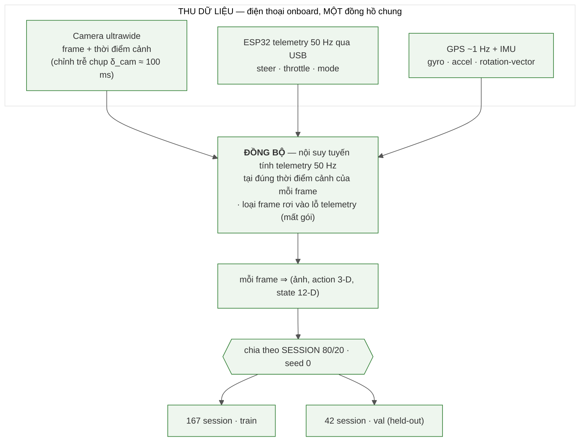
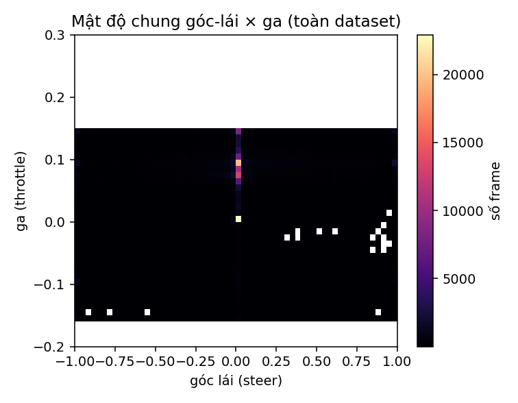
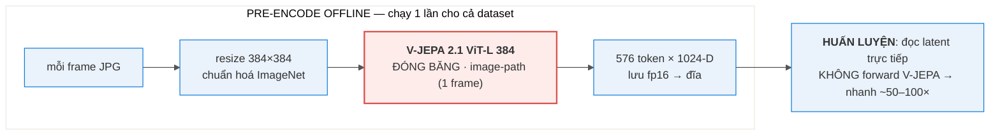
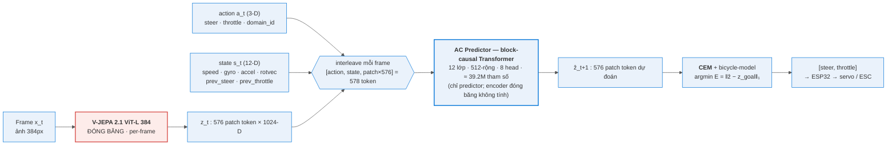
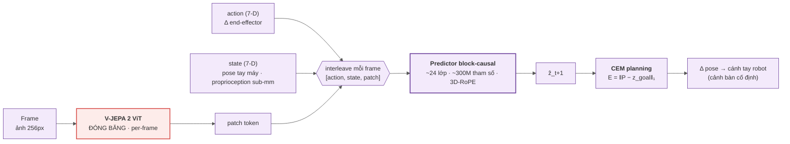

# BÁO CÁO — World Model Hành-động-điều-kiện dựa trên V-JEPA 2.1 cho Xe RC

**Đề tài.** Đóng băng encoder video nền-tảng **V-JEPA 2.1 (ViT-L, 384px)** làm biểu diễn thị giác,
huấn luyện một **AC Predictor** nhỏ học "hành động nào gây thay đổi hình ảnh nào" trong không gian
latent, rồi dùng **CEM planning** để **lái xe lặp lại một tuyến đã được dạy (teach & repeat)** bằng
cách bám ảnh-mục-tiêu.

> **Về số liệu trong báo cáo.** Mọi con số đều **đếm/đo trực tiếp bằng script trong repo** (xem
> §Phụ lục), không chép từ ghi chú cũ: tham số mô hình đếm từ checkpoint (§9.2); thống kê dữ liệu
> quét từ `data/raw_*` (§7); độ nhạy hành động + ablation đứng-yên đo bằng `scripts/probe_*` (§11, §13).
> Placeholder cần điền: `[Họ tên]`, `[MSSV]`, `[Lớp/Môn]`, `[GVHD]`.

---

## Mục lục
1. Tóm tắt & Đóng góp
2. Giới thiệu & Động lực
3. Phát biểu bài toán & Phạm vi
4. **Khái niệm & thước đo** *(định nghĩa thuật ngữ trước khi dùng)*
5. Nền tảng & Công trình liên quan
6. Hệ thống phần cứng & cách thu thập dữ liệu
7. Dữ liệu & Thống kê
8. Encoder V-JEPA 2.1 (đóng băng) + pipeline pre-encode
9. AC Predictor — kiến trúc (đóng góp chính)
10. Lập kế hoạch: CEM + động học xe
11. TẦNG 1 — Dynamics offline
12. TẦNG 2 — Planner open-loop chọn JOINT (lái + ga)
13. TẦNG 3 — Closed-loop ngoài trời (kết quả âm, phân tích cơ chế)
14. Đánh giá dữ liệu IMU & vì sao không dự đoán toàn bộ next-state
15. Hạn chế
16. Hướng phát triển
17. Kết luận
18. Phụ lục (tái lập, checkpoint, bản đồ file)

---

## 1. Tóm tắt & Đóng góp

**Tóm tắt.** Chúng tôi nghiên cứu việc dùng một **encoder video nền-tảng đóng băng (V-JEPA 2.1
ViT-L 384)** làm biểu diễn cho một **world model hành-động-điều-kiện** trên **xe RC di động**, rồi
dùng **CEM planning** để **lái lặp lại một tuyến đã dạy** (teach & repeat): khi dạy, người lái tay
đi hết tuyến và hệ thống lưu chuỗi ảnh-mốc; khi chạy lại, model so ảnh hiện tại với ảnh-mốc kế tiếp
và chọn lái/ga để tới đó. Encoder được giữ đóng băng hoàn toàn; chúng tôi chỉ huấn luyện một **AC
Predictor** nhỏ (**≈ 39.2 triệu tham số**, đếm trực tiếp từ checkpoint) học ánh xạ "action → đổi
latent". Báo cáo trình bày kết quả theo **ba tầng đánh giá**, mỗi tầng có thước đo và kết luận riêng:

- **Tầng 1 — Dynamics offline:** AC predictor đặt trên latent đóng băng **dự đoán tốt hơn baseline
  "đứng yên"** (rollout@1 / identity = **0.744** < 1, tức tốt hơn giả định "cảnh không đổi" — một
  điều kiện CẦN, xem §4 cho định nghĩa), có **độ nhạy hành động đo được ở cả hai trục** — lái
  (argmin-năng-lượng đúng hướng cua **95%**) và ga (model nhất quán "muốn tiến" **83%**) — và cho
  thấy **transfer chéo-domain-servo có lợi** (train trộn 2 servo → eval servo mới **0.65** so với
  **1.073** khi chỉ-train-servo-đó).
- **Tầng 2 — Planner open-loop, chọn JOINT cả lái lẫn ga:** trên video VAL held-out, với mỗi frame
  thật ta đặt goal là mốc ~0.9s phía trước rồi cho planner quét **lưới 2-D (lái × ga)** và chọn cả
  hai trục ở đáy năng lượng — **lái khớp dấu người 94.2%** ở khúc quẹo và **model tự chọn ga "muốn
  tiến" 92%** (median +0.075 ≈ người +0.090). Đây là bằng chứng planner chọn hành động giống chuyên
  gia **khi chưa chịu vật-lý-đóng-vòng** (open-loop) — bắc cầu giữa metric offline và "lái thật".
- **Tầng 3 — Closed-loop ngoài trời (kết quả âm):** khi đóng vòng thật, hệ thống **bám tuyến tốt ở
  nửa đầu route rồi "bung" ra lề**. Phân tích định lượng quy nguyên nhân về **khâu định-vị + chế-độ-
  điều-khiển**, **KHÔNG** về chất lượng biểu diễn: (A) **descriptor định-vị** (latent mean-pool +
  cosine) **không bất-biến** dưới đổi-sáng + đổi-heading giữa lúc dạy và lúc chạy → so-ảnh sập; (B)
  một **vùng-chết đứng-yên** (ga thấp → speed≈0 → động học `yaw ∝ steer·speed` ≈ 0 → landscape phẳng)
  mà chúng tôi đã **chẩn và vá** bằng sàn ga.

**Đóng góp.**
1. **Đánh giá đầu tiên họ V-JEPA 2 trên một robot di động (xe RC)** — Meta chỉ thử trên cánh tay
   robot (cảnh bàn cố định). Đây là chế độ khó hơn về robustness (heading / ánh sáng / lệch ngang).
2. **Pipeline offline đo độ nhạy hành động cả lái lẫn ga**, rollout-vs-identity, và **bằng chứng
   transfer chéo-domain-servo**, với **mọi số tái lập được bằng script** trong repo.
3. **Kiểm chứng planner OPEN-LOOP** tách "năng lực lập kế hoạch" khỏi "robustness đóng vòng" — CEM
   chọn hành động khớp chuyên gia ~94% (lái) khi không chịu vật-lý-đóng-vòng.
4. **Phân tích thất bại closed-loop có cơ chế, định lượng**: khoanh đúng nguyên nhân (descriptor
   định-vị + vùng-chết đứng-yên) thay vì gộp một nhãn mơ hồ.

---

## 2. Giới thiệu & Động lực

**Vấn đề.** Điều hướng bằng thị giác cho robot di động truyền thống dựa vào bản đồ hình học. Một
hướng thay thế gần đây là **học biểu diễn tự-giám-sát** rồi **lập kế hoạch trong không gian latent**:
thay vì xây bản đồ 3D, ta học một *world model* dự đoán "hành động nào gây ra thay đổi hình ảnh nào"
và tìm chuỗi hành động đưa quan sát hiện tại về quan sát-mục-tiêu.

**Vì sao V-JEPA 2.1.** V-JEPA học đặc trưng bằng **dự đoán trong không gian biểu diễn** (feature
prediction) thay vì tái tạo pixel — tránh lãng phí dung lượng mô hình vào chi tiết pixel không cần
thiết. Bản **2.1** (ViT-L distilled từ ViT-G, 384px) bổ sung **Dense Predictive Loss** → đặc trưng
patch chất lượng cao. Meta đã chứng minh **V-JEPA 2-AC** (action-conditioned) cho phép **planning**
trên cánh tay robot. Câu hỏi tự nhiên: *biểu diễn này có dùng được cho một robot DI ĐỘNG, ngoài
trời, với động lực học và domain-shift thật?*

**Đóng khung cho môn CV.** Bài toán bản chất là Computer Vision: (a) **biểu diễn thị giác** từ một
foundation model đóng băng; (b) **so khớp ảnh để định vị và lập kế hoạch điều khiển** trong latent;
(c) **độ bền của biểu diễn dưới domain-shift thật** (ánh sáng/giờ/góc nhìn) — chính là tâm điểm của
phần phân tích thất bại.

**Hạn chế tài nguyên & quyết định dừng thực địa.** Encoder ViT-L chạy trên GPU (RTX 5070 Ti), không
chạy trên điện thoại → inference phải qua PC. Sau vài ngày tinh chỉnh closed-loop ngoài thực địa mà
chẩn đoán cho thấy thất bại nằm ở **khâu định-vị + chế-độ-điều-khiển**, không phải ở tham số mô hình,
nhóm dừng thử nghiệm thực địa và chốt phần offline + kiểm chứng planner open-loop, trình bày
closed-loop như một kết quả âm được phân tích kỹ.

---

## 3. Phát biểu bài toán & Phạm vi

**Bài toán chính = TEACH & REPEAT (dạy-rồi-lặp).** Người lái tay đi hết một tuyến một lần (*teach*);
hệ thống lưu chuỗi ảnh-mốc dọc tuyến. Khi *repeat*, tại mỗi bước model so ảnh hiện tại với ảnh-mốc
kế tiếp và CEM chọn `[lái, ga]` để đưa cảnh hiện tại về cảnh-mốc đó; tới nơi thì chuyển sang mốc kế.

**Kiến trúc 2 tầng (tách bạch — quan trọng để quy trách nhiệm khi phân tích lỗi):**
- **Định vị (chỉ dùng thị giác + GPS):** trả lời "đang ở đâu trên tuyến" và "ảnh-mốc kế là cái nào".
- **Điều khiển (servo-specific):** AC predictor (V-JEPA frozen + predictor) + CEM. Trả lời "đạp
  ga / đánh lái bao nhiêu để tới mốc kế".

> Việc tách 2 tầng cho phép kết luận cuối cùng: **tầng biểu diễn + điều khiển hoạt động (Tầng 1+2);
> gap nằm ở tầng định-vị (descriptor nhạy ánh sáng/heading) + chế-độ-điều-khiển khi đóng vòng (Tầng 3).**

---

## 4. Khái niệm & thước đo

> Định nghĩa gọn các thuật ngữ dùng xuyên suốt, để phần kết quả đọc trôi.

- **Latent / patch token.** Encoder biến mỗi ảnh thành **576 token**, mỗi token một vector **1024
  chiều** mô tả một mảnh ảnh. Ta gọi tập 576×1024 này là *latent* của frame.
- **Horizon (tầm nhìn) `H`.** Số bước tương lai mà mô hình/planner xét tới. Báo cáo dùng `H=4` (≈
  0.9s, xem §12).
- **Rollout@k.** Cho model **dự đoán k bước latent liên tiếp** rồi đo sai số so với latent thật.
- **Baseline "đứng yên" (identity).** Phép so sánh ngây thơ: "đoán frame sau **y hệt** frame hiện
  tại" (giả định cảnh không đổi). **`rollout@k / identity`** = sai số của model chia cho sai số của
  identity. **< 1 = model dự đoán tốt hơn việc giả định cảnh đứng yên.** Đây chỉ là điều kiện **cần**
  (model có học được gì đó về tác động của hành động), chưa phải điều kiện đủ để lái được.
- **Năng lượng `E` của một chuỗi hành động.** Cho một chuỗi `[lái, ga]` ứng viên, ta **roll** nó qua
  AC predictor để ra latent dự đoán cuối `ẑ`, rồi tính **`E = ‖ẑ − z_goal‖₁`** (khoảng cách L1 trung
  bình trên toàn bộ 576×1024 chiều tới latent của ảnh-mục-tiêu). **E thấp = hành động đó đưa cảnh
  tới gần goal.**
- **argmin-E.** Hành động có `E` nhỏ nhất trong lưới quét = hành động model "chọn".
- **Contrast (độ sâu thung lũng).** **`contrast = (E_max − E_min) / E_min`** khi quét một trục hành
  động. Cao = đáy năng lượng **rõ** (model phân biệt được hành động tốt/xấu); ≈ 0 = **landscape
  phẳng** (model không có gì để bám → CEM mất phương hướng). Contrast đã khử thang tuyệt đối nên so
  được giữa các cảnh.
- **Sign-turn (đúng-dấu-cua).** Trên các frame người lái **đang quẹo** (|lái| > 0.15), tỉ lệ frame
  mà **dấu** góc lái model chọn trùng dấu góc lái người (cùng quẹo trái / phải).
- **Open-loop vs closed-loop.** *Open-loop:* video chạy theo người lái thật, model **chỉ đề xuất**
  hành động (không thực sự lái) → đo "năng lực lập kế hoạch". *Closed-loop:* model **thực sự lái xe**,
  hành động của nó quyết định frame kế → đo cả robustness vật-lý-đóng-vòng.

---

## 5. Nền tảng & Công trình liên quan

- **JEPA / V-JEPA / V-JEPA 2 / 2.1.** Học self-supervised bằng *feature prediction* trong không gian
  embedding (không reconstruct pixel). V-JEPA 2 mở rộng lên video quy mô lớn; 2.1 thêm Dense
  Predictive Loss (đặc trưng patch dày). (PDF gốc trong `docs/`.)
- **V-JEPA 2-AC.** Bản action-conditioned của Meta: interleave `[action, state, patch]` mỗi frame,
  một predictor block-causal, CEM planning với năng lượng `‖P − z_goal‖₁`. **Chỉ thử trên cánh tay
  robot** — cảnh bàn cố định. Đây là **kiến trúc tham khảo** mà AC Predictor của chúng tôi dựa vào
  (so sánh giống/khác/vì-sao ở §9.3).
- **ViNG (điều hướng bằng goal ảnh).** Ý tưởng "đi tới ảnh-mục-tiêu, học policy từ dữ liệu có hành vi
  đa dạng". Chúng tôi **lấy ý tưởng goal-image** cho teach & repeat; phần đồ-thị-ảnh (topological
  graph) chỉ là **thử nghiệm phụ** (§16), không phải đóng góp chính.

---

## 6. Hệ thống phần cứng & cách thu thập dữ liệu

> Mô tả phần cứng + cách thu thập **trước** kiến trúc model, để người đọc hiểu dữ liệu đến từ đâu.

### 6.1. Xe & bộ điều khiển
- **Khung xe:** xe RC địa hình; **ESP32-S3 WROOM (N16R8)** gắn trên xe điều khiển 2 cơ cấu:
  - **Servo lái** TowerPro MG946R (analog, GPIO5), dải PWM **1000–2000µs**, tâm 1560µs.
  - **ESC ga** Hobbywing QuicRun 8BL150 (150A brushless, GPIO6), dải 1000–2000µs, map tuyến tính
    `esc_us = 1000 + (ga+1)/2·1000`.
- **Nguồn:** pin → ESC; BEC 6V cấp servo (giữ ≤6V vì MG946R không phải loại HV).
- **Hai "domain" servo — vì sao có (lý do thực tế, không phải thiết kế).** Phần lớn dữ liệu cũ thu
  bằng servo **KDS**. Trong quá trình thu, **servo KDS hỏng và phải thay bằng TowerPro MG946R**. Hai
  servo có **ánh xạ lệnh→góc-lái khác nhau** (cùng một lệnh cho ra góc bánh khác nhau). Thay vì bỏ dữ
  liệu cũ, chúng tôi coi đây là **hai domain điều khiển** và gắn một cờ `domain_id` (0=KDS, 1=TowerPro)
  vào input predictor để model học chung mà vẫn phân biệt được hai ánh xạ. Việc thay servo *ngoài ý
  muốn* này về sau cho một thí nghiệm transfer có giá trị (§11.3).

### 6.2. Bước ngoặt: từ link video không dây sang điện thoại onboard
- **Rig ban đầu (đã bỏ cho thu data):** camera RunCam (OpenIPC, IMX415) truyền H.265 qua **WFB-NG
  (5.8GHz)** về PC. **Thất bại ở tầm xa** (~50m: vỡ ảnh, trễ phình 92→310ms khi mất gói).
- **Rig hiện tại (pivot):** **đặt điện thoại Android lên xe** (Samsung A42 5G) làm camera + máy ghi.
  Camera **ultrawide** chụp frame cục bộ; điện thoại đọc telemetry ESP32 qua **USB**; lưu frame +
  action + telemetry + GPS + IMU. **Frame và telemetry chung MỘT đồng hồ điện thoại** → các vấn đề
  trễ-WFB / đồng-bộ-clock biến mất. Còn lại một **độ trễ chụp camera δ_cam ≈ 100ms** (đo trên A42,
  ổn định 98–103ms) được ghi mỗi frame và hiệu chỉnh khi đồng bộ.

### 6.3. Luồng hình thành dữ liệu train/val
Hình dưới mô tả toàn bộ luồng từ lúc thu tới lúc thành tập train/val (mô tả luồng, không phải tên
file). Điểm cốt lõi: vì **frame, telemetry, GPS, IMU dùng chung một đồng hồ**, ta có thể ghép chính
xác mỗi frame với hành động *đúng tại thời điểm cảnh đó*.


**Mã mermaid (Hình 1):**


*Hình 1 — Luồng dữ liệu: thu (1 đồng hồ chung) → đồng bộ (nội suy telemetry 50Hz tại thời điểm cảnh,
hiệu chỉnh δ_cam, loại frame mất gói) → mỗi frame thành (ảnh, action 3-D, state 12-D) → chia theo
session 80/20 → 167 train / 42 val.*

1. **Thu.** Người lái tay bằng **FlySky i-BUS**; máy ghi thụ động lưu: frame ảnh kèm *thời điểm cảnh*
   (đã trừ δ_cam), luồng telemetry 50Hz (lái/ga/mode), GPS ~1Hz, IMU (gyro/accel/rotation-vector).
2. **Đồng bộ.** Với mỗi frame, **nội suy tuyến tính** luồng telemetry 50Hz tại đúng thời điểm cảnh để
   lấy `[lái, ga]` *đang thực sự áp lên xe lúc khung hình đó được chụp*. Frame nào rơi vào **lỗ
   telemetry** (mất gói khi tín hiệu yếu) bị **loại** thay vì ghép với hành động cũ.
3. **Ghép.** Mỗi frame ⇒ một mẫu `(ảnh, action 3-D [lái, ga, domain_id], state 12-D)`. **State 12-D**
   = `[speed, gx,gy,gz, ax,ay,az, rx,ry,rz, prev_steer, prev_throttle]` = GPS speed + gyro + accel +
   rotation-vector + **hành-động-bước-trước** (loại lat/lon/bearing tuyệt đối để tránh overfit địa
   điểm — đánh giá chi tiết IMU ở §14).
4. **Chia.** Chia **theo SESSION** (không theo frame, để val không "rò rỉ" frame kề từ train) tỉ lệ
   80/20 với seed cố định → **167 session train / 42 session val**. Mọi đánh giá đọc lại split này.
- **GPS:** điện thoại A42 trả **~1.04Hz** (dù xin 5Hz); nhiễu vị trí **trung vị 0.44m / p90 1.0m**.
  → GPS chỉ đủ làm **cổng pop ảnh-mốc**, KHÔNG đủ giữ làn theo mét.

---

## 7. Dữ liệu & Thống kê

> Toàn bộ số trong mục này **quét lại trực tiếp** từ `data/raw_kds` + `data/raw_towerpro` (xem §Phụ lục).

### 7.1. Tổng quan
| Tập | #session | #frame | Thời lượng | FPS lưu (tb) |
|---|---:|---:|---:|---:|
| **KDS** (servo cũ) | 28 | 53,076 | **1.73 h** | 8.53 |
| **TowerPro** (servo mới) | 181 | 175,435 | **5.71 h** | 8.51 |
| **TỔNG** | **209** | **228,511** | **7.43 giờ** | 8.51 |

- **FPS thực ~8.5** (đặt save_hz=10, hụt nhẹ do tải ghi ảnh) — nhất quán giữa 2 domain.
- **Split:** session-level 80/20, seed 0 → **train 167 / val 42**.

### 7.2. Phân bố hành động & chuyển động (đo trên 228,511 frame)
| Đại lượng | Giá trị | Ý nghĩa |
|---|---|---|
| Trung vị throttle | **0.084** | ga thật, KHÔNG ~0 (xe chạy chậm, ga nhỏ nhưng có) |
| Tỉ lệ "đi gần-thẳng" (\|steer\|<0.15) | **63%** | phần lớn thời gian đi thẳng |
| Tổng số sự kiện quẹo | **13,871** | đủ mẫu cua để học/đánh giá độ nhạy lái |
| Trung vị tốc độ GPS | **1.05 m/s** (p90 2.91) | xe đi bộ-tốc-độ |
| Tỉ lệ frame đứng-yên (speed<0.06) | **11.3%** | regime đứng-yên đáng kể → liên quan §13 |

### 7.3. Dữ liệu CÓ hành vi điều-chỉnh (corrective driving)
Dữ liệu là **lái tay tự do** trong công viên, không phải lái-một-đường-thẳng. Với **13,871 sự kiện
quẹo** và góc lái dao động hai phía liên tục (Hình 2), người lái **liên tục điều chỉnh** trái/phải.
Điều này quan trọng cho phần phân tích closed-loop (§13): **tập huấn luyện không hề thiếu hành vi
sửa-lệch** — cái thiếu khi *deploy* là một thứ khác (xem §13).


*Hình 2 — Một session điển hình: góc lái (tím) dao động hai phía liên tục + ga (cam) — bằng chứng dữ
liệu chứa hành vi điều chỉnh/sửa lệch, không phải lái-thẳng-một-mạch.*

### 7.4. Khác biệt 2 domain & vì sao thu thêm TowerPro
- **KDS:** steering đủ dải −1..1 nhưng **throttle gần như hằng (~7.5%)** → gần "steering-only".
- Vì vậy mẻ **TowerPro** được thu với **throttle biến thiên** (có cả lùi nhẹ), cho model tín hiệu học
  trục ga (xác nhận ở §11.4: model đọc được trục ga). Hình 3, 4, 5 là phân bố steering / throttle /
  tốc độ; Hình 6 là độ dài 209 session; Hình 7 là phủ thời gian thu; Hình 8 là mật độ chung lái×ga.


*Hình 3 — Throttle: KDS ~hằng (đỉnh nhọn ~0.075) vs TowerPro biến thiên (trải rộng, có lùi nhẹ).*

| | | |
|---|---|---|
|  |  |  |
| *Hình 4 — phân bố góc lái* | *Hình 5 — phân bố tốc độ GPS* | *Hình 8 — mật độ lái×ga* |

| | |
|---|---|
|  |  |
| *Hình 6 — độ dài 209 session* | *Hình 7 — phủ thời gian thu (giờ)* |

---

## 8. Encoder V-JEPA 2.1 (đóng băng) + pipeline pre-encode

- **Encoder:** V-JEPA 2.1 **ViT-L 384** (distilled từ ViT-G), **đóng băng tuyệt đối** (không bao giờ
  backprop).
- **Encode TỪNG frame** (image-path) → **patch tokens**: 384px → **576 token**, mỗi token **1024-D**.
  KHÔNG pool khi train predictor (giữ 576 token để còn thông tin không gian), KHÔNG nhồi nhiều frame.
- **Tối ưu then chốt — pre-encode offline:** ta chạy V-JEPA **một lần** trên toàn bộ dataset, lưu
  latent (fp16) ra đĩa; khi huấn luyện predictor chỉ **đọc latent**, **không** forward V-JEPA →
  nhanh hơn **~50–100×**. Đây là điều khiến việc huấn luyện một predictor nhỏ trên 228k frame khả thi
  trên một GPU.


**Mã mermaid (Hình 9):**


*Hình 9 — Pipeline encoder: mỗi frame → resize 384 + chuẩn hoá → V-JEPA ViT-L 384 đóng băng (per-frame)
→ 576×1024 token lưu fp16 → huấn luyện đọc latent trực tiếp (nhanh ~50–100×).*

> **Vì sao 384px (không phải 256).** 384 là độ phân giải gốc của checkpoint ViT-L distilled (cooldown
> ở 384) → chọn cho **chất lượng**. 256 của V-JEPA 2-AC là lựa chọn **compute** ("for simplicity"),
> không phải vì 256 đẹp hơn. Chúng tôi iterate ở 256 (rẻ) rồi **chốt model cuối ở 384**.

---

## 9. AC Predictor — kiến trúc (đóng góp chính)

### 9.1. Sơ đồ & cơ chế
Mỗi frame được xếp thành một nhóm token `[action_t (3-D), state_t (12-D), patch_t (576)]` (= 578
token). Một **mask block-causal** cho token ở frame t nhìn được mọi token ở frame ≤ t. Đầu ra ở
vị-trí-patch của frame t dự đoán **patch map của frame t+1**.


**Mã mermaid (Hình 10):**


*Hình 10 — Kiến trúc của chúng tôi: frame → V-JEPA frozen → 576×1024 → interleave [action, state,
patch] → AC predictor block-causal (12 lớp) → ẑ_{t+1} → CEM → ESP32.*

### 9.2. Quy mô — **≈ 39.2M tham số** (đếm trực tiếp từ checkpoint)
Cấu hình triển khai (`cd4`): `pred_dim = 512`, `depth = 12`, `n_heads = 8`, `num_tokens = 576`,
`action_dim = 3`, `state_dim = 12`. **Đếm trực tiếp từ checkpoint `best.pt` = 39,192,576 ≈ 39.2M
tham số huấn luyện** (chỉ predictor — encoder V-JEPA đóng băng KHÔNG tính). Trong đó **12 lớp
Transformer chiếm ~96%** (mỗi lớp ~3.15M). Chúng tôi cố ý giữ predictor **nhỏ hơn nhiều** so với
~300M của Meta vì dataset chỉ ~228k frame và 576 token/frame đã rất nặng → predictor quá lớn dễ
overfit.

> Con số 39.2M tái lập bằng 1 dòng (xem §Phụ lục). *(Một bản nháp trước từng ghi "26M" do chưa đếm —
> con số đúng đã đếm lại là 39.2M.)*

### 9.3. Kiến trúc tham khảo từ V-JEPA 2-AC — giống / khác / vì sao
Chúng tôi **dựa trên** kiến trúc V-JEPA 2-AC của Meta nhưng điều chỉnh cho xe. Hình 10 (của chúng
tôi) và Hình 11 (Meta) đặt cạnh nhau để so sánh.


**Mã mermaid (Hình 11):**


*Hình 11 — Kiến trúc tham khảo Meta V-JEPA 2-AC (cánh tay robot): state = pose 7-D (proprioception
sub-mm), action = Δ end-effector 7-D, 3D-RoPE, predictor ~300M.*

| Khía cạnh | Meta V-JEPA 2-AC | Của chúng tôi | Giống/Khác — **vì sao** |
|---|---|---|---|
| Encoder | V-JEPA frozen | V-JEPA 2.1 ViT-L 384 frozen | **GIỐNG** — triết lý "đóng băng encoder nền-tảng" |
| Token mỗi frame | patch tokens | 576 patch × 1024 | **GIỐNG** — giữ patch map (không pool) cho không gian |
| Interleave | `[action,state,patch]` | `[action,state,patch]` | **GIỐNG** — cấu trúc token cốt lõi |
| Attention | block-causal | block-causal | **GIỐNG** — frame t nhìn ≤ t |
| State | pose tay máy **7-D** | IMU 10-D + prev-action = **12-D** | **KHÁC** — xe không có proprioception sub-mm; dùng IMU+speed; prev-action cho model biết "đang giữ lệnh gì"; bỏ vị trí tuyệt đối tránh overfit địa điểm |
| Action | Δ end-effector **7-D** | `[steer, throttle, domain_id]` **3-D** | **KHÁC** — xe chỉ 2 trục điều khiển; thêm `domain_id` để học chung 2 servo |
| Pos-embedding | 3D-RoPE | học được (temporal + token-type) | **KHÁC** — clip nhỏ cố định thì pos-emb học được là đủ |
| Quy mô | ~24 lớp / ~300M | **12 lớp / 39.2M** | **KHÁC** — data ít → predictor to dễ overfit + 576 token rất nặng |
| Động học cho CEM | `compute_new_pose` tay máy | **bicycle-model** fit từ data xe | **KHÁC** — động học xe khác hẳn tay máy (§10) |

### 9.4. Vì sao **không** dự đoán toàn bộ next-state 12-D
Predictor hiện tại là **visual-latent predictor** — dự đoán **patch map** frame kế, KHÔNG có head
riêng cho 12-D state. Có chủ ý, vì: (1) thiết kế là visual-latent predictor; (2) **dự đoán full IMU
state rất khó** — accel/gyro/rotvec rất nhiễu (§14), data ít dễ học sai; (3) **planning chỉ cần
speed + yaw**, đã được bicycle-model (§10) lo; (4) **cố đoán full state rồi feed lại → sai số nổ
nhanh hơn** khi rollout nhiều bước. Triết lý: *"dự đoán ít nhưng phần nào còn tin được"*.

---

## 10. Lập kế hoạch: CEM + động học xe

- **CEM (Cross-Entropy Method):** lấy mẫu N chuỗi action ~ N(μ, σ) trên horizon H=4, roll mỗi chuỗi
  qua predictor, chấm năng lượng `E = ‖ẑ_cuối − z_goal‖₁`, giữ K elite có E thấp nhất, refit (μ, σ)
  rồi lặp; áp **action đầu** (receding-horizon). Mỗi vòng chèn thêm 5 ứng viên steer cố định trải đều
  `[-1,…,+1]` để elite bắt được đáy toàn cục.
- **CarDynamics (bicycle-model):** tích phân `[x, y, heading, speed]` từ `[steer, throttle]`; hệ số
  fit từ data thật: `k_thr=1.588, k_drag=0.078, k_yaw=0.088`. **Một điểm vật-lý quan trọng:**
  `yaw_rate = k_yaw · steer · speed` → **speed = 0 ⇒ lái không sinh yaw** (gốc của hiện tượng §13.B).
- **Trễ CEM (bench GPU thật):** 32 mẫu/1 vòng ≈ **0.5s**; 256/2 ≈ 5.5s. Search dày làm xe đi "mù" lâu
  → chốt 32/1 (≈ 64/2 về chất lượng).

---

## 11. TẦNG 1 — World-model dynamics offline

> **Câu hỏi tầng này:** predictor có học được "action → đổi latent" thật không (cả lái lẫn ga), độc
> lập hoàn toàn với chuyện đóng vòng / ánh sáng / GPS?

### 11.1. Hai thước đo (vì sao không tin val loss đơn lẻ)
- **`rollout@k / identity`**: < 1 = dự đoán tốt hơn baseline "đứng yên". Dùng tỉ số (không phải val
  loss đơn lẻ) vì val loss bị lừa bởi latent collapse (model bỏ qua action vẫn cho val thấp).
- **Action-sensitivity (energy-probe):** quét `E` quanh một trục action, xem **argmin-E có đúng
  hướng** và **contrast** sâu cỡ nào. Đây là cái sát nhất với thứ CEM thực sự dùng.

### 11.2. Dự đoán tốt hơn baseline "đứng yên" (Bảng A)
| Model | @1 | @2 | @3 |
|---|---|---|---|
| **cd4 (ckpt deploy)** | **0.744** | **0.703** | **0.697** |

→ Thắng identity ở mọi horizon. **Diễn giải đúng mức:** điều này **chỉ xác nhận** predictor học được
*một phần* động học có-điều-kiện-hành-động (dự đoán tốt hơn giả định "cảnh đứng yên") — một điều kiện
**cần, chưa đủ**. Nó **không** tự nó chứng minh "lái được". Bằng chứng mạnh hơn nằm ở §11.3–11.4
(transfer + độ nhạy hành động) và §12 (planner open-loop).

### 11.3. Transfer chéo-domain-servo
- Train **chỉ TowerPro** → eval TowerPro held-out = **1.073** (THUA cả baseline đứng-yên!).
- Train **trộn KDS + TowerPro** → eval TowerPro held-out = **0.65**.
→ Dữ liệu của servo-khác **giúp** học động học chung; `domain_id` cho phép trộn mà không lẫn lộn ánh
xạ lệnh→góc. (Đây là "quả ngọt ngoài ý muốn" của việc phải thay servo KDS hỏng — §6.1.)


*Hình 12 — (A) Train trộn 2 servo thắng baseline trên servo mới (0.65), trong khi chỉ-train-servo-mới
lại thua (1.073). (B) Val của model trộn giảm đều 0.79 → 0.60 (học động học chung, không overfit servo).*

### 11.4. Action-sensitivity — đo RIÊNG từng trục trước (cô lập tín hiệu)
**Chiến lược đo: riêng trước, joint sau.** Ở Tầng 1 ta đo **từng trục riêng** (giữ trục kia = teacher)
để **cô lập** xem mỗi trục có tín hiệu không; ở Tầng 2 (§12) ta đo **joint** cả hai trục cùng lúc
(sát closed-loop). Tách như vậy giúp quy trách nhiệm rõ ràng: nếu joint hỏng mà riêng-lẻ tốt thì lỗi
ở tương tác hai trục, v.v.

Đo trên **300 window VAL người-lái-đang-quẹo**, d=4, checkpoint cd4 (`scripts/probe_energy.py`):

| Đo riêng từng trục | Lái (quét steer, ga=teacher) | Ga (quét throttle, lái=teacher) |
|---|---|---|
| argmin-E **đúng dấu** (sign-turn) | **285/300 = 95%** | **83% muốn TIẾN (>0)** |
| **contrast** (median, trên frame quẹo) | **0.33** | **0.27** |
| model "muốn" | — | ga median **+0.11** (≈ data 0.084) |

*(Lưu ý: 0.33 là contrast trên **frame quẹo**; nếu tính trên **toàn bộ** frame, contrast median ≈
0.41 — cao hơn vì frame đi thẳng cũng có đáy rõ ở lái ≈ 0.)*

→ Model **KHÔNG "đánh lái yếu" offline** — đáy energy rõ và đúng phía, ở **cả hai trục**. Hình 13 minh
hoạ trực quan trên một session VAL.


*Hình 13 — Energy landscape lái (session VAL `162959`, goal ~0.9s phía trước, ga = teacher). (A) vài
đường E(steer) chuẩn hoá — đáy (●=argmin) nằm đúng phía người lái (đỏ=cua trái, xanh=cua phải). (B)
argmin-E (model) vs góc người trên 374 frame quẹo — đúng dấu 95.2%. (C) toàn session: "sườn sáng"
(góc model thích, đậm khi quẹo) bám sát đường người lái (xanh lá).*

---

## 12. TẦNG 2 — Planner OPEN-LOOP chọn JOINT (lái + ga) khớp người lái

> **Câu hỏi tầng này:** khi *thật sự cho planner lập kế hoạch* trên video thật (chưa đóng vòng), nó
> có chọn hành động **giống chuyên gia** không — và chọn được **CẢ ga** chứ không chỉ lái?

### 12.1. Thiết kế & thuật toán (OPEN-LOOP, JOINT 2 trục)
Lấy session VAL held-out. Với **mỗi frame thật** t:
1. **Goal** = patch map d=4 bước (~0.9s) phía trước **cùng session**. *Vì sao d=4 (~0.9s)?* `lead =
   d × stride × dt_frame = 4 × 2 × 0.11 ≈ 0.9s`. Chọn d=4 vì: **đủ xa** để hành động lái tạo khác
   biệt cảnh đo được (d=1 quá gần, cảnh gần như không đổi → landscape phẳng); **đủ gần** để cảnh hiện
   tại còn overlap với goal (d lớn → contrast tụt, đo được ở §11: d2 0.44 → d8 0.27).
2. **Quét lưới JOINT 2-D** = 15 điểm lái `∈[−1,1]` × 9 điểm ga `∈[−0.1, 0.25]` = **135 tổ hợp**.
3. Mỗi tổ hợp `(lái, ga)` được **roll qua AC predictor** (d bước, dùng bicycle-model cho state) →
   latent dự đoán cuối → năng lượng `E(lái, ga) = ‖ẑ − z_goal‖₁`.
4. Hành động model = **argmin trên cả lưới 2-D** → chọn **lái VÀ ga cùng lúc**.
5. So với `(lái, ga)` người lái thật ở chính frame đó; **sign-turn** = sign(model_steer) ==
   sign(human_steer) trên frame |human_steer| > 0.15.

```
cho mỗi frame thật t trong session VAL:
    z_t   ← latent frame t        (đã pre-encode)
    z_goal ← latent frame t+d     (mốc ~0.9s phía trước)
    s_t   ← state 12-D tại t
    for (lái, ga) trong lưới 15×9:          # 135 tổ hợp
        roll d bước qua AC predictor (state theo bicycle-model) → ẑ
        E[lái, ga] ← mean L1(ẑ, z_goal)
    (lái*, ga*) ← argmin E                  # model chọn CẢ 2 trục
    ghi nhận: sign(lái*) == sign(lái_người)?  ;  ga* > 0?
```

**Vì sao gọi là OPEN-LOOP:** video **chạy theo người lái thật** — model **chỉ ĐỀ XUẤT**, không thực
sự lái (frame kế đã bị người lái đóng đinh). **⚠ KHÔNG chứng minh "xe tự lái".**

### 12.2. Kết quả (3 session VAL best, gộp 893 frame quẹo)
| Đo | Giá trị |
|---|---|
| **Sign-turn** lái (đúng dấu người, \|steer\|>0.15) | **841/893 = 94.2%** (per-session 92.6 / 94.5 / 95.2%) |
| **Ga: model muốn TIẾN (>0)** | **91.9%** |
| **Ga model median / người median** | **+0.075 / +0.090** |
| Contrast joint (lưới 2-D) median | **0.52** |

→ **Hai kết luận:** (a) khi tối ưu **joint cả 2 trục**, lái vẫn **đúng chiều người 94.2%** (≈ probe
1-D 95% ở §11.4 — thêm trục ga KHÔNG làm hỏng lái); (b) **model TỰ chọn ga hợp lý** — 92% muốn tiến,
mức median +0.075 sát người +0.090 → **không cần giữ ga = teacher**. **Năng lực lập kế hoạch (cả lái
lẫn ga) là LÀNH** khi chưa chịu vật-lý-đóng-vòng; cái gãy ở Tầng 3 KHÔNG phải "planner dốt".

> Demo trực quan: một web player phát lại landscape 2-D lái×ga của từng frame (● người vs ✕ model),
> xuất được MP4 cho slide.

---

## 13. TẦNG 3 — Closed-loop ngoài trời (kết quả âm) — phân tích cơ chế

> Khi đóng vòng thật, **bám tuyến tốt ở nửa đầu route rồi bung ra lề**. Chỉnh tham số chỉ **dời điểm
> bung, không xoá** → giới hạn ở model/data/descriptor, không phải tham số. (~10 run, 1 môi trường,
> 0 run về đích → kết quả **định tính + cơ chế**.) Phân tích quy về **hai nguyên nhân thuộc khâu
> định-vị + điều khiển**, KHÔNG về chất lượng biểu diễn.

### 13.1. Triển khai & kết quả thô (Bảng D)
**Luồng.** *Teach:* lái tay, chụp chuỗi ảnh-mốc + GPS dọc tuyến (~15m). *Repeat:* phone stream (frame
+ GPS + rotvec) qua TCP → **PC: V-JEPA 2.1 ViT-L → AC predictor cd4 → CEM** → 2-byte action → ESP32.

| Run | tick | bám tốt tới | bung tại | kết cục |
|---|---|---|---|---|
| 163607 | 1.13s | mốc 18 (lệch <0.5m) | mốc 21 (cos 0.07) | bung trái +3.2m |
| 171912 | 1.78s | mốc 6 | mốc 7 (cos 0.02) | veer trái → bụi cỏ |

### 13.2. Nguyên nhân A — descriptor ĐỊNH-VỊ không bất-biến (KHÔNG phải "V-JEPA hỏng")
**Phân biệt rõ hai thứ — đây là điểm dễ nhầm.** Hệ dùng V-JEPA cho **hai khâu khác nhau**:
- **Khâu điều khiển (CEM)** chấm năng lượng bằng **L1 trên 576 patch token** (`‖P − z_goal‖₁`). Khâu
  này **lighting-robust** (đo: nắng→mây thay đổi <5%).
- **Khâu định-vị / pop ảnh-mốc** chấm độ giống bằng **cosine trên latent MEAN-POOL** (gộp 576 token
  → 1 vector 1024-D). **Chính khâu này sập**, không phải khâu điều khiển.

**Triệu chứng.** Tới một ảnh-mốc mà ảnh live (heading/ánh-sáng/vị-trí lúc chạy khác lúc dạy) không
khớp ảnh dạy → cosine giữa latent-pooled live và mốc **tụt < 0.1 rồi âm** → goal không phân-biệt-được
→ energy CEM phẳng theo lái → lái loạn.

**Đào tới gốc (định lượng).** Probe `scripts/probe_seqslam_lighting.py` (thuần CPU, dùng latent đã
encode; tự tìm cặp session **chồng-không-gian, khác buổi** Δt≈53h trên TowerPro). Thước đo
**assumption-free**: *ảnh-dạy ĐÚNG-HÌNH-HỌC (gần nhất theo GPS < 1.5m) đứng HẠNG MẤY theo cosine?*
- Sáng **gần** (Δbright ~11/255): ảnh-dạy đúng ở **hạng 0**, top-1 **79%** → descriptor **TỐT**.
- Sáng **xa** (Δbright ~18/255): ảnh-dạy đúng rơi **hạng trung vị 41–62 / ~600**, top-1 **0–3%** →
  **tín hiệu per-frame SAI**, ảnh đúng bị chôn sâu.

**Quan trọng — đây KHÔNG phải "biểu diễn V-JEPA kém".**
- **Embedding teach không degenerate** (đo riêng: các ảnh-mốc phân-biệt-được với nhau bình thường).
- **Khâu điều khiển dùng patch-L1 vẫn bền.** Sự cố nằm ở **lựa chọn descriptor cho khâu định-vị**
  (mean-pool + cosine) — phép gộp toàn-cục + cosine **nhạy với đổi-sáng toàn-cục + đổi-heading/góc-nhìn**
  (probe chọn ảnh-đúng theo GPS nên **không khớp heading** — heading khác cũng làm tụt hạng).
- Đã thử **sequence-matching (SeqSLAM)** và **multi-reference đa-sáng (kể cả GPS-gated)** — **đều
  không cứu** vì ảnh đúng chôn ở hạng 41, không "trick temporal/bank" nào kéo nổi về top.

> **➡️ Kết luận A:** đây là **giới hạn của DESCRIPTOR định-vị** (pooled-latent + cosine) dưới
> đổi-sáng + đổi-heading, **không phải giới hạn của biểu diễn V-JEPA hay của khâu điều khiển**. **Fix
> nguyên-lý = học một descriptor bất-biến-sáng** (head nhỏ trên frozen V-JEPA, train cross-session —
> §16). **Fix kịp deadline = dạy lại CÙNG BUỔI** (descriptor rất tốt khi sáng-gần).

### 13.3. Nguyên nhân B — vùng-chết đứng-yên (cơ chế động học, ĐÃ chẩn & vá)
**Hiện tượng.** Có lúc ở bãi, landscape `E(steer)` phẳng (contrast ~0.02–0.11) → CEM ra full-lock.

**Cơ chế (đo, không đoán).** Động học xe có `yaw_rate = k_yaw · steer · speed` (§10) → khi xe đứng
(speed ≈ 0) thì **lái không sinh yaw**, nên predictor đúng khi cho "đứng thì cảnh không quay" → quét
steer cho ra cảnh gần như không đổi → **landscape phẳng**. Đây là hiệu ứng **đứng-yên**, không liên
quan tới cảnh-lạ.

**Bằng chứng định lượng (ablation tái lập — `scripts/probe_speed_confound.py`).** Trên cùng các
window quẹo VAL, **chỉ đổi một biến**: ép kênh `speed` của state về 0 (cảnh & goal y nguyên), rồi đo
lại contrast của `E(steer)`:

| Điều kiện (CÙNG cảnh & goal, chỉ đổi chuyển-động) | contrast E(steer) median |
|---|---:|
| **Xe đang chạy** (speed thật ~1.26 m/s, ga = teacher) | **0.335** |
| Đứng rồi tăng-tốc-lại (ép speed₀ = 0, ga = teacher) | 0.271 |
| **Đứng yên suốt** (speed ≡ 0, ga ở vùng-chết ≈ 0) | **0.088** |

→ Cùng một cảnh, khi xe **đứng yên suốt** landscape lái xẹp **×3.8** (0.335 → 0.088), tiệm cận "phẳng".
(Mức trung gian 0.271 cho thấy chỉ giảm speed ban đầu là **chưa đủ** — speed tự dựng lại; phải xe đứng
yên *suốt* mới phẳng → đúng vì sao cách vá là một **sàn ga**, không phải một cú nhích.)

→ Cùng một cảnh, **chỉ vì xe "đứng yên"** mà landscape lái xẹp hẳn. Cộng với đo **live tại chính
park**: ga ≥ 0.07 → contrast 0.2–0.57; ga < 0.06 → phẳng 0.01–0.02.

**Gốc = deadlock đứng-yên:** hộp ga CEM `[0, 0.10]` chứa vùng chết `[0, 0.06)` → xe đứng → speed=0 →
phẳng → ra rác → lại đứng. **Đã vá = SÀN GA `TMIN = 0.07`** → xe chạy, lái khoẻ trở lại (xác nhận
thật). Đây là một **lỗi triển khai (chế-độ-điều-khiển) đã chẩn ra và sửa**, không phải giới hạn biểu
diễn.

### 13.4. Vì sao khi đã văng thì không cứu được (liên hệ A)
Teach&repeat chỉ chụp ảnh-mốc **dọc một đường đi** (lúc dạy xe ở giữa tuyến). Khi xe **văng ra
khỏi hành lang đã dạy**, ảnh live rơi vào vùng *chưa từng được chụp làm mốc* → cosine tới mốc kế tụt
(đúng cơ chế A) → **không còn goal hợp lệ để bám về**. Lưu ý phân biệt: **tập huấn luyện AC predictor
KHÔNG thiếu hành vi sửa-lệch** (§7.3, 13,871 sự kiện quẹo) — cái thiếu là **một ảnh-mốc chỉ đường-về
khi đã off-route**, tức là hệ quả của cách *teach một-lượt-giữa-line* + sự sập của descriptor (A),
chứ không phải "dữ liệu lái thiếu recovery". (Một khắc phục mức-latent — token-shift augment — được
bàn ở §16 như hướng tương lai.)

### 13.5. So với Meta & ViNG
- **Meta (robot-arm):** cảnh bàn cố định, action đổi-cảnh lớn + tức thì, **không** heading/ánh-sáng/
  lệch-ngang. "Chính xác cm" = khớp **proprioception** tay máy (**khác hệ đo**), không phải "world
  model chính xác hơn".
- **Xe ngoài trời:** action → đổi-cảnh nhỏ + cosine-định-vị-dropout (sáng/heading) + đứng-yên →
  **khó hơn** về robustness.
- **ViNG chạy được** vì policy train trên data có hành vi đa dạng phủ cả lúc lệch — và quan trọng,
  nó **không** dựa vào cosine-pooled cho định-vị như khâu pop của chúng tôi.

---

## 14. Đánh giá dữ liệu IMU & vì sao không dự đoán toàn bộ next-state

State token dùng 10 kênh IMU (gyro gx/gy/gz, accel ax/ay/az, rotation-vector rx/ry/rz) + speed GPS.
Quan sát thực tế về **chất lượng các kênh này**:
- **Rất nhiễu & phụ thuộc lắp đặt.** Điện thoại gắn trên xe → accel/gyro lẫn **rung khung + xóc mặt
  đường + rung mount**; az lệch hằng số do trọng lực; ax/ay nhỏ và chìm trong nhiễu khi xe chạy.
- **GPS speed 1Hz** trong khi frame ~8.5Hz → speed phải **nội suy**, trễ và mượt-hoá.
- **rotation-vector** ổn cho **pitch/roll** (thái độ xe trên dốc/xóc) nhưng **yaw≈heading drift** +
  la-bàn kém ngoài trời (đã thấy lệch lớn khi thử lái-theo-heading-hình-học).
- **Hệ quả:** trong 12-D state, **các chiều thật sự đáng tin cho điều khiển là `speed` và `gz`
  (yaw-rate)**; phần accel/rotvec mang ít tín hiệu sạch, chủ yếu để model "ngửi" được đang xóc/nghiêng.

Đây củng cố lựa chọn **không** cho predictor dự đoán full state (§9.4) và là động lực thay IMU điện
thoại bằng cảm biến chuyên dụng **BNO055** (sensor-fusion phần cứng → orientation/gyro ổn định hơn
nhiều) ở hướng tương lai (§16).

---

## 15. Hạn chế

1. **Closed-loop:** ~10 run, **1 môi trường**, **0 run về đích**, không có success-rate metric chuẩn
   → kết quả closed-loop **định tính + cơ chế**, không phải thống kê quy mô.
2. **Descriptor định-vị nhạy ánh sáng/heading:** dạy ≠ chạy về giờ/nắng → chất-lượng-cosine sập; **fix
   nguyên-lý cần learned descriptor**, chưa làm kịp deadline.
3. **GPS 1Hz, nhiễu 0.44m** → cổng pop thô, không định vị mét.
4. **IMU điện thoại nhiễu** (§14) → state chỉ tin được speed + yaw-rate.
5. **Encoder không chạy trên thiết bị** (ViT-L cần GPU) → qua PC; trễ CEM cao (0.5–5.5s/tick).
6. **Margin offline khiêm tốn** (rollout@1 0.744; thắng identity chỉ là điều kiện cần) → thẳng thắn
   là **mức report/workshop**, không phải SOTA.

---

## 16. Hướng phát triển

1. **Thay IMU bằng cảm biến BNO055** (IMU 9-trục, sensor-fusion phần cứng) → state token sạch hơn
   nhiều (fix gốc §14).
2. **LEARNED lighting/heading-invariant descriptor cho khâu định-vị (fix gốc nguyên nhân A):** head
   nhỏ trên frozen V-JEPA, train cross-session — dataset 181 session ĐÃ có cặp cùng-chỗ-khác-buổi.
3. **Token-shift augment ("DAVE-2 cho latent"):** dịch ngang lưới patch token để giả lập camera lệch
   ngang rồi ghép nhãn "bẻ-về", trộn vào BC của policy. *Đo offline:* khuếch đại đáp ứng bẻ-về
   3.4–5.4× mà không hại goal-reaching. **Lưu ý hạn chế:** dịch token là proxy, **không có
   renderer** → chưa chứng minh transfer closed-loop → mặc định tắt, chỉ bật sau khi probe trên xe.
4. **3DGS sim:** dựng lại bãi từ data → test closed-loop trong nhà, kiểm soát heading/lighting.
5. **RTK GPS** (1–2cm): pop chính-xác-mét + ground-truth lateral-offset.
6. **Thử nghiệm phụ (không dùng trong hệ chính):** đồ-thị-ảnh topological — offline định vị được
   ~2m nhưng **khó kiểm soát khi chạy thật** (đường nối zigzag, ảnh dạy≠chạy, mốc xa nhau, GPS thô)
   → hệ chính chốt ở **teach & repeat tuyến tính**.

---

## 17. Kết luận

Frozen V-JEPA 2.1 cung cấp một **biểu diễn latent đủ tốt** để: (Tầng 1) một AC predictor **≈ 39.2M
tham số** dự đoán tốt hơn baseline identity ở mọi horizon, có độ nhạy hành động **cả lái lẫn ga**, và
**transfer chéo-domain-servo**; (Tầng 2) **planner chọn JOINT cả lái lẫn ga khớp người lái** (~94%
lái đúng chiều, ga tự chọn muốn-tiến 92%) trên video held-out (open-loop). Tuy nhiên, (Tầng 3) triển
khai closed-loop ngoài trời **bung** — và phân tích định lượng quy nguyên nhân về **khâu định-vị
(descriptor pooled-cosine không bất-biến sáng/heading)** và **chế-độ-điều-khiển (vùng-chết đứng-yên,
đã vá)**, **KHÔNG** về chất lượng biểu diễn. Đây là **đánh giá đầu tiên họ V-JEPA 2 trên robot di
động** và một **kết quả âm có cơ chế**: với cùng một biểu diễn mạnh, khoảng cách giữa "dự đoán latent
tốt + lập kế hoạch khớp chuyên gia offline" và "lái được closed-loop ngoài trời" nằm ở
**độ-bền-định-vị + chế-độ-điều-khiển**, không ở representation.

---

## 18. Phụ lục

### 18.1. Tái lập số liệu (data/ và checkpoints/ đều gitignored)
```bash
pip install -e .
# Thống kê dữ liệu + biểu đồ (§7)
PYTHONPATH=src python scripts/dataset_stats.py
# Đếm tham số (§9.2)
python -c "import torch;sd=torch.load('checkpoints/vjepa_ac_car_cd4/vjepa_ac_car/best.pt',weights_only=False)['model'];print(sum(v.numel() for v in sd.values()))"
# TẦNG 1: rollout-vs-identity + action-sensitivity (lái + ga)
PYTHONPATH=src python scripts/eval_ratio_ac.py --checkpoint checkpoints/vjepa_ac_car_cd4/vjepa_ac_car/best.pt
PYTHONPATH=src python scripts/probe_energy.py --turn-only -d 4 --n-windows 300 --with-throttle
# TẦNG 3.B: ablation đứng-yên (speed=0)
PYTHONPATH=src python scripts/probe_speed_confound.py -d 4 --n-windows 200
# TẦNG 3.A: descriptor định-vị cross-lighting
PYTHONPATH=src python scripts/probe_seqslam_lighting.py --auto-pairs 3
# TẦNG 2: planner open-loop JOINT (demo)
PYTHONPATH=src python scripts/demo_precompute.py <session> -d 4
# Biểu đồ energy landscape + transfer
PYTHONPATH=src python scripts/plot_energy_landscape.py
PYTHONPATH=src python scripts/plot_transfer.py
```

### 18.2. Checkpoint deploy
`checkpoints/vjepa_ac_car_cd4/vjepa_ac_car/best.pt` — V-JEPA 2.1 ViT-L 384, state **12-D**, predictor
**depth12 / pred_dim512 / 8 heads / 39.2M**, action 3-D (steer/throttle/domain), `auto_steps 2`,
`predict_residual false`. Split: 209 ss → **train 167 / val 42** (seed 0).

### 18.3. Số liệu đối chứng (đã verify trong phiên này)
- **Data:** 209 session, **228,511 frame**, **7.43 giờ** (KDS 1.73h / TowerPro 5.71h); throttle
  median 0.084; đứng yên 11.3%; 13,871 sự kiện quẹo; speed median 1.05 m/s. Split 167/42.
- **Tham số:** AC predictor **39,192,576 ≈ 39.2M**.
- **Tầng 1:** cd4 ratio@1/2/3 = 0.744/0.703/0.697; transfer mixed→TowerPro 0.65 vs TowerPro-only
  1.073; action-sens (300 turn-window VAL): lái sign-turn **285/300 = 95%**, contrast turn **0.33**;
  ga contrast **0.27**, muốn-tiến **83%** (median +0.11).
- **Tầng 2 (JOINT lái×ga, 3 ss VAL):** sign-turn lái **841/893 = 94.2%**; ga muốn-tiến **91.9%**, ga
  med +0.075 (người +0.090); contrast joint median **0.52**.
- **Tầng 3.A:** lighting probe hạng-0 (top1 79%) sáng-gần vs hạng 41–62 (top1 0–3%) sáng-xa.
- **Tầng 3.B:** ablation đứng-yên (`probe_speed_confound.py`, 200 turn-window VAL, cùng cảnh): contrast
  E(steer) **0.335 (xe chạy) → 0.088 (đứng yên suốt, ×3.8)**; fix = sàn ga TMIN=0.07.

### 18.4. Bản đồ file
| Khâu | File |
|---|---|
| Encoder | `src/jepa_wm/models/encoders/vjepa.py`, `scripts/encode_patch.py` |
| AC predictor | `src/jepa_wm/models/vjepa2_ac_car.py`, `src/jepa_wm/engine/train_ac_car.py` |
| Thống kê data | `scripts/dataset_stats.py` |
| Eval offline (Tầng 1) | `scripts/eval_ratio_ac.py`, `scripts/probe_energy.py`, `scripts/plot_transfer.py` |
| Demo open-loop (Tầng 2) | `scripts/demo_precompute.py`, `scripts/demo_web.py`, `scripts/plot_energy_landscape.py` |
| Planning | `src/jepa_wm/planning/cem.py`, `src/jepa_wm/planning/dynamics.py` |
| Closed-loop (Tầng 3) | `scripts/inference_loop.py`, `scripts/probe_seqslam_lighting.py`, `scripts/probe_speed_confound.py` |
| Sơ đồ (mermaid + PNG) | `docs/report/figures/src/*.mmd`, `docs/report/figures/fig_*.png` |
