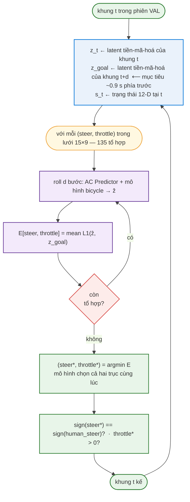
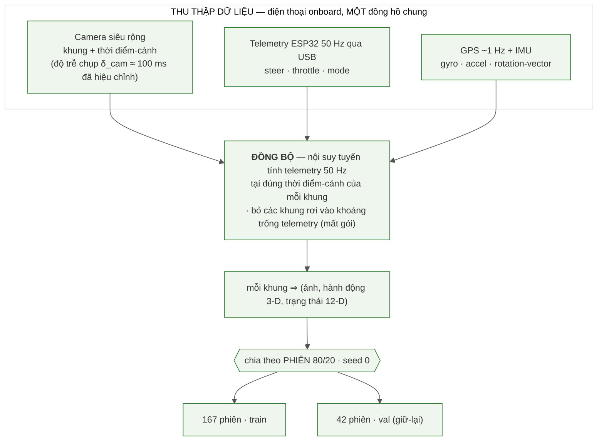
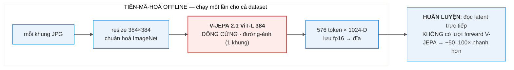
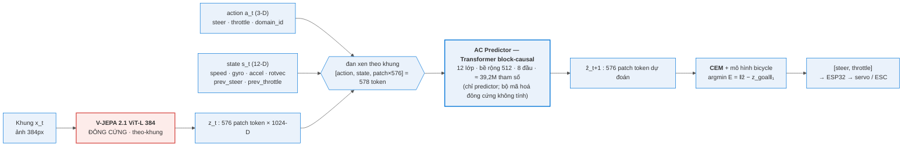
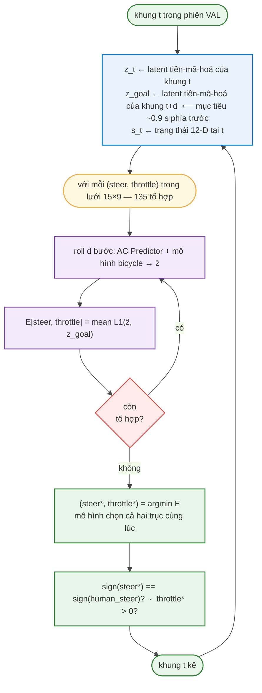
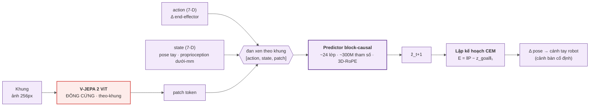

# Mô hình Thế giới có Điều kiện Hành động dựa trên V-JEPA 2.1 cho Điều hướng Xe RC

> **Bản dịch tiếng Việt** của `2_REPORT_FULL.md`. Mọi con số, đường dẫn file, tên hình và khối code/sơ đồ được giữ nguyên; chỉ dịch phần văn xuôi.

**Chủ đề.** Đóng băng (freeze) bộ mã hoá video nền tảng **V-JEPA 2.1 (ViT-L, 384px)** làm
biểu diễn thị giác, huấn luyện một **AC Predictor** (bộ dự đoán có điều kiện hành động) nhỏ học
"hành động nào gây ra thay đổi hình ảnh nào" trong không gian latent, rồi dùng **lập kế hoạch CEM**
để thực hiện **điều hướng theo ảnh mục tiêu (goal-conditioned image navigation)**: cho trước một ảnh
mục tiêu, ở mỗi bước bộ lập kế hoạch chọn một hành động `[steer, throttle]` (lái, ga) đưa cảnh quan
sát hiện tại tiến về phía cảnh mục tiêu. Đây **không phải** là bắt chước (imitation) một quỹ đạo cố
định; hành động được sinh ra từ mục tiêu thị giác, nên đổi mục tiêu thì hành vi cũng đổi.

*Tác giả / Mã số sinh viên / Môn học / Giảng viên hướng dẫn: sẽ điền sau.*

> **Về các con số trong báo cáo này.** Mọi đại lượng đều được **đo trực tiếp bằng một script trong
> repo** (xem Phụ lục): số tham số mô hình được đếm từ checkpoint (§9.2); thống kê dữ liệu được quét
> từ `data/raw_*` (§7); độ nhạy hành động được đo bằng `scripts/probe_energy.py` (§11); kết quả
> transfer được đọc từ `runs/lewm_overnight/…` (§11.3); độ chính xác Tier-2 đọc từ
> `data/demo/*/demo.json` (§12).

---

## Mục lục
1. [Tóm tắt & Đóng góp](#1-tóm-tắt--đóng-góp)
2. [Giới thiệu & Động lực](#2-giới-thiệu--động-lực)
3. [Phát biểu bài toán & Phạm vi](#3-phát-biểu-bài-toán--phạm-vi)
4. [Khái niệm & Thước đo](#4-khái-niệm--thước-đo)
5. [Bối cảnh & Công trình liên quan](#5-bối-cảnh--công-trình-liên-quan)
6. [Phần cứng & Thu thập dữ liệu](#6-phần-cứng--thu-thập-dữ-liệu)
7. [Dữ liệu & Thống kê](#7-dữ-liệu--thống-kê)
8. [Bộ mã hoá V-JEPA 2.1 đông cứng & Pipeline tiền-mã-hoá](#8-bộ-mã-hoá-v-jepa-21-đông-cứng--pipeline-tiền-mã-hoá)
9. [AC Predictor — Kiến trúc & Huấn luyện (đóng góp chính)](#9-ac-predictor--kiến-trúc--huấn-luyện-đóng-góp-chính)
10. [Lập kế hoạch: CEM + Động lực học xe](#10-lập-kế-hoạch-cem--động-lực-học-xe)
11. [TIER 1 — Động lực học offline](#11-tier-1--động-lực-học-offline)
12. [TIER 2 — Bộ lập kế hoạch open-loop chọn ĐỒNG THỜI (lái + ga)](#12-tier-2--bộ-lập-kế-hoạch-open-loop-chọn-đồng-thời-lái--ga)
13. [TIER 3 — Closed-loop ngoài trời (chưa tự lái được; phân tích cơ chế)](#13-tier-3--closed-loop-ngoài-trời-chưa-tự-lái-được-phân-tích-cơ-chế)
14. [Đánh giá dữ liệu IMU & Vì sao không dự đoán toàn bộ next-state](#14-đánh-giá-dữ-liệu-imu--vì-sao-không-dự-đoán-toàn-bộ-next-state)
15. [Hạn chế](#15-hạn-chế)
16. [Hướng phát triển](#16-hướng-phát-triển)
17. [Kết luận](#17-kết-luận)
18. [Phụ lục (tái lập, checkpoint, bản đồ file, nguồn hình)](#18-phụ-lục)
19. [Tài liệu tham khảo](#19-tài-liệu-tham-khảo)

---

## Danh sách Hình
- **Hình 1** — Kết quả tóm tắt: bảng điểm ba tầng (§1)
- **Hình 2** — Xe RC: khung gầm + ESP32 onboard + đấu dây (§6.1)
- **Hình 3** — Các khung hình onboard tiêu biểu theo thời điểm trong ngày & cả hai miền servo (§6.2)
- **Hình 4** — Pipeline dữ liệu: thu thập → đồng bộ → ghép cặp → chia tập (§6.3)
- **Hình 5** — Tổng quan dữ liệu theo miền servo (§7.1)
- **Hình 7** — Chuỗi thời gian lái của một phiên điển hình (lái hiệu chỉnh) (§7.3)
- **Hình 8** — Phân bố ga, hai miền (§7.4)
- **Hình 9** — Phân bố lái (§7.4)
- **Hình 10** — Phân bố tốc độ GPS (§7.4)
- **Hình 11** — Độ dài các phiên (209 phiên) (§7.4)
- **Hình 12** — Độ phủ thời điểm trong ngày (§7.4)
- **Hình 13** — Pipeline mã hoá: tiền-mã-hoá offline, huấn luyện đọc latent (§8)
- **Hình 14** — Kiến trúc của chúng tôi (tổng quan) (§9.1)
- **Hình 15** — Chi tiết bên trong AC Predictor (§9.1)
- **Hình 16** — Kiến trúc tham chiếu: Meta V-JEPA 2-AC (§9.3)
- **Hình 17** — Đường cong loss L1 trên tập validation (§9.6)
- **Hình 18** — Transfer chéo miền servo (§11.3)
- **Hình 20** — Lái của bộ lập kế hoạch so với lái của người (§11.4)
- **Hình 21** — Độ tương phản năng lượng theo tầm nhìn mục tiêu d, biện minh d = 4 (§12.1)
- **Hình 22** — Mặt năng lượng đồng thời E(steer, throttle) cho một khung VAL (§12.2)
- **Hình 23** — Sơ đồ khối triển khai closed-loop (§13.1)
- **Hình 24** — Tuyến đường được dạy và các subgoal thị giác (§13.1)
- **Hình 25** — Quỹ đạo một lần chạy thật: bám đường rồi lệch ra (§13.1)
- **Hình 26** — Descriptor định vị dưới một thay đổi ánh sáng (66% so với 0%) (§13.2)
- **Hình 27** — Vết sụp cosine của một lần chạy thật (§13.2)
- **Hình 28** — Cơ chế hỏng cos-dropout (§13.2)

## Danh sách Bảng
- **Bảng 1** — Phân bố hành động & chuyển động trên 228.511 khung (§7.2)
- **Bảng 2** — So sánh kiến trúc: Meta V-JEPA 2-AC vs của chúng tôi (§9.3)
- **Bảng 3** — Rollout so với baseline identity (§11.2)
- **Bảng 4** — Transfer chéo miền servo (§11.3)
- **Bảng 5** — Độ nhạy hành động theo từng trục (§11.4)
- **Bảng 6** — Kết quả bộ lập kế hoạch open-loop đồng thời Tier-2 (§12.2)
- **Bảng 7** — Các lần chạy closed-loop (kết quả thô) (§13.1)
- **Bảng 8** — Các biến thể descriptor định vị đã thử (§13.3)
- **Bảng 9** — Bản đồ file (Phụ lục §18.4)

---

## 1. Tóm tắt & Đóng góp

**Tóm tắt.** Chúng tôi nghiên cứu việc dùng một **bộ mã hoá video nền tảng đông cứng (V-JEPA 2.1
ViT-L 384)** [2] làm biểu diễn cho một **mô hình thế giới có điều kiện hành động** trên một **xe RC
di động**, rồi dùng **lập kế hoạch CEM** [6] cho **điều hướng theo mục tiêu**: cho trước một ảnh mục
tiêu, ở mỗi bước mô hình so sánh cảnh hiện tại với mục tiêu trong không gian latent và chọn `[steer,
throttle]` đưa cảnh hiện tại tiến về phía cảnh mục tiêu. Bộ mã hoá được giữ **đông cứng hoàn toàn**;
chúng tôi chỉ huấn luyện một **AC Predictor** nhỏ (**≈ 39,2 triệu tham số**) học ánh xạ "hành động →
thay đổi latent". Chúng tôi trình bày kết quả qua **ba tầng đánh giá**, mỗi tầng có thước đo và kết
luận riêng (Hình 1):


*Hình 1 — Toàn bộ câu chuyện trong năm giây. **Tier 1** (động lực học offline) và **Tier 2** (lập kế
hoạch open-loop) đạt; **Tier 3** (closed-loop ngoài trời) chưa tự lái được — và khoảng cách nằm ở độ
bền vững của khâu định vị, không phải ở mô hình thế giới.*

- **Tier 1 — Động lực học offline:** AC predictor trên nền latent đông cứng **dự đoán tốt hơn baseline
  "cảnh đứng yên"** (rollout@1 / identity = **0,744** < 1, tức tốt hơn giả định "cảnh không đổi" — một
  điều kiện *cần*, xem §4), thể hiện **độ nhạy hành động đo được trên cả hai trục** — lái (argmin năng
  lượng đúng hướng rẽ **95%**, độ lệch trung vị so với người lái **0,146** trên thang [−1,1]) và ga
  (mô hình nhất quán "muốn đi tới" **83%**) — và bộ lộ **transfer chéo miền servo có lợi**: chỉ-huấn-
  luyện-servo-mới **1,073** → tiền-huấn-servo-cũ-rồi-finetune **0,975** → huấn-luyện-trộn **0,65**.
- **Tier 2 — Bộ lập kế hoạch open-loop, chọn ĐỒNG THỜI lái và ga:** trên video VAL giữ-lại, với mỗi
  khung thật ta đặt mục tiêu là một mốc ~0,9 s phía trước và để bộ lập kế hoạch quét một **lưới 2-D
  (lái × ga)** rồi chọn cả hai trục tại cực tiểu năng lượng — **lái khớp dấu của người 94,2%** số lần
  ở các pha rẽ (độ lệch trung vị **0,118** trên thang [−1,1]) và **bản thân mô hình chọn ga tiến 92%**
  số lần (trung vị +0,075 ≈ người +0,090; độ lệch ga trung vị **0,033**). Đây là bằng chứng cho thấy
  bộ lập kế hoạch chọn hành động **gần** chuyên gia — cả về dấu lẫn độ lớn — **trước khi đối mặt với
  vật lý closed-loop** (open-loop), bắc cầu giữa thước đo offline và "lái thật".
- **Tier 3 — Closed-loop ngoài trời (chưa tự lái được; phân tích cơ chế):** khi đóng vòng lặp thật,
  hệ thống **bám tuyến tốt ở nửa đầu, rồi "lệch" ra**. Phân tích định lượng quy **nguyên nhân chính**
  về **khâu định vị**, **không phải** về chất lượng biểu diễn: **descriptor định vị** (latent mean-pool
  + cosine) **không bất biến** với thay đổi ánh sáng + hướng giữa lúc dạy và lúc chạy → so khớp ảnh
  sụp đổ → mục tiêu trở nên không phân biệt được → CEM mất phương hướng. (Một bế tắc điều khiển thứ
  cấp khi xe đứng yên cũng được tìm ra và vá bằng một sàn ga (throttle floor) — xem §13.4.)

**Đóng góp.**
1. **Một thí nghiệm dòng V-JEPA 2 trên một robot DI ĐỘNG (xe RC)** — Meta công bố chủ yếu trên cánh
   tay robot (cảnh bàn cố định) [2]. Vì dữ liệu được **chúng tôi thu thập và đo**, chúng tôi không
   tuyên bố "đầu tiên"; điểm đáng chú ý là đây là một **chế độ bền vững khó hơn** (hướng / ánh sáng /
   lệch ngang) so với các đánh giá đã công bố.
2. **Một nghiên cứu bộ lập kế hoạch OPEN-LOOP** tách bạch "năng lực lập kế hoạch" khỏi "độ bền
   closed-loop" — CEM chọn hành động khớp chuyên gia ~94% (đúng dấu lái), với độ lệch độ lớn trung vị
   ~0,12, khi không chịu vật lý closed-loop.
3. **Một phân tích hỏng closed-loop có cơ chế, định lượng**: nó định vị **nguyên nhân chính** vào một
   **descriptor định vị không bất biến ánh sáng/hướng** (đo bằng một probe), thay vì gán một nhãn mơ
   hồ — và phân biệt rõ với khâu điều khiển (vốn vẫn bền vững).

---

## 2. Giới thiệu & Động lực

**Bối cảnh.** Những năm gần đây, các **mô hình thế giới (world model)** học theo kiểu tự giám sát —
đặc biệt là họ **JEPA** (Joint-Embedding Predictive Architecture) của Yann LeCun và Meta [3] — đã nổi
lên như một hướng mạnh để máy "hiểu vật lý của một cảnh" mà không cần nhãn. Thay vì dựng bản đồ 3-D
hay tái tạo từng pixel, một mô hình thế giới dự đoán **trong không gian biểu diễn** "hành động nào dẫn
tới quan sát nào", rồi **lập kế hoạch trực tiếp trong không gian latent đó**. Meta đã chứng minh điều
này chạy thật trên một **cánh tay robot Franka** với **V-JEPA 2-AC** [2]: đông cứng một bộ mã hoá
video và học một bộ dự đoán có điều kiện hành động nhỏ là đủ để robot *lập kế hoạch* tới/đẩy một vật
chỉ từ một ảnh mục tiêu. Câu hỏi của chúng tôi: *liệu cùng biểu diễn đó có hoạt động cho một robot **di
động, ngoài trời** (một xe RC) — nơi động lực học và sự dịch miền (ánh sáng/thời điểm/hướng) khắc
nghiệt hơn nhiều so với một mặt bàn cố định?* Báo cáo này là một nỗ lực mang V-JEPA 2-AC từ cánh tay
robot sang một xe RC. (§5 giới thiệu mô hình thế giới / JEPA / V-JEPA 2 / 2.1 / V-JEPA 2-AC và vì sao
LeCun theo đuổi hướng này.)

**Vì sao V-JEPA 2.1.** V-JEPA học đặc trưng bằng **dự đoán trong không gian biểu diễn** (feature
prediction) thay vì tái tạo pixel — tránh lãng phí dung lượng mô hình vào chi tiết pixel không cần
thiết [1]. Phiên bản **2.1** (ViT-L chưng cất từ ViT-G, 384px) thêm một **Dense Predictive Loss** →
đặc trưng patch chất lượng cao, đúng thứ một AC predictor cần để phân biệt "cảnh thay đổi thế nào theo
hành động" [2].

**Ràng buộc tài nguyên & quyết định dừng thử nghiệm thực địa.** Bộ mã hoá ViT-L chạy trên GPU (RTX
5070 Ti), không chạy trên điện thoại → suy luận phải đi qua PC. Sau vài ngày tinh chỉnh closed-loop
ngoài thực địa, chẩn đoán cho thấy lỗi nằm ở **khâu định vị**, không phải ở tham số mô hình; nhóm
ngừng thử nghiệm thực địa và củng cố phần offline cùng nghiên cứu bộ lập kế hoạch open-loop, trình bày
closed-loop như một **kết quả đã được phân tích cẩn thận, chưa thành công**.

---

## 3. Phát biểu bài toán & Phạm vi

**Bài toán chính = ĐIỀU HƯỚNG THỊ GIÁC THEO MỤC TIÊU.** Cho trước một (hoặc một chuỗi) **ảnh mục
tiêu**, ở mỗi bước mô hình so sánh cảnh hiện tại với mục tiêu trong không gian latent và CEM chọn
`[steer, throttle]` đưa cảnh hiện tại tiến về cảnh mục tiêu; khi đạt một mục tiêu, nó chuyển sang mục
tiêu kế. Khi mục tiêu cuối **khuất tầm nhìn**, ta xâu chuỗi vài **ảnh mục tiêu nhìn-thấy-được** trung
gian (subgoal) dọc đường — đây **chỉ là cách cấp mục tiêu** cho bộ lập kế hoạch, **không phải bắt
chước** một quỹ đạo: việc thu thập ảnh subgoal là *cần thiết* vì V-JEPA-AC lập kế hoạch **hướng tới
một ảnh mục tiêu**, trong khi hành động không bao giờ được "ghi lại để phát lại". Đổi ảnh mục tiêu →
hành vi đổi theo.

**Kiến trúc hai tầng (giữ tách bạch — quan trọng để quy trách nhiệm khi phân tích hỏng):**
- **Định vị (chỉ thị giác + GPS):** trả lời "tôi đang ở đâu" và "đâu là ảnh mục tiêu kế tiếp".
- **Điều khiển (đặc thù servo):** AC predictor (V-JEPA đông cứng + predictor) + CEM. Trả lời "cần bao
  nhiêu ga / lái để tới mục tiêu kế".

> Tách hai tầng cho phép đi tới kết luận cuối: **tầng biểu diễn + điều khiển hoạt động (Tier 1+2);
> khoảng cách nằm ở tầng định vị (một descriptor nhạy với ánh sáng/hướng) khi đóng vòng lặp (Tier 3).**

---

## 4. Khái niệm & Thước đo

> Định nghĩa ngắn gọn các thuật ngữ dùng xuyên suốt, để phần kết quả đọc trôi chảy.

- **Latent / patch token.** Bộ mã hoá biến mỗi ảnh thành **576 token**, mỗi token là một vector
  **1024 chiều** mô tả một patch ảnh. Ta gọi tập 576×1024 này là *latent* của một khung.
- **Tầm nhìn `H`.** Số bước tương lai mà mô hình/bộ lập kế hoạch xét. Báo cáo dùng `H=4` (≈ 0,9 s, xem
  §12).
- **Rollout@k.** Để mô hình **dự đoán k bước latent liên tiếp** và đo sai số so với latent thật.
- **Baseline "cảnh đứng yên" (identity).** So sánh ngây thơ: "dự đoán khung kế **giống hệt** khung
  hiện tại" (giả định cảnh không đổi). **`rollout@k / identity`** = sai số mô hình chia cho sai số
  identity. **< 1 = mô hình dự đoán tốt hơn giả định cảnh tĩnh.** Đây chỉ là điều kiện **cần** (mô
  hình học được *điều gì đó* về tác động của hành động), chưa phải điều kiện đủ để lái.
- **Năng lượng `E` của một chuỗi hành động.** Với một chuỗi `[steer, throttle]` ứng viên, ta **roll**
  nó qua AC predictor để có latent dự đoán cuối `ẑ`, rồi tính **`E = ‖ẑ − z_goal‖₁`** (khoảng cách L1
  trung bình trên toàn bộ 576×1024 chiều tới latent ảnh mục tiêu). **E thấp = hành động đó đưa cảnh
  gần mục tiêu hơn.**
- **argmin-E.** Hành động có `E` nhỏ nhất trên lưới đã quét = hành động mà mô hình "chọn".
- **Tương phản (độ sâu thung lũng).** **`contrast = (E_max − E_min) / E_min`** khi quét một trục hành
  động. Cao = một cực tiểu năng lượng **rõ** (mô hình phân biệt được hành động tốt/xấu); ≈ 0 = một
  **mặt phẳng** (mô hình không có gì để bám → CEM mất phương hướng). Tương phản loại bỏ thang tuyệt
  đối, nên có thể so sánh giữa các cảnh.
- **Sign-turn (đúng hướng rẽ).** Trên các khung mà người đang **rẽ** (|steer| > 0,15), tỉ lệ khung mà
  **dấu** lái mô hình chọn khớp với người (cùng rẽ trái/phải).
- **Open-loop vs closed-loop.** *Open-loop:* video phát lại lượt lái thật của người, mô hình **chỉ đề
  xuất** hành động (không thực sự lái) → đo "năng lực lập kế hoạch". *Closed-loop:* mô hình **thực sự
  lái xe**, hành động của nó quyết định khung kế tiếp → đo cả độ bền closed-loop thật.

---

## 5. Bối cảnh & Công trình liên quan

> Mục này giải thích ngắn các khái niệm nền trước khi dùng: *world model*, JEPA, V-JEPA 2 / 2.1,
> V-JEPA 2-AC — chúng là gì, làm gì, áp dụng ở đâu, và vì sao theo đuổi hướng này.

### 5.1. World model là gì & vì sao được nghiên cứu
Một **world model** là mô hình *mô phỏng* thế giới trong đầu một tác nhân: cho trạng thái hiện tại và
một hành động, nó **dự đoán** trạng thái/quan sát kế tiếp. Với một world model đủ tốt, tác nhân có thể
**"tưởng tượng" hệ quả của hành động** rồi *lập kế hoạch* (thử nhiều chuỗi hành động trong đầu, chọn
một cái tốt) thay vì thử-và-sai trong thế giới thật. Đây là một trong những hướng hứa hẹn nhất tới máy
biết suy luận và lập kế hoạch: học **không nhãn** (chỉ bằng cách quan sát dữ liệu), học **vật lý/quan
hệ nhân quả** của môi trường, và tái sử dụng cho nhiều tác vụ [3]. Ứng dụng điển hình: robotics (lập
kế hoạch thao tác/di chuyển), lái tự động, tác nhân trong game/mô phỏng.

### 5.2. JEPA — dự đoán trong không gian biểu diễn (cách tiếp cận của Yann LeCun)
**JEPA (Joint-Embedding Predictive Architecture)** là một kiến trúc world-model do **Yann LeCun** đề
xuất và phát triển tại Meta [3]. Ý tưởng cốt lõi: thay vì dự đoán **từng pixel** của tương lai (vốn
tiêu tốn dung lượng mô hình vào chi tiết vô nghĩa, và bất khả thi vì tương lai vốn dĩ bất định), JEPA
**dự đoán trong không gian biểu diễn (latent)** — nó chỉ cần dự đoán *đặc trưng trừu tượng* của quan
sát kế. LeCun theo đuổi điều này vì: (1) sinh pixel lãng phí và dễ bị phân tâm bởi chi tiết, trong khi
thứ ta cần để suy luận/điều khiển là *cấu trúc trừu tượng*; (2) dự đoán trong latent cho phép mô hình
**bỏ qua cái không dự đoán được** và tập trung vào cái có nghĩa; (3) nó là mảnh "predictive world
model" trong tầm nhìn về *trí tuệ máy tự chủ* của ông (xem `docs/10356_a_path_towards_autonomous_mach.pdf`)
[3]. Phiên bản đầu cho ảnh là **I-JEPA** [4]; cho video là **V-JEPA** [1].

### 5.3. V-JEPA → V-JEPA 2 → V-JEPA 2.1
- **V-JEPA** [1]: học tự giám sát trên video bằng *feature prediction* (che một phần video, dự đoán
  **biểu diễn** của phần bị che) — không tái tạo pixel.
- **V-JEPA 2** [2]: mở rộng lên video quy mô lớn (hơn một triệu giờ), cho một bộ mã hoá ViT mạnh, đạt
  SOTA về hiểu/dự đoán chuyển động và **cho phép lập kế hoạch trên robot** (xem bên dưới).
- **V-JEPA 2.1** [2]: một biến thể cải tiến (ViT-L **chưng cất** từ ViT-G, **384px**) thêm **Dense
  Predictive Loss** → đặc trưng **patch** dày, chất lượng cao (mỗi patch ảnh có một descriptor tốt),
  phù hợp các tác vụ cần thông tin **không gian** như điều khiển. Các PDF nguồn nằm trong `docs/`.

### 5.4. V-JEPA 2-AC — biến thể có điều kiện hành động (kiến trúc tham chiếu chính)
**V-JEPA 2-AC** [2] là thành phần "có điều kiện hành động" của Meta đặt trên một bộ mã hoá V-JEPA 2
**đông cứng**: mỗi khung được biểu diễn thành một chuỗi token `[action, state, patch]`, một bộ dự đoán
**block-causal** học dự đoán biểu diễn của khung kế, rồi **lập kế hoạch CEM** chọn hành động theo năng
lượng `‖P − z_goal‖₁` hướng tới một ảnh mục tiêu. Meta chứng minh nó **trên một cánh tay robot
(Franka)** — một cảnh bàn cố định — tới/đẩy vật chỉ từ một ảnh mục tiêu, **không phần thưởng và không
nhãn hành động ngoài dữ liệu tương tác**. Đây chính là **kiến trúc tham chiếu** mà AC Predictor của
chúng tôi dựa vào, với các điều chỉnh cho xe RC (giống/khác/vì sao trong §9.3).

### 5.5. Điều hướng theo ảnh mục tiêu (ViNG)
- **ViNG** (điều hướng theo ảnh mục tiêu) [5]: ý tưởng "đi tới một **ảnh mục tiêu**" cho robot di động.
  Chúng tôi **mượn ý tưởng ảnh mục tiêu này**; phần đồ thị ảnh topo chỉ là một **thí nghiệm phụ** (§16),
  không phải đóng góp chính.

---

## 6. Phần cứng & Thu thập dữ liệu

> Chúng tôi mô tả phần cứng + cách thu thập dữ liệu **trước** kiến trúc mô hình, để người đọc hiểu dữ
> liệu đến từ đâu.

### 6.1. Xe & bộ điều khiển
- **Khung gầm:** một xe RC địa hình; một **ESP32-S3 WROOM (N16R8)** gắn trên xe điều khiển hai cơ cấu:
  - **Servo lái** TowerPro MG946R (analog, GPIO5), dải PWM **1000–2000 µs**, tâm 1560 µs.
  - **ESC ga** Hobbywing QuicRun 8BL150 (150 A brushless, GPIO6), dải 1000–2000 µs, ánh xạ tuyến tính
    `esc_us = 1000 + (throttle+1)/2·1000`.
- **Nguồn:** pin → ESC; một BEC 6 V cấp servo (giữ ≤ 6 V vì MG946R không phải loại HV).
- **Hai "miền" servo — vì sao tồn tại (lý do thực tế, không phải lựa chọn thiết kế).** Phần lớn dữ
  liệu cũ thu bằng một servo **KDS**. Trong lúc thu, **servo KDS hỏng và phải thay bằng TowerPro
  MG946R**. Hai servo có **ánh xạ lệnh→góc-lái khác nhau** (cùng một lệnh cho ra góc bánh khác). Thay
  vì bỏ dữ liệu cũ, ta coi đây là **hai miền điều khiển** và gắn một cờ `domain_id` (0 = KDS, 1 =
  TowerPro) vào đầu vào predictor để mô hình học chung mà vẫn phân biệt được hai ánh xạ. Vụ đổi servo
  *ngoài ý muốn* này về sau cho một thí nghiệm transfer giá trị (§11.3).


*Hình 2 — Nền tảng xe RC dùng thu thập dữ liệu: khung gầm địa hình với bộ điều khiển ESP32-S3 onboard
và đấu dây servo-lái / ESC-ga. Điện thoại Android (camera + recorder, §6.2) gắn trên sàn phía trên;
một người lái xe thủ công trong lúc thu.*

### 6.2. Bước ngoặt: từ liên kết video không dây sang điện thoại onboard
- **Rig gốc (đã bỏ cho thu thập dữ liệu):** một camera RunCam (OpenIPC, IMX415) stream H.265 qua
  **WFB-NG (5.8 GHz)** về PC. **Nó hỏng ở tầm xa** (~50 m: vỡ hình, độ trễ phình 92→310 ms khi mất
  gói).
- **Rig hiện tại (bước ngoặt):** **đặt một điện thoại Android lên xe** (Samsung A42 5G) làm camera +
  recorder. Camera **siêu rộng** thu khung cục bộ; điện thoại đọc telemetry ESP32 qua **USB**; nó ghi
  log khung + hành động + telemetry + GPS + IMU. **Khung và telemetry dùng chung MỘT đồng hồ điện
  thoại** → các vấn đề độ-trễ-WFB / đồng-bộ-đồng-hồ biến mất. Còn lại là một **độ trễ chụp camera
  δ_cam ≈ 100 ms** (đo trên A42, ổn định 98–103 ms), được ghi theo từng khung và hiệu chỉnh khi đồng
  bộ.

Hình 3 cho thấy các khung tiêu biểu camera onboard thu được — chính các khung mà bộ mã hoá đông cứng
về sau nhìn thấy. Chúng trải rộng một dải lớn ánh sáng và thời điểm trong ngày, vốn trở nên trung tâm
ở §13.


*Hình 3 — Các khung onboard tiêu biểu lấy mẫu theo thời điểm trong ngày (11:18 → 22:53) và cả hai miền
servo. Sự đa dạng ánh sáng, bóng và cảnh chính là sự dịch miền mà hệ thống phải xử lý; §13 cho thấy
chính descriptor định vị — không phải bộ mã hoá — chật vật với nó.*

### 6.3. Pipeline tạo dữ liệu train/val
Hình 4 mô tả toàn bộ luồng từ thu thập tới một tập train/val (nó mô tả luồng, không phải tên file).
Điểm mấu chốt: vì **khung, telemetry, GPS và IMU dùng chung một đồng hồ**, ta có thể ghép mỗi khung
chính xác với hành động *tại đúng thời điểm cảnh đó xảy ra*.


*Hình 4 — Luồng dữ liệu: thu thập (một đồng hồ chung) → đồng bộ (nội suy tuyến tính telemetry 50 Hz tại
thời điểm-cảnh của mỗi khung, hiệu chỉnh δ_cam, bỏ các khung mất gói) → mỗi khung thành (ảnh, hành động
3-D, trạng thái 12-D) → chia theo phiên 80/20 → 167 train / 42 val. (Nguồn sơ đồ ở Phụ lục §18.5.)*

1. **Thu thập.** Một người lái thủ công bằng radio **FlySky i-BUS**; một recorder thụ động ghi: khung
   ảnh kèm *thời điểm-cảnh* của nó (đã trừ δ_cam), luồng telemetry 50 Hz (lái/ga/mode), GPS ~1 Hz, và
   IMU (gyro/accel/rotation-vector).
2. **Đồng bộ — nội suy hoạt động ra sao (chi tiết).** Mỗi khung có một *thời điểm-cảnh* `t_scene = t_ms
   − δ_cam` (δ_cam = 100 ms cho dữ liệu cũ; = 0 cho dữ liệu mới vốn đã ghi `dcam_ms`). Telemetry 50 Hz
   là một luồng mẫu `(t_k, steer_k, throttle_k)`. Để có hành động *tại đúng thời điểm khung được chụp*,
   ta tìm cặp kẹp `t_{k−1} ≤ t_scene < t_k` và **nội suy tuyến tính**:
   `steer(t_scene) = steer_{k−1} + τ·(steer_k − steer_{k−1})` với
   `τ = (t_scene − t_{k−1})/(t_k − t_{k−1})` (ga và 9 kênh IMU được nội suy y hệt tại cùng `t_scene`;
   IMU không có độ trễ kiểu camera, nên lấy mẫu tại `t_scene` đã khớp cảnh). Ta **bỏ** một khung nếu:
   `t_scene` rơi ngoài khoảng telemetry; hoặc có một **khoảng trống telemetry** (hai mẫu kề nhau cách
   nhau quá `60 ms` = mất gói khi tín hiệu yếu → không nội suy mù); hoặc `mode ≠ RECORD`. Nguyên tắc:
   thà bỏ một khung còn hơn ghép nó với một hành động cũ/sai.
3. **Ghép cặp.** Mỗi khung ⇒ một mẫu `(ảnh, hành động 3-D [steer, throttle, domain_id], trạng thái
   12-D)`. **Trạng thái 12-D** = `[speed, gx,gy,gz, ax,ay,az, rx,ry,rz, prev_steer, prev_throttle]` =
   tốc độ GPS + gyro + accel + rotation-vector + **hành động trước** (kinh độ/vĩ độ/hướng tuyệt đối bị
   bỏ để tránh overfit theo vị trí — đánh giá IMU chi tiết ở §14).
4. **Chia tập.** Chia **theo PHIÊN** (không theo khung, để val không "rò" các khung kề từ train) tỉ lệ
   80/20 với seed cố định → **167 phiên train / 42 phiên val**. Mọi đánh giá đều dùng lại split này.
- **GPS:** điện thoại A42 trả về **~1,04 Hz**; nhiễu vị trí **trung vị 0,44 m / p90 1,0 m**. → GPS chỉ
  đủ tốt để **mở cổng pop ảnh-mục-tiêu**, KHÔNG để giữ làn ở mức mét.

---

## 7. Dữ liệu & Thống kê

> Mọi con số trong mục này được **quét trực tiếp** từ `data/raw_kds` + `data/raw_towerpro` (xem Phụ
> lục).

### 7.1. Tổng quan

*Hình 5 — Tổng quan dữ liệu theo hai miền servo: **209 phiên · 228.511 khung · 7,43 giờ** lái thật
(KDS 28 phiên / 53.076 khung / 1,73 h; TowerPro 181 phiên / 175.435 khung / 5,71 h). FPS lưu ~8,5 (mục
tiêu save_hz=10, hơi hụt do tải ghi ảnh) — nhất quán giữa hai miền. Chia 80/20 cấp phiên, seed 0 →
**167 train / 42 val**.*

### 7.2. Phân bố hành động & chuyển động (đo trên 228.511 khung)
| Đại lượng | Giá trị | Ý nghĩa |
|---|---|---|
| Ga trung vị | **0,084** | ga thật, KHÔNG ~0 (xe chạy chậm, ga nhỏ nhưng khác 0) |
| Tỉ lệ "gần thẳng" (\|steer\| < 0,15) | **63%** | phần lớn thời gian chạy thẳng |
| Tổng sự kiện rẽ | **13.871** | đủ mẫu rẽ để học/đánh giá độ nhạy lái |
| Tốc độ GPS trung vị | **1,05 m/s** (p90 2,91) | lái tốc độ đi bộ |
| Tỉ lệ đứng yên (speed < 0,06) | **11,3%** | một chế độ đứng yên đáng kể → liên quan §13 |

*Bảng 1 — Phân bố hành động & chuyển động trên toàn bộ 228.511 khung.*

### 7.3. Dữ liệu CÓ chứa lái hiệu chỉnh
Dữ liệu là **lái thủ công tự do** trong công viên, không phải lái trên một đường thẳng duy nhất. Với
**13.871 sự kiện rẽ** và dao động lái hai phía liên tục (Hình 7), người lái **liên tục hiệu chỉnh**
trái/phải. Điều này quan trọng cho phân tích closed-loop (§13): **tập huấn luyện không thiếu hành vi
hiệu chỉnh** — thứ thiếu lúc *triển khai* là cái khác (xem §13.7).


*Hình 7 — Một phiên điển hình: lái (tím) dao động hai phía liên tục, bên cạnh ga (cam) — bằng chứng
dữ liệu chứa hành vi hiệu chỉnh/giữ làn, không phải một lượt chạy thẳng đơn.*

### 7.4. Khác biệt giữa hai miền
- **KDS:** lái trải đủ dải −1..1 nhưng **ga gần như hằng (~7,5%)** → gần "chỉ-lái".
- **TowerPro** (thu sau khi servo KDS hỏng — §6.1) có **ga biến thiên** (kể cả lùi nhẹ), cho mô hình
  một tín hiệu trục-ga học được (xác nhận ở §11.4: mô hình đọc trục ga). Hình 7, 8, 9 là phân bố lái /
  ga / tốc độ; Hình 10 cho độ dài cả 209 phiên; Hình 12 cho độ phủ thời điểm trong ngày.


*Hình 8 — Ga: KDS ~hằng (đỉnh nhọn ~0,075) so với TowerPro biến thiên (trải rộng, có lùi nhẹ).*

| | |
|---|---|
|  |  |
| *Hình 9 — phân bố lái* | *Hình 10 — phân bố tốc độ GPS* |

| | |
|---|---|
|  |  |
| *Hình 11 — độ dài 209 phiên* | *Hình 12 — độ phủ thời điểm trong ngày (giờ)* |

---

## 8. Bộ mã hoá V-JEPA 2.1 đông cứng & Pipeline tiền-mã-hoá

- **Bộ mã hoá:** V-JEPA 2.1 **ViT-L 384** (chưng cất từ ViT-G), **đông cứng tuyệt đối** (không bao giờ
  lan truyền ngược qua) [2].
- **Mã hoá TỪNG khung** (đường ảnh) → **patch token**: 384px → một lưới **24×24 = 576 token**, mỗi
  token **1024-D**; ta **giữ cả 576 token** (không pooling) để giữ thông tin không gian.
- **Tối ưu mấu chốt — tiền-mã-hoá offline:** ta chạy V-JEPA **một lần** trên toàn bộ dữ liệu và lưu
  latent (fp16) ra đĩa; trong lúc huấn luyện predictor ta chỉ **đọc latent**, **không** có lượt forward
  V-JEPA → **nhanh hơn ~50–100×**. Chính điều này làm việc huấn luyện một predictor nhỏ trên 228k khung
  khả thi trên một GPU đơn.


*Hình 13 — Pipeline bộ mã hoá: mỗi khung → resize 384 + chuẩn hoá → V-JEPA ViT-L 384 đông cứng (theo
khung) → 576×1024 token lưu fp16 → huấn luyện đọc latent trực tiếp (~50–100× nhanh hơn). (Nguồn sơ đồ
ở Phụ lục §18.5.)*

> **Vì sao 384px (không phải 256).** Chúng tôi chọn huấn luyện ở **384px** vì bộ mã hoá **V-JEPA 2.1**
> (ViT-L chưng cất) ban đầu được huấn luyện ở **384** (với một cooldown ở 384). Dùng độ phân giải gốc
> của bộ mã hoá tránh làm méo phân bố đầu vào do đổi độ phân giải → giữ chất lượng đặc trưng patch.
> (Con số 256px của V-JEPA 2-AC chỉ là một lựa chọn **tính toán** "cho đơn giản", không phải vì 256
> cho biểu diễn tốt hơn.)

---

## 9. AC Predictor — Kiến trúc & Huấn luyện (đóng góp chính)

### 9.1. Sơ đồ & cơ chế
Mỗi khung được sắp thành một nhóm token `[action_t (3-D), state_t (12-D), patch_t (576)]` (= 578
token). Một **mặt nạ block-causal** cho một token tại khung t chú ý (attend) tới mọi token tại khung
≤ t. Đầu ra tại các vị trí patch của khung t dự đoán **bản đồ patch của khung t+1**. Hình 14 cho sơ đồ
tổng (khung → bộ mã hoá → predictor → CEM); **Hình 15** mở **bên trong predictor**: ba phép chiếu
tuyến tính đưa action/state/patch về bề rộng `P=512`, cộng positional embedding (temporal theo từng
khung + theo loại-token), 12 lớp Transformer (mỗi lớp = LayerNorm → tự-chú-ý block-causal với 8 đầu →
residual → LayerNorm → MLP 512→2048→512 → residual), rồi một đầu `Linear 512→1024` tại các vị trí
patch của khung t cho ra ẑ_{t+1}.


*Hình 14 — Kiến trúc của chúng tôi (tổng quan): khung → V-JEPA đông cứng → 576×1024 → đan xen [action,
state, patch] → AC predictor block-causal (12 lớp) → ẑ_{t+1} → CEM → ESP32. (Nguồn sơ đồ ở Phụ lục
§18.5.)*


*Hình 15 — Bên trong AC Predictor: chiếu action(3)/state(12)/patch(1024) về `P=512` + pos-emb; × 12
lớp Transformer block-causal (LN → MHSA 8 đầu → residual → LN → MLP 512→2048→512 → residual);
LayerNorm cuối + đầu `Linear 512→1024` tại các vị trí patch → ẑ_{t+1} (576×1024); loss = L1(ẑ_{t+1},
z_{t+1}).*

### 9.2. Quy mô — **≈ 39,2M tham số**
Cấu hình triển khai (`cd4`): `pred_dim = 512`, `depth = 12`, `n_heads = 8`, `num_tokens = 576`,
`action_dim = 3`, `state_dim = 12` → **39.192.576 ≈ 39,2M tham số huấn luyện được** (chỉ predictor —
bộ mã hoá V-JEPA đông cứng KHÔNG được tính), trong đó **12 lớp Transformer chiếm ~96%** (~3,15M mỗi
lớp). Chúng tôi cố ý giữ predictor **nhỏ hơn nhiều** so với ~300M của Meta vì hai lý do: (1) **ít dữ
liệu** (~228k khung) và **576 token/khung đã rất nặng** → một predictor quá khổ dễ overfit; (2) **phần
cứng/tính toán hạn chế** — mọi huấn luyện chạy trên **một RTX 5070 Ti (16 GB)**, nơi một predictor
~300M × 576 token/khung là bất khả thi với bộ nhớ/thời gian có sẵn.

> Con số 39,2M tái lập được trong một dòng (xem Phụ lục).

### 9.3. Kiến trúc tham chiếu từ V-JEPA 2-AC — giống / khác / vì sao
Chúng tôi **dựa trên** kiến trúc V-JEPA 2-AC của Meta [2] nhưng điều chỉnh cho xe. Hình 14 (của ta) và
Hình 16 (Meta) đặt cạnh nhau để so sánh.


*Hình 16 — Kiến trúc tham chiếu, Meta V-JEPA 2-AC (cánh tay robot): state = pose 7-D (proprioception
dưới-mm), action = Δ end-effector 7-D, 3D-RoPE, predictor ~300M. (Nguồn sơ đồ ở Phụ lục §18.5.)*

| Khía cạnh | Meta V-JEPA 2-AC | Của chúng tôi | Giống/Khác — **vì sao** |
|---|---|---|---|
| Bộ mã hoá | V-JEPA đông cứng | V-JEPA 2.1 ViT-L 384 đông cứng | **GIỐNG** — triết lý "đông cứng bộ mã hoá nền tảng" |
| Token mỗi khung | patch token | 576 patch × 1024 | **GIỐNG** — giữ bản đồ patch (không pool) cho thông tin không gian |
| Đan xen | `[action,state,patch]` | `[action,state,patch]` | **GIỐNG** — cấu trúc token cốt lõi |
| Chú ý | block-causal | block-causal | **GIỐNG** — khung t chú ý tới ≤ t |
| State | pose tay **7-D** | IMU 10-D + prev-action = **12-D** | **KHÁC** — xe không có proprioception dưới-mm; dùng IMU+tốc độ; prev-action cho mô hình biết "lệnh nào đang giữ"; bỏ vị trí tuyệt đối để tránh overfit theo vị trí |
| Action | Δ end-effector **7-D** | `[steer, throttle, domain_id]` **3-D** | **KHÁC** — xe chỉ có 2 trục điều khiển; thêm `domain_id` để học hai servo chung |
| Pos-embedding | 3D-RoPE | học được (temporal + loại-token) | **KHÁC** — với clip nhỏ cố định, pos-emb học được là đủ |
| Quy mô | ~24 lớp / ~300M | **12 lớp / 39,2M** | **KHÁC** — ít dữ liệu → predictor lớn overfit + 576 token rất nặng |
| Động lực học cho CEM | tay `compute_new_pose` | **mô hình bicycle** khớp từ dữ liệu xe | **KHÁC** — động lực học xe khác hẳn cánh tay (§10) |

*Bảng 2 — So sánh kiến trúc: Meta V-JEPA 2-AC vs của chúng tôi.*

### 9.4. Vì sao **không** dự đoán toàn bộ next-state 12-D
Predictor hiện tại là một **predictor latent thị giác** — nó dự đoán **bản đồ patch** của khung kế, KHÔNG
có đầu riêng cho trạng thái 12-D. Đây là chủ ý, vì: (1) thiết kế là predictor latent thị giác; (2) **dự
đoán toàn bộ trạng thái IMU rất khó** — accel/gyro/rotvec rất nhiễu (§14), và với ít dữ liệu nó dễ học
sai; (3) **lập kế hoạch chỉ cần tốc độ + yaw**, mà mô hình bicycle (§10) đã lo; (4) **cố dự đoán toàn
bộ trạng thái rồi đưa ngược lại → sai số bùng nổ nhanh hơn** qua rollout nhiều bước. Triết lý: *"dự
đoán ít hơn nhưng giữ cái đáng tin"*.

### 9.5. Huấn luyện: chuẩn bị target, loss, chiến lược, siêu tham số

**Chuẩn bị target (chuẩn hoá).** Patch token V-JEPA được **LayerNorm theo từng token** ngay trong
dataset (khớp `normalize_reps` của Meta) — predictor học **dự đoán biểu diễn đã chuẩn hoá**; trạng thái
12-D được **z-score** dùng thống kê tập train (mean/std lưu trong checkpoint để tái dùng lúc lập kế
hoạch).

**Loss (L1, teacher-forcing + rollout 2 bước).** Với một clip `z_{1..T}` (T = horizon = 4), hành động
`a`, trạng thái `s`:
- **Teacher-forcing 1 bước:** đưa mô hình token thật ở mọi khung, phạt `L1(ẑ_{t+1}, z_{t+1})` trên cả
  chuỗi → `L_tf = ‖ model(z,a,s)[:,:−1] − z[:,1:] ‖₁`.
- **Rollout 2 bước (auto_steps=2):** chỉ cho khung thật đầu tiên `z_1`, để mô hình **tự đưa** dự đoán
  của chính nó cho 2 bước (với một **re-LayerNorm** giữa các bước, đúng như lúc lập kế hoạch), phạt
  `L_ro = ‖ ẑ_3^{rollout} − z_3 ‖₁`.
- **Tổng:** `L = L_tf + L_ro`. Số hạng rollout buộc mô hình **ổn định dưới tự-hồi-quy** — đúng chế độ
  CEM dùng (roll nhiều bước) — tránh một mô hình chỉ giỏi teacher-forcing 1 bước rồi trôi khi roll.

**Cấu hình optimizer.** AdamW [7], `weight_decay 1e-4`, **bf16 autocast**, **gradient checkpointing**
(chuỗi = 4×578 token × depth 12 → OOM trên 16 GB nếu không có nó; có nó ~13 GB ở batch 64),
`torch.compile`. `batch_size 64`, một sampler theo phiên (mỗi batch lấy từ một phiên để clip liền mạch),
`frame_stride 2` (~0,22 s/bước ≈ 4 fps của V-JEPA 2-AC), `action_scale [1.0, 6.67]` (đưa ga
~[−0,15,0,15] về ~[−1,1]; `domain_id` được nối nguyên). Split đông cứng trong `split.json` (167 train /
42 val) nên mọi train/eval đều dùng đúng một split.

**Chiến lược LR kiểu WSD (warmup–stable–decay).** Mục tiêu gốc là một lịch cosine qua 60 epoch, nhưng
ở **2,9 h/epoch** thì 60 epoch ≈ 7 ngày > deadline, nên đuôi cosine không bao giờ tới. Thực tế nó chạy
thành hai pha:
1. **Base run (pha warmup + stable):** `lr 2.5e-4`, warmup 5%, cosine. Val L1 giảm **0,79 → 0,60** vào
   epoch 9, rồi **phẳng ~0,60** (pha "stable" của WSD). **Mất điện giữa epoch 12.**
2. **Cooldown `cd4` (pha decay):** `init_from` best.pt(ep9), `lr 1.2e-4` (~0,5× đỉnh) **cosine giảm →
   0** qua 3 epoch (~8,6 h), giữ mọi thứ khác cố định (T=4, batch, dữ liệu, mục tiêu) để cải thiện quy
   được hoàn toàn về LR decay. Cho ra **checkpoint triển khai**: val **0,5693**, `rollout@1 / identity
   0,744`.

### 9.6. Đường cong loss

*Hình 17 — Loss L1 validation (teacher-forcing + rollout 2 bước) theo epoch: base run cosine giảm
0,79 → 0,60 (pha stable phẳng), mất điện giữa epoch 12, rồi cooldown cd4 LR→0 kéo val xuống **0,569**
(checkpoint triển khai, rollout@1/identity 0,744). Số đọc từ log huấn luyện (wandb) cộng giá trị `val`
lưu trong checkpoint.*

---

## 10. Lập kế hoạch: CEM + Động lực học xe

- **CEM (Cross-Entropy Method)** [6]: lấy mẫu N chuỗi hành động ~ N(μ, σ) trên tầm H=4, roll mỗi chuỗi
  qua predictor, chấm năng lượng `E = ‖ẑ_final − z_goal‖₁`, giữ K elite có E thấp nhất, khớp lại (μ, σ)
  và lặp; áp dụng **hành động đầu tiên** (receding-horizon). Mỗi vòng còn tiêm 5 ứng viên lái cố định
  trải đều trên `[−1,…,+1]` để các elite có thể bắt được cực tiểu toàn cục.
- **CarDynamics (mô hình bicycle)** [8]: tích phân `[x, y, heading, speed]` từ `[steer, throttle]`; hệ
  số khớp từ dữ liệu xe thật: `k_thr=1.588, k_drag=0.078, k_yaw=0.088`. **Một điểm vật lý quan trọng:**
  `yaw_rate = k_yaw · steer · speed` → **speed = 0 ⇒ lái không tạo yaw** (liên quan §13.4).

---

## 11. TIER 1 — Động lực học offline

> **Câu hỏi tầng này:** predictor có thực sự học "hành động → thay đổi latent" (cả lái và ga) không,
> hoàn toàn độc lập với vấn đề closed-loop / ánh sáng / GPS?

### 11.1. Hai thước đo (vì sao không tin val loss đơn thuần)
- **`rollout@k / identity`**: < 1 = dự đoán tốt hơn baseline "cảnh đứng yên". **Vì sao không dùng val
  loss đơn thuần — vấn đề "sụp latent".** Vì cảnh giữa hai khung kề nhau đổi rất ít (xe đi ~1 m/s,
  ~0,22 s/bước), một mô hình **bỏ qua hoàn toàn hành động** và chỉ học "sao chép gần như toàn bộ latent
  hiện tại sang khung kế" cũng đạt **val L1 thấp** — nó "thắng" loss bằng cách *không học gì về tác động
  của hành động*. Đó là **collapse**: predictor thoái hoá thành một hàm gần-identity, val loss đẹp nhưng
  mặt năng lượng **phẳng theo hành động** → CEM vô dụng. Chia cho baseline identity **phơi bày** đúng
  cái bẫy đó: nếu mô hình chỉ sao chép, tỉ số `≈ 1`; chỉ khi mô hình **thực sự dùng hành động** để dự
  đoán tốt hơn sao chép thì tỉ số mới giảm `< 1`. (Đây cũng là lý do ta đo thêm độ nhạy hành động bên
  dưới — tỉ số `<1` là cần, nhưng độ nhạy hành động mới là cái CEM thực sự dùng.)
- **Độ nhạy hành động (probe năng lượng):** quét `E` quanh một trục hành động và xem **argmin-E có chỉ
  đúng hướng** không và **contrast** sâu cỡ nào. Đây là thứ gần nhất với cái CEM thực sự dùng.

### 11.2. Dự đoán tốt hơn baseline "cảnh đứng yên" (Bảng A)
| Mô hình | @1 | @2 | @3 |
|---|---|---|---|
| **cd4 (ckpt triển khai)** | **0,744** | **0,703** | **0,697** |

*Bảng 3 — Rollout so với baseline identity (thấp hơn = tốt hơn; < 1 thắng "cảnh đứng yên").*

→ Nó thắng identity ở mọi tầm. **Đọc đúng:** điều này **chỉ xác nhận** predictor học được *một phần*
động lực học có điều kiện hành động (dự đoán tốt hơn giả định cảnh tĩnh) — điều kiện **cần, không đủ**.
Tự thân nó **không** chứng minh "có thể lái". Bằng chứng mạnh hơn ở §11.3–11.4 (transfer + độ nhạy hành
động) và §12 (bộ lập kế hoạch open-loop).

### 11.3. Transfer chéo miền servo (servo cũ giúp học servo mới)
*Bối cảnh:* thí nghiệm này chạy ở giai đoạn **dữ liệu TowerPro còn ít** (lúc đó chỉ ~64 phiên TowerPro
+ 28 phiên KDS), nên TowerPro một mình không đủ để học động lực học. Đánh giá trên **TowerPro giữ-lại**
(cùng split), đo `rollout@1 / identity`:

| Phương pháp huấn luyện | rollout@1 / identity (TowerPro giữ-lại) |
|---|---|
| Chỉ TowerPro | **1,073** — *tệ hơn baseline ngây thơ* |
| Tiền-huấn KDS → finetune TowerPro | **0,975** — chỉ nhỉnh hơn baseline |
| Huấn luyện **trộn** KDS + TowerPro (`domain_id`) | **0,65** — tốt nhất |

*Bảng 4 — Transfer chéo miền servo trên TowerPro giữ-lại.*

→ Càng thêm **dữ liệu servo cũ (KDS, giàu lái)** thì mô hình càng học tốt **động lực học chung**:
chỉ-TowerPro *thua*, tiền-huấn-rồi-finetune *gần hoà*, **trộn cả hai cùng lúc** *thắng rõ*. Cờ
`domain_id` cho phép trộn mà không lẫn ánh xạ lệnh→góc của hai servo. (Đây là "lợi bất ngờ" của việc
buộc phải thay servo KDS hỏng — §6.1.) Số đọc từ `runs/lewm_overnight/20260608_015058`.

> **Về cụm "baseline cảnh-đứng-yên".** Đây là **baseline ngây thơ chuẩn** trong ML — một predictor
> *không học gì* và luôn dự đoán "khung kế = khung này" (identity / "cảnh không đổi"). Đánh bại nó là
> yêu cầu *tối thiểu*; tỉ số **>1 nghĩa là mô hình tệ hơn không làm gì**. Ta dùng "baseline" đúng theo
> nghĩa này.


*Hình 18 — (A) Tiến trình 3 bước trên servo mới: chỉ-TowerPro THUA (1,073) → tiền-huấn-KDS-rồi-finetune
gần hoà (0,975) → trộn cả hai servo THẮNG (0,65). (B) Val loss của mô hình trộn giảm đều 0,79 → 0,60
(học động lực học chung, không overfit một servo).*

### 11.4. Độ nhạy hành động — đo từng trục riêng trước (cô lập tín hiệu)
**Chiến lược đo: riêng trước, đồng thời sau.** Ở Tier 1 ta đo **từng trục riêng** (giữ trục kia =
teacher) để **cô lập** xem mỗi trục có mang tín hiệu không; ở Tier 2 (§12) ta đo **đồng thời** cả hai
trục cùng lúc (gần closed-loop hơn). Việc tách này cho phép quy trách nhiệm sạch: nếu đồng thời hỏng mà
từng trục riêng đều ổn, lỗi nằm ở tương tác hai trục, v.v.

Đo trên **300 cửa sổ VAL có rẽ**, d=4, checkpoint cd4 (`scripts/probe_energy.py`):

| Đo theo trục | Lái (quét steer, throttle=teacher) | Ga (quét throttle, steer=teacher) |
|---|---|---|
| argmin-E **đúng dấu** (sign-turn) | **285/300 = 95%** | **83% muốn TỚI (>0)** |
| **độ lệch so với người** (trung vị \|argminE − teacher\|) | **0,146** (thang [−1,1]) | — |
| **contrast** (trung vị, trên khung rẽ) | **0,33** | **0,27** |
| mô hình "muốn" gì | — | ga trung vị **+0,11** (≈ data 0,084) |

*Bảng 5 — Độ nhạy hành động theo trục (300 cửa sổ VAL có rẽ, d=4).*

*(Lưu ý: 0,33 là contrast trên khung **có rẽ**; trên **toàn bộ** khung, contrast trung vị ≈ 0,41 —
cao hơn vì các khung chạy thẳng cũng có cực tiểu rõ ở steer ≈ 0.)*

→ Mô hình **KHÔNG "lái yếu" offline**: không chỉ **đúng dấu 95%**, góc chọn cũng **gần** góc người —
**độ lệch trung vị chỉ 0,146** trên thang [−1,1] (tức ~7% toàn dải). Cực tiểu năng lượng rõ và ở đúng
phía, trên **cả hai trục**. Hình 20 cho thấy bộ lập kế hoạch bám lái của người trên một phiên VAL cụ
thể với số thật.


*Hình 20 — Bộ lập kế hoạch chọn lái khớp người (phiên VAL `162959`, mục tiêu ~0,9 s phía trước). (A)
Scatter lái người (x) vs lái mô hình (y) trên khung rẽ: bám đường chéo, **đúng dấu 95,2%**, độ lệch
trung vị **0,092** (phiên này). (B) Chuỗi thời gian: lái mô hình (xanh) bám lái người (lục) qua các
pha rẽ.*

---

## 12. TIER 2 — Bộ lập kế hoạch open-loop chọn ĐỒNG THỜI (lái + ga)

> **Câu hỏi tầng này:** khi *thực sự để bộ lập kế hoạch lập kế hoạch* trên video thật (vòng lặp vẫn
> mở), nó có chọn hành động **như chuyên gia** không — và chọn **cả ga** chứ không chỉ lái?

### 12.1. Thiết kế & thuật toán (OPEN-LOOP, ĐỒNG THỜI 2 trục)
Lấy một phiên VAL giữ-lại. Với **mỗi khung thật** t:
1. **Mục tiêu** = bản đồ patch d=4 bước (~0,9 s) phía trước **trong cùng phiên**. *Vì sao d=4 (~0,9
   s)?* `lead = d × stride × dt_frame = 4 × 2 × 0,11 ≈ 0,9 s`. Ta chọn d=4 vì: nó **đủ xa** để hành
   động lái tạo khác biệt cảnh đo được (d=1 quá gần, cảnh gần như không đổi → mặt phẳng); và **đủ gần**
   để cảnh hiện tại còn chồng lấp mục tiêu (d lớn làm sụp contrast, đo được: d=2 0,44 → d=8 0,27, Hình
   21).
2. **Quét lưới ĐỒNG THỜI 2-D** = 15 điểm lái `∈[−1,1]` × 9 điểm ga `∈[−0,1, 0,25]` = **135 tổ hợp**.
   *Vì sao dải ga `[−0,1, 0,25]`?* Dải ga **thực tế** trong dữ liệu là ~`[−0,16, +0,15]` (trung vị
   +0,084), nhưng xe **hầu như luôn đi tới** (chỉ ~13% khung đứng yên; lùi hiếm và rất nhẹ). Vì tác vụ
   là tới-mục-tiêu *đi tới*, ta đặt một **lưới thiên-về-tiến**: phủ vùng tiến dày (tới 0,25 cho độ phân
   giải ý-định-tiến mịn) và để chỉ một biên lùi nhỏ (−0,1). Cái giá: lưới **không phủ hết đuôi lùi**
   (−0,16), nhưng khung lùi-sâu hiếm tới mức không ảnh hưởng kết luận.
3. Mỗi tổ hợp `(steer, throttle)` được **roll qua AC predictor** (d bước, dùng mô hình bicycle cho
   trạng thái) → một latent dự đoán cuối → năng lượng `E(steer, throttle) = ‖ẑ − z_goal‖₁`.
4. Hành động mô hình = **argmin trên cả lưới 2-D** → nó chọn **lái VÀ ga cùng lúc**.
5. So với `(steer, throttle)` thật của người tại khung đó; **sign-turn** = sign(model_steer) ==
   sign(human_steer) trên khung có |human_steer| > 0,15.



**Vì sao gọi là OPEN-LOOP:** video **phát lại lượt lái thật của người** — mô hình **chỉ đề xuất**, nó
không thực sự lái (khung kế đã bị người cố định). **⚠ Điều này KHÔNG chứng minh "xe tự lái".**


*Hình 21 — Vì sao tầm mục tiêu d = 4: contrast năng lượng lái đạt đỉnh rồi suy theo tầm (đo trên khung
VAL có rẽ: d=2 0,44, d=4 0,33, d=8 0,27). d=4 đủ xa để hành động đổi cảnh, đủ gần để giữ chồng lấp với
mục tiêu.*

### 12.2. Kết quả (3 phiên VAL tốt nhất, gộp 893 khung rẽ)
| Thước đo | Giá trị |
|---|---|
| **Lái — đúng dấu người** (sign-turn, \|steer\|>0,15) | **841/893 = 94,2%** (theo phiên 92,6 / 94,5 / 95,2%) |
| **Lái — độ lệch độ lớn vs người** (trung vị \|Δsteer\|) | **0,118** (thang [−1,1], ~6%) |
| **Ga — mô hình muốn TỚI (>0)** | **91,9%** |
| **Ga — trung vị mô hình / trung vị người** | **+0,075 / +0,090** (toàn bộ khung) |
| **Ga — độ lệch vs người** (trung vị \|Δthrottle\|) | **0,033** |
| Contrast đồng thời (lưới 2-D) trung vị | **0,52** |

*Bảng 6 — Kết quả bộ lập kế hoạch open-loop đồng thời Tier-2 (3 phiên VAL, 893 khung rẽ).*

→ **Hai kết luận:** (a) khi tối ưu **đồng thời cả hai trục**, lái không chỉ **94,2% đúng hướng người**
(≈ 95% của probe 1-D ở §11.4 — thêm trục ga KHÔNG phá lái) mà còn **gần về độ lớn** (độ lệch trung vị
chỉ 0,118); (b) **mô hình tự chọn một ga hợp lý** — 92% muốn tới, trung vị +0,075 gần +0,090 của người,
độ lệch ga chỉ 0,033 → **không cần giữ ga = teacher**. **Năng lực lập kế hoạch (cả lái VÀ ga) LÀNH
MẠNH** — khớp chuyên gia cả về **dấu** lẫn **độ lớn** — trước khi đối mặt vật lý closed-loop; thứ hỏng
ở Tier 3 KHÔNG phải "một bộ lập kế hoạch ngớ ngẩn". (Độ chính xác đọc từ `data/demo/*/demo.json`.)

Hình 22 làm bộ lập kế hoạch đồng thời trở nên cụ thể — chính lưới 15×9 được chấm cho một khung thật,
với cả mốc người và mốc mô hình đều nằm trong lòng chảo năng lượng thấp.


*Hình 22 — Mặt năng lượng của bộ lập kế hoạch đồng thời E(steer, throttle) cho một khung VAL (k=388):
lưới 15×9 mà bộ lập kế hoạch thực sự chấm. Cả người (○) và argmin mô hình (✕) đều đáp vào thung lũng
năng lượng thấp ở đúng phía rẽ (trái), tại một ga tiến — một cực tiểu rõ, dứt khoát (contrast 0,96 cho
khung này).*

> Demo tương tác: một web player phát lại mặt 2-D lái×ga của mỗi khung (● người vs ✕ mô hình) và có
> thể xuất MP4 cho slide.

---

## 13. TIER 3 — Closed-loop ngoài trời (chưa tự lái được; phân tích cơ chế)

> Khi đóng vòng lặp thật, nó **bám tuyến tốt ở nửa đầu, rồi lệch ra**. Tinh chỉnh siêu tham số chỉ
> **dời điểm bứt ra, không loại bỏ nó** → giới hạn nằm ở mô hình/dữ liệu/descriptor, không phải siêu
> tham số. (~10 lần chạy, 1 môi trường, 0 lần tới đích → kết quả là **định tính + cơ chế**, không phải
> thống kê quy mô lớn.) Phân tích chỉ ra nhiều nguyên nhân: **nguyên nhân chính** là **khâu định vị**
> (một descriptor không bất biến ánh sáng/hướng), **KHÔNG** phải chất lượng biểu diễn (§13.2); các biện
> pháp định vị thử nghiệm đều chưa đủ trong deadline (§13.3); một **bế tắc đứng yên có cấu trúc**
> (bò–dừng–bò do độ trễ suy luận, vá bằng sàn ga — §13.4) và **độ trễ suy luận biến thiên** (§13.5)
> buộc xe lái mù giữa các quyết định; **trạng thái cảm biến thô và động lực học mô hình bicycle**
> (§13.6) càng giới hạn độ chính xác closed-loop.

### 13.1. Triển khai & kết quả thô
**Luồng.** *Dạy:* lái thủ công một lần, ghi một chuỗi ảnh mục tiêu + GPS dọc tuyến (~15 m). *Chạy:*
điện thoại stream (khung + GPS + rotvec) qua TCP → **PC: V-JEPA 2.1 ViT-L → AC predictor cd4 → CEM** →
một hành động 2-byte → ESP32. Hình 23 là sơ đồ khối triển khai; Hình 24 là một tuyến được dạy với các
subgoal thị giác.


*Hình 23 — Triển khai closed-loop: điện thoại onboard stream khung + GPS + rotvec qua TCP về PC, nơi
chạy bộ mã hoá V-JEPA đông cứng → AC predictor → bộ lập kế hoạch CEM và trả về một [steer, throttle]
2-byte về **điện thoại qua TCP**; điện thoại chuyển nó tới **ESP32 qua USB**, ESP32 điều khiển servo
và ESC. (Nguồn sơ đồ: `figures/src/deploy_loop.dot`.)*


*Hình 24 — Một tuyến được dạy và các subgoal thị giác của nó (các ảnh mà CEM cục bộ đuổi theo lần
lượt): tuyến được lập xâu 13 subgoal qua công viên; các thumbnail bên dưới là các ảnh mục tiêu subgoal.*

**Độ trễ CEM (bench GPU thật).** Closed-loop cần thời gian thực, nên ngân sách tìm kiếm bị giới hạn: 32
mẫu / 1 vòng lặp ≈ **0,5 s/quyết định**; 256 mẫu / 2 vòng lặp ≈ **5,5 s** (tìm dày làm xe lái "mù" quá
lâu giữa các quyết định). Ta chọn **32/1** (≈ chất lượng 64/2) để xe phản ứng kịp.

| Lần chạy | tick | bám tốt tới | lệch tại | kết cục |
|---|---|---|---|---|
| 163607 | 1,13 s | subgoal 18 (< 0,5 m lệch) | subgoal 21 (cos 0,07) | lệch trái +3,2 m |
| 171912 | 1,78 s | subgoal 6 | subgoal 7 (cos 0,02) | lệch trái → vào cỏ |

*Bảng 7 — Các lần chạy closed-loop (kết quả thô). Cả hai bám nửa đầu, rồi lệch ra tại một điểm sụp
cosine.*

Hình 25 cho thấy quỹ đạo của lần chạy 171912: bám sạch (xanh, cosine cao) rồi lệch ra (đỏ, cosine sụp)
tại điểm bứt ra.


*Hình 25 — Quỹ đạo lần chạy 20260613_171912, tô màu theo cosine định vị: nó bám hành lang được dạy (màu
lạnh = cos cao) rồi cosine sụp (màu ấm) và lệch ra, nơi lần chạy bị dừng.*

### 13.2. Nguyên nhân A — descriptor ĐỊNH VỊ không bất biến (KHÔNG phải "V-JEPA hỏng")
**Phân biệt rõ hai thứ — đây là chỗ dễ nhầm.** Hệ thống dùng V-JEPA cho **hai khâu khác nhau**:
- **Khâu điều khiển (CEM)** chấm năng lượng bằng **L1 trên 576 patch token** (`‖P − z_goal‖₁`). Khâu
  này **bền vững với ánh sáng** (đo: nắng→mây đổi < 5%).
- **Khâu định vị / pop-mục-tiêu** chấm tương đồng bằng **cosine trên latent MEAN-POOLED** (gộp 576
  token → một vector 1024-D). **Chính khâu này sụp đổ**, không phải khâu điều khiển.

**Triệu chứng.** Khi tới một ảnh mục tiêu nơi ảnh trực tiếp (hướng/ánh sáng/vị trí lúc chạy khác lúc
dạy) không khớp ảnh được dạy → cosine giữa latent pooled trực tiếp và mốc **rớt < 0,1 rồi âm** → mục
tiêu trở nên không phân biệt được → năng lượng CEM phẳng theo lái → lái thất thường.

**Bằng chứng định lượng (từ log chạy thật).** Chất lượng cosine phụ thuộc **khoảng cách ánh sáng/thời
gian giữa dạy và chạy**, không phụ thuộc cảnh (Hình 26):
- Tuyến dạy & chạy **cùng phiên, gần nhau về thời gian** → **66% số tick** có cos > 0,3 (định vị bám
  tốt).
- Tuyến dạy lúc 14:11, chạy lúc 14:50 (nắng gắt, ánh sáng đã dịch) → **0% số tick** có cos > 0,3 (định
  vị sụp).


*Hình 26 — Descriptor định vị KHÔNG bất biến ánh sáng: 66% tick định vị tốt (cos > 0,3) khi dạy và chạy
gần nhau về thời gian so với 0% dưới một thay đổi ánh sáng. Khâu điều khiển vẫn bền vững (patch-L1 đổi
< 5%); chỉ bộ định vị pooled-cosine sụp.*

Hình 27 vẽ vết sụp này qua một lần chạy thật: cosine-căn-giữa tới subgoal khớp suy giảm dưới ngưỡng 0,1,
và khi đó, lái thô của CEM xoay tới hết cữ (full-lock).


*Hình 27 — Lần chạy closed-loop 20260613_171912: cosine-căn-giữa tới subgoal trực-tiếp-vs-dạy (trên)
suy giảm vào vùng cos-dropout (cos < 0,1), và khi đó |lái thô| của CEM (dưới) nhảy lên hết cữ — chữ ký
mất-gradient → hết-cữ.*

**Quan trọng — đây KHÔNG phải "biểu diễn V-JEPA kém".**
- **Embedding dạy không suy biến** (đo riêng: các ảnh mục tiêu phân biệt lẫn nhau bình thường).
- **Khâu điều khiển dùng patch-L1 vẫn bền vững** (nắng→mây < 5%). Lỗi nằm ở **lựa chọn descriptor cho
  khâu định vị** (mean-pool + cosine) — pooling toàn cục + cosine **nhạy với thay đổi ánh sáng toàn cục
  + thay đổi hướng/góc nhìn**: khi ánh sáng/hướng dịch, vector pooled của ảnh trực tiếp xoay đủ để cosine
  tới đúng mốc rớt dưới ngưỡng phân biệt. Hình 28 trình bày trọn vòng xoáy hỏng.


*Hình 28 — Vòng xoáy hỏng cos-dropout (quan sát qua ~10 lần chạy): một subgoal yếu (trực tiếp ≠ dạy) →
cos-căn-giữa < 0,1 → năng lượng phẳng theo lái → CEM mất gradient → lái thất thường hết cữ → trôi > 2 m
khỏi tuyến → không có ảnh được dạy nào dạy "lái về thế nào" → đâm vào rìa.*

> **➡️ Kết luận A:** đây là một **giới hạn của DESCRIPTOR ĐỊNH VỊ** (latent pooled + cosine) dưới thay
> đổi ánh sáng + hướng, **không phải giới hạn của biểu diễn V-JEPA hay của khâu điều khiển**. **Cách
> sửa căn cơ = học một descriptor bất biến ánh sáng** (một đầu nhỏ trên V-JEPA đông cứng, huấn luyện
> chéo-phiên — §16). **Cách sửa hợp deadline = dạy lại trong CÙNG phiên** (descriptor rất tốt khi ánh
> sáng gần nhau).

### 13.3. Các biện pháp thử cho sụp định vị (đều không đủ trong deadline)

Sau khi xác định nguyên nhân A, vài biện pháp đã được thử. Tất cả đều giảm triệu chứng một phần nhưng
không loại bỏ căn nguyên (độ nhạy descriptor với thay đổi ánh sáng/hướng). Ta chia thành **(A) thay
chính descriptor** và **(B) các cách sửa heuristic / cổng**.

**(A) Các descriptor định vị thay thế.** Pooled-cosine hỏng theo hai cách: (i) *bão hoà* — trong một
công viên tự-giống, vector mean-pool bị chi phối bởi một thành phần chung lớn "đây là cảnh ngoài trời",
nên cosine giữa các chỗ *khác nhau* vẫn 0,94–0,97 ("chỗ nào cũng giống"); (ii) *nhạy sáng* — một thay
đổi nắng→mây xoay cả vector pooled, làm rớt cosine tới mốc đúng ngay cả khi cùng một chỗ. Trước khi
dùng heuristic, ta đo các descriptor ứng viên **offline** bằng ba probe: `probe_reach.py` (encode các
ảnh của một route theo thứ tự chụp, in ma trận tương đồng cặp-đôi cho từng metric — descriptor tốt có
đường chéo tách rõ khỏi off-diagonal, đơn điệu theo `|i−j|`, và hàng-xóm-gần-nhất là ảnh *kề*);
`probe_route_sim.py --cross-sessions` (lấy frame người-lái-cũ có GPS+heading rơi đúng mỗi subgoal —
"một live frame khác ngày" — và đo tương đồng teach-vs-khác-ngày tại đúng mốc, một bài test dịch-miền-
sáng trực tiếp); và `probe_seqslam_lighting.py` (sequence matching vs single-frame, chấm bằng *hình
học* = localize-error theo mét / %<tol qua các độ dài chuỗi `Ls ∈ {1,5,10,20}`).

| Descriptor | Ý tưởng | Kết quả / trạng thái |
|---|---|---|
| cosine pooled thô | mean-pool 576→1024, L2-normalize, cosine | baseline; **bão hoà** (0,94–0,97 giữa các chỗ *khác nhau*) + nhạy sáng |
| centered cosine | trừ vector pooled trung bình của route, rồi cosine | de-bão-hoà (kề ≈ +0,5 / xa ≈ −0,4); **deploy mặc định**; vẫn coarse + nhạy sáng |
| centered spatial-token | giữ cả 576 patch, center theo từng vị-trí patch, mean per-patch cosine | đòi khớp *cục bộ* (layout) → sắc hơn; **deploy opt-in** (`--pop-spatial`); thang cosine khác |
| patch-L1 (energy h=0) | mean \|Δ\| token đã LN (metric của khâu điều khiển) | tách chỗ tốt nhất, bền sáng (<5%) — nhưng là metric *điều khiển*, chưa lắp thành locator |
| bỏ-top-PC | chiếu bỏ thành phần chính lớn nhất (phương sáng toàn cục) | một phần (chỉ probe) |
| whiten-shrink | whiten các chiều về phương sai đơn vị có shrinkage, rồi cosine | một phần (chỉ probe) |
| sequence matching (SeqSLAM) | khớp một *chuỗi* ràng buộc vận tốc có local-contrast-norm | fix literature cho bất-biến-điều-kiện; **chưa lắp vào vòng chạy** trước deadline |

*Bảng 8 — Các biến thể descriptor định vị đã thử (deploy vs chỉ-probe).*

**Kết quả then chốt:** mọi descriptor *1-frame* (centered, bỏ-top-PC, patch-L1) đều sụp về ~random
(≈ 15% localize-±1) dưới bài test **cross-lighting** (teach vs chạy ở thời điểm khác). Centering / bỏ-PC
/ whitening / giữ-spatial đều giảm *bão hoà* (giúp phân biệt chỗ *cùng phiên*) nhưng **không** xoá được
*dịch sáng khác-buổi* — một dịch miền sâu hơn mà một phép biến đổi tuyến tính thủ công không khử nổi.
Sequence matching là hướng hứa hẹn nhất còn lại nhưng chưa kịp tích hợp + kiểm chứng closed-loop. Điều
này **củng cố kết luận**: cách sửa căn cơ là một descriptor bất biến ánh sáng/hướng *học được* (§16),
không phải chỉnh tay thêm các biến thể cosine.

**(B) Các cách sửa heuristic / cổng.**

1. **Tinh chỉnh ngưỡng cosine** (mức dưới đó mục tiêu bị coi là "mất"). Hạ xuống → xe pop sang mục tiêu
   kế quá hăng khi khớp giả; nâng lên → xe khoá vào một mục tiêu đã sụp. Dời ngưỡng chỉ dịch *khi nào*
   sụp biểu hiện, không phải *có sụp hay không*. Điểm bứt ra dời sang một subgoal khác — xe vẫn lệch.

2. **Dạy và chạy trong cùng phiên, gần nhau về thời gian.** Cách này hiệu quả: 66% tick có cos > 0,3
   khi dạy và chạy gần nhau so với 0% khi ánh sáng dịch (§13.2, Hình 26). Tuy nhiên nó giới hạn vận
   hành vào một cửa sổ thời gian hẹp (dạy, rồi chạy ngay) — trường hợp tổng quát (dạy một lần, chạy lại
   bất cứ lúc nào) chưa được giải.

3. **Pop mục tiêu cổng-bằng-GPS** (tiến sang subgoal kế khi khoảng cách GPS tới mốc < ngưỡng thay vì
   chờ cos > ngưỡng). GPS 1 Hz và nhiễu ~0,44 m gây kích hoạt thất thường: pop nổ trước khi xe tới mốc,
   hoặc không nổ vì GPS trôi. Kết hợp với bất định hướng, nó không pop tin cậy đúng thời điểm.

4. **Quét tham số CEM** (N mẫu, K vòng lặp, σ ban đầu). Chúng dời điểm bứt ra (phủ không gian hành động
   tốt hơn làm chậm chút khởi phát mặt phẳng) nhưng không sửa được căn nguyên: một khi cosine định vị
   sụp, năng lượng mục tiêu thấp đều trên mọi hành động → không thay đổi tham số nào cứu được một mặt
   phẳng.

Cách sửa căn cơ (một descriptor bất biến chéo-phiên học được — §16) chưa hoàn thành trước deadline. Chế
độ gỡ lỗi `--step` được dùng để cô lập từng lỗi, nhưng mọi lỗi đều tái hiện trong vòng lặp trực tiếp
liên tục (nguyên nhân A có tính cấu trúc, không phải sản phẩm phụ của một chế độ).

### 13.4. Bế tắc đứng yên — một vấn đề cấu trúc trong mọi vòng lặp bị giới hạn độ trễ (đã vá)

Đây **không** phải sản phẩm phụ của chế độ gỡ lỗi `--step`; nó là một **vấn đề cấu trúc** trong mọi lần
chạy closed-loop nơi độ trễ suy luận đáng kể (§13.5). Vì mỗi tick CEM mất ~0,5–1 s, xe không thể duy
trì chuyển động liên tục: nó **lao tới theo lệnh cuối, rồi giảm tốc và dừng** trong lúc kế hoạch kế
được tính. Kết quả là một chu kỳ **bò–dừng–bò–dừng**. Trong những lúc dừng, mặt `E(steer)` phẳng vì một
lý do **động lực học** (không phải lý do descriptor), sinh ra lái rác làm tổng thể hỏng thêm.

**Cơ chế (đơn giản).** Động lực học xe: `yaw_rate = k_yaw · steer · speed` (§10). Khi speed ≈ 0, **lái
không xoay cảnh**, nên predictor (đúng) làm **mọi góc lái cho ra gần như cùng một cảnh** → quét steer
không tạo khác biệt năng lượng → phẳng. Nói cách khác: **một chiếc xe đứng yên không có gì để "lái về"**
— sự phẳng là *vì xe đang dừng*, không phải vì cảnh lạ hay mô hình kém.

**Kiểm tra một-biến** (`scripts/probe_speed_confound.py`, **cùng cảnh & mục tiêu**, chỉ đổi trạng thái
chuyển động): khi xe **đang chạy** contrast `E(steer)` = **0,335**; khi ép **đứng yên suốt** nó rớt
xuống **0,088** — sụp **~3,8×** chỉ vì xe dừng, không hề đổi cảnh. (Đo trực tiếp: ga ≥ 0,07 → contrast
0,2–0,57; ga < 0,06 → phẳng 0,01–0,02.)

**Chu kỳ bế tắc.** Hộp ga CEM `[0, 0,10]` chứa một vùng chết ma-sát-tĩnh `[0, 0,06)`: CEM chọn một ga
thấp → xe không chuyển → speed = 0 → mặt phẳng → lái rác → xe đứng im → tick kế: y hệt. **Bản vá** là
một **sàn ga `TMIN = 0,07`** (buộc xe luôn lăn trên vùng chết) → mặt lái hồi sinh giữa các tick. Sau
bản vá xe chạy nhưng **vẫn lệch ra ở nguyên nhân A** — nên A là nút cổ chai chính; bế tắc đứng yên là
một vấn đề cấu trúc thứ cấp (nhưng thật và lặp lại) mà sàn ga chỉ giảm thiểu một phần: xe vẫn dừng
thoáng chốc ở mỗi tick, chỉ ít chìm sâu vào vùng chết hơn.

### 13.5. Độ trễ suy luận biến thiên: xe lái mù giữa các quyết định

Một ràng buộc cấu trúc giới hạn căn bản chất lượng closed-loop, độc lập với chất lượng bộ lập kế hoạch:
**vòng điều khiển không phải thời gian thực**. Một tick CEM tốn **≈ 0,5 s (32 mẫu / 1 vòng lặp)** tối
thiểu; một tìm kiếm dày hơn (256/2) tốn **≈ 5,5 s** (bench Bảng 7). Trong suốt vòng khứ hồi tính toán
đó — stream TCP từ điện thoại → PC mã hoá → CEM → hành động → ESP32 — **xe lái mù** với bất kỳ lệnh cuối
nào.

- **Lập kế hoạch trên trạng thái cũ.** Mô hình bicycle trong CEM tích phân tiến từ trạng thái *hiện
  tại* (tốc độ, hướng). Nhưng "hiện tại" đã **cũ 0,5–1,5 s** vào lúc hành động được tính và thực thi.
  Ở tốc độ đi bộ 1 m/s, điều này nghĩa là xe **đi trước 0,5–1,5 m** so với chỗ mô hình nghĩ — nên hành
  động được lập là tối ưu cho một vị trí quá khứ, không phải hiện tại.
- **Vòng lặp không tuần hoàn.** Đệm TCP, lập lịch GPU, và ngân sách CEM biến thiên (số mẫu hợp lệ thay
  đổi mỗi tick) đều làm khoảng giữa các tick **không hằng**. Mô hình bicycle tích phân một `dt` cố
  định; mọi lệch giữa `dt` giả định và `dt` thật tích luỹ thành sai số hướng.
- **Tương tác độ-trễ × lệch.** Một khi sụp định vị (§13.2) bắt đầu đẩy xe khỏi tuyến, một thời-gian-chết
  0,5–1 s giữa các hiệu chỉnh cho xe **0,5–1 m trôi không kiểm soát** mỗi chu kỳ, làm độ lệch khỏi
  tuyến tích luỹ nhanh.
- **Căn nguyên.** ViT-L không chạy được trên điện thoại → cần GPU off-board → độ trễ khứ hồi TCP không
  tránh khỏi với kiến trúc này. Suy luận on-board (một bộ mã hoá nhẹ hơn hoặc lượng tử hoá NPU) sẽ giảm
  thời-gian-chết xuống < 50 ms, nhưng nằm ngoài ngân sách phần cứng hiện tại.

### 13.6. Xấp xỉ trạng thái: mô hình bicycle vs. proprioception

V-JEPA 2-AC của Meta chạy trên một cánh tay robot với **proprioception 7-D dưới-mm** (pose Descartes
chính xác + góc khớp lấy mẫu ở tần số bộ điều khiển servo). CEM của cánh tay lập kế hoạch trong trạng
thái hiện tại *chính xác*. Trạng thái xe của chúng tôi lúc suy luận về căn bản thô hơn:

- **Tốc độ từ GPS ở 1 Hz** (rồi nội suy), với nhiễu vị trí ~0,44 m → ước lượng tốc độ bị trễ và làm
  mượt, không tức thời.
- **Hướng từ IMU điện thoại** (tích phân gyro + từ kế). La bàn điện thoại không tin cậy ngoài trời gần
  motor brushless và ESC (nhiễu từ mạnh) — sai số hướng lớn được quan sát khi thử bám-hướng hình học.
- **Không có vị trí tuyệt đối lúc suy luận** (chỉ GPS thô cho pop mục tiêu, không cho điều khiển).
- **Mô hình bicycle** (`yaw_rate = k_yaw · steer · speed`) là một xấp xỉ động học tuyến tính hoá: nó
  giả định không trượt lốp, địa hình phẳng, và hệ số cản hằng. Một xe RC thật trên sỏi/cỏ ngoài trời
  có trượt đáng kể, chuyển tải khi qua mô, và hành vi lốp phi tuyến.
- **Hệ quả.** CEM roll tiến một trạng thái không chính xác qua một mô hình không chính xác — nên ngay
  cả khi mặt năng lượng rõ, hành động *thực sự* đưa xe đúng hướng có thể lệch khỏi cái mô hình bicycle
  dự đoán. Ngược lại, cánh tay Meta có trạng thái chính xác → động lực học chính xác → CEM khám phá
  không gian trạng thái thật một cách chuẩn xác. Khoảng cách này không phải lỗi của biểu diễn V-JEPA;
  nó là một **khoảng cách mô hình cảm-biến + động-lực-học** vốn có trong rig di động hiện tại.

### 13.7. Vì sao không thể phục hồi một khi đã lệch (liên hệ với A)
Teach&repeat chỉ thu ảnh mục tiêu **dọc một đường** (khi dạy, xe ở giữa tuyến). Khi xe **lệch khỏi hành
lang được dạy**, ảnh trực tiếp rơi vào một vùng *chưa từng được thu làm mốc* → cosine tới mốc kế rớt
(đúng cơ chế A) → **không có mục tiêu hợp lệ nào để lái về**. Lưu ý phân biệt: **tập huấn luyện của AC
predictor KHÔNG thiếu hành vi hiệu chỉnh** (§7.3, 13.871 sự kiện rẽ) — thứ thiếu là **một ảnh mục tiêu
chỉ đường về khi đã lệch**, tức một hệ quả của phương pháp *dạy-một-lần-giữa-đường* + sụp descriptor
(A), không phải "dữ liệu lái thiếu phục hồi". (Một biện pháp ở mức latent — token-shift augmentation —
được bàn ở §16 như hướng phát triển.)

### 13.8. So sánh với Meta (V-JEPA 2-AC)
- **Meta (cánh tay robot):** một cảnh bàn cố định, hành động gây thay đổi cảnh lớn + tức thời, **không**
  có hướng / ánh sáng / lệch ngang phải xử lý. Tuyên bố "chính xác cm" của Meta khớp với
  proprioception **dưới-mm** của cánh tay (**một phép đo khác** — pose Descartes chính xác, không phải
  tuyên bố độ chính xác mô hình thế giới), không phải "một mô hình thế giới chính xác hơn". CEM lập kế
  hoạch trong trạng thái hiện tại chính xác.
- **Xe của chúng tôi (ngoài trời):** hành động → thay đổi cảnh nhỏ + **cos-localization-dropout**
  (§13.2, dịch ánh sáng/hướng giữa dạy và chạy) + **0,5–1 s thời-gian-chết mù mỗi tick** (§13.5) +
  **trạng thái GPS/IMU thô và động lực học mô hình bicycle** (§13.6) → **khó hơn nhiều về độ bền so với
  một mặt bàn cố định**. Cùng họ kiến trúc; khoảng cách không nằm ở biểu diễn mà ở **độ bền định vị**
  dưới dịch miền thật, cộng thêm ràng buộc cảm-biến + độ-trễ.

---

## 14. Đánh giá dữ liệu IMU & Vì sao không dự đoán toàn bộ next-state

Token trạng thái dùng 10 kênh IMU (gyro gx/gy/gz, accel ax/ay/az, rotation-vector rx/ry/rz) + tốc độ
GPS. Vài quan sát thực tế về **chất lượng các kênh này**:
- **Rất nhiễu & phụ thuộc cách gắn.** Một điện thoại buộc vào xe → accel/gyro trộn lẫn **rung khung +
  xóc đường + cộng hưởng giá gắn**; az có offset trọng lực hằng; ax/ay nhỏ và chìm trong nhiễu khi lái.
- **Tốc độ GPS ở 1 Hz** trong khi khung ~8,5 Hz → tốc độ phải **nội suy**, bị trễ và làm mượt.
- **Rotation-vector** ổn định cho **pitch/roll** (thế đứng của xe trên dốc/mô) nhưng có **yaw≈hướng
  trôi** + la bàn ngoài trời kém (sai số lớn khi thử bám-hướng hình học).
- **Hệ quả:** trong 12-D trạng thái, **các chiều thực sự đáng tin cho điều khiển là `speed` và `gz`
  (yaw-rate)**; phần accel/rotvec mang ít tín hiệu sạch, chủ yếu cho mô hình "cảm" được nó đang xóc/
  nghiêng.

Điều này củng cố lựa chọn **không** để predictor dự đoán toàn bộ trạng thái (§9.4) và thúc đẩy thay
IMU điện thoại bằng một cảm biến **BNO055** chuyên dụng [9] (sensor fusion phần cứng → orientation/gyro
ổn định hơn nhiều) ở hướng phát triển (§16).

---

## 15. Hạn chế

1. **Closed-loop:** ~10 lần chạy, **1 môi trường**, **0 lần tới đích**, không có thước đo success-rate
   chuẩn → kết quả closed-loop là **định tính + cơ chế**, không phải thống kê quy mô lớn.
2. **Descriptor định vị nhạy với ánh sáng/hướng:** dạy ≠ chạy về thời gian/nắng → chất lượng cosine
   sụp; **cách sửa căn cơ cần một descriptor học được**, chưa kịp làm trong deadline.
3. **GPS 1 Hz, nhiễu 0,44 m** → chỉ một cổng pop thô, không phải định vị mức mét.
4. **IMU điện thoại nhiễu** (§14) → chỉ tốc độ + yaw-rate trong trạng thái là đáng tin.
5. **Bộ mã hoá không chạy on-device** (ViT-L cần GPU) → đi qua PC; độ trễ CEM cao (0,5–5,5 s/tick).
6. **Biên offline khiêm tốn** (rollout@1 0,744; thắng identity chỉ là điều kiện cần) → thành thật mà
   nói đây là **mức báo cáo/workshop**, không phải SOTA.

---

## 16. Hướng phát triển

1. **Thay IMU bằng BNO055** (IMU 9 trục, sensor fusion phần cứng) → một token trạng thái sạch hơn nhiều
   (sửa gốc cho §14) [9].
2. **Một descriptor HỌC ĐƯỢC bất biến ánh sáng/hướng cho khâu định vị (sửa gốc cho nguyên nhân A):** một
   đầu nhỏ trên V-JEPA đông cứng, huấn luyện chéo-phiên — tập 181-phiên ĐÃ chứa các cặp cùng-chỗ-khác-
   thời.
3. **Token-shift augmentation ("DAVE-2 cho latent"):** dịch ngang lưới patch-token để mô phỏng một
   camera lệch ngang, rồi gắn nhãn "lái về" và trộn vào BC của policy. *Đo offline:* nó khuếch đại đáp
   ứng lái-về 3,4–5,4× mà không hại tới-mục-tiêu. **Một lưu ý:** dịch token là một proxy, **không có
   renderer** → transfer closed-loop chưa được chứng minh → tắt mặc định, chỉ bật sau một probe trên xe.
4. **Mô phỏng 3DGS:** dựng lại công viên từ dữ liệu → test closed-loop trong nhà, kiểm soát ánh sáng/
   hướng.
5. **RTK GPS** (1–2 cm): pop chính xác mức mét + một lệch ngang ground-truth.
6. **Một thí nghiệm phụ (không dùng trong hệ thống chính):** một đồ thị ảnh topo — offline nó định vị
   tới ~2 m nhưng **khó điều khiển trong lần chạy thật** (cạnh nối zigzag, ảnh dạy≠chạy, mốc xa, GPS
   thô) → hệ thống chính chốt một **chuỗi tuyến tính các ảnh mục tiêu** (subgoal tuần tự).

---

## 17. Kết luận

V-JEPA 2.1 đông cứng cung cấp một **biểu diễn latent đủ tốt** để: (Tier 1) cho một AC predictor **≈
39,2M tham số** dự đoán tốt hơn baseline identity ở mọi tầm, với độ nhạy hành động trên **cả lái và
ga**, và **transfer chéo miền servo**; (Tier 2) cho một **bộ lập kế hoạch chọn ĐỒNG THỜI lái và ga khớp
người lái** — ~94% đúng hướng và **gần về độ lớn** (lệch lái ~0,12, lệch ga ~0,03), với ga tiến tự-chọn
92% — trên video giữ-lại (open-loop). Tuy nhiên, (Tier 3) triển khai closed-loop ngoài trời **lệch ra**
— và phân tích định lượng quy **nguyên nhân chính** về **khâu định vị (một descriptor pooled-cosine
không bất biến ánh sáng/hướng)**, **KHÔNG** về chất lượng biểu diễn (một bế tắc điều khiển đứng yên thứ
cấp đã được vá, §13.4). Vì dữ liệu do chúng tôi thu thập và đo, chúng tôi trình bày đây như **một thí
nghiệm dòng V-JEPA 2 trên một robot DI ĐỘNG** (một chế độ bền vững khó hơn cánh tay robot) cùng **một
phân tích hỏng có cơ chế**: với cùng biểu diễn mạnh, khoảng cách giữa "dự đoán latent tốt + lập kế hoạch
offline khớp chuyên gia" và "lái closed-loop ngoài trời thật" nằm ở **độ bền định vị**, không phải ở
biểu diễn.

---

## 18. Phụ lục

### 18.1. Tái lập các con số (cả data/ và checkpoints/ đều gitignore)
```bash
pip install -e .
# Thống kê dữ liệu + biểu đồ tổng quan (§7)
PYTHONPATH=src python scripts/dataset_stats.py
PYTHONPATH=src python scripts/plot_dataset_overview.py
# Đếm tham số (§9.2)
python -c "import torch;sd=torch.load('checkpoints/vjepa_ac_car_cd4/vjepa_ac_car/best.pt',weights_only=False)['model'];print(sum(v.numel() for v in sd.values()))"
# Đường cong loss (§9.6)
PYTHONPATH=src python scripts/plot_loss_curve.py
# TIER 1: rollout-vs-identity + độ nhạy hành động (lái + ga) + độ lệch so với teacher
PYTHONPATH=src python scripts/eval_ratio_ac.py --checkpoint checkpoints/vjepa_ac_car_cd4/vjepa_ac_car/best.pt
PYTHONPATH=src python scripts/probe_energy.py --turn-only -d 4 --n-windows 300 --with-throttle
PYTHONPATH=src python scripts/plot_transfer.py            # transfer 3 bước (1.073→0.975→0.65)
# TIER 2: bộ lập kế hoạch open-loop đồng thời (demo + độ chính xác) + hình bám lái
PYTHONPATH=src python scripts/demo_precompute.py <session> -d 4
PYTHONPATH=src python scripts/plot_steer_tracking.py
# §13.4 ablation đứng yên (speed=0)
PYTHONPATH=src python scripts/probe_speed_confound.py -d 4 --n-windows 200
# §13.2 (định vị chéo ánh sáng): đọc từ log chạy thật logs/infer_20260613_*.log (cos>0.3 mỗi tick)
# §13.3 các biến thể descriptor định vị (cos / centered / spatial / patch-L1 / bỏ-PC / whiten / SeqSLAM)
PYTHONPATH=src python scripts/probe_reach.py --dir data/routes/manual/<route>
PYTHONPATH=src python scripts/probe_route_sim.py --route <route> --cross-sessions 3
PYTHONPATH=src python scripts/probe_seqslam_lighting.py --auto-pairs 3 --with-patch
# Hình báo cáo (tạo lại mọi PNG với nhãn tiếng Anh):
PYTHONPATH=src python scripts/plot_results_summary.py        # N1
PYTHONPATH=src python scripts/plot_cross_lighting.py         # N2
PYTHONPATH=src python scripts/plot_energy_heatmap.py         # N3
PYTHONPATH=src python scripts/plot_contrast_vs_horizon.py    # N4
PYTHONPATH=src python scripts/plot_frame_montage.py          # N5
PYTHONPATH=src python scripts/plot_energy_landscape.py --demo data/demo/session_20260607_162959/demo.json
python scripts/plot_closed_loop.py logs/infer_20260613_171912.log --out docs/report/figures
# Sơ đồ (graphviz): for f in arch_ours arch_meta arch_predictor_detail encoder_pipeline data_pipeline deploy_loop; do
#   dot -Tpng docs/report/figures/src/$f.dot -o docs/report/figures/fig_$f.png; done
# dot -Tpng docs/report/figures/src/fig_cos_dropout_mechanism.dot -o docs/report/figures/fig_cos_dropout_mechanism.png
```

### 18.2. Checkpoint triển khai
`checkpoints/vjepa_ac_car_cd4/vjepa_ac_car/best.pt` — V-JEPA 2.1 ViT-L 384, state **12-D**, predictor
**depth12 / pred_dim512 / 8 đầu / 39,2M**, action 3-D (steer/throttle/domain), `auto_steps 2`,
`predict_residual false`. Split: 209 phiên → **train 167 / val 42** (seed 0).

### 18.3. Số tham chiếu (đã xác minh trong lần này)
- **Dữ liệu:** 209 phiên, **228.511 khung**, **7,43 giờ** (KDS 1,73 h / TowerPro 5,71 h); ga trung vị
  0,084; đứng yên 11,3%; 13.871 sự kiện rẽ; tốc độ trung vị 1,05 m/s. Split 167/42.
- **Tham số:** AC predictor **39.192.576 ≈ 39,2M**.
- **Tier 1:** cd4 ratio@1/2/3 = 0,744/0,703/0,697; transfer (TowerPro giữ-lại) **1,073** (chỉ TowerPro)
  → **0,975** (tiền-huấn KDS + finetune) → **0,65** (trộn); độ nhạy hành động (300 cửa sổ VAL có rẽ):
  lái sign-turn **285/300 = 95%**, **trung vị \|argminE−teacher\| 0,146**, contrast rẽ **0,33**;
  contrast ga **0,27**, muốn-tới **83%** (trung vị +0,11).
- **Tier 2 (ĐỒNG THỜI lái×ga, 3 phiên VAL, 893 khung rẽ):** lái sign-turn **841/893 = 94,2%**, **trung
  vị \|Δsteer\| 0,118**; ga muốn-tới **91,9%**, ga trung vị +0,075 (người +0,090), **trung vị
  \|Δthrottle\| 0,033**; contrast đồng thời trung vị **0,52**.
- **§13.2 (định vị chéo ánh sáng):** từ log chạy thật — cùng-phiên-gần-thời **66% tick cos>0,3** so với
  dạy/chạy dịch-ánh-sáng **0% tick cos>0,3**.
- **§13.4 (bế tắc đứng yên):** ablation `probe_speed_confound.py` (200 cửa sổ VAL có rẽ, cùng cảnh):
  contrast E(steer) **0,335 (đang chạy) → 0,088 (đứng yên, ×3,8)**; sửa = sàn ga TMIN=0,07.

### 18.4. Bản đồ file
| Giai đoạn | File |
|---|---|
| Bộ mã hoá | `src/jepa_wm/models/encoders/vjepa.py`, `scripts/encode_patch.py` |
| AC predictor | `src/jepa_wm/models/vjepa2_ac_car.py`, `src/jepa_wm/engine/train_ac_car.py` |
| Thống kê dữ liệu | `scripts/dataset_stats.py` |
| Eval offline (Tier 1) | `scripts/eval_ratio_ac.py`, `scripts/probe_energy.py`, `scripts/plot_transfer.py` |
| Huấn luyện + loss | `scripts/train_ac_car.py`, `src/jepa_wm/engine/train_ac_car.py`, `scripts/plot_loss_curve.py` |
| Demo open-loop (Tier 2) | `scripts/demo_precompute.py`, `scripts/demo_web.py`, `scripts/plot_steer_tracking.py` |
| Lập kế hoạch | `src/jepa_wm/planning/cem.py`, `src/jepa_wm/planning/dynamics.py` |
| Closed-loop (Tier 3) | `scripts/inference_loop.py`, `scripts/probe_speed_confound.py` |
| Descriptor định vị (Tier 3, §13.3) | `scripts/probe_reach.py`, `scripts/probe_route_sim.py`, `scripts/probe_seqslam_lighting.py`, `src/jepa_wm/nav/graph.py` |
| Hình báo cáo | `scripts/plot_*.py`, `docs/report/figures/src/*.dot`, `docs/report/figures/fig_*.png` |

*Bảng 9 — Bản đồ file.*

### 18.5. Nguồn hình (mã sơ đồ)
Phần thân hiển thị các PNG đã render (qua graphviz). Mã **mermaid** tương đương được giữ ở đây để sơ đồ
cũng render trên GitHub/VS Code; nguồn chuẩn nằm trong `docs/report/figures/src/*.{dot,mmd}`.

**Hình 4 — Pipeline dữ liệu (`data_pipeline.mmd`):**


**Hình 13 — Pipeline bộ mã hoá (`encoder_pipeline.mmd`):**


**Hình 14 — Kiến trúc của chúng tôi (`arch_ours.mmd`):**


**Thuật toán — Bộ lập kế hoạch open-loop (§12.1) (`open_loop_algo.mmd`):**


**Hình 16 — Meta V-JEPA 2-AC (`arch_meta.mmd`):**


---

## 19. Tài liệu tham khảo

[1] A. Bardes, Q. Garrido, J. Ponce, X. Chen, M. Rabbat, Y. LeCun, M. Assran, N. Ballas.
"Revisiting Feature Prediction for Learning Visual Representations from Video" (V-JEPA). Meta AI, 2024.

[2] Meta AI (FAIR). "V-JEPA 2: Self-Supervised Video Models Enable Understanding, Prediction and
Planning," 2025 — bao gồm mô hình có điều kiện hành động **V-JEPA 2-AC** dùng cho lập kế hoạch cánh tay
robot, và ViT-L chưng cất **V-JEPA 2.1** (384px, Dense Predictive Loss) dùng ở đây. Trọng số mô hình:
`https://dl.fbaipublicfiles.com/vjepa2/`; HF id `facebook/vjepa2-vitl-fpc64-256`.

[3] Y. LeCun. "A Path Towards Autonomous Machine Intelligence." Open Review / Meta AI, 2022
(`docs/10356_a_path_towards_autonomous_mach.pdf`).

[4] M. Assran, Q. Duval, I. Misra, P. Bojanowski, P. Vincent, M. Rabbat, Y. LeCun, N. Ballas.
"Self-Supervised Learning from Images with a Joint-Embedding Predictive Architecture" (I-JEPA). CVPR,
2023.

[5] D. Shah, B. Eysenbach, G. Kahn, N. Rhinehart, S. Levine. "ViNG: Learning Open-World Navigation with
Visual Goals." ICRA, 2021.

[6] P.-T. de Boer, D. P. Kroese, S. Mannor, R. Y. Rubinstein. "A Tutorial on the Cross-Entropy Method."
Annals of Operations Research, 2005.

[7] I. Loshchilov, F. Hutter. "Decoupled Weight Decay Regularization" (AdamW). ICLR, 2019.

[8] R. Rajamani. *Vehicle Dynamics and Control* (mô hình bicycle động học). Springer, 2006.

[9] Bosch Sensortec. "BNO055 — Intelligent 9-axis absolute orientation sensor," datasheet. (Hướng phát
triển.)
