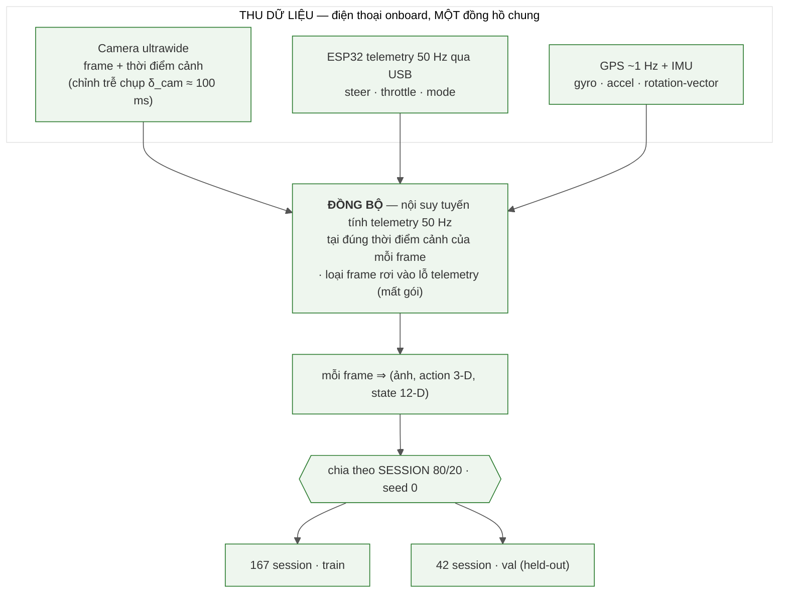
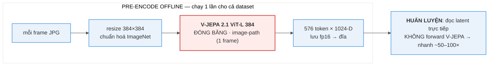
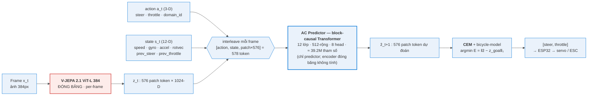
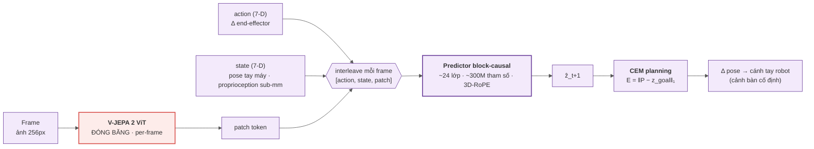

# BÁO CÁO — World Model Hành-động-điều-kiện dựa trên V-JEPA 2.1 cho Xe RC (bản prose)

*Bản văn xuôi để dán thẳng vào Word. Mọi con số đều tái lập được bằng script trong repo (xem báo cáo
chi tiết `2_REPORT_FULL.md` §Phụ lục). Hình ở `docs/report/figures/`. Placeholder: `[Họ tên]`,
`[MSSV]`, `[Lớp/Môn]`, `[GVHD]`.*

---

## Tóm tắt (Abstract)

Chúng tôi nghiên cứu việc dùng một encoder video nền-tảng đóng băng — **V-JEPA 2.1 ViT-L 384** — làm
biểu diễn thị giác cho một **world model hành-động-điều-kiện** trên một **xe RC di động**, rồi dùng
**CEM planning** để **điều hướng xe theo ảnh-mục-tiêu (goal-conditioned)**: cho trước một ảnh-mục-tiêu,
ở mỗi bước model so cảnh hiện tại với mục-tiêu trong không gian latent và chọn `[lái, ga]` đưa cảnh
hiện tại tiến về cảnh-mục-tiêu (đây **không** phải học-bắt-chước một quỹ đạo: đổi ảnh-goal thì hành vi
đổi theo). Encoder được giữ đóng băng hoàn toàn; chúng tôi chỉ huấn luyện một **AC Predictor** nhỏ
(**≈ 39.2 triệu tham số**).

Kết quả được trình bày theo **ba tầng đánh giá**. **Tầng 1 (offline):** AC predictor dự đoán tốt hơn
baseline "đứng yên" (rollout@1 / identity = 0.744 < 1 — tức tốt hơn giả định "cảnh không đổi", một
điều kiện cần), có độ nhạy hành động đo được ở **cả hai trục** lái và ga (lái đúng dấu cua 95%, lệch
trung vị so với người 0.146), và cho thấy **transfer chéo-domain-servo** có lợi (chỉ-servo-mới 1.073 →
pretrain-rồi-finetune 0.975 → trộn 2 servo 0.65). **Tầng 2 (open-loop):** trên video held-out, planner
chọn **joint cả lái lẫn ga**, lái **khớp dấu người 94.2%** ở khúc quẹo (lệch độ-lớn trung vị 0.118) và
ga tự chọn muốn-tiến ~92% (lệch ga 0.033). **Tầng 3 (closed-loop ngoài trời):** hệ thống bám tuyến tốt
ở nửa đầu route rồi bung ra lề; phân tích định lượng quy nguyên nhân **chính** về **khâu định-vị**
(descriptor mean-pool + cosine không bất-biến dưới đổi sáng/heading), **không** về chất lượng biểu diễn
(một deadlock điều-khiển phụ lúc xe đứng-yên cũng được phát hiện & vá bằng sàn ga — xem §7). Vì dữ liệu
do nhóm tự thu/tự đo, chúng tôi trình bày đây như **một thử nghiệm họ V-JEPA 2 trên một robot DI ĐỘNG**
(chế độ khó hơn về robustness so với cánh-tay-robot) kèm phân tích thất bại có cơ chế, định lượng.

---

## 1. Giới thiệu

Vài năm gần đây, **world model** học tự-giám-sát — tiêu biểu là họ **JEPA** (Joint-Embedding Predictive
Architecture) do **Yann LeCun** và Meta theo đuổi — nổi lên mạnh như một hướng để máy "hiểu vật lý của
cảnh" mà không cần nhãn. Thay vì xây bản đồ 3D hay tái tạo từng pixel, world model **dự đoán trong không
gian biểu diễn (latent)** rằng "hành động nào dẫn tới quan sát nào", rồi **lập kế hoạch ngay trong
latent** đó (tác tử "tưởng tượng" hệ quả hành động rồi chọn chuỗi tốt). LeCun theo đuổi JEPA vì
sinh-pixel lãng phí và bất khả thi với tương lai bất định, còn dự đoán latent cho phép bỏ qua chi tiết
vô nghĩa và giữ lại cấu trúc trừu tượng cần cho suy-luận/điều-khiển. Meta đã chứng minh ý tưởng này
chạy thật **trên cánh tay robot Franka** với **V-JEPA 2-AC** (action-conditioned): đóng băng encoder
video, học một predictor nhỏ hành-động-điều-kiện là robot plan được để với/đẩy vật chỉ từ một
ảnh-mục-tiêu. (V-JEPA học đặc trưng bằng *feature prediction*; bản 2.1 — ViT-L distilled từ ViT-G,
384px — thêm Dense Predictive Loss cho đặc trưng patch chất lượng cao.) Câu hỏi tự nhiên của chúng tôi:
liệu cùng biểu diễn này có dùng được cho một robot **DI ĐỘNG, ngoài trời** (xe RC), với động lực học và
domain-shift (ánh sáng/giờ/heading) khắc nghiệt hơn nhiều cảnh-bàn-cố-định? Vì encoder ViT-L cần GPU,
suy luận phải qua PC; sau vài ngày tinh chỉnh closed-loop ngoài thực địa, chẩn đoán cho thấy thất bại
nằm ở **khâu định-vị** chứ không ở tham số mô hình, nên
chúng tôi chốt phần offline + kiểm chứng planner open-loop và trình bày closed-loop như một **kết quả
chưa thành công được phân tích kỹ theo cơ chế**.

---

## 2. Khái niệm & thước đo

Để phần kết quả đọc trôi, xin định nghĩa trước các thuật ngữ dùng xuyên suốt. **Latent / patch token:**
encoder biến mỗi ảnh thành 576 token, mỗi token một vector 1024 chiều mô tả một mảnh ảnh; tập 576×1024
này là *latent* của frame. **Horizon H:** số bước tương lai planner xét (báo cáo dùng H=4 ≈ 0.9s).
**rollout@k:** cho model dự đoán k bước latent liên tiếp rồi đo sai số. **Baseline "đứng yên"
(identity):** phép so sánh ngây thơ "đoán frame sau y hệt frame hiện tại"; tỉ số **rollout@k / identity
< 1** nghĩa là model dự đoán tốt hơn việc giả định cảnh không đổi — đây là điều kiện *cần*, chưa *đủ*
để lái được. **Năng lượng E của một chuỗi hành động:** roll chuỗi `[lái, ga]` qua predictor ra latent
dự đoán cuối ẑ, rồi tính `E = ‖ẑ − z_goal‖₁` (khoảng cách L1 trên toàn bộ 576×1024 chiều tới latent
goal); E thấp nghĩa là hành động đó đưa cảnh tới gần mục tiêu. **argmin-E:** hành động có E nhỏ nhất
= hành động model "chọn". **Contrast = (E_max − E_min)/E_min** khi quét một trục: cao = đáy năng lượng
rõ (model phân biệt được hành động tốt/xấu), ≈ 0 = landscape phẳng (model mất phương hướng).
**Sign-turn:** trên các frame người đang quẹo (|lái| > 0.15), tỉ lệ frame mà dấu góc lái model trùng
dấu góc lái người. **Open-loop vs closed-loop:** open-loop = video chạy theo người, model chỉ đề xuất
(đo năng lực lập kế hoạch); closed-loop = model thực sự lái, hành động của nó quyết định frame kế.

---

## 3. Công trình liên quan

Báo cáo giữ phần liên quan gọn, tập trung vào world model và điều-hướng-theo-ảnh-mục-tiêu (xem §1 cho
nền tảng world model / JEPA / vì-sao-LeCun-theo-đuổi). **V-JEPA / V-JEPA 2 / 2.1** là nền tảng học
self-supervised bằng feature prediction trong latent (không tái tạo pixel). **V-JEPA 2-AC** của Meta —
interleave `[action, state, patch]` mỗi frame, predictor block-causal, CEM planning với năng lượng
`‖P − z_goal‖₁` — là **kiến trúc tham khảo** mà AC Predictor của chúng tôi dựa vào; Meta trình diễn
trên cánh tay robot Franka (cảnh bàn cố định). Từ **ViNG** (điều hướng bằng goal ảnh) chúng tôi mượn
ý tưởng "đi tới ảnh-mục-tiêu"; phần đồ-thị-ảnh topological chỉ là thử nghiệm phụ, không dùng làm hệ chính.

---

## 4. Phương pháp

### 4.1. Hệ thống phần cứng & cách thu thập dữ liệu

Hệ thống vật lý gồm một xe RC địa hình với một **ESP32-S3** điều khiển hai cơ cấu: servo lái TowerPro
MG946R (GPIO5, PWM 1000–2000µs) và ESC Hobbywing QuicRun 8BL150 (GPIO6). Một chi tiết quan trọng cho
phần kết quả: phần lớn dữ liệu cũ được thu bằng servo **KDS**, nhưng **servo KDS hỏng trong quá trình
thu và phải thay bằng TowerPro MG946R**. Hai servo có ánh xạ lệnh→góc-lái khác nhau, nên thay vì bỏ
dữ liệu cũ, chúng tôi coi đây là **hai "domain" điều khiển** và gắn một cờ `domain_id` vào input
model. Việc thay servo ngoài ý muốn này về sau cho một thí nghiệm transfer có giá trị (§5).

Ban đầu chúng tôi dùng một camera truyền H.265 không dây 5.8GHz về PC, nhưng link này vỡ ở tầm xa
(~50m: vỡ ảnh, trễ phình 92→310ms). Vì vậy chúng tôi **pivot: đặt một điện thoại Android (Samsung
A42) lên xe** làm camera ultrawide kiêm máy ghi; điện thoại đọc telemetry ESP32 qua USB, lưu frame +
action + telemetry + GPS + IMU. Vì frame và telemetry dùng chung một đồng hồ điện thoại, các vấn đề
lệch clock biến mất; chỉ còn độ trễ chụp camera δ_cam ≈ 100ms được ghi mỗi frame và hiệu chỉnh khi
đồng bộ.

Luồng hình thành dữ liệu train/val (Hình 1): khi thu, người lái tay bằng FlySky i-BUS và máy ghi thụ
động lưu frame (kèm thời điểm cảnh đã trừ δ_cam), telemetry 50Hz, GPS ~1Hz và IMU. **Cách đồng bộ
(chi tiết):** mỗi frame có thời điểm cảnh `t_scene = t_ms − δ_cam`; telemetry là chuỗi mẫu `(t_k, lái_k,
ga_k)`, ta tìm cặp mẫu kề `t_{k−1} ≤ t_scene < t_k` rồi **nội suy tuyến tính**
`lái(t_scene) = lái_{k−1} + τ·(lái_k − lái_{k−1})` với `τ = (t_scene − t_{k−1})/(t_k − t_{k−1})` (ga và
9 kênh IMU nội suy y hệt tại cùng `t_scene`). Frame bị **loại** nếu `t_scene` ngoài khoảng telemetry,
hoặc hai mẫu kề cách nhau > 60ms (lỗ telemetry do mất gói → không nội suy bừa), hoặc `mode ≠ RECORD` —
thà bỏ frame còn hơn ghép với hành động cũ. Mỗi frame trở thành một mẫu `(ảnh, action 3-D, state 12-D)`,
với state 12-D =
`[speed, gx,gy,gz, ax,ay,az, rx,ry,rz, prev_steer, prev_throttle]`. Cuối cùng dữ liệu được **chia theo
session** (không theo frame, tránh rò rỉ) tỉ lệ 80/20 với seed cố định → **167 session train / 42
session val**. GPS điện thoại chỉ đạt ~1Hz với nhiễu vị trí trung vị 0.44m, nên chỉ đủ làm cổng để
pop ảnh-mốc, không đủ giữ làn theo mét.

**Mã mermaid (Hình 1):**

*Hình 1 — Luồng dữ liệu: thu (một đồng hồ) → đồng bộ → ghép action/state → chia train/val.*

### 4.2. Dữ liệu & thống kê

Tập dữ liệu gồm **209 session, 228,511 frame, tương đương 7.43 giờ** lái thật (KDS 28 session / 1.73
giờ; TowerPro 181 session / 5.71 giờ), thu ở ~8.5 fps; split theo session 80/20 → 167 train / 42 val
(Hình 2). Phân bố hành động cho thấy throttle median 0.084 (ga thật, không phải 0), 63% thời gian đi
gần-thẳng (|steer|<0.15) với **13,871 sự kiện quẹo**, tốc độ median 1.05 m/s, và 11.3% frame ở trạng
thái đứng-yên (speed<0.06) — con số cuối liên quan trực tiếp tới phân tích lỗi ở §7. Dữ liệu là lái tay
tự do với góc lái dao động hai phía liên tục (Hình 3), nên **tập huấn luyện chứa đầy đủ hành vi
điều-chỉnh/sửa-lệch** — một điểm quan trọng khi phân tích closed-loop. Dữ liệu KDS có throttle gần như
hằng (~7.5%, gần "steering-only"); **sau khi servo KDS hỏng phải thay bằng TowerPro** (§4.1), mẻ
TowerPro lại có throttle biến thiên nên model có thêm tín hiệu học chiều ga. Báo cáo kèm các biểu đồ
phân bố steering/throttle/speed (Hình 4–6), độ dài từng session (Hình 7) và phủ thời gian thu theo giờ
(Hình 8).

*Hình 2 — Tổng quan dữ liệu theo 2 domain servo (KDS vs TowerPro): #session, #frame, thời lượng.*

*Hình 3 — Góc lái (tím) dao động hai phía liên tục → dữ liệu chứa hành vi điều chỉnh, không phải
lái-thẳng-một-mạch.*

### 4.3. Encoder đóng băng và pipeline pre-encode

Encoder V-JEPA 2.1 ViT-L 384 được giữ **đóng băng tuyệt đối**; chúng tôi encode từng frame thành 576
patch token, mỗi token 1024 chiều, và **pre-encode toàn bộ dataset offline một lần** rồi lưu latent
ra đĩa, để khi huấn luyện predictor chỉ đọc latent (nhanh hơn ~50–100 lần). Đây là điều khiến việc
huấn luyện trên 228k frame khả thi trên một GPU. Chúng tôi giữ nguyên 576 token (không mean-pool) để
còn thông tin không gian, và **huấn luyện ở 384px** vì bản encoder V-JEPA 2.1 (ViT-L distilled) được
huấn luyện gốc ở 384 — dùng đúng độ phân giải gốc tránh đổi resolution làm lệch phân bố đầu vào, giữ
chất lượng đặc trưng patch (256px của V-JEPA 2-AC chỉ là lựa chọn compute, không phải vì 256 tốt hơn).

**Mã mermaid (Hình 9):**

*Hình 9 — Pipeline encoder: mỗi frame → resize 384 + chuẩn hoá → V-JEPA ViT-L 384 đóng băng → 576×1024
token lưu fp16 → huấn luyện đọc latent trực tiếp.*

### 4.4. AC Predictor — kiến trúc tham khảo, ≈ 39.2M tham số

Với mỗi frame, AC Predictor xếp các token thành nhóm `[action_t (3-D), state_t (12-D), patch_t (576)]`
và dùng một transformer **block-causal** để token ở frame t chỉ nhìn được token ở frame ≤ t; đầu ra ở
vị trí patch của frame t dự đoán patch map của frame t+1 (Hình 10; **Hình 11** mở chi tiết bên trong
predictor). Đây là **kiến trúc tham khảo từ V-JEPA 2-AC**, không phải một "port nguyên bản": chúng tôi
giữ những phần cốt lõi (encoder đóng băng, interleave action+state+patch, attention block-causal, dự
đoán latent frame kế) nhưng điều chỉnh có lý do cho xe (Hình 12 là kiến trúc Meta để đối chiếu). State
của xe là IMU 10-D cộng hành-động-bước-trước (12-D) thay cho pose tay máy 7-D, vì xe không có
proprioception sub-mm; action là `[steer, throttle, domain_id]` 3-D thay cho delta 7-D; positional
embedding học được thay cho 3D-RoPE; và động học cho CEM là bicycle-model fit từ data xe.

Cụ thể bên trong (Hình 11): ba phép chiếu tuyến tính đưa action(3)/state(12)/patch(1024) về chiều
`P=512`, cộng pos-embedding (theo frame + theo vị-trí-token); 12 lớp Transformer block-causal, mỗi lớp
= LayerNorm → self-attention 8-head → residual → LayerNorm → MLP 512→2048→512 → residual; LayerNorm
cuối + head `Linear 512→1024` ở các vị-trí-patch của frame t sinh ẑ_{t+1} (576×1024).

Về quy mô, **39,192,576 tham số ≈ 39.2M** (chỉ predictor; encoder đóng băng không tính), trong đó 12
lớp Transformer chiếm ~96%. Chúng tôi cố ý giữ predictor nhỏ hơn nhiều so với ~300M của Meta vì hai lẽ:
(1) dữ liệu ít (~228k frame) và 576 token/frame đã rất nặng → predictor quá lớn dễ overfit; (2)
**phần cứng/tài nguyên hạn chế** — toàn bộ huấn luyện chạy trên **một GPU RTX 5070 Ti (16GB)**, một
predictor ~300M × 576 token/frame là bất khả thi với bộ nhớ/thời gian sẵn có.

**Mã mermaid (Hình 10):**

*Hình 10 — Kiến trúc của chúng tôi (tổng thể): V-JEPA 2.1 frozen + AC predictor 12 lớp.*

*Hình 11 — Chi tiết bên trong AC Predictor: chiếu action(3)/state(12)/patch(1024) về P=512 + pos-emb;
× 12 lớp Transformer block-causal (LN → MHSA 8-head → residual → LN → MLP 512→2048→512 → residual);
LayerNorm cuối + head Linear 512→1024 → ẑ_{t+1}; loss = L1(ẑ_{t+1}, z_{t+1}).*

**Mã mermaid (Hình 12):**

*Hình 12 — Kiến trúc tham khảo Meta V-JEPA 2-AC (cánh tay robot, pose 7-D, ~300M).*

Một câu hỏi tự nhiên: vì sao không cho predictor dự đoán luôn toàn bộ next-state 12-D? Bốn lý do:
predictor được thiết kế là một *visual-latent predictor* (không có head cho state 12-D); dự đoán full
IMU state rất khó vì accel/gyro/rotvec rất nhiễu (§8) và data ít dễ overfit; planning chỉ cần tốc độ
và yaw — phần này đã được bicycle-model lo; và cố đoán full state rồi feed lại thì sai số nổ nhanh hơn
khi rollout nhiều bước. Vì vậy chúng tôi chọn triết lý "dự đoán ít nhưng phần nào còn tin được".

### 4.5. Huấn luyện: hàm loss, chiến lược, tham số

**Chuẩn-bị mục-tiêu.** Patch token V-JEPA được **LayerNorm theo từng token** trong dataset (đúng
`normalize_reps` của Meta) — predictor học dự đoán biểu diễn đã chuẩn hoá; 12-D state được z-score bằng
thống kê train (lưu trong checkpoint để dùng lại khi plan).

**Hàm loss (L1, teacher-forcing + rollout 2 bước).** Với clip `z_{1..T}` (T=4): (i) *teacher-forcing
1 bước* — cho model nhìn token thật, phạt `L_tf = ‖model(z,a,s)[:,:−1] − z[:,1:]‖₁`; (ii) *rollout 2
bước* (`auto_steps=2`) — chỉ cho frame đầu thật, model tự nuôi dự đoán của chính nó 2 bước (giữa các
bước **re-LayerNorm** đúng như lúc plan), phạt `L_ro = ‖ẑ_3^{rollout} − z_3‖₁`. **Tổng `L = L_tf + L_ro`**.
Thành phần rollout buộc model ổn định khi tự-hồi-quy — đúng chế độ CEM dùng.

**Tham số & tối ưu.** AdamW, `weight_decay 1e-4`, **bf16 autocast**, **gradient checkpointing** (chuỗi
4×578 token × depth 12 sẽ OOM 16GB nếu không bật), `torch.compile`; `batch_size 64`, sampler theo
session, `frame_stride 2` (~0.22s/bước ≈ 4fps của V-JEPA 2-AC), `action_scale [1.0, 6.67]`. Split đóng
băng (`split.json`): 167 train / 42 val.

**Chiến lược LR kiểu WSD (warmup–stable–decay).** Mục tiêu gốc cosine 60 epoch nhưng **2.9h/epoch** →
60 ep ≈ 7 ngày > deadline nên đuôi cosine không tới. Thực tế hai pha: (1) **base run** (`lr 2.5e-4`,
warmup 5%, cosine) — val L1 giảm 0.79 → 0.60 ở ep9 rồi đi ngang (pha "stable"), **cúp điện giữa ep12**;
(2) **cooldown `cd4`** — init từ best.pt(ep9), `lr 1.2e-4` (~0.5× đỉnh) giảm → 0 trong 3 epoch, giữ
nguyên mọi thứ khác → checkpoint deploy val **0.5693**, `rollout@1/identity 0.744`.

*Hình 13 — Val L1 loss theo epoch: base cosine 0.79 → 0.60 (đi ngang), cúp điện giữa ep12 → cooldown cd4
LR→0 kéo val xuống 0.569 (deploy, rollout@1/identity 0.744). Số đọc từ log wandb + giá trị val trong checkpoint.*

### 4.6. Lập kế hoạch: CEM và động học

Để chọn hành động, một CEM planner roll các chuỗi action ứng viên qua AC predictor và chấm năng lượng
L1 từ latent dự đoán cuối tới latent goal, theo lối receding-horizon (horizon 4, chỉ áp action đầu);
mỗi vòng chèn thêm 5 ứng viên steer cố định trải đều [−1,1] để elite bắt được đáy toàn cục. Trạng thái
tương lai được tích phân bằng một bicycle-model với hệ số fit từ data thật (`k_thr=1.588, k_drag=0.078,
k_yaw=0.088`); một điểm vật-lý quan trọng là `yaw_rate = k_yaw · steer · speed`, nên khi speed=0 thì
lái không sinh yaw (liên quan footnote deadlock-đứng-yên ở §7). Ngân sách search và độ trễ CEM bàn ở
§7 (đóng vòng cần real-time).

---

## 5. Tầng 1 — Kết quả đánh giá Offline

Câu hỏi của tầng này là predictor có thực sự học được "action → đổi latent" hay không, độc lập với
chuyện đóng vòng. Thước đo quyết định **không** phải val loss đơn lẻ mà là tỉ số **rollout@k / identity**.
Vì sao không tin val loss đơn lẻ — **latent collapse**: vì cảnh giữa hai frame kề đổi rất ít, một model
*bỏ qua action* mà chỉ "copy gần nguyên latent hiện tại sang frame sau" cũng đạt val L1 thấp — nó thắng
loss bằng cách không học gì về tác động của hành động, để lại landscape phẳng theo action (CEM vô dụng).
Chia cho baseline identity phơi bày đúng bẫy đó: model chỉ-copy cho tỉ số ≈ 1, chỉ khi thật sự dùng
action để dự đoán tốt hơn copy thì mới < 1. Checkpoint triển khai đạt 0.744 / 0.703 / 0.697 ở horizon
1/2/3 — tốt hơn baseline "đứng yên" ở mọi horizon (đây là điều kiện *cần, chưa đủ*; bằng chứng mạnh hơn
là transfer và độ nhạy hành động dưới đây).

Một kết quả đáng chú ý là **transfer chéo-domain-servo** (Hình 14), đo ở giai đoạn **dữ liệu TowerPro
còn ít**: huấn luyện chỉ trên TowerPro thì eval TowerPro *thua* identity (**1.073**); pretrain trên KDS
rồi finetune trên TowerPro kéo về **0.975** (gần hoà); huấn luyện **trộn** cả KDS và TowerPro thì xuống
**0.65** (tốt nhất). Càng đưa thêm dữ liệu servo-cũ (giàu tín hiệu lái), model học động học chung càng
tốt; `domain_id` cho phép trộn mà không lẫn lộn ánh xạ lệnh→góc. Đây là "quả ngọt ngoài ý muốn" của
việc phải thay servo KDS hỏng. (Lưu ý: "baseline đứng-yên" là baseline ngây thơ chuẩn — luôn đoán
"frame sau = frame này"; tỉ số >1 nghĩa là model còn tệ hơn không-làm-gì.)

*Hình 14 — (A) Tiến trình 3 bước trên servo mới: chỉ-TowerPro THUA (1.073) → pretrain-KDS-rồi-finetune
gần hoà (0.975) → trộn 2 servo THẮNG (0.65). (B) Val loss của model trộn giảm đều 0.79 → 0.60.*

Để kiểm tra model có "đọc" được hành động không, chúng tôi quét năng lượng quanh **từng trục riêng**
trước (giữ trục kia = teacher) để cô lập tín hiệu, rồi mới đo joint cả hai trục ở Tầng 2 (sát
closed-loop). Trên 300 cửa sổ VAL người-lái-đang-quẹo: ở trục lái, argmin năng lượng đúng dấu góc cua
**95%** (285/300), **lệch so với người lái chỉ 0.146** (median |argminE−teacher|, thang [−1,1]), với
contrast median **0.33** trên frame quẹo (toàn bộ frame ≈ 0.41); ở trục ga, model nhất quán muốn tiến
(**83%** > 0) với contrast **0.27** và "muốn" ga +0.11 ≈ trung vị data 0.084. Như vậy model không hề
"đánh lái yếu" offline mà có đáy năng lượng rõ, đúng phía và **gần** góc người ở cả hai trục (Hình 15).

*Hình 15 — Planner chọn lái khớp người lái (session VAL 162959): (A) scatter lái-người vs lái-model
trên frame quẹo, bám đường chéo, đúng dấu 95.2%, lệch trung vị 0.092; (B) chuỗi thời gian lái-model
bám theo lái-người qua các khúc quẹo.*

---

## 6. Tầng 2 — Planner OPEN-LOOP chọn JOINT (lái + ga) khớp người lái

Tầng 1 chỉ đo dự-đoán-latent; tầng 2 đo **quyết-định-của-planner** mà chưa chịu vật-lý-đóng-vòng, và
quan trọng là planner phải chọn **cả lái lẫn ga cùng lúc**. Trên session VAL held-out, với mỗi frame
thật t, ta đặt goal là patch map d=4 bước (~0.9s) phía trước cùng session — chọn d=4 vì đủ xa để hành
động lái tạo khác biệt cảnh đo được, nhưng đủ gần để cảnh hiện tại còn overlap với goal. Sau đó cho
planner quét một **lưới JOINT hai chiều (15 điểm lái ∈[−1,1] × 9 điểm ga ∈[−0.1, 0.25] = 135 tổ hợp)**:
mỗi tổ hợp được roll qua AC predictor để ra năng lượng `E(lái, ga)`, và hành động model = argmin trên
cả lưới — chọn lái và ga đồng thời, so với (lái, ga) người lái thật. (Dải ga thực trong data là
~[−0.16, +0.15] nhưng xe gần như luôn tiến, nên lưới đặt **lệch tiến** [−0.1, 0.25] để phân giải mịn
ý-định-tiến; cái giá là không phủ hết đuôi lùi, vốn rất hiếm.) Đây là open-loop vì video luôn chạy theo
người lái — model chỉ đề xuất — nên nó **không** chứng minh "xe tự lái".

Kết quả trên ba session VAL tốt nhất (gộp 893 cửa sổ quẹo): góc lái model **khớp dấu người 94.2%**
(841/893, per-session 92.6 / 94.5 / 95.2%) và **gần về độ lớn** — lệch trung vị |Δsteer| chỉ **0.118**
(thang [−1,1]); **model tự chọn ga hợp lý** — 91.9% số frame muốn tiến (ga>0), ga trung vị +0.075 sát
người +0.090, lệch |Δthrottle| trung vị chỉ **0.033**; contrast joint median 0.52. Vậy planner đọc được
**cả hai trục** — khi tối ưu joint, lái vẫn đúng chiều ~94% (≈ probe 1-D 95%) và gần về độ lớn, ga chọn
độc lập ở mức hợp lý (không cần giữ ga = teacher). Năng lực lập kế hoạch là lành — khớp chuyên gia cả
**dấu** lẫn **độ lớn**; cái gãy ở Tầng 3 không phải vì "planner dốt". (Accuracy đọc từ `data/demo/*/demo.json`.)

---

## 7. Tầng 3 — Phân tích thất bại Closed-loop (chưa lái được, phân tích cơ chế)

Khi triển khai ngoài trời (chuẩn-bị: lái tay đi một lượt, chụp chuỗi ảnh-mục-tiêu + GPS dọc tuyến ~15m;
chạy: điện thoại stream frame+GPS+rotvec qua TCP về PC chạy V-JEPA → AC predictor → CEM rồi gửi 2-byte
action về ESP32), hệ thống bám tuyến tốt ở nửa đầu route rồi bung ra lề. Chỉnh tham số chỉ dời điểm
bung chứ không xoá, qua khoảng 10 run trong một môi trường mà không run nào về đích, nên kết quả là
định tính + cơ chế. Phân tích quy nguyên nhân **chính** về **khâu định-vị**, không về chất lượng biểu
diễn (ngoài ra có một deadlock điều-khiển phụ lúc xe đứng-yên đã vá — footnote cuối mục). Về **độ trễ
CEM** (đóng vòng cần real-time): 32 mẫu/1 vòng ≈ 0.5s/quyết định, 256/2 ≈ 5.5s (search dày làm xe đi
"mù" quá lâu), nên chốt 32/1 (≈ chất lượng 64/2).

**Nguyên nhân A — descriptor ĐỊNH-VỊ không bất-biến (không phải "V-JEPA hỏng").** Cần phân biệt rõ hai
khâu dùng V-JEPA: khâu **điều khiển** (CEM) chấm năng lượng bằng **L1 trên 576 patch token**, và khâu
này **lighting-robust** (nắng→mây đổi <5%); khâu **định-vị / pop ảnh-mục-tiêu** lại chấm độ giống bằng
**cosine trên latent MEAN-POOL** (gộp 576 token thành 1 vector), và **chính khâu này sập**. Khi tới
một ảnh-mục-tiêu mà ảnh live (khác heading/ánh sáng/vị trí so với lúc dạy) không khớp ảnh dạy, cosine
giữa latent-pooled live và mốc tụt xuống dưới 0.1 rồi âm, khiến goal không còn phân biệt được và năng
lượng CEM phẳng theo lái. Đo từ log chạy thật: chất-lượng-cosine phụ thuộc **độ lệch sáng/giờ giữa dạy
và chạy**, không phải cảnh — route cùng-buổi-sáng-gần có **66% tick** đạt cos>0.3, còn route dạy/chạy
lệch nắng chỉ **0% tick** đạt cos>0.3. Quan trọng: đây **không** phải "biểu diễn V-JEPA kém" — embedding
teach không degenerate, khâu điều khiển dùng patch-L1 vẫn bền. Vấn đề nằm ở **lựa chọn descriptor cho
khâu định-vị** (mean-pool + cosine) — phép gộp toàn-cục + cosine nhạy với đổi-sáng-toàn-cục và
đổi-heading. Vì vậy fix nguyên-lý là **học một descriptor bất-biến** trên frozen V-JEPA (§10), còn cách
kịp deadline là dạy lại cùng buổi.

Cần làm rõ liên hệ giữa A và việc "không cứu được khi đã văng": chuỗi ảnh-mục-tiêu chỉ chụp dọc một
đường đi (lúc dạy xe ở giữa tuyến), nên khi xe văng ra khỏi hành lang đã dạy, ảnh live rơi vào vùng
chưa từng được chụp làm mốc → cosine tới mốc kế tụt (đúng cơ chế A) → không còn goal hợp lệ để bám về.
Phải nhấn mạnh: **tập huấn luyện AC predictor không thiếu hành vi sửa-lệch** (13,871 sự kiện quẹo, lái
hai phía liên tục); cái thiếu là một *ảnh-mục-tiêu chỉ đường-về khi đã off-route*, tức hệ quả của cách
chụp một-lượt-giữa-line cộng với sự sập của descriptor, chứ không phải "dữ liệu lái thiếu recovery".

**Footnote — một deadlock điều-khiển phụ lúc xe đứng-yên (đã vá, KHÔNG phải nguyên nhân chính).** Lúc
debug `--step`, ngoài (A) còn gặp một sự cố phụ: khi xe đứng yên, landscape E(steer) cũng phẳng — nhưng
vì **động học**, không phải descriptor. Do `yaw_rate = k_yaw · steer · speed`, speed≈0 ⇒ bẻ lái không
làm cảnh quay ⇒ predictor (đúng) cho mọi góc lái ra cảnh gần như nhau ⇒ phẳng. Ablation một-biến
(`probe_speed_confound.py`, **cùng cảnh & goal**, chỉ đổi chuyển-động): xe-đang-chạy contrast E(steer)
**0.335** → ép xe đứng-yên-suốt **0.088** (xẹp ~3.8×) — chỉ vì xe đứng, dù cảnh không đổi. Gốc là một
deadlock: hộp ga CEM [0,0.10] chứa vùng-chết ma-sát-tĩnh [0,0.06) → xe đứng → speed=0 → phẳng → ra lái
rác → vẫn đứng. Vá bằng **sàn ga TMIN=0.07** (xe luôn lăn) → lái sống lại. Đây chỉ là lỗi triển khai
đã sửa; **sau khi vá xe chạy được nhưng vẫn bung ở A** — nên A mới là nút thắt thật.

So với Meta (V-JEPA 2-AC, tay máy, cảnh bàn cố định, không heading/ánh-sáng/lệch-ngang; "chính xác cm"
thực ra là proprioception sub-mm — khác hệ đo), hệ của chúng tôi chịu domain-shift thật nên **khó hơn
hẳn về robustness** ở khâu định-vị. Tóm lại, cùng một họ kiến trúc, gap giữa "dự đoán latent tốt + lập
kế hoạch khớp chuyên gia offline" và "lái được closed-loop ngoài trời" nằm ở **độ-bền-định-vị**, **không**
ở chất lượng representation.

---

## 8. Đánh giá dữ liệu IMU

State token dùng 10 kênh IMU (gyro, accel, rotation-vector) cộng tốc độ GPS. Trên thực tế chất lượng
các kênh này không đều: vì điện thoại gắn trên xe, accel và gyro lẫn rung khung, xóc mặt đường và rung
mount; az lệch hằng số do trọng lực; ax/ay nhỏ và chìm trong nhiễu khi xe chạy; tốc độ GPS chỉ 1Hz nên
phải nội suy; rotation-vector ổn cho pitch/roll nhưng yaw≈heading bị drift và la bàn kém ngoài trời.
Hệ quả là trong 12 chiều state, chỉ `speed` và `gz` (yaw-rate) là thật sự đáng tin cho điều khiển. Đánh
giá này củng cố lựa chọn không cho predictor dự đoán full state và là động lực thay IMU điện thoại bằng
cảm biến chuyên dụng BNO055 (sensor-fusion phần cứng) ở hướng tương lai.

---

## 9. Hạn chế

Closed-loop chỉ trong một môi trường, không run nào về đích, nên là kết quả định tính; descriptor
định-vị nhạy ánh sáng/heading (fix nguyên-lý cần learned descriptor, chưa làm kịp deadline); GPS 1Hz
nhiễu; IMU điện thoại nhiễu nên state chỉ tin được speed và yaw-rate; encoder cần GPU nên phải qua PC
với trễ CEM cao; và margin offline khiêm tốn (rollout@1 0.744; thắng identity chỉ là điều kiện cần),
thẳng thắn mà nói là mức report/workshop chứ không phải SOTA.

---

## 10. Hướng phát triển

Hướng ưu tiên là **thay IMU điện thoại bằng cảm biến BNO055** (IMU 9-trục sensor-fusion phần cứng) để
làm sạch state token. Tiếp theo là **học một descriptor bất-biến sáng/heading cho khâu định-vị** (head
nhỏ trên frozen V-JEPA, train cross-session — dữ liệu hiện có đã chứa cặp cùng-chỗ-khác-buổi) để fix
nguyên nhân A. Một khắc phục mức-latent đã thử offline là **token-shift augment ("DAVE-2 cho latent")**:
dịch ngang lưới patch token để giả lập camera lệch ngang rồi ghép nhãn bẻ-về; đo offline cho thấy đáp
ứng tự-sửa được khuếch đại 3.4–5.4 lần và không hại goal-reaching, nhưng đây là proxy không có renderer
nên chưa chứng minh được transfer closed-loop, vì vậy mặc định tắt. Xa hơn, một sim 3DGS dựng lại bãi
từ data sẽ cho phép test closed-loop trong nhà với heading/ánh-sáng kiểm soát được, và RTK GPS sẽ cho
định vị cm. Về đồ-thị-ảnh topological, chúng tôi đã thử nhanh và offline nó định vị được ~2m, nhưng
không dùng làm hệ chính vì khó kiểm soát khi chạy thật.

---

## 11. Kết luận

Frozen V-JEPA 2.1 cung cấp một biểu diễn latent đủ tốt để một AC predictor ≈ 39.2M tham số dự đoán tốt
hơn baseline identity ở mọi horizon, nhạy với cả lái lẫn ga, hưởng lợi từ transfer chéo-domain-servo,
và để planner chọn joint cả lái lẫn ga khớp người lái — đúng chiều ~94% và gần về độ lớn (lệch lái
~0.12, lệch ga ~0.03), ga tự chọn muốn-tiến ~92% — trên video held-out theo lối open-loop. Tuy nhiên,
triển khai closed-loop ngoài trời bung ra lề, và phân tích định lượng quy nguyên nhân **chính** về
**khâu định-vị** (descriptor mean-pool + cosine không bất-biến sáng/heading), **không** về chất lượng
biểu diễn (một deadlock điều-khiển phụ lúc xe đứng-yên đã được vá, §7). Vì dữ liệu do nhóm tự thu/tự đo,
chúng tôi trình bày đây như một thử nghiệm họ V-JEPA 2 trên robot DI ĐỘNG (chế độ khó hơn về robustness)
kèm phân tích thất bại có cơ chế: với cùng một biểu diễn mạnh, khoảng cách tới "lái được closed-loop
ngoài trời" nằm ở **độ-bền-định-vị**, không ở representation.
