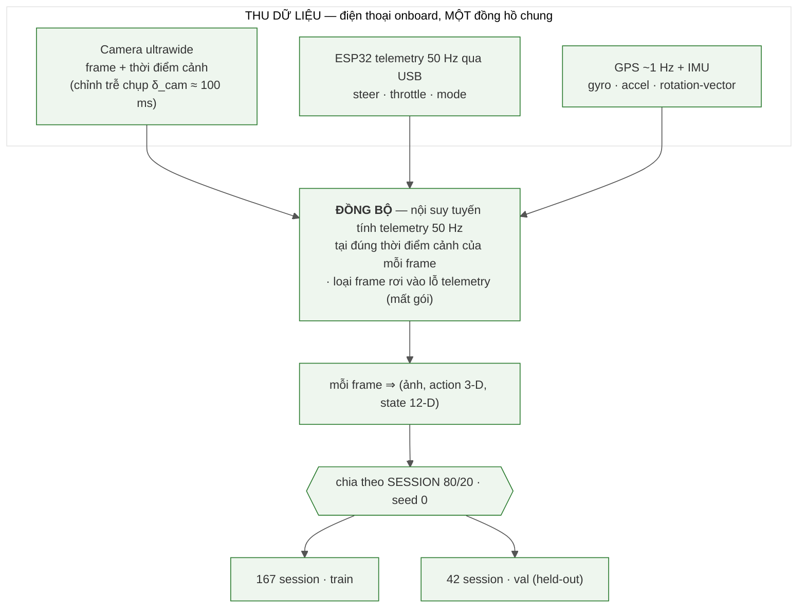
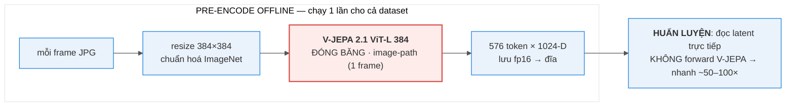
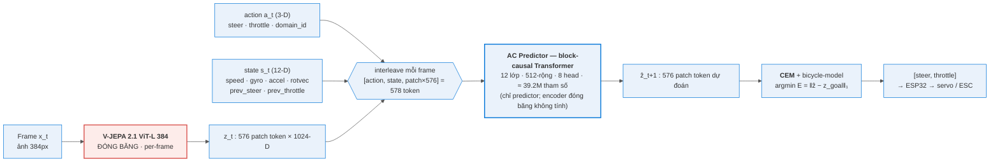
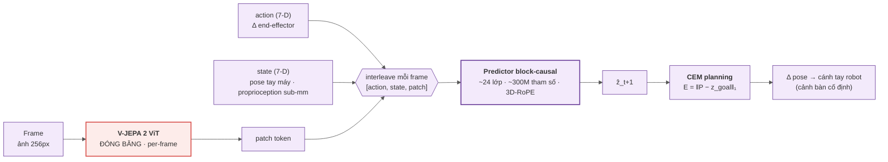

# BÁO CÁO — World Model Hành-động-điều-kiện dựa trên V-JEPA 2.1 cho Xe RC (bản prose)

*Bản văn xuôi để dán thẳng vào Word. Mọi con số đều tái lập được bằng script trong repo (xem báo cáo
chi tiết `2_REPORT_FULL.md` §Phụ lục). Hình ở `docs/report/figures/`. Placeholder: `[Họ tên]`,
`[MSSV]`, `[Lớp/Môn]`, `[GVHD]`.*

---

## Tóm tắt (Abstract)

Chúng tôi nghiên cứu việc dùng một encoder video nền-tảng đóng băng — **V-JEPA 2.1 ViT-L 384** — làm
biểu diễn thị giác cho một **world model hành-động-điều-kiện** trên một **xe RC di động**, rồi dùng
**CEM planning** để cho xe **lặp lại một tuyến đã được dạy** (teach & repeat): người lái tay đi hết
tuyến một lần và hệ thống lưu lại chuỗi ảnh-mốc; khi chạy lại, tại mỗi bước model so ảnh hiện tại với
ảnh-mốc kế tiếp và chọn lái/ga để đi tới đó. Encoder được giữ đóng băng hoàn toàn; chúng tôi chỉ
huấn luyện một **AC Predictor** nhỏ (**≈ 39.2 triệu tham số**, đếm trực tiếp từ checkpoint).

Kết quả được trình bày theo **ba tầng đánh giá**. **Tầng 1 (offline):** AC predictor dự đoán tốt hơn
baseline "đứng yên" (rollout@1 / identity = 0.744 < 1 — tức tốt hơn giả định "cảnh không đổi", một
điều kiện cần), có độ nhạy hành động đo được ở **cả hai trục** lái và ga, và cho thấy **transfer
chéo-domain-servo** có lợi. **Tầng 2 (open-loop):** trên video held-out, planner chọn **joint cả lái
lẫn ga**, lái **khớp dấu người 94.2%** ở khúc quẹo và ga tự chọn muốn-tiến ~92%. **Tầng 3 (closed-loop
ngoài trời):** hệ thống bám tuyến tốt ở nửa đầu route rồi bung ra lề; phân tích định lượng quy nguyên
nhân về **khâu định-vị** (descriptor mean-pool + cosine không bất-biến dưới đổi sáng/heading) và
**chế-độ-điều-khiển** (vùng-chết đứng-yên, đã chẩn và vá), **không** về chất lượng biểu diễn. Đây là
**đánh giá đầu tiên của họ V-JEPA 2 trên một robot di động** kèm phân tích thất bại có cơ chế, định
lượng.

---

## 1. Giới thiệu

Điều hướng bằng thị giác cho robot di động theo lối truyền thống dựa vào bản đồ hình học. Một hướng
thay thế gần đây là học biểu diễn tự-giám-sát rồi lập kế hoạch ngay trong không gian latent: thay vì
xây bản đồ 3D, ta học một *world model* dự đoán "hành động nào gây ra thay đổi hình ảnh nào" và tìm
chuỗi hành động đưa quan sát hiện tại về quan sát-mục-tiêu. V-JEPA học đặc trưng bằng *feature
prediction* trong không gian biểu diễn thay vì tái tạo pixel; bản 2.1 (ViT-L distilled từ ViT-G,
384px) bổ sung Dense Predictive Loss cho đặc trưng patch chất lượng cao. Meta đã chứng minh V-JEPA
2-AC (action-conditioned) cho phép planning **trên cánh tay robot**. Câu hỏi tự nhiên của chúng tôi:
liệu biểu diễn này có dùng được cho một robot **di động, ngoài trời**, với động lực học và domain-shift
thật? Vì encoder ViT-L cần GPU, suy luận phải qua PC; sau vài ngày tinh chỉnh closed-loop ngoài thực
địa, chẩn đoán cho thấy thất bại nằm ở khâu định-vị và chế-độ-điều-khiển chứ không ở tham số, nên
chúng tôi chốt phần offline + kiểm chứng planner open-loop và trình bày closed-loop như một kết quả
âm được phân tích kỹ.

---

## 2. Khái niệm & thước đo

Để phần kết quả đọc trôi, xin định nghĩa trước các thuật ngữ dùng xuyên suốt. **Latent / patch token:**
encoder biến mỗi ảnh thành 576 token, mỗi token một vector 1024 chiều mô tả một mảnh ảnh; tập 576×1024
này là *latent* của frame. **Horizon H:** số bước tương lai planner xét (báo cáo dùng H=4 ≈ 0.9s).
**rollout@k:** cho model dự đoán k bước latent liên tiếp rồi đo sai số. **Baseline "đứng yên"
(identity):** phép so sánh ngây thơ "đoán frame sau y hệt frame hiện tại"; tỉ số **rollout@k / identity
< 1** nghĩa là model dự đoán tốt hơn việc giả định cảnh không đổi — đây là điều kiện *cần*, chưa *đủ*
để lái được. **Năng lượng E của một chuỗi hành động:** roll chuỗi `[lái, ga]` qua predictor ra latent
dự đoán cuối ẑ, rồi tính `E = ‖ẑ − z_goal‖₁` (khoảng cách L1 trên toàn bộ 576×1024 chiều tới latent
goal); E thấp nghĩa là hành động đó đưa cảnh tới gần mục tiêu. **argmin-E:** hành động có E nhỏ nhất
= hành động model "chọn". **Contrast = (E_max − E_min)/E_min** khi quét một trục: cao = đáy năng lượng
rõ (model phân biệt được hành động tốt/xấu), ≈ 0 = landscape phẳng (model mất phương hướng).
**Sign-turn:** trên các frame người đang quẹo (|lái| > 0.15), tỉ lệ frame mà dấu góc lái model trùng
dấu góc lái người. **Open-loop vs closed-loop:** open-loop = video chạy theo người, model chỉ đề xuất
(đo năng lực lập kế hoạch); closed-loop = model thực sự lái, hành động của nó quyết định frame kế.

---

## 3. Công trình liên quan

Báo cáo giữ phần liên quan gọn, tập trung vào world model và teach & repeat. **V-JEPA / V-JEPA 2 /
2.1** là nền tảng học self-supervised bằng feature prediction. **V-JEPA 2-AC** của Meta — interleave
`[action, state, patch]` mỗi frame, predictor block-causal, CEM planning với năng lượng `‖P − z_goal‖₁`
— là **kiến trúc tham khảo** mà AC Predictor của chúng tôi dựa vào; Meta chỉ thử trên cánh tay robot
với cảnh bàn cố định. Từ **ViNG** (điều hướng bằng goal ảnh) chúng tôi mượn ý tưởng "đi tới ảnh-mục-
tiêu"; phần đồ-thị-ảnh topological chỉ là thử nghiệm phụ, không dùng làm hệ chính.

---

## 4. Phương pháp

### 4.1. Hệ thống phần cứng & cách thu thập dữ liệu

Hệ thống vật lý gồm một xe RC địa hình với một **ESP32-S3** điều khiển hai cơ cấu: servo lái TowerPro
MG946R (GPIO5, PWM 1000–2000µs) và ESC Hobbywing QuicRun 8BL150 (GPIO6). Một chi tiết quan trọng cho
phần kết quả: phần lớn dữ liệu cũ được thu bằng servo **KDS**, nhưng **servo KDS hỏng trong quá trình
thu và phải thay bằng TowerPro MG946R**. Hai servo có ánh xạ lệnh→góc-lái khác nhau, nên thay vì bỏ
dữ liệu cũ, chúng tôi coi đây là **hai "domain" điều khiển** và gắn một cờ `domain_id` vào input
model. Việc thay servo ngoài ý muốn này về sau cho một thí nghiệm transfer có giá trị (§5).

Ban đầu chúng tôi dùng một camera truyền H.265 không dây 5.8GHz về PC, nhưng link này vỡ ở tầm xa
(~50m: vỡ ảnh, trễ phình 92→310ms). Vì vậy chúng tôi **pivot: đặt một điện thoại Android (Samsung
A42) lên xe** làm camera ultrawide kiêm máy ghi; điện thoại đọc telemetry ESP32 qua USB, lưu frame +
action + telemetry + GPS + IMU. Vì frame và telemetry dùng chung một đồng hồ điện thoại, các vấn đề
lệch clock biến mất; chỉ còn độ trễ chụp camera δ_cam ≈ 100ms được ghi mỗi frame và hiệu chỉnh khi
đồng bộ.

Luồng hình thành dữ liệu train/val (Hình 1): khi thu, người lái tay bằng FlySky i-BUS và máy ghi thụ
động lưu frame (kèm thời điểm cảnh đã trừ δ_cam), telemetry 50Hz, GPS ~1Hz và IMU. Khi đồng bộ, với
mỗi frame ta **nội suy tuyến tính** telemetry 50Hz tại đúng thời điểm cảnh để lấy `[lái, ga]` đang
thực sự áp lên xe lúc khung hình được chụp; frame nào rơi vào lỗ telemetry (mất gói) bị loại thay vì
ghép với hành động cũ. Mỗi frame trở thành một mẫu `(ảnh, action 3-D, state 12-D)`, với state 12-D =
`[speed, gx,gy,gz, ax,ay,az, rx,ry,rz, prev_steer, prev_throttle]`. Cuối cùng dữ liệu được **chia theo
session** (không theo frame, tránh rò rỉ) tỉ lệ 80/20 với seed cố định → **167 session train / 42
session val**. GPS điện thoại chỉ đạt ~1Hz với nhiễu vị trí trung vị 0.44m, nên chỉ đủ làm cổng để
pop ảnh-mốc, không đủ giữ làn theo mét.

**Mã mermaid (Hình 1):**

*Hình 1 — Luồng dữ liệu: thu (một đồng hồ) → đồng bộ → ghép action/state → chia train/val.*

### 4.2. Dữ liệu & thống kê

Tập dữ liệu gồm **209 session, 228,511 frame, tương đương 7.43 giờ** lái thật (KDS 28 session / 1.73
giờ; TowerPro 181 session / 5.71 giờ), thu ở ~8.5 fps. Phân bố hành động cho thấy throttle median
0.084 (ga thật, không phải 0), 63% thời gian đi gần-thẳng (|steer|<0.15) với **13,871 sự kiện quẹo**,
tốc độ median 1.05 m/s, và 11.3% frame ở trạng thái đứng-yên (speed<0.06) — con số cuối liên quan trực
tiếp tới phân tích lỗi ở §7. Dữ liệu là lái tay tự do với góc lái dao động hai phía liên tục (Hình 2),
nên **tập huấn luyện chứa đầy đủ hành vi điều-chỉnh/sửa-lệch** — một điểm quan trọng khi phân tích
closed-loop. Dữ liệu KDS có throttle gần như hằng (~7.5%, gần "steering-only"), nên chúng tôi thu thêm
mẻ TowerPro với throttle biến thiên để model có tín hiệu học chiều ga. Báo cáo kèm các biểu đồ phân bố
steering/throttle/speed (Hình 3–5), độ dài từng session (Hình 6), phủ thời gian thu theo giờ (Hình 7)
và mật độ chung lái×ga (Hình 8).

*Hình 2 — Góc lái (tím) dao động hai phía liên tục → dữ liệu chứa hành vi điều chỉnh, không phải
lái-thẳng-một-mạch.*

### 4.3. Encoder đóng băng và pipeline pre-encode

Encoder V-JEPA 2.1 ViT-L 384 được giữ **đóng băng tuyệt đối**; chúng tôi encode từng frame thành 576
patch token, mỗi token 1024 chiều, và **pre-encode toàn bộ dataset offline một lần** rồi lưu latent
ra đĩa, để khi huấn luyện predictor chỉ đọc latent (nhanh hơn ~50–100 lần). Đây là điều khiến việc
huấn luyện trên 228k frame khả thi trên một GPU. Chúng tôi giữ patch map đầy đủ (không mean-pool) để
còn thông tin không gian, và chọn 384px (độ phân giải gốc của checkpoint ViT-L distilled) cho chất
lượng — 256px của V-JEPA 2-AC là lựa chọn compute, không phải vì 256 đẹp hơn.

**Mã mermaid (Hình 9):**

*Hình 9 — Pipeline encoder: mỗi frame → resize 384 + chuẩn hoá → V-JEPA ViT-L 384 đóng băng → 576×1024
token lưu fp16 → huấn luyện đọc latent trực tiếp.*

### 4.4. AC Predictor — kiến trúc tham khảo, ≈ 39.2M tham số

Với mỗi frame, AC Predictor xếp các token thành nhóm `[action_t (3-D), state_t (12-D), patch_t (576)]`
và dùng một transformer **block-causal** để token ở frame t chỉ nhìn được token ở frame ≤ t; đầu ra ở
vị trí patch của frame t dự đoán patch map của frame t+1 (Hình 10). Đây là **kiến trúc tham khảo từ
V-JEPA 2-AC**, không phải một "port nguyên bản": chúng tôi giữ những phần cốt lõi (encoder đóng băng,
interleave action+state+patch, attention block-causal, dự đoán latent frame kế) nhưng điều chỉnh có lý
do cho xe (Hình 11 là kiến trúc Meta để đối chiếu). State của xe là IMU 10-D cộng hành-động-bước-trước
(12-D) thay cho pose tay máy 7-D, vì xe không có proprioception sub-mm; action là `[steer, throttle,
domain_id]` 3-D thay cho delta 7-D; positional embedding học được thay cho 3D-RoPE; và động học cho CEM
là bicycle-model fit từ data xe.

Về quy mô, **đếm trực tiếp từ checkpoint triển khai cho 39,192,576 tham số ≈ 39.2M** (chỉ predictor;
encoder đóng băng không tính), trong đó 12 lớp Transformer chiếm ~96%. Chúng tôi cố ý giữ predictor
nhỏ hơn nhiều so với ~300M của Meta vì dataset chỉ ~228k frame và 576 token/frame đã rất nặng.

**Mã mermaid (Hình 10):**

*Hình 10 — Kiến trúc của chúng tôi (V-JEPA 2.1 frozen + AC predictor 12 lớp).*

**Mã mermaid (Hình 11):**

*Hình 11 — Kiến trúc tham khảo Meta V-JEPA 2-AC (cánh tay robot, pose 7-D, ~300M).*

Một câu hỏi tự nhiên: vì sao không cho predictor dự đoán luôn toàn bộ next-state 12-D? Bốn lý do:
predictor được thiết kế là một *visual-latent predictor* (không có head cho state 12-D); dự đoán full
IMU state rất khó vì accel/gyro/rotvec rất nhiễu (§8) và data ít dễ overfit; planning chỉ cần tốc độ
và yaw — phần này đã được bicycle-model lo; và cố đoán full state rồi feed lại thì sai số nổ nhanh hơn
khi rollout nhiều bước. Vì vậy chúng tôi chọn triết lý "dự đoán ít nhưng phần nào còn tin được".

### 4.5. Lập kế hoạch: CEM và động học

Để chọn hành động, một CEM planner roll các chuỗi action ứng viên qua AC predictor và chấm năng lượng
L1 từ latent dự đoán cuối tới latent goal, theo lối receding-horizon (horizon 4, chỉ áp action đầu);
mỗi vòng chèn thêm 5 ứng viên steer cố định trải đều [−1,1] để elite bắt được đáy toàn cục. Trạng thái
tương lai được tích phân bằng một bicycle-model với hệ số fit từ data thật (`k_thr=1.588, k_drag=0.078,
k_yaw=0.088`); một điểm vật-lý quan trọng là `yaw_rate = k_yaw · steer · speed`, nên khi speed=0 thì
lái không sinh yaw — gốc rễ của hiện tượng landscape phẳng ở §7. Về độ trễ, search dày (256 mẫu/2 vòng)
tốn tới ~5.5s mỗi quyết định, trong khi 32/1 chỉ ~0.5s với chất lượng tương đương, nên chúng tôi chốt
32/1.

---

## 5. Tầng 1 — Kết quả đánh giá Offline

Câu hỏi của tầng này là predictor có thực sự học được "action → đổi latent" hay không, độc lập với
chuyện đóng vòng. Thước đo quyết định **không** phải val loss đơn lẻ (bị lừa bởi latent collapse) mà
là tỉ số **rollout@k / identity**. Checkpoint triển khai đạt 0.744 / 0.703 / 0.697 ở horizon 1/2/3,
tức tốt hơn baseline "đứng yên" ở mọi horizon. Cần diễn giải đúng mức: điều này **chỉ xác nhận**
predictor học được một phần động học có-điều-kiện-hành-động (dự đoán tốt hơn giả định cảnh đứng yên) —
một điều kiện *cần, chưa đủ*; nó không tự nó chứng minh "lái được". Bằng chứng mạnh hơn nằm ở transfer
và độ nhạy hành động dưới đây.

Một kết quả đáng chú ý là **transfer chéo-domain-servo** (Hình 12): huấn luyện chỉ trên TowerPro thì
eval TowerPro lại thua identity (1.073), nhưng huấn luyện trộn cả KDS và TowerPro thì eval TowerPro
xuống 0.65 — dữ liệu của servo khác giúp học động học chung, và `domain_id` cho phép trộn mà không lẫn
lộn ánh xạ lệnh→góc. Đây chính là "quả ngọt ngoài ý muốn" của việc phải thay servo KDS hỏng.

*Hình 12 — Train trộn 2 servo thắng baseline trên servo mới (0.65), trong khi chỉ-train-servo-mới lại
thua (1.073); val của model trộn giảm đều 0.79 → 0.60.*

Để kiểm tra model có "đọc" được hành động không, chúng tôi quét năng lượng quanh **từng trục riêng**
trước (giữ trục kia = teacher) để cô lập tín hiệu, rồi mới đo joint cả hai trục ở Tầng 2 (sát
closed-loop). Trên 300 cửa sổ VAL người-lái-đang-quẹo: ở trục lái, argmin năng lượng đúng dấu góc cua
**95%** (285/300) với contrast median **0.33** trên frame quẹo (nếu tính trên toàn bộ frame thì ≈
0.41); ở trục ga, model nhất quán muốn tiến (**83%** > 0) với contrast **0.27** và "muốn" ga +0.11 ≈
trung vị data 0.084. Như vậy model không hề "đánh lái yếu" offline mà có đáy năng lượng rõ và đúng phía
ở cả hai trục (Hình 13).

*Hình 13 — Energy landscape lái (session VAL 162959): (A) vài đường E(steer) với đáy nằm đúng phía
người lái; (B) argmin-E (model) vs người trên 374 frame quẹo, đúng dấu 95.2%; (C) toàn session, "sườn
sáng" (góc model thích) bám sát đường người lái.*

---

## 6. Tầng 2 — Planner OPEN-LOOP chọn JOINT (lái + ga) khớp người lái

Tầng 1 chỉ đo dự-đoán-latent; tầng 2 đo **quyết-định-của-planner** mà chưa chịu vật-lý-đóng-vòng, và
quan trọng là planner phải chọn **cả lái lẫn ga cùng lúc**. Trên session VAL held-out, với mỗi frame
thật t, ta đặt goal là patch map d=4 bước (~0.9s) phía trước cùng session — chọn d=4 vì đủ xa để hành
động lái tạo khác biệt cảnh đo được, nhưng đủ gần để cảnh hiện tại còn overlap với goal. Sau đó cho
planner quét một **lưới JOINT hai chiều (15 điểm lái × 9 điểm ga = 135 tổ hợp)**: mỗi tổ hợp được roll
qua AC predictor để ra năng lượng `E(lái, ga)`, và hành động model = argmin trên cả lưới — chọn lái và
ga đồng thời, so với (lái, ga) người lái thật. Đây là open-loop vì video luôn chạy theo người lái —
model chỉ đề xuất — nên nó **không** chứng minh "xe tự lái".

Kết quả trên ba session VAL tốt nhất (gộp 893 cửa sổ quẹo): góc lái model **khớp dấu người 94.2%**
(841/893, per-session 92.6 / 94.5 / 95.2%); và đáng chú ý là **model tự chọn ga hợp lý** — 91.9% số
frame model muốn tiến (ga>0), với ga trung vị +0.075 rất sát mức người lái +0.090; contrast joint
median 0.52. Hai điều này cho thấy planner đọc được **cả hai trục** hành động: khi tối ưu joint, lái
vẫn đúng chiều ~94% (≈ probe 1-D 95%) và ga được chọn độc lập ở mức hợp lý — không cần giữ ga = teacher.
Diễn giải: năng lực lập kế hoạch là lành; cái gãy ở Tầng 3 không phải vì "planner dốt".

---

## 7. Tầng 3 — Phân tích thất bại Closed-loop (kết quả âm)

Khi triển khai teach & repeat ngoài trời (teach: lái tay chụp chuỗi ảnh-mốc + GPS dọc tuyến ~15m;
repeat: điện thoại stream frame+GPS+rotvec qua TCP về PC chạy V-JEPA → AC predictor → CEM rồi gửi 2-byte
action về ESP32), hệ thống bám tuyến tốt ở nửa đầu route rồi bung ra lề. Chỉnh tham số chỉ dời điểm
bung chứ không xoá, qua khoảng 10 run trong một môi trường mà không run nào về đích, nên kết quả là
định tính + cơ chế. Phân tích quy về **hai nguyên nhân thuộc khâu định-vị và điều khiển**, không về
chất lượng biểu diễn.

**Nguyên nhân A — descriptor ĐỊNH-VỊ không bất-biến (không phải "V-JEPA hỏng").** Cần phân biệt rõ hai
khâu dùng V-JEPA: khâu **điều khiển** (CEM) chấm năng lượng bằng **L1 trên 576 patch token**, và khâu
này **lighting-robust** (nắng→mây đổi <5%); khâu **định-vị / pop ảnh-mốc** lại chấm độ giống bằng
**cosine trên latent MEAN-POOL** (gộp 576 token thành 1 vector), và **chính khâu này sập**. Khi tới
một ảnh-mốc mà ảnh live (khác heading/ánh sáng/vị trí so với lúc dạy) không khớp ảnh dạy, cosine giữa
latent-pooled live và mốc tụt xuống dưới 0.1 rồi âm, khiến goal không còn phân biệt được và năng lượng
CEM phẳng theo lái. Đào sâu bằng một probe thuần CPU trên latent (cặp session cùng-chỗ-khác-buổi cách
nhau ~53 giờ), chúng tôi đo thứ hạng theo cosine của ảnh-dạy đúng-hình-học: khi sáng gần nhau, ảnh
đúng ở hạng 0 (top-1 79%, descriptor tốt); khi sáng xa nhau, ảnh đúng rơi xuống hạng trung vị 41–62
(top-1 chỉ 0–3%). Quan trọng: đây **không** phải "biểu diễn V-JEPA kém" — embedding teach không
degenerate, khâu điều khiển dùng patch-L1 vẫn bền, và probe chọn ảnh-đúng theo GPS (không khớp heading)
nên kết quả còn lẫn cả ảnh hưởng đổi-heading/góc-nhìn. Vấn đề nằm ở **lựa chọn descriptor cho khâu
định-vị** (mean-pool + cosine) — phép gộp toàn-cục + cosine nhạy với đổi-sáng-toàn-cục và đổi-heading.
Chúng tôi đã thử sequence-matching (SeqSLAM) và multi-reference đa-sáng (kể cả GPS-gated) nhưng đều
không cứu vì ảnh đúng chôn ở hạng 41, không trick temporal nào kéo nổi về top. Vì vậy fix nguyên-lý là
**học một descriptor bất-biến** trên frozen V-JEPA (§10), còn cách kịp deadline là dạy lại cùng buổi.

**Nguyên nhân B — vùng-chết đứng-yên (cơ chế động học, đã chẩn và vá).** Có lúc ở bãi, năng lượng
E(steer) phẳng và CEM ra full-lock. Cơ chế đến từ động học `yaw_rate = k_yaw · steer · speed`: khi xe
đứng (speed≈0) thì lái không sinh yaw, nên predictor đúng khi cho "đứng thì cảnh không quay" → quét
steer cho ra cảnh gần như không đổi → landscape phẳng. Để chứng minh đây là hiệu ứng đứng-yên chứ
không phải cảnh-lạ, chúng tôi làm một ablation **chỉ đổi trạng-thái-chuyển-động, giữ nguyên cảnh &
goal** trên các cửa sổ quẹo VAL: ép kênh speed về 0 và giữ ga trong vùng-chết (xe đứng yên suốt horizon, cảnh
& goal y nguyên) làm contrast của E(steer) tụt từ 0.335 (xe đang chạy) xuống 0.088 — phẳng đi ~3.8 lần
chỉ vì xe "đứng yên" (mức trung gian 0.271 khi chỉ ép speed ban đầu cho thấy speed tự dựng lại, nên phải
đứng yên *suốt* mới phẳng). Cộng với đo live tại chính park đó (ga≥0.07 → contrast
0.2–0.57; ga<0.06 → phẳng 0.01–0.02), gốc rễ là một deadlock: hộp ga CEM chứa vùng chết, xe đứng →
speed=0 → phẳng → ra rác → lại đứng. Khắc phục là đặt **sàn ga TMIN=0.07**, và xe lái khoẻ trở lại.
Đây là một lỗi triển khai (chế-độ-điều-khiển) đã chẩn ra và sửa, không phải giới hạn biểu diễn.

Cần làm rõ liên hệ giữa A và việc "không cứu được khi đã văng": teach&repeat chỉ chụp ảnh-mốc dọc một
đường đi (lúc dạy xe ở giữa tuyến), nên khi xe văng ra khỏi hành lang đã dạy, ảnh live rơi vào vùng
chưa từng được chụp làm mốc → cosine tới mốc kế tụt (đúng cơ chế A) → không còn goal hợp lệ để bám về.
Phải nhấn mạnh: **tập huấn luyện AC predictor không thiếu hành vi sửa-lệch** (13,871 sự kiện quẹo, lái
hai phía liên tục); cái thiếu là một *ảnh-mốc chỉ đường-về khi đã off-route*, tức hệ quả của cách teach
một-lượt-giữa-line cộng với sự sập của descriptor, chứ không phải "dữ liệu lái thiếu recovery".

So với Meta (tay máy, cảnh bàn cố định, không heading/ánh-sáng/lệch-ngang, "chính xác cm" thực ra là
proprioception sub-mm — khác hệ đo) và ViNG (chạy được vì policy train trên data đa dạng và không dựa
vào cosine-pooled cho định-vị), hệ của chúng tôi khó hơn về robustness ở đúng hai khâu trên. Tóm lại,
gap giữa "dự đoán latent tốt + lập kế hoạch khớp chuyên gia offline" và "lái được closed-loop ngoài
trời" nằm ở độ-bền-định-vị và chế-độ-điều-khiển, **không** ở chất lượng representation.

---

## 8. Đánh giá dữ liệu IMU

State token dùng 10 kênh IMU (gyro, accel, rotation-vector) cộng tốc độ GPS. Trên thực tế chất lượng
các kênh này không đều: vì điện thoại gắn trên xe, accel và gyro lẫn rung khung, xóc mặt đường và rung
mount; az lệch hằng số do trọng lực; ax/ay nhỏ và chìm trong nhiễu khi xe chạy; tốc độ GPS chỉ 1Hz nên
phải nội suy; rotation-vector ổn cho pitch/roll nhưng yaw≈heading bị drift và la bàn kém ngoài trời.
Hệ quả là trong 12 chiều state, chỉ `speed` và `gz` (yaw-rate) là thật sự đáng tin cho điều khiển. Đánh
giá này củng cố lựa chọn không cho predictor dự đoán full state và là động lực thay IMU điện thoại bằng
cảm biến chuyên dụng BNO055 (sensor-fusion phần cứng) ở hướng tương lai.

---

## 9. Hạn chế

Closed-loop chỉ trong một môi trường, không run nào về đích, nên là kết quả định tính; descriptor
định-vị nhạy ánh sáng/heading (fix nguyên-lý cần learned descriptor, chưa làm kịp deadline); GPS 1Hz
nhiễu; IMU điện thoại nhiễu nên state chỉ tin được speed và yaw-rate; encoder cần GPU nên phải qua PC
với trễ CEM cao; và margin offline khiêm tốn (rollout@1 0.744; thắng identity chỉ là điều kiện cần),
thẳng thắn mà nói là mức report/workshop chứ không phải SOTA.

---

## 10. Hướng phát triển

Hướng ưu tiên là **thay IMU điện thoại bằng cảm biến BNO055** (IMU 9-trục sensor-fusion phần cứng) để
làm sạch state token. Tiếp theo là **học một descriptor bất-biến sáng/heading cho khâu định-vị** (head
nhỏ trên frozen V-JEPA, train cross-session — dữ liệu hiện có đã chứa cặp cùng-chỗ-khác-buổi) để fix
nguyên nhân A. Một khắc phục mức-latent đã thử offline là **token-shift augment ("DAVE-2 cho latent")**:
dịch ngang lưới patch token để giả lập camera lệch ngang rồi ghép nhãn bẻ-về; đo offline cho thấy đáp
ứng tự-sửa được khuếch đại 3.4–5.4 lần và không hại goal-reaching, nhưng đây là proxy không có renderer
nên chưa chứng minh được transfer closed-loop, vì vậy mặc định tắt. Xa hơn, một sim 3DGS dựng lại bãi
từ data sẽ cho phép test closed-loop trong nhà với heading/ánh-sáng kiểm soát được, và RTK GPS sẽ cho
định vị cm. Về đồ-thị-ảnh topological, chúng tôi đã thử nhanh và offline nó định vị được ~2m, nhưng
không dùng làm hệ chính vì khó kiểm soát khi chạy thật.

---

## 11. Kết luận

Frozen V-JEPA 2.1 cung cấp một biểu diễn latent đủ tốt để một AC predictor ≈ 39.2M tham số dự đoán tốt
hơn baseline identity ở mọi horizon, nhạy với cả lái lẫn ga, hưởng lợi từ transfer chéo-domain-servo,
và để planner chọn joint cả lái lẫn ga khớp người lái (lái đúng chiều ~94%, ga tự chọn muốn-tiến ~92%)
trên video held-out theo lối open-loop. Tuy nhiên, triển khai closed-loop ngoài trời bung ra lề, và
phân tích định lượng quy nguyên nhân về **khâu định-vị** (descriptor mean-pool + cosine không bất-biến
sáng/heading) và **chế-độ-điều-khiển** (vùng-chết đứng-yên, đã vá), **không** về chất lượng biểu diễn.
Đây là đánh giá đầu tiên của họ V-JEPA 2 trên một robot di động và một kết quả âm có cơ chế: với cùng
một biểu diễn mạnh, khoảng cách tới "lái được closed-loop ngoài trời" nằm ở độ-bền-định-vị và
chế-độ-điều-khiển, không ở representation.
